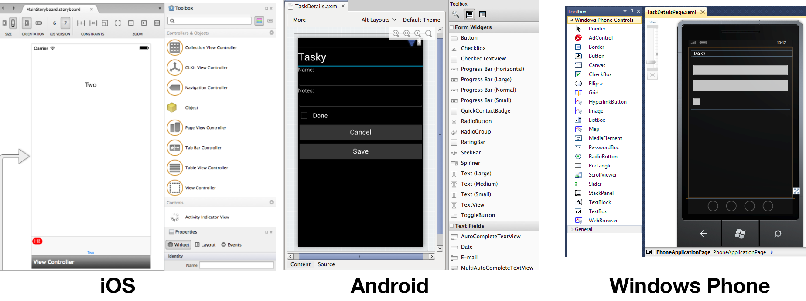

# Part 1 – Understanding the Xamarin Mobile Platform

The Xamarin platform consists of a number of elements that allow you to
develop applications for iOS and Android:

- **C# language** – Allows you to use a familiar syntax and sophisticated features like Generics, LINQ and the Parallel Task Library.
- **Mono .NET framework** – Provides a cross-platform implementation of the extensive features in Microsoft’s .NET framework.
- **Compiler** – Depending on the platform, produces a native app (eg. iOS) or an integrated .NET application and runtime (eg. Android). The compiler also performs many optimizations for mobile deployment such as linking away un-used code.
- **IDE tools** – The Visual Studio on Mac and Windows allows you to create, build, and deploy Xamarin projects.

In addition, because the underlying language is C# with the .NET framework,
projects can be structured to share code that can also be deployed to Windows
Phone.

## Under the Hood

Although Xamarin allows you to write apps in C#, and share the same code
across multiple platforms, the actual implementation on each system is very
different.

## Compilation

The C# source makes its way into a native app in very different ways on each
platform:

- **iOS** – C# is ahead-of-time (AOT) compiled to ARM assembly language. The .NET framework is included, with unused classes being stripped out during linking to reduce the application size. Apple does not allow runtime code generation on iOS, so some language features are not available (see  [Xamarin.iOS Limitations](~/ios/internals/limitations.md) ).
- **Android** – C# is compiled to IL and packaged with MonoVM + JIT’ing. Unused classes in the framework are stripped out during linking. The application runs side-by-side with Java/ART (Android runtime) and interacts with the native types via JNI (see  [Xamarin.Android Limitations](~/android/internals/limitations.md) ).
- **Windows** – C# is compiled to IL and executed by the built-in runtime, and does not require Xamarin tools. Designing Windows applications following Xamarin’s guidance makes it simpler to re-use the code on iOS and Android.
  Note that the Universal Windows Platform also has a **.NET Native** option which behaves similarly to Xamarin.iOS' AOT compilation.

The linker documentation for [Xamarin.iOS](~/ios/deploy-test/linker.md) and [Xamarin.Android](~/android/deploy-test/linker.md) provides more
information about this part of the compilation process.

Runtime 'compilation' – generating code dynamically with `System.Reflection.Emit` – should be avoided.

Apple’s kernel prevents dynamic code generation on iOS devices, therefore emitting code on-the-fly will not work in Xamarin.iOS. Likewise, the Dynamic Language Runtime features cannot be used with Xamarin tools.

Some reflection features do work (eg. MonoTouch.Dialog uses it for the Reflection API), just not code generation.

## Platform SDK Access

Xamarin makes the features provided by the platform-specific SDK easily accessible with familiar C# syntax:

- **iOS** – Xamarin.iOS exposes Apple’s CocoaTouch SDK frameworks as namespaces that you can reference from C#. For example the UIKit framework that contains all the user interface controls can be included with a simple  `using UIKit;` statement.
- **Android** – Xamarin.Android exposes Google’s Android SDK as namespaces, so you can reference any part of the supported SDK with a using statement, such as  `using Android.Views;` to access the user interface controls.
- **Windows** – Windows apps are built using Visual Studio on Windows. Project types include Windows Forms, WPF, WinRT, and the Universal Windows Platform (UWP).

## Seamless Integration for Developers

The beauty of Xamarin is that despite the differences under the hood,
Xamarin.iOS and Xamarin.Android (coupled with Microsoft’s Windows SDKs)
offer a seamless experience for writing C# code that can be re-used across all
three platforms.

Business logic, database usage, network access, and other common functions can
be written once and re-used on each platform, providing a foundation for
platform-specific user interfaces that look and perform as  native applications.

## Integrated Development Environment (IDE) Availability

Xamarin development can be done in Visual Studio on either Mac or Windows. The
IDE you choose will be determined by the platforms you wish to target.

Because Windows apps can
only be developed on Windows, to build for iOS, Android, _and_ Windows requires
Visual Studio for Windows. However it's possible to share projects and files
between Windows and Mac computers, so iOS and Android apps can be built on
a Mac and shared code could later be added to a Windows project.

The development requirements for each platform are discussed in more detail
in the [Requirement](~/cross-platform/get-started/requirements.md) guide.

### iOS

Developing iOS applications requires a Mac computer, running macOS. You can also use Visual Studio to write and deploy iOS applications with Xamarin in Visual Studio. However, a Mac is still needed for build and licensing purposes.

Apple’s Xcode IDE must be installed to provide the compiler and simulator
for testing. You can test on your own devices [for free](~/ios/get-started/installation/device-provisioning/free-provisioning.md),
but to build applications for distribution (eg. the App Store)
you must join Apple’s Developer Program ($99 USD per year). Each time you
submit or update an application, it must be reviewed and approved by Apple before
it is made available for customers to download.

Code is written with the Visual Studio IDE
and screen layouts can be built
programmatically or edited with Xamarin's iOS Designer in either IDE.

Refer to the [Xamarin.iOS Installation Guide](~/ios/get-started/installation/index.md) for
detailed instructions on getting set up.

### Android

Android application development requires the Java and Android SDKs to be
installed. These provide the compiler, emulator and other tools required for
building, deployment and testing. Java, Google’s Android SDK and Xamarin’s
tools can all be installed and run on Windows and macOS. The following configurations
are recommended:

- Windows 10 with Visual Studio 2019
- macOS Mojave (10.11+) with Visual Studio 2019 for Mac

Xamarin provides a unified installer that will configure your system with the
pre-requisite Java, Android and Xamarin tools (including a visual designer for
screen layouts). Refer to the [Xamarin.Android Installation Guide](~/android/get-started/installation/index.md) for detailed instructions.

You can build and test applications on a real device without any license from
Google, however to distribute your application through a store (such as Google
Play, Amazon or Barnes &amp; Noble) a registration fee may be payable to the
operator. Google Play will publish your app instantly, while the other stores
have an approval process similar to Apple’s.

### Windows

Windows apps (WinForms, WPF, or UWP) are built with Visual Studio. They do not use Xamarin directly. However, C# code can
be shared across Windows, iOS and Android.
Visit Microsoft’s [Dev Center](https://developer.microsoft.com/) to learn about the tools required for Windows development.

## Creating the User Interface (UI)

A key benefit of using Xamarin is that the application user interface uses
native controls on each platform, creating apps that are indistinguishable from an
application written in Objective-C or Java (for iOS and Android
respectively).

When building screens in your app, you can either lay out the controls in
code or create complete screens using the design tools available for each
platform.

### Create Controls Programmatically

Each platform allows user interface controls to be added to a screen using
code. This can be very time-consuming as it can be difficult to visualize the
finished design when hard-coding pixel coordinates for control positions and
sizes.

Programmatically creating controls does have benefits though, particularly on
iOS for building views that resize or render differently across the iPhone and
iPad screen sizes.

### Visual Designer

Each platform has a different method for visually laying out screens:

- **iOS** – Xamarin's iOS Designer facilitates building Views using drag-and-drop functionality and property fields. Collectively these Views make up a Storyboard, and can be accessed in the **.Storyboard** file that is included in your project.
- **Android** – Xamarin provides an Android drag-and-drop UI designer for Visual Studio. Android screen layouts are saved as **.AXML** files when using Xamarin tools.
- **Windows** – Microsoft provides a drag-and-drop UI designer in Visual Studio and Blend. The screen layouts are stored as .XAML files.

These screenshots show the visual screen designers available on each
platform:

 [](understanding-the-xamarin-mobile-platform-images/designer-all1.png#lightbox)

In all cases the elements that you create visually can be referenced in your
code.

### User Interface Considerations

A key benefit of using Xamarin to build cross platform applications is that
they can take advantage of native UI toolkits to present a familiar interface to
the user. The UI will also perform as fast as any other native application.

Some UI metaphors work across multiple platforms (for example, all three
platforms use a similar scrolling-list control) but in order for your
application to ‘feel’ right the UI should take advantage of
platform-specific user interface elements when appropriate. Examples of
platform-specific UI metaphors include:

- **iOS** – hierarchical navigation with soft back button, tabs on the bottom of the screen.
- **Android** – hardware/system-software back button, action menu, tabs on the top of the screen.
- **Windows** – Windows apps can run on desktops, tablets (such as Microsoft Surface) and phones. Windows 10 devices may have hardware back button and live tiles, for example.

It is recommended that you read the design guidelines relevant to the
platforms you are targeting:

- **iOS** –  [Apple's Human Interface Guidelines](https://developer.apple.com/library/ios/documentation/UserExperience/Conceptual/MobileHIG/index.html)
- **Android** –  [Google's User Interface Guidelines](https://developer.android.com/guide/practices/ui_guidelines/index.html)
- **Windows** –  [User Experience Design Guidelines for Windows](https://developer.microsoft.com/windows/design)

## Library and Code Re-Use

The Xamarin platform allows re-use of existing C# code across all platforms
as well as the integration of libraries written natively for each platform.

### C# Source and Libraries

Because Xamarin products use C# and the .NET framework, lots of existing
source code (both open source and in-house projects) can be re-used in Xamarin.iOS
or Xamarin.Android projects. Often the source can simply be added to a Xamarin
solution and it will work immediately. If an unsupported .NET framework feature
has been used, some tweaks may be required.

Examples of C# source that can be used in Xamarin.iOS or Xamarin.Android
include: SQLite-NET, NewtonSoft.JSON and SharpZipLib.

### Objective-C Bindings + Binding Projects

Xamarin provides a tool called *btouch* that helps create bindings
that allow Objective-C libraries to be used in Xamarin.iOS projects. Refer to the [Binding Objective-C Types documentation](~/cross-platform/macios/binding/binding-types-reference.md) for details on how this is done.

Examples of Objective-C libraries that can be used in Xamarin.iOS include: RedLaser
barcode scanning, Google Analytics and PayPal integration. Open-source Xamarin.iOS
bindings are available on [github](https://github.com/mono/monotouch-bindings).

### .jar Bindings + Binding Projects

Xamarin supports using existing Java libraries in Xamarin.Android. Refer to
the [Binding a Java Library documentation](~/android/platform/binding-java-library/index.md) for details on how to use a .JAR file
from Xamarin.Android.

Open-source Xamarin.Android bindings are available on [github](https://github.com/mono/monodroid-bindings).

### C via PInvoke

"Platform Invoke" technology (P/Invoke) allows managed code (C#) to call
methods in native libraries as well as support for native libraries to call back
into managed code.

For example, the [SQLite-NET](https://github.com/praeclarum/sqlite-net) library uses statements like this:

```csharp
[DllImport("sqlite3", EntryPoint = "sqlite3_open", CallingConvention=CallingConvention.Cdecl)]
public static extern Result Open (string filename, out IntPtr db);
```

This binds to the native C-language SQLite implementation in iOS and Android.
Developers familiar with an existing C API can construct a set of C# classes to
map to the native API and utilize the existing platform code. There is
documentation for [linking native libraries](~/ios/platform/native-interop.md) in Xamarin.iOS, similar principles apply to Xamarin.Android.

### C++ via CppSharp

Miguel explains CXXI (now called [CppSharp](https://github.com/mono/CppSharp)) on his [blog](https://tirania.org/blog/archive/2011/Dec-19.html). An
alternative to binding to a C++ library directly is to create a C wrapper and
bind to that via P/Invoke.
