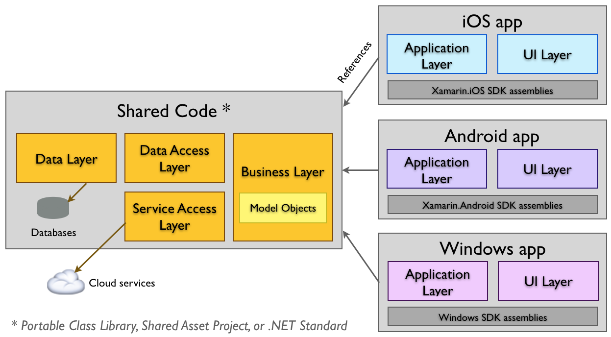
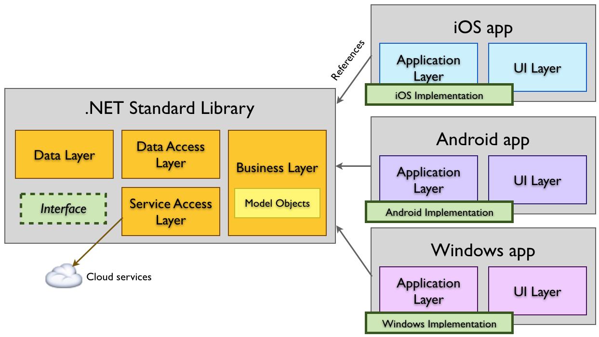
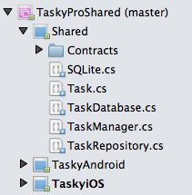
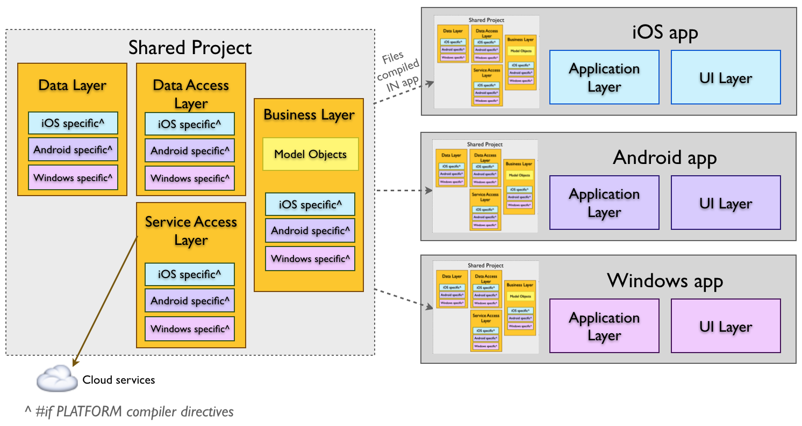

# Sharing code overview

_This document compares the different methods of sharing code between cross-platform projects: .NET Standard, Shared Projects, and Portable Class Libraries, including the benefits and disadvantages of each._

There are three methods for sharing code between cross-platform applications:

- [**.NET Standard Libraries**](#Net_Standard) – .NET Standard projects can implement code to be shared across multiple platforms, and can access a large number of .NET APIs (depending on the version). .NET Standard 1.0 - 1.6 implement progressively larger sets of APIs, while .NET Standard 2.0 provides the best coverage of the .NET BCL (including the .NET APIs available in Xamarin apps).
- [**Shared Projects**](#Shared_Projects) – Use the Shared Asset Project type to organize your source code, and use `#if` compiler directives as required to manage platform-specific requirements.
- [**Portable Class Libraries**](#Portable_Class_Libraries) (deprecated) – Portable Class Libraries (PCLs) can target multiple platforms with a common API surface, and use Interfaces to provide platform-specific functionality. PCLs are deprecated in the latest versions of Visual Studio &ndash; use .NET Standard instead.

The goal of a code-sharing strategy is to support the architecture shown in this diagram, where a single codebase can be utilized by multiple platforms.

 

This article compares the methods available to help you choose the right project type for your applications.

## .NET Standard Libraries

[.NET Standard](~/cross-platform/app-fundamentals/net-standard.md) libraries provide a well defined set of
the base class libraries that can be referenced in different project types, including cross-platform projects
like Xamarin.Android and Xamarin.iOS. .NET Standard 2.0 is recommended for maximum compatibility with existing
.NET Framework code.

### Benefits

- Allows you to share code across multiple projects.
- Refactoring operations always update all affected references.
- A larger surface area of the .NET Base Class Library (BCL) is available than PCL profiles. In particular, .NET Standard 2.0 has almost the same API surface as the .NET Framework and is recommended for new apps and porting existing PCLs.

### Disadvantages

- Cannot use compiler directives like `#if __IOS__`.

### Remarks

.NET Standard is [similar to PCL](/dotnet/standard/net-standard#comparison-to-portable-class-libraries), but with a simpler model for platform support and a greater number of classes from the BCL.

## Shared Projects

[Shared Projects](~/cross-platform/app-fundamentals/shared-projects.md) contain code files and assets
that are included in any project that references them. Share projects do not produce compiled output on their own.

This screenshot shows a solution file containing three application projects
(for Android, iOS, and Windows), with a **Shared** project that
contains common C# source code files:

The conceptual architecture is shown in the following diagram, where each
project includes all the shared source files:

### Example

A cross platform application that supports iOS, Android, and Windows
would require an application project for each platform. The common code lives in
the Shared Project.

An example solution would contain the following folders and projects (project
names have been chosen for expressiveness, your projects do not have to follow
these naming guidelines):

- **Shared** – Shared Project containing the code common to all projects.
- **AppAndroid** – Xamarin.Android application project.
- **AppiOS** – Xamarin.iOS application project.
- **AppWindows** – Windows application project.

In this way the three application projects are sharing the same
source code (the C# files in Shared). Any edits to the shared code will be
shared across all three projects.

### Benefits

- Allows you to share code across multiple projects.
- Shared code can be branched based on the platform using compiler directives (eg. using  `#if __ANDROID__` , as discussed in the  [Building Cross Platform Applications](~/cross-platform/app-fundamentals/building-cross-platform-applications/index.md) document).
- Application projects can include platform-specific references that the shared code can utilize (such as using  `Community.CsharpSqlite.WP7` in the Tasky sample for Windows Phone).

### Disadvantages

- Refactorings that affect code inside 'inactive' compiler directives will not update the code inside those directives.
- Unlike most other project types, a Shared Project has no 'output' assembly. During compilation, the files are treated as part of the referencing project and compiled into that assembly. If you wish to share your code as a assembly then .NET Standard or Portable Class Libraries are a better solution.

### Remarks

A good solution for application developers writing code that is only intended for sharing in their app (and not distributing to other developers).

## Portable Class Libraries

> [!TIP]
> .NET Standard 2.0 libraries are recommended over Portable Class Libraries.

Portable Class Libraries are [discussed in detail here](~/cross-platform/app-fundamentals/pcl.md).

### Benefits

- Allows you to share code across multiple projects.
- Refactoring operations always update all affected references.

### Disadvantages

- Deprecated in the latest versions of Visual Studio, .NET Standard libraries are recommended instead. Refer to this [explanation of the differences](/dotnet/standard/net-standard#comparison-to-portable-class-libraries) between PCL and .NET Standard.
- Cannot use compiler directives.
- Only a subset of the .NET framework is available to use, determined by the profile selected (see the  [Introduction to PCL](~/cross-platform/app-fundamentals/pcl.md) for more info).

### Remarks

PCL template is considered deprecated in the latest versions of Visual Studio.

## Summary

The code sharing strategy you choose will be driven by the platforms you are targeting. Choose a method that works best for your project.

.NET Standard is the best choice for building sharable code libraries (especially publishing on NuGet). Shared Projects work well for application developers planning to use lots of platform-specific functionality in their cross-platform apps.

While PCL projects continue to be supported in Visual Studio, .NET Standard is recommended for new projects.

## Related links

- [Building Cross Platform Applications (main document)](~/cross-platform/app-fundamentals/building-cross-platform-applications/index.md)
- [Portable Class Libraries](~/cross-platform/app-fundamentals/pcl.md)
- [Shared Projects](~/cross-platform/app-fundamentals/shared-projects.md)
- [.NET Standard](~/cross-platform/app-fundamentals/net-standard.md)
- [Case Study: Tasky](~/cross-platform/app-fundamentals/building-cross-platform-applications/case-study-tasky.md)
- [Tasky Sample (github)](https://github.com/xamarin/mobile-samples/tree/master/Tasky)
- [Tasky Sample using PCL (github)](https://github.com/xamarin/mobile-samples/tree/master/TaskyPortable)