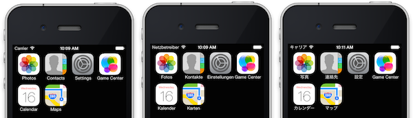

# Localization

This guide introduces the concepts behind *internationalization* and *localization*
and links to instructions on how to produce Xamarin mobile applications using
those concepts.

If you want to skip straight to the technical details of localizing Xamarin apps,
start with one of these platform-specific how-to articles:

- [**Xamarin.Forms**](~/xamarin-forms/app-fundamentals/localization/index.md) cross-platform localization using RESX files.
- [**Xamarin.iOS**](~/ios/app-fundamentals/localization/index.md) native platform localization.
- [**Xamarin.Android**](~/android/app-fundamentals/localization.md) native platform localization.

## i18n and L10n

*Internationalization* is the process of making your code capable of displaying
different languages and adapting its display for different locales
(such as number and date formatting). This is also referred to as *globalization*.

*Localization* is the step that follows – creating resources (such as strings and images)
for each language and bundling them with the internationalize app.

Internationalization it is often shortened to i18n – shorthand for 18 letters
between "i" and "n". Localization is similarly shortened to L10n – for 10 letters between "L" and "n".

## Overview

This document introduces the concepts associated with internationalization and
localization, and how they apply to mobile application development in general.
When designing and building an application, things that you might previously have
hardcoded but which must parameterized for localization include:

- Screen layouts and text,
- Icons, graphics and colors,
- Video and sound files,
- Dynamic text and text-formatting (such as numbers, currency and dates),
- Layout changes for right-to-left (RTL) languages, and
- Data sorting.

Regardless of which mobile platforms your app targets these tips will help you
build a high-quality localized app.

## Design Considerations

Architecting an application so that it is possible to localize its content is called internationalization. Doing internationalization properly is more than just allowing for different language strings to be loaded at runtime – a well-designed app should allow for all resources to be changed based on language and locale (including images, sounds and videos) and can adapt formatting and layout to cope with different sized strings.

This section discusses some design considerations to be taken into account when building an internationalized application.

### Layouts and string length

Chinese and Japanese strings can be very short – sometimes one or two characters can be meaningful enough for an input field label.

German strings (for example) can be very long; sometimes a relatively short word in English becomes very long in other languages – either becoming clipped or else unexpectedly reflowing your layout.

Compare the string lengths for a few items on the iOS home screen in English, German, and Japanese:

[](localization-images/language-compare.png#lightbox)

Notice that **Settings** in English (8 characters) requires 13 characters for the German translation but only 2 characters in Japanese.

Layouts where the display label and input field are side-by-side are difficult to work with when the label length can vary greatly. Often a layout where the label is displayed above a field is easier to localize because the full width of the screen is available for both the label and the input.

As a general rule, if you are building fixed layouts (especially side-by-side elements) allow at least 50% more width than your English strings require for labels and text. This won’t solve every problem but will provide a buffer that will work in many cases.

### Input validation

Beware of assumptions when writing validation rules. It might seem valid to require a text field input to "require" at least three characters in English, since a single letter very rarely has any meaning. In Chinese and Japanese however a single character might be a valid input, and a validation message "at least 3 characters is required" does not make sense for those languages.

Other seemingly simple tasks like validating an email address or website URL become more complicated with the characters are not limited to the ASCII subset.

Write your validation rules with internationalization in mind – either choose the least restrictive rules, or write the logic so that it works differently for each language.

### Images and Color

Not every image needs to change based on a user’s language choice. Many icons or photos will be suitable for all users, not matter what language they speak.
Some resources make sense to localize though, such as:

- Images depicting people or specific locations – your app may feel more relevant to users if it shows local people/locations.
- Icons – Some iconography can be culture-specific and you can make your app easier to use by localizing the imagery to reflect local understanding.
- Colors – Some cultures understand colors differently – red might mean warning in one region, but good luck in another. Check with native speakers when designing your app to determine whether you should be building a mechanism to localize colors.

### Videos and Sound

Videos and sound present special challenges when localizing an application, because while it’s relatively easy to get strings translated, recording multiple voiceover tracks or video clips can be both expensive and difficult.

Multiple copies of video and sound files may also significantly increase the size of your application (especially if you are localizing into a large number of languages or have lots of media files). You might consider downloading only the required language assets after the user has installed your app, but this could also result in a poor user experience on slow networks.

There are often multiple ways to solve localization issues – the most important thing is to consider them up-front and ensure your application is designed to take care of them.

### Dates, Times, Numbers and Currency

If you’re using .NET formatting functions, remember to specify the culture so that decimal separators are parsed correctly (and avoid conversion exceptions being thrown). For example both 1.99 and 1,99 are valid decimal representations depending on your locale.

When the data is coming from a known source (ie. from your own code or a web-service that you control) you can hardcode a culture identifier that matches the formatting such as the InvariantCulture which will work for standard English language formatting.

```csharp
double.Parse("1,999.99", CultureInfo.InvariantCulture);
```

If the data is being input by the app user, parse it using a CultureInfo instance that reflects their locale:

```csharp
double.Parse("1 999,99", CultureInfo.CreateSpecificCulture("fr-FR"));
```

See the [Parsing Numeric Strings](/dotnet/standard/base-types/parsing-numeric) and [Parsing Date and Time Strings](/dotnet/standard/base-types/parsing-datetime) MSDN articles for additional information.

<a name="rtl"></a>

### Right-to-left (RTL) Languages

Some languages, such as Arabic, Hebrew, and Urdu (for example), are read from right to left.
Applications that support these languages should use screen designs that adapt for
right-to-left readers, for example:

- Text should be right-aligned.
- Labels should appear to the right of input fields.
- Default button placement is generally reversed.
- Hierarchical navigation swiping and animation (and other navigation metaphors and animations)
  that use direction for context should also be reversed.

Both iOS and Android support right-to-left layouts and font rendering, with
built-in features that help to make the above adjustments. Xamarin.Forms does not
currently automatically support RTL rendering.

### Sorting

Different languages define the sort order of their alphabets differently, even when they use the same character set.

See the [Detail of String Comparison](/dotnet/standard/base-types/best-practices-strings#the_details_of_string_comparison) in [Best Practices for Using Strings in the .NET Framework](/dotnet/standard/base-types/best-practices-strings) for an example where language (CultureInfo) affects the sort order.

It’s unlikely the built-in database capabilities on the mobile platforms will support language-specific sort ordering so you may be required to implement additional code in your business logic.

### Text search

Ensure you write and test your search algorithm with multiple languages in mind. Things to consider include:

- Auto-complete – if you have built an auto-complete function ensure it sources suggestions relevant to the user’s language.
- Matching query to data – will search queries entered in a specific language be executed against just content written in that language, or against all content in your app?
- Stemming – if your search is built to search for similar words, word roots and other search optimizations, are those optimizations built for all the languages you support?
- Sorting – make sure the results are sorted correctly (see above).

### Data from external sources

Many applications download data from external sources, from Twitter and RSS feeds to weather, news, or stock prices. When displaying this to a user you need to consider the possibility that you will display a screen of irrelevant or unreadable information to them.

There are few strategies you can use to try and ensure your app displays data relevant to the user:

- Different sources – your application might download the data from a different source depending on the user’s language or locale. Locale news, weather and stock prices might make more sense than something downloaded from a North American feed.
- Localized display – if you are displaying a Twitter or photo feed, you should display the metadata (such as the time taken) in his or her own language, even if the content itself remains in the original language.
- Translation – you could build a translation option into your app to do a machine translation of incoming data. This could be automatic or at the user’s discretion – just be sure to notify the user if this is taking place, since machine translations are never perfect!

This could also affect external links to audio tracks or videos – when designing your application be sure to plan ahead for sourcing translated content or ensuring that users are adequately informed by the user interface when content will not be presented in their language.

### Don’t over-translate

Some strings in your app might not need translating, or at the very least need special attention by the translator. Examples might include:

- URLs – if you list a URL, it may or may not need to be adjusted by language. For example, facebook.com doesn’t require translation it auto-detects language at the main site. Other sites have locale-specific content and you might want to offer a different URL, such as yahoo.com versus yahoo.fr or yahoo.it.
- Telephone numbers – especially those with different country-codes or numbers for callers that speak a particular language.
- Contact details – addresses and other information might vary by language or locale.
- Trademarks & product names – some strings don’t need translating because they’re always written in same language.

Finally, be sure to include detailed instructions for the translator if certain strings require special treatment.

### Formatted text

Not usually a problem with mobile apps because strings generally aren’t richly formatted. However if rich text (such as bold or italic formatting) is required in your app ensure the translator knows how to input the formatting, your strings files store it correctly and it is formatted properly before being displayed to the user (ie. don’t accidentally let the formatting codes themselves be presented to the user).

## Translation Tips

Translating the strings used by an application is considered to be part of the localization process. Typically this task will be outsourced to a translation service and performed by multilingual staff that may not know your application or your business.

The following tips will help you produce strings that are easier to translate accurately and therefore improve the quality of your localized apps.

### Localize complete strings, not words

Sometimes developers take the approach of trying to specify single words or sentence 'snippets' so that they can re-use them throughout the application. For example, for the text "You have 5 messages." they might specify the following strings for translation

**Bad**:

```csharp
"You have"
"no"
"message"
"messages"
```

and then attempt to create the correct phrase on-the-fly in code using string concatenation:

**Bad**:

```csharp
"You have" + " " + numMsgs + " " + "messages"
"You have" + " no " + "messages"
```

**This is discouraged** because it will not necessarily work for all languages and will be difficult for the translator to understand the context of each short segment. It also leads to re-use of translated strings, which can cause problems later if they are used in different contexts (and then get updated).

### Allow for parameter re-ordering

Some programming languages require extra syntax to specify the order of parameters in a string, however .NET already supports the concept of numbered placeholders, so

**Good**:

```csharp
"a {0} b {1} cde {3}"
```

could be translated the following (where the position and order of the placeholders is changed)

```csharp
"{2} {3} f g h {0}"
```

and the tokens will be ordered as the translator intended. Be sure to include an explanation of what each placeholder contains when sending the string to a translator.

### Use multiple strings for cardinality

Avoid strings like `"You have {0} message/s."`
Use specific strings for each state to provide a better user experience:

**Good**:

```csharp
"You have no messages."
"You have 1 message."
"You have 2 messages."
"You have {0} messages."
```

You will have to write code in your app to evaluate the number being displayed and choose the appropriate string. Some platforms (including iOS and Android) have built-in features to automatically choose the best plural string based on the preferences for the current language/locale.

### Allowing for gender

Latin-based languages sometimes use different words depending on the gender of the subject. If your app knows about gender, you should allow the translated strings to reflect this.

There is also the more obvious case even in English, where strings refer to a specific person or user of your app. For example, some sites show messages like `"Bob commented on his post"` so you need strings for both a male, female, and non-binary or unknown gender:

**Good**:

```csharp
"{0} commented on his post"
"{0} commented on her post"
"{0} commented on their post"
```

### Don’t reuse strings

Or more accurately, don’t reuse strings just because they are similar when the string itself has a different purpose or meaning.

For example: imagine you have an on/off switch in your app and the switch control needs the text for ‘on’ and ‘off’ to be localized. You also display the value of that setting elsewhere in the app in a text label. You should use different strings for the switch display versus the switch’s status (even if they are the same string in your default language) – for example:

- "On" – displayed on the switch itself
- "Off" – displayed on the switch itself
- "On" – displayed in a label
- "Off" – displayed in a label

This provides maximum flexibility for the translator:

- For design reasons, perhaps the switch itself uses lowercase "on" and "off" but the display label uses upper case "On" and "Off".
- Some languages might need the switch value to be abbreviated to fit in the user interface control, while the complete (translated) word can appear in the label.
- Alternatively, for some languages the rendering of your switch might be use "I" and "O" for cultural familiarity, but you might still want the label to read "On" or "Off".

### Translation Services

#### Machine translation

To build translation features into your app, consider the [Azure Translator Text API](https://azure.microsoft.com/services/cognitive-services/translator-text-api/).

For testing purposes you could use one of the many online translation tools to include some localized text in your app during development:

- [Bing Translator](https://www.bing.com/translator/)
- [Google Translate](https://translate.google.com/)

There are many others available. The quality of machine translation generally isn't considered good enough to release an application without first being reviewed and tested by professional translators or native speakers.

#### Professional translation

There are also professional translation services that will take your strings and distribute them to their own translators, providing you with finished translations for a fee.

One of the best-known services is [LionBridge](https://www.lionbridge.com/). Most professional services support all the common file types including strings, XML, RESX and POT/PO.

## Summary

This article introduced some of the concepts that you should be familiar with before internationalizing your app and then localizing your resources, and also covered how to change language preferences for each platform.

These concepts can be applied to the various platform-specific and cross-platform internationalization techniques that are possible with Xamarin.

Continue reading technical details for the platform you are interested in:

- [Xamarin.Forms](~/xamarin-forms/app-fundamentals/localization/index.md) cross-platform localization using RESX files.
- [Xamarin.iOS](~/ios/app-fundamentals/localization/index.md) native platform localization.
- [Xamarin.Android](~/android/app-fundamentals/localization.md) native platform localization.

## Related Links

- [Apple's Localization Overview](https://developer.apple.com/internationalization/)
- [Android's Localization Checklist](https://developer.android.com/distribute/tools/localization-checklist.html)
- [Best Practices for Developing World-Ready Applications (MSDN)](/previous-versions/visualstudio/visual-studio-2008/w7x1y988(v=vs.90))