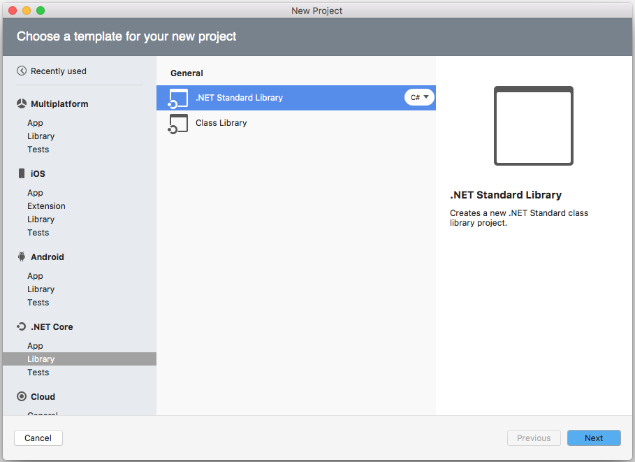
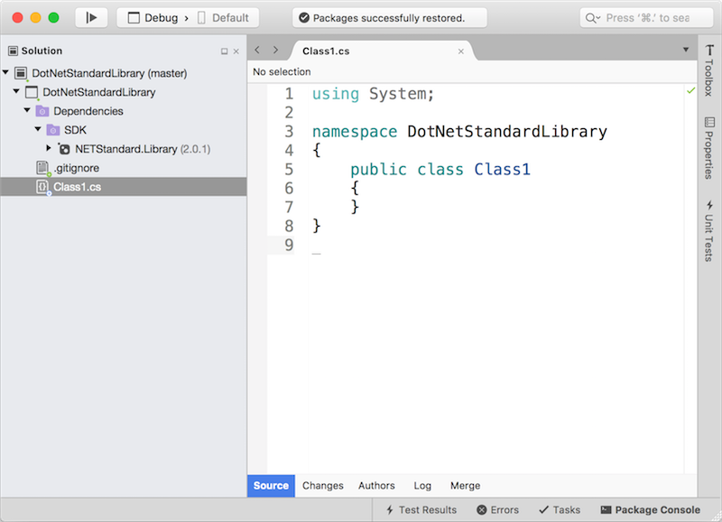
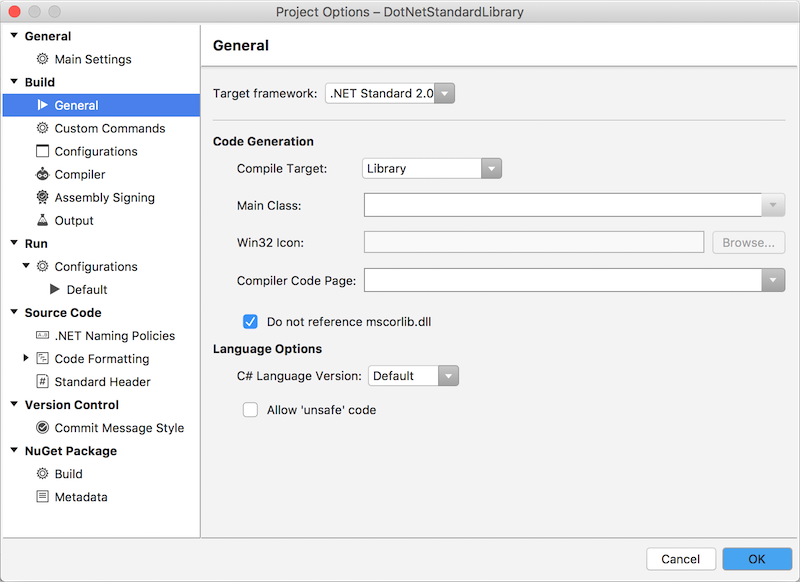
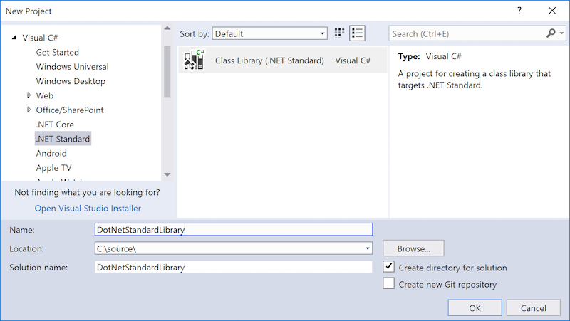
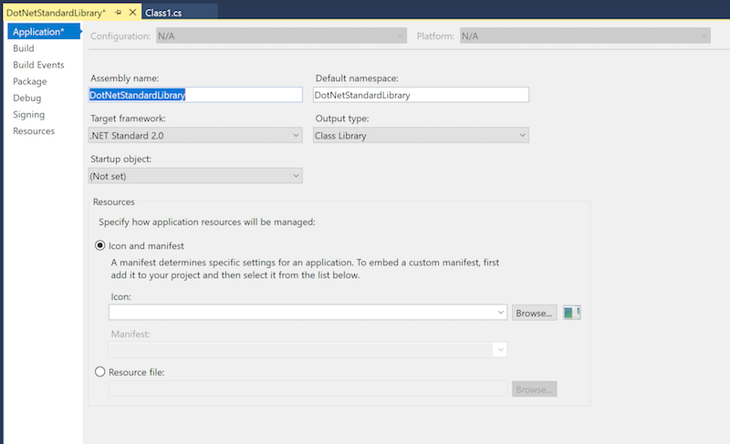

# .NET Standard Library code sharing

.NET Standard libraries have a uniform API for all .NET Platforms including Xamarin and .NET Core. Create a single .NET Standard Library and use it from any runtime that supports the .NET Standard Platform. Refer to [this chart](/dotnet/standard/net-standard#net-implementation-support) for details of supported platforms.

While .NET Standard versions 1.0 through 1.6 provide incrementally larger subsets of the .NET Framework, .NET Standard 2.0 provides
the best level of support for Xamarin applications and for porting existing Portable Class Libraries.

# [Visual Studio for Mac](#tab/macos)

## Visual Studio for Mac

This section walks through how to create and use a .NET Standard Library using Visual Studio for Mac.

### Creating a .NET Standard Library

You can add a .NET Standard Library to your solution with these steps:

1. In the **Add New Project** dialog, select the **.NET Core** category and then select **.NET Standard Library**:

    

2. On the next screen, choose the target framework - **.NET Standard 2.0** is recommended:

    

3. On the final screen, type the project name and click **Create**.

4. The .NET Standard Library project will appear as shown in the Solution Explorer. The Dependencies node will indicate that the library uses the [NETStandard.Library](https://www.nuget.org/packages/NETStandard.Library/).

    

#### Editing .NET Standard Library settings

The .NET Standard Library settings can be viewed and changed by right-clicking on the project and selecting `Options` as shown in this screenshot:

Inside you can change your version of `netstandard` by changing the `Target Framework` dropdown value.

**Additionally:** You can edit the `.csproj` directly to change this value.

# [Visual Studio](#tab/windows)

## Visual Studio 2017 (Windows)

This section walks through how to create and use a .NET Standard Library using Visual Studio.

### Creating a .NET Standard library

Adding a .NET Standard Library to your solution is fairly straight forward.

1. In the **New Project** dialog, select the **.NET Standard** category and then select **Class Library (.NET Standard)**.

    

2. The .NET Standard Library project will appear as shown in the Solution Explorer. The Dependencies node will indicate that the library uses the [NETStandard.Library](https://www.nuget.org/packages/NETStandard.Library/).

    

### Editing .NET Standard library settings

The .NET Standard Library settings can be viewed and changed by right-clicking on the project and selecting **Properties** as shown in this screenshot:

**Additionally:** You can edit the `.csproj` directly to edit the `TargetFramework` element and change which version is targeted (eg. `<TargetFramework>netstandard2.0</TargetFramework>`).

### Using a .NET Standard Library project

Once a .NET Standard Library has been created, you can add a reference to it from any compatible Application or Library project in the same way you normally add references. In Visual Studio, right-click on the References node and choose **Add Reference...** then switch to the **Projects > Solution** tab as shown:

-----

## .NET Standard and Xamarin.Forms for the .NET Developer (video)

> [!Video https://channel9.msdn.com/Shows/XamarinShow/NET-Standard-and-XamarinForms-for-the-NET-Developer/player]

## Related Links

* [.NET Standard](/dotnet/standard/net-standard) - detailed information and comparison to PCL.