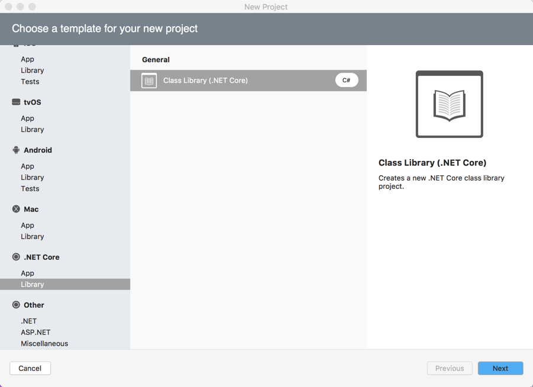
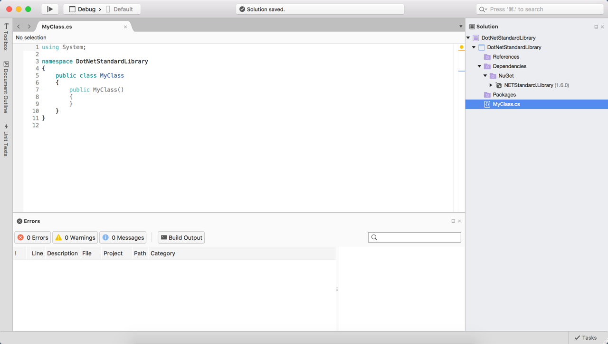
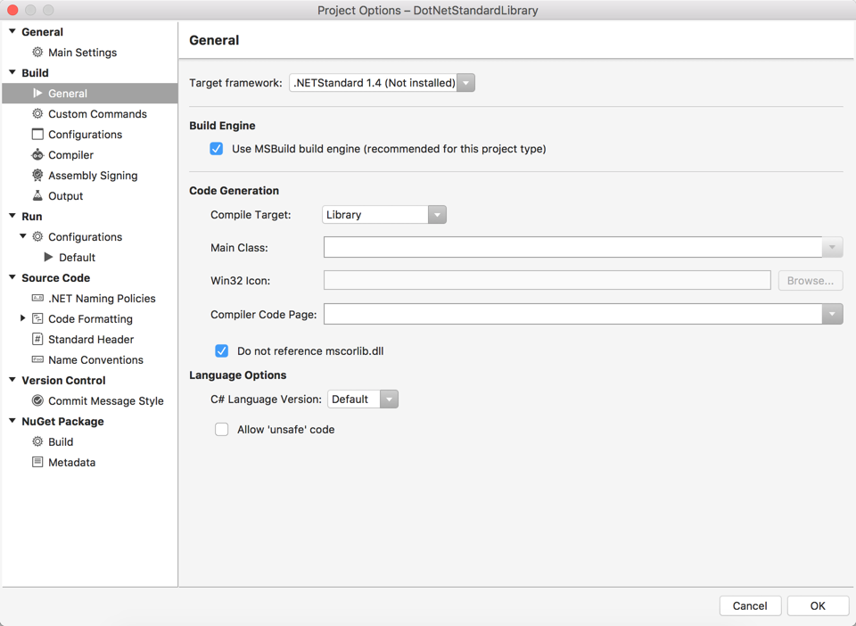
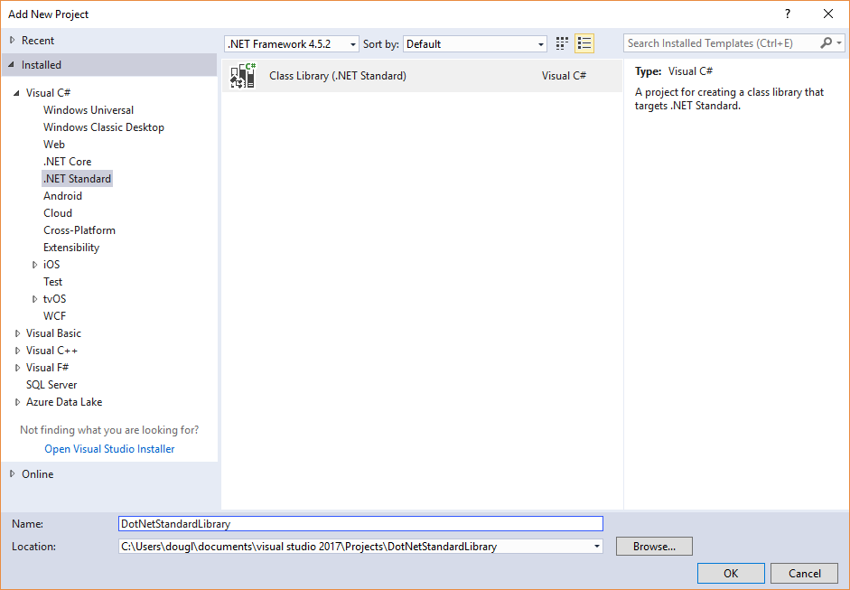
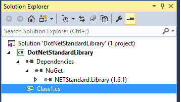
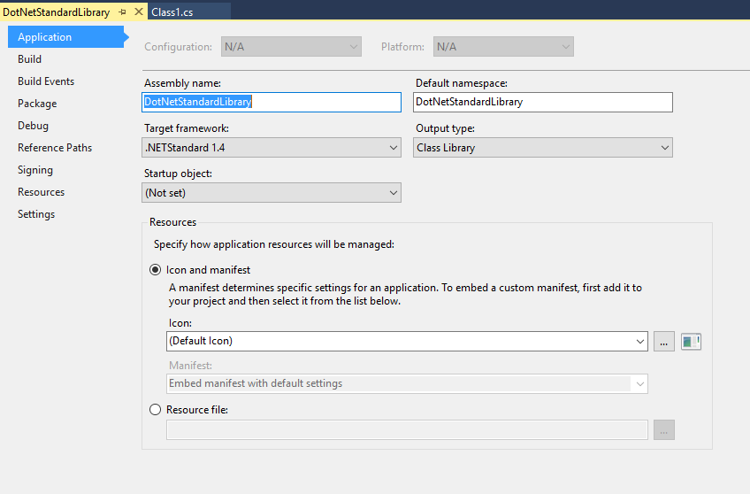

# .NET Standard

## Using .NET Standard Library Projects to share code

The .NET Standard Library is a formal specification of .NET APIs that are intended to be available on all .NET runtimes. The motivation behind the Standard Library is establishing greater uniformity in the .NET ecosystem.
[ECMA 335](https://github.com/dotnet/coreclr/blob/master/Documentation/project-docs/dotnet-standards.md) continues to establish uniformity for .NET runtime behavior, but there is no similar spec for the .NET Base Class Libraries (BCL) for .NET library implementations.

You can think of it as a simplified, next generation of [Portable Class Library](https://msdn.microsoft.com/library/gg597391.aspx).
It is a single library with a uniform API for all .NET Platforms including .NET Core. You just create a single .NET Standard Library and use it from any runtime that supports .NET Standard Platform.

# [Visual Studio for Mac](#tab/vsmac)

## Visual Studio for Mac

This section walks through how to create and use a .NET Standard Library using Visual Studio for Mac. Refer to the .NET Standard Library Example section for a complete implementation.

### Creating a .NET Standard Library

Adding a .NET Standard Library to your solution is fairly straight forward.

1. In the Add New Project dialog, select the `.NET Core` category and then select `Class Library(.NET Core)`.

  **Note:** This template will be renamed to `.NET Standard` in a future version of Visual Studio for Mac.

  

2. The .NET Standard Library project will appear as shown in the Solution Explorer. The Dependencies node will indicate that the library uses the [NETStandard.Library](https://www.nuget.org/packages/NETStandard.Library/).

  

#### Editing .NET Standard Library Settings

The .NET Standard Library settings can be viewed and changed by right-clicking on the project and selecting `Options` as shown in this screenshot:

Inside you can change your version of `netstandard` by changing the `Target Framework` dropdown value.

**Additionally:** You can edit the `.csproj` directly to change this value.

# [Visual Studio](#tab/vswin)

## Visual Studio 2017 (Windows)

This section walks through how to create and use a .NET Standard Library using Visual Studio. Refer to the .NET Standard Library Example section for a complete implementation.

### Creating a .NET Standard Library

#### Visual Studio 2017

Adding a .NET Standard Library to your solution is fairly straight forward.

1. In the Add New Project dialog, select the `.NET Standard` category and then select `Class Library(.NET Standard)`.

  

2. The .NET Standard Library project will appear as shown in the Solution Explorer. The Dependencies node will indicate that the library uses the [NETStandard.Library](https://www.nuget.org/packages/NETStandard.Library/).

  

#### Editing .NET Standard Library Settings

The .NET Standard Library settings can be viewed and changed by right-clicking on the project and selecting `Properties` as shown in this screenshot:

Inside you can change your version of `netstandard` by changing the `Target Framework` dropdown value.

**Additionally:** You can edit the `.csproj` directly to change this value.

#### Using .NET Standard Library

Once a .NET Standard Library has been created, you can add a reference to it from any compatible Application or Library project in the same way you normally add references. In Visual Studio, right-click on the References node and choose `Add Reference...` then switch to the `Solution : Projects` tab as shown:

-----

