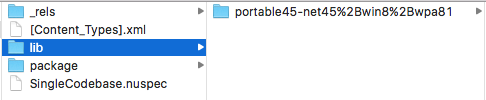

# Creating a NuGet from Existing Library Projects

Existing PCL or .NET Standard libraries can be turned into NuGets
via the **Project Options** window:

1. Right-click on the library project in the **Solution Pad** and choose **Options**.

2. Go to the **NuGet Package > Metadata** section and enter all the [required information](~/cross-platform/app-fundamentals/nuget-multiplatform-libraries/metadata.md) in the **General** tab:

   

3. Optionally, [add additional metadata](~/cross-platform/app-fundamentals/nuget-multiplatform-libraries/metadata.md)
   in the **Details** tab.

4. Once the metadata is configured, you can right-click on the project and choose **Create NuGet Package** and the **.nupkg** NuGet package file will be saved in the **/bin/** folder (either Debug or Release, depending on configuration).

   

5. To create the NuGet package on _every_ build or deploy, go to the **NuGet Package > Build** section and tick **Create a NuGet Package when building the project**:

    

> [!NOTE]
> Building the NuGet package can slow down the build process. If this box is not ticked,
> you can still generate a NuGet package manually at any time from the project context menu
> (shown in step 4 above).

## Verifying the Output

NuGet packages are also ZIP files, so it's possible to inspect the internal structure of the generated package.

This screenshot shows the contents of a PCL-based NuGet – only a single PCL assembly is included:

## Related Links

- [Metadata Guide](~/cross-platform/app-fundamentals/nuget-multiplatform-libraries/metadata.md)
