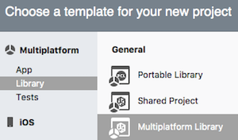

# NuGet Multiplatform Library Projects (Nugetizer 3000)

_Automatically create NuGet packages to share code across platforms using the 'Nugetizer 3000'!_

It is possible to automatically create NuGet packages to share code across platforms using the _Nugetizer 3000_. This makes is possible to create NuGet packages from existing library projects or by creating a new **Multiplatform Library Project**.

# [Visual Studio for Mac](#tab/macos)

The Nugetizer 3000 is included with Visual Studio for Mac &ndash; look for the **Library > Mulitplatform Library** project type in the **File > New** window:

# [Visual Studio](#tab/windows)

To use the Nugetizer 3000 in Visual Studio, please [download and run the VSIX installer](https://bit.ly/nugetizer-2017).

-----

## Building NuGet packages

Once configured, every build of the project outputs a complete NuGet package, which
can be used to share code internally with other apps or uploaded to [NuGet.org](https://www.nuget.org).

There are three scenarios for using this feature:

- [Existing Library Projects](existing-library.md)

  Create a NuGet package from existing PCL (or .NET Standard) projects.

- [Creating a New Multiplatform Library Project](single-codebase.md)

  Create a new library to share common code via NuGet, using a PCL or .NET Standard.

- [Creating New Platform-Specific Library Projects](platform-specific.md)

  Create a new library and NuGet that includes platform-specific code for iOS and Android, and uses a Shared Project to contain the common code and platform-specific projects to support iOS- or Android-specific functionality.

Refer to the [Metadata guide](metadata.md) for details on the required and optional metadata
that must be added to any NuGet package.

## Further NuGet information

Read more about [manually creating NuGets for Xamarin](~/cross-platform/app-fundamentals/nuget-manual.md)
and how to [include a NuGet package in an app](/visualstudio/mac/nuget-walkthrough).

Microsoft's [NuGet Documentation](/nuget/) contains more
detailed information on the **.nupkg** format and using NuGet packages in Visual Studio.

The  design discussion for NuGet Package Projects (a.k.a. NuGetizer 3000) is available
on the [NuGet GitHub repository](https://github.com/NuGet/Home/wiki/NuGetizer-3000).

## Related Links

- [NuGetizer-3000 Use Cases](https://github.com/NuGet/Home/wiki/NuGetizer-Core-Scenarios)
- [Manually Create NuGet Packages for Xamarin](~/cross-platform/app-fundamentals/nuget-manual.md)
- [NuGet Documentation](/nuget/)