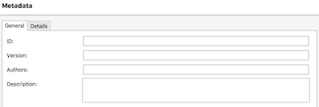
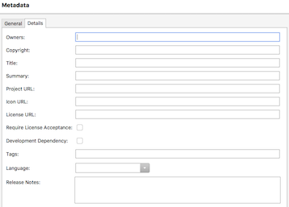

# Editing NuGet Metadata

_Use the project options to edit NuGet metadata for multiplatform libraries_

Library project types (such as PCL or .NET Standard, or the new NuGet project type) have a
**NuGet Package** section in the **Project Options** window.

The **Metadata** section configures the values used in the
[**.nuspec** NuGet package manifest file](/nuget/create-packages/creating-a-package#the-role-and-structure-of-the-nuspec-file).

## Required Information

The **General** tab contains four fields that must be entered to generate a NuGet package:

- **ID** – The package identifier, which should be unique within NuGet.org (or wherever the package will be distributed). Follow this [guidance](/nuget/create-packages/creating-a-package#choosing-a-unique-package-identifier-and-setting-the-version-number) and only use characters that are valid in a URL (no spaces, and avoid most special characters).
- **Version** – Choose a version number consistent with [NuGet's versioning rules](/nuget/create-packages/dependency-versions).
- **Authors** – Comma-separated list of names.
- **Description** – Overview of the package's features which is displayed when users are selecting the package.

> [!NOTE]
> Remember to increment the version number when building new versions for distribution to NuGet or other users.

For more information, see the [Required Elements Reference](/nuget/schema/nuspec#required-metadata-elements)
for more information, as well as these detailed instructions on [Choosing a unique package identifier and setting the version number](/nuget/create-packages/creating-a-package#choosing-a-unique-package-identifier-and-setting-the-version-number) and
[Setting a package type](/nuget/create-packages/creating-a-package#setting-a-package-type).

> [!IMPORTANT]
> All fields on this tab must be entered; otherwise, an error message will appear:
> _"The project does not have NuGet metadata so a NuGet package will not be created.
> NuGet package metadata can be specified in the Metadata section in Project Options"_

## Optional Metadata

The **Details** tab contains optional fields to be included in the NuGet package manifest file.

Refer to the [Optional Elements Reference](/nuget/schema/nuspec#optional-metadata-elements)
for more information about the required and optional fields.

> [!NOTE]
> If the NuGet package is being distributed on [NuGet.org](https://www.nuget.org) it is recommended to supply as much information as possible.

## Related Links

- [.nuspec Reference](/nuget/schema/nuspec#general-form-and-schema)