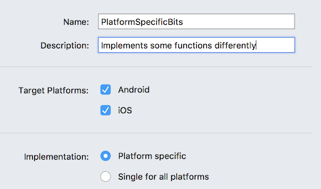
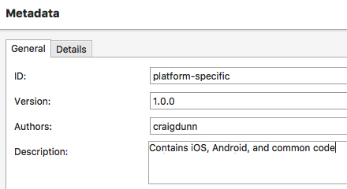
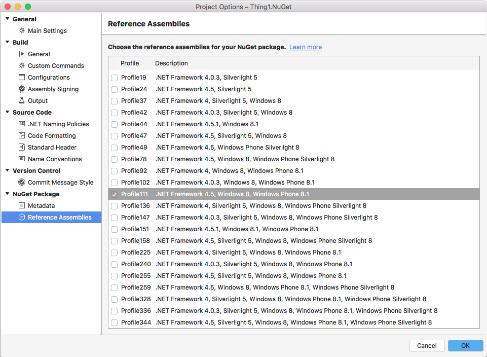
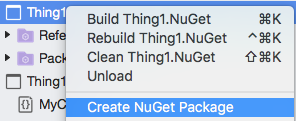
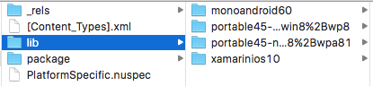

# Creating New Platform-Specific Library Projects for NuGet

Multiplatform Library projects that target specific
platforms, like iOS and Android, work best with Shared Projects.

The NuGet can contain both iOS- and Android-specific code, as well as .NET code common
to both.

Multiple assemblies are created and built into a single NuGet package. NuGet standards
ensure that the package can be added to all supported project types, such as
Xamarin.iOS and Android projects.

## Steps to Create a Cross-Platform Library NuGet

1. Select **File > New Solution** (or right click an existing solution and choose **Add > New Project**).

2. Choose **Multiplatform Library** from the **Multiplatform > Library** section:

    

3. Enter a **Name** and **Description**, and choose **Platform specific**:

    

4. Complete the wizard. The following projects are added to the solution:

    - **Android Project** – Android-specific code can optionally be added to this project.
    - **iOS Project** – iOS-specific code can optionally be added to this project.
    - **NuGet Project** – No code is added to this project. It references the other projects, and contains the metadata configuration for the NuGet package output.
    - **Shared Project** – Common code should be added to this project, including platform-specific code inside `#if` compiler directives.

5. Right-click on the NuGet project and choose **Options**, then open the **NuGet Package > Metadata** section and enter the [required metadata](~/cross-platform/app-fundamentals/nuget-multiplatform-libraries/metadata.md)
    (as well as any optional metadata):

    

6. Also in the **Project Options** window, open the **Reference Assemblies** section and choose
    which PCL profiles the shared library will support via "bait and switch":

    

    > [!NOTE]
    > "Bait and switch" means that the PCL assemblies will only contain the API exposed by the library
    > (it cannot contain the platform-specific code). When the NuGet is added to a Xamarin
    > project, shared libraries will be compiled against the PCL, but the platform-specific
    > assemblies contain the code that is actually used by the iOS or Android project.

7. Right-click on the project and choose **Create NuGet Package** (or build or deploy the solution) and
  the **.nupkg** NuGet package file will be saved in the **/bin/** folder (either Debug or Release, depending on configuration).

    

## Verifying the Output

NuGet packages are also ZIP files, so it's possible to inspect the internal structure of the generated package.

This screenshot shows the contents of a platform-specific NuGet that supports iOS and Android,
and had two reference assemblies selected:

## Related Links

- [Metadata Guide](~/cross-platform/app-fundamentals/nuget-multiplatform-libraries/metadata.md)
