# Portable Class Libraries (PCL)

> [!TIP]
> Portable Class Libraries (PCLs) are considered deprecated in the latest versions of Visual Studio.
> While you can still open, edit, and compile PCLs, for new projects it is recommended to use
> [.NET Standard libraries](~/cross-platform/app-fundamentals/net-standard.md)
> to access a larger API surface area.

A key component of building cross-platform applications is being able to share code across various
  platform-specific projects. However, this is complicated by the fact that different platforms often use a
  different sub-set of the .NET Base Class Library (BCL), and therefore are actually built to a different .NET
  Core Library Profile. This means that each platform can only use class libraries that are targeted to the
  same profile so they would appear to require separate class library projects for each platform.

There are three major approaches to code sharing that address this problem: **.NET Standard projects**, **Shared Asset Projects**, and **Portable Class Library (PCL) projects**.

- **.NET Standard projects** are the preferred approach for sharing .NET code, read more about [.NET Standard projects and Xamarin](~/cross-platform/app-fundamentals/net-standard.md).
- **Shared Asset Projects** use a single set of files and offers a quick and simple way in which to share code within a solution and generally employs conditional compilation directives to specify code paths for various platforms that will use it (for more information see the [Shared Projects article](~/cross-platform/app-fundamentals/shared-projects.md)).
- **PCL** projects target specific profiles that support a known set of BCL classes/features. However, the down side to PCL is that they often require extra architectural effort to separate profile specific code into their own libraries.

This page explains how to create a **PCL** project that targets a specific profile,
which can then be referenced by multiple platform-specific projects.

## What is a Portable Class Library?

When you create an Application Project or a Library Project, the resulting DLL is restricted to
  working on the specific platform it is created for. This prevents you from writing an assembly for a Windows
  app, and then re-using it on Xamarin.iOS and Xamarin.Android.

When you create a Portable Class Library, however, you can choose a combination of platforms that you want
 your code to run on. The compatibility choices you make when creating a Portable Class Library are translated
  into a “Profile” identifier, which describes which platforms the library supports.

The table below shows some of the features that vary by .NET platform. To write a PCL assembly that is
  guaranteed to run on specific devices/platforms you simply choose which support is required when you create
  the project.

|Feature|.NET Framework|UWP apps|Silverlight|Windows Phone|Xamarin|
|---|---|---|---|---|---|
|Core|Y|Y|Y|Y|Y|
|LINQ|Y|Y|Y|Y|Y|
|IQueryable|Y|Y|Y|7.5 +|Y|
|Serialization|Y|Y|Y|Y|Y|
|Data Annotations|4.0.3 +|Y|Y||Y|

The Xamarin column reflects the fact that Xamarin.iOS and Xamarin.Android supports all the profiles shipped with Visual Studio, and the availability of features in any libraries you create will only be limited by the other platforms you choose to support.

This includes profiles that are combinations of:

- .NET 4 or .NET 4.5
- Silverlight 5
- Windows Phone 8
- UWP apps

You can read more about the different profiles' capabilities on
[Microsoft’s website](/dotnet/standard/cross-platform/cross-platform-development-with-the-portable-class-library)
and see another community member's [PCL profile summary](https://portablelibraryprofiles.stephencleary.com/)
which includes supported framework info and other notes.

**Benefits**

1. Centralized code sharing – write and test code in a single project that can be consumed by other libraries or applications.
2. Refactoring operations will affect all code loaded in the solution (the Portable Class Library and the platform-specific projects).
3. The PCL project can be easily referenced by other projects in a solution, or the output assembly can be shared for others to reference in their solutions.

**Disadvantages**

1. Because the same Portable Class Library is shared between multiple applications, platform-specific libraries cannot be referenced (eg. Community.CsharpSqlite.WP7).
2. The Portable Class Library subset may not include classes that would otherwise be available in both MonoTouch and Mono for Android (such as DllImport or System.IO.File).

> [!NOTE]
> Portable Class Libraries have been deprecated in the latest version of Visual Studio, and
> [.NET Standard Libraries](net-standard.md) are recommended instead.

To some extent both disadvantages can be circumvented using the Provider pattern or Dependency Injection to code the actual implementation in the platform projects against an interface or base class that is defined in the Portable Class Library.

This diagram shows the architecture of a cross-platform application using a Portable Class Library to share code, but also using Dependency Injection to pass in platform-dependent features:

[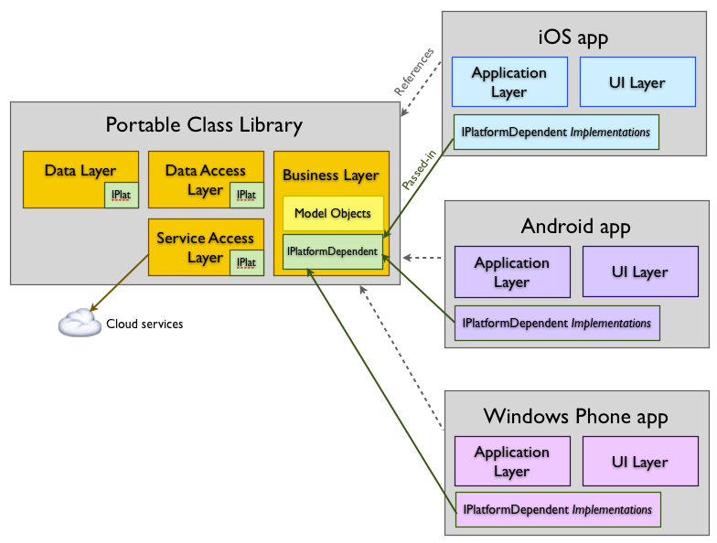](pcl-images/image1.png#lightbox)

# [Visual Studio for Mac](#tab/macos)

## Visual Studio for Mac walkthrough

This section walks through how to create and use a Portable Class Library using Visual Studio for Mac. Refer the to PCL Example section for a complete implementation.

### Creating a PCL

Adding a Portable Class Library to your solution is very similar to adding a regular Library project.

1. In the **New Project** dialog select the **Multiplatform > Library > Portable Library** option:

    

1. When a PCL is created in Visual Studio for Mac it is automatically configured with a Profile that works for Xamarin.iOS and Xamarin.Android. The PCL project will appear as shown in this screenshot:

    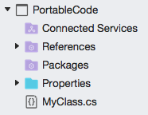

The PCL is now ready for code to be added. It can also be referenced by other projects (Application projects, Library projects and even other PCL projects).

### Editing PCL settings

To view and change the PCL settings for this project, right-click the project and choose **Options > Build > General** to see the screen shown here:

[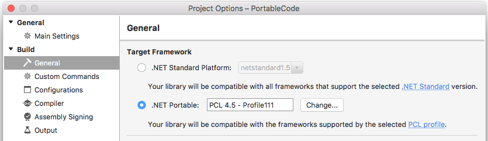](pcl-images/image4.png#lightbox)

Click **Change...** to alter the target profile for this portable class library.

If the profile is changed after code has already been added to the PCL, it's possible that the library will no longer compile if the code references features that are not part of the newly-selected profile.

## Working with a PCL

When code is written in a PCL library, the Visual Studio for Mac editor will recognize the limitations of the selected profile and adjust auto-complete options accordingly. For example, this screenshot shows the auto-complete options for System.IO using the default profile (Profile136) used in Visual Studio for Mac – notice the scrollbar which indicates about half of the available classes are displayed (in fact there are only 14 classes available).

[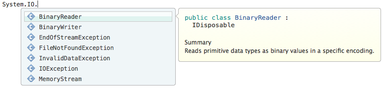](pcl-images/image6.png#lightbox)

Compare that with the System.IO auto-complete in a Xamarin.iOS or Xamarin.Android project – there are 40 classes available including commonly used classes like `File` and `Directory` which are not in any PCL profile.

[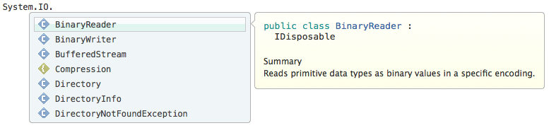](pcl-images/image7.png#lightbox)

This reflects the underlying trade-off of using PCL – the ability to share code seamlessly across many platforms means certain APIs are not available to you because they don’t have comparable implementations across all possible platforms.

### Using PCL

Once a PCL project has been created, you can add a reference to it from any compatible Application or Library project in the same way you normally add references. In Visual Studio for Mac, right-click on the References node and choose **Edit References...** then switch to the **Projects** tab as shown:

[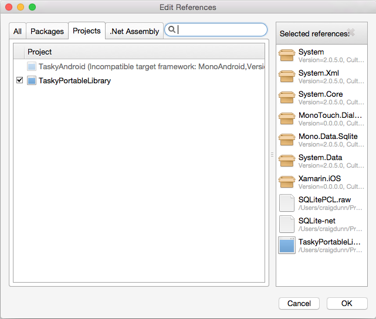](pcl-images/image8.png#lightbox)

The following screenshot shows the Solution pad for the TaskyPortable sample app, showing the PCL library at the bottom and a reference to that PCL library in the Xamarin.iOS project.

[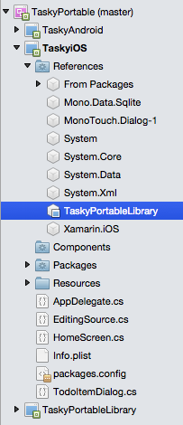](pcl-images/image9.png#lightbox)

The output from a PCL (ie. the resulting assembly DLL) can also be added as a reference to most projects. This makes PCL an ideal way to ship cross-platform components and libraries.

# [Visual Studio](#tab/windows)

## Visual Studio walkthrough

This section walks through how to create and use a Portable Class Library using Visual Studio. Refer the to
 PCL Example section for a complete implementation.

### Creating a PCL

Adding a PCL to your solution in Visual Studio is slightly different to adding a regular project:

1. In the **Add New Project** screen, select the **Class Library (Legacy Portable)** option. Note the description on the right advises that this project type has been deprecated.

    [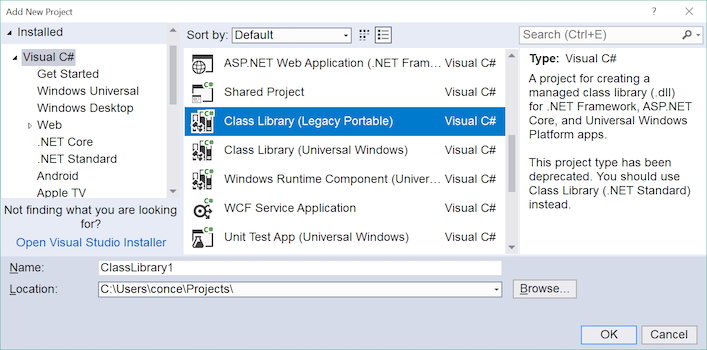](pcl-images/image10.png#lightbox)

2. Visual Studio will immediately prompt with the following dialog so that the profile can be configured.
 Tick the platforms you need to support and press OK.

    [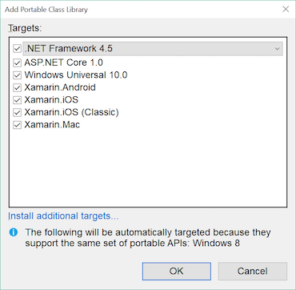](pcl-images/image11.png#lightbox)

3. The PCL project will appear as shown in the Solution Explorer &ndash; the text **(Portable)** appears beside the project name to indicate it is a PCL:

    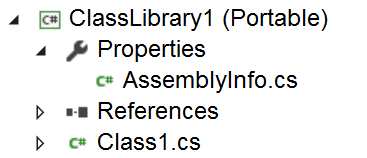

The PCL is now ready for code to be added. It can also be referenced by other projects (application
projects, library projects, and even other PCL projects).

### Editing PCL settings

The PCL settings can be viewed and changed by right-clicking on the project and choosing **Properties > Library** , as shown in this screenshot:

[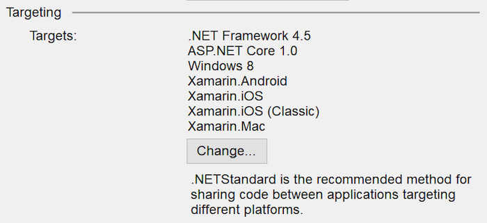](pcl-images/image13.png#lightbox)

If the profile is changed after code has already been added to the PCL, it’s possible that the library will no longer compile if the code references features that are not part of the newly-selected profile.

> [!TIP]
> There is also a message advising that **.NETStandard is the recommended method for sharing code**. This is an indication that while PCLs are still supported, it is recommended to upgrade to .NET Standard.

### Working with a PCL

When code is written in a PCL library, Visual Studio will recognize the limitations of the selected profile and adjust Intellisense options accordingly. For example, this screenshot shows the auto-complete options for System.IO using the default profile (Profile136) – notice the scrollbar which indicates about half of the available classes are displayed (in fact there are only 14 classes available).

[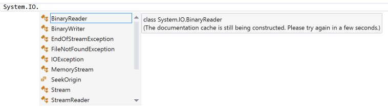](pcl-images/image14.png#lightbox)

Compare that with the System.IO auto-complete in a regular project – there are 40 classes available including
 commonly used classes like `File` and `Directory` which are not in any PCL profile.

[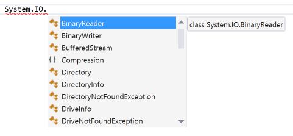](pcl-images/image15.png#lightbox)

This reflects the underlying trade-off of using PCL – the ability to share code seamlessly across many platforms means certain APIs are not available to you because they don’t have comparable implementations across all possible platforms.

> [!TIP]
> .NET Standard 2.0 represents a much larger API surface area than PCLs, including the System.IO namespace. For new
> projects, .NET Standard is recommended over PCL.

### Using PCL

Once a PCL project has been created, you can add a reference to it from any compatible Application or Library project in the same way you normally add references. In Visual Studio, right-click on the References node and choose `Add Reference...` then switch to the **Solution > Projects** tab as shown:

[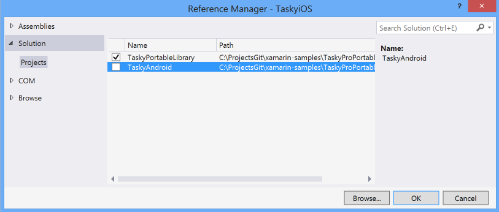](pcl-images/image16.png#lightbox)

The following screenshot shows the Solution pane for the TaskyPortable sample app, showing the PCL library at the bottom and a reference to that PCL library in the Xamarin.iOS project.

[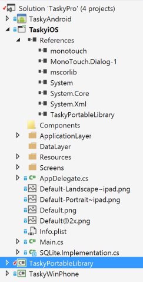](pcl-images/image17.png#lightbox)

The output from a PCL (ie. the resulting assembly DLL) can also be added as a reference to most projects.
 This makes PCL an ideal way to ship cross-platform components and libraries.

-----

## PCL example

The [TaskyPortable](/samples/xamarin/mobile-samples/taskyportable/)
sample application demonstrates how a Portable Class Library can be used with Xamarin.
Here are some screenshots of the resulting apps running on iOS and Android:

[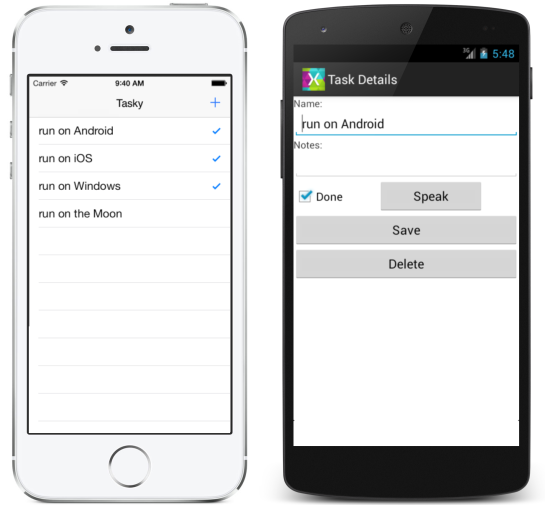](pcl-images/image18.png#lightbox)

It shares a number of data and logic classes that are purely portable code, and it also demonstrates how to
  incorporate platform-specific requirements using Dependency Injection for the SQLite database implementation.

The solution structure is shown below (in Visual Studio for Mac and Visual Studio respectively):

[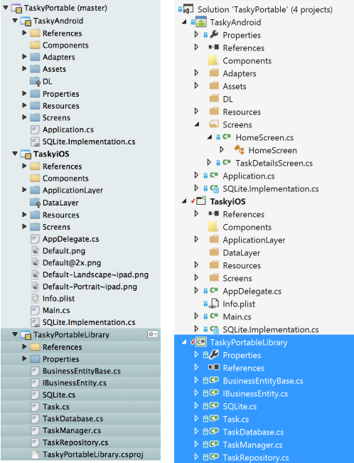](pcl-images/image19.png#lightbox)

Because the SQLite-NET code has platform-specific pieces (to work with the SQLite implementations on each different operating system) for demonstration purposes it has been refactored into an abstract class that can be compiled into a Portable Class Library, and the actual code implemented as subclasses in the iOS and Android projects.

### TaskyPortableLibrary

The Portable Class Library is limited in the .NET features that it can support. Because it is compiled to run on multiple platforms, it cannot make use of `[DllImport]` functionality that is used in SQLite-NET. Instead SQLite-NET is implemented as an abstract class, and then referenced through the rest of the shared code. An extract of the abstract API is shown below:

```csharp
public abstract class SQLiteConnection : IDisposable {

    public string DatabasePath { get; private set; }
    public bool TimeExecution { get; set; }
    public bool Trace { get; set; }
    public SQLiteConnection(string databasePath) {
         DatabasePath = databasePath;
    }
    public abstract int CreateTable<T>();
    public abstract SQLiteCommand CreateCommand(string cmdText, params object[] ps);
    public abstract int Execute(string query, params object[] args);
    public abstract List<T> Query<T>(string query, params object[] args) where T : new();
    public abstract TableQuery<T> Table<T>() where T : new();
    public abstract T Get<T>(object pk) where T : new();
    public bool IsInTransaction { get; protected set; }
    public abstract void BeginTransaction();
    public abstract void Rollback();
    public abstract void Commit();
    public abstract void RunInTransaction(Action action);
    public abstract int Insert(object obj);
    public abstract int Update(object obj);
    public abstract int Delete<T>(T obj);

    public void Dispose()
    {
        Close();
    }
    public abstract void Close();

}
```

The remainder of the shared code uses the abstract class to “store” and “retrieve” objects from the database. In any application that uses this abstract class we must pass in a complete implementation that provides the actual database functionality.

### TaskyAndroid and TaskyiOS

The iOS and Android application projects contain the user-interface and other platform-specific code used to wire-up the shared code in the PCL.

These projects also contain an implementation of the abstract database API that works on that platform. On
  iOS and Android the Sqlite database engine is built-in to the operating system, so the implementation can use
  `[DllImport]` as shown to provide the concrete implementation of database connectivity. An excerpt of the platform-specific implementation code is shown here:

```csharp
[DllImport("sqlite3", EntryPoint = "sqlite3_open")]
public static extern Result Open(string filename, out IntPtr db);

[DllImport("sqlite3", EntryPoint = "sqlite3_close")]
public static extern Result Close(IntPtr db);
```

The full implementation can be seen in the sample code.

## Summary

This article has briefly discussed the benefits and pitfalls of Portable Class Libraries, demonstrated how to create and consume PCLs from inside Visual Studio for Mac and Visual Studio; and finally introduced a complete sample application – TaskyPortable – that shows a PCL in action.

## Related links

- [TaskyPortable (sample)](/samples/xamarin/mobile-samples/taskyportable/)
- [Building Cross Platform Applications](~/cross-platform/app-fundamentals/building-cross-platform-applications/index.md)
- [Portable Visual Basic](~/cross-platform/platform/visual-basic/index.md)
- [Shared Projects](~/cross-platform/app-fundamentals/shared-projects.md)
- [Sharing Code Options](~/cross-platform/app-fundamentals/code-sharing.md)
- [Cross-Platform Development with the .NET Framework (Microsoft)](/dotnet/standard/cross-platform/cross-platform-development-with-the-portable-class-library)