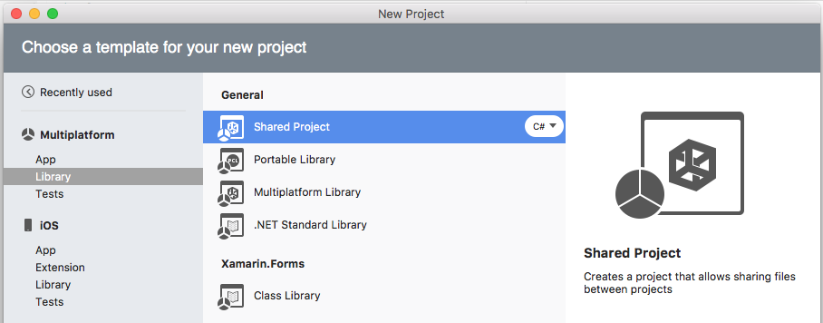
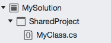
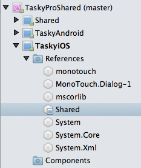
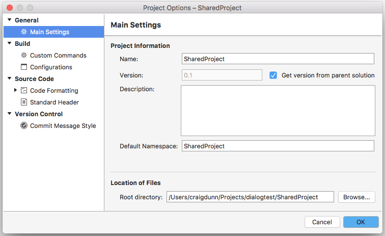
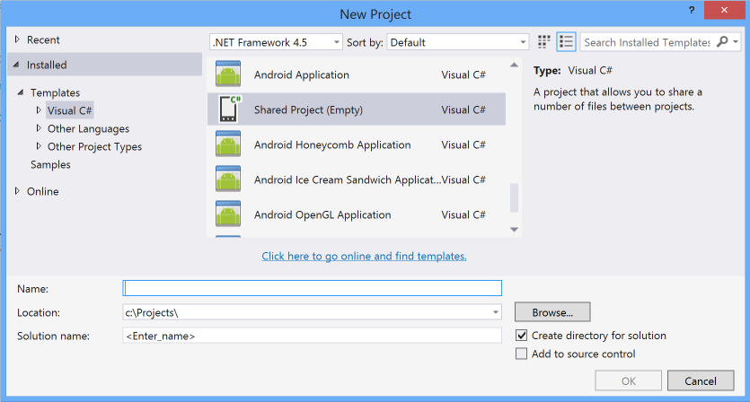
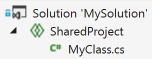
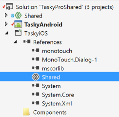
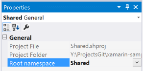
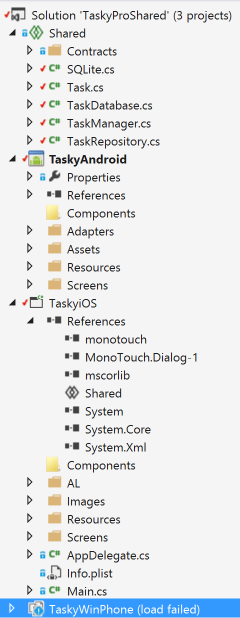

# Shared Projects code sharing

_Shared Projects let you write common code that is referenced by a number of different application projects. The code is compiled as part of each referencing project and can include compiler directives to help incorporate platform-specific functionality into the shared code base._

Shared Projects (also sometimes called Shared Asset Projects) let you write code that is shared between multiple target projects including Xamarin applications.

They support compiler directives so that you can conditionally include platform-specific code to be compiled into a subset of the projects that are referencing the Shared Project. There is also IDE support to help manage the compiler directives and visualize how the code will look in each application.

If you have used file-linking in the past to share code between projects, Shared Projects works in a similar way but with much improved IDE support.

## What is a Shared Project?

Unlike most other project types a shared project does not have any output (in DLL form), instead the code is compiled into each project that references it. This is illustrated in the diagram below - conceptually the entire contents of the Shared Project is "copied into" each referencing project and compiled as though it was a part of them.

The code in a Shared Project can contain compiler directives that will enable or disable sections of code depending on which application project is using the code, which is suggested by the colored platform boxes in the diagram.

A Shared Project does not get compiled on its own, it exists purely as a grouping of source code files that can be included in other projects. When referenced by another project, the code is effectively compiled as *part* of that project. Shared Projects cannot reference any other project type (including other Shared Projects).

Note that Android application projects cannot reference other Android application projects - for example, an Android unit test project cannot reference an Android application project. For more information about this limitation, see this [forum discussion](https://forums.xamarin.com/discussion/comment/98092/).

# [Visual Studio for Mac](#tab/macos)

## Visual Studio for Mac Walkthrough

This section walks through how to create and use a Shared Project using Visual Studio for Mac. Refer the to [Shared Project Example](#Shared_Project_Example) section for a complete example.

## Creating a Shared Project

To create a new Shared Project navigate to **File > New Solution...** (or right click an existing solution and choosing **Add > Add New Project...**):

On the next screen, choose the project name and click **Create**.

A new Shared Project is shown below - notice there are no References or Component nodes; these are not supported for Shared Projects.

For a Shared Project to be useful, it needs to be referenced by at least one build-able project (such as an iOS or Android application or library, or a PCL project). A Shared Project does not get compiled when it has nothing referencing it, so syntax (or any other) errors will not be highlighted until it has been referenced by something else.

Adding a reference to a Shared Project is done the same way as referencing a regular Library project. This screenshot shows a Xamarin.iOS project referencing a Shared Project.

Once the Shared Project is referenced by another library or application you can build the solution and view any errors in the code. When the Shared Project is referenced by _two-or-more_ other projects, a menu appears in the top-left of the source code editor that shows which projects reference this file.

## Shared Project Options

When you right-click on a Shared Project and choose **Options** there fewer settings than other project types. Because Shared Projects are not compiled (on their own), you cannot set output or compiler options, project configurations, assembly signing, or custom commands. The code in a Shared Project effectively inherits these values from whatever is referencing them.

The **Options** screen is shown below - the Project **Name** and the **Default Namespace** are the only two settings that you will generally change.

# [Visual Studio](#tab/windows)

## Visual Studio Walkthrough

This section walks through how to create and use a Shared Project using Visual Studio. Refer the to [Shared Project Example](#Shared_Project_Example) section for a complete implementation.

### Creating a Shared Project

To create a new Shared Project, navigate to **File** > **New** > **Project**.

In Visual Studio 2019, enter **shared** in the search box on the **Create a new project** page. Select the **Shared Project** template and then select **Next**. Enter a name for the project, and then select **Create**.

In Visual Studio 2017, select the **Shared Project** template, and then choose a name for the project.

You can also add a new Shared Project to an existing solution by right-clicking on the solution file and choosing **Add > New Project**. A new Shared Project looks as shown below (after a class file has been added). Notice there are no References or Component nodes; these are not supported for Shared Projects.

For a Shared Project to be useful, it needs to be referenced by at least one build-able project (such as an iOS or Android application or library, or a PCL project). A Shared Project does not get compiled when it has nothing referencing it, so syntax (or any other) errors will not be highlighted until it has been referenced by something else.

Adding a reference to a Shared Project is done the same way as referencing a regular Library project. This screenshot shows a Xamarin.iOS project referencing a Shared Project.

Once the Shared Project is referenced by another library or application you can build the solution and view any errors in the code. When the Shared Project is referenced by _two-or-more_ other projects, a menu appears in the top-left of the source code editor to see which projects reference the current code file.

### Shared Project Properties

When you select a Shared Project there fewer settings in the Properties panel than other project types. Because Shared Projects are not compiled (on their own), you cannot set output or compiler options, project configurations, assembly signing, or custom commands. The code in a Shared Project effectively inherits these values from whatever is referencing them.

The **Properties** panel is shown below - the **Root Namespace** is the only setting that you can change.

-----

## Shared Project Example

The [Tasky](https://github.com/xamarin/mobile-samples/tree/master/Tasky) example uses a Shared Project to contain the common code used by both the iOS, Android and Windows Phone applications. Both the `SQLite.cs` and `TaskRepository.cs` source code files utilise compiler directives (eg. `#if __ANDROID__`) to produce different output for each of the applications that reference them.

The complete solution structure is shown below (in Visual Studio for Mac and Visual Studio respectively):

# [Visual Studio for Mac](#tab/macos)

# [Visual Studio](#tab/windows)

-----

The Windows Phone project can be navigated from within Visual Studio for Mac, even though that project type is not supported for compilation in Visual Studio for Mac.

The running applications are shown below:

## Summary

This document described how Shared Projects work, how they can be created and used in both Visual Studio for Mac and Visual Studio, and introduced a simple sample application that demonstrates a Shared Project in action.

## Related Links

- [Tasky Sample App](https://github.com/xamarin/mobile-samples/tree/master/Tasky)
- [Portable Class Libraries (sample)](~/cross-platform/app-fundamentals/pcl.md)
- [Sharing Code Options (sample)](~/cross-platform/app-fundamentals/code-sharing.md)
