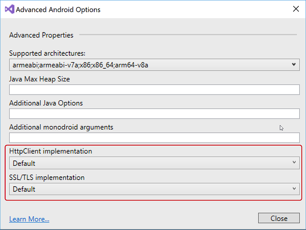
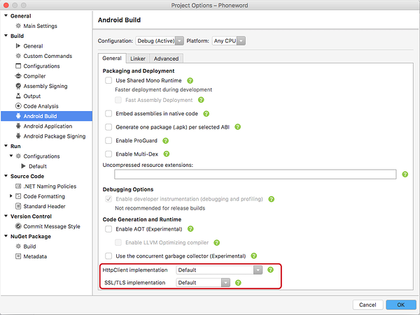

# Transport Layer Security (TLS)

_Enabling TLS 1.2 for Xamarin projects on Android, iOS, and Mac_

Using the latest version of [_Transport Layer Security_ (TLS)](https://en.wikipedia.org/wiki/Transport_Layer_Security)
is important to ensure application network communications are secure.

> [!NOTE]
> Xamarin releases since [February 2017](https://releases.xamarin.com/stable-release-cycle-9/) use TLS 1.2 in new projects by default.

TLS 1.2 support is now available in:

* Mono 4.8 (includes [TLS 1.2 support](http://www.mono-project.com/docs/about-mono/releases/4.8.0/#tls-12-support))
* Xamarin.iOS
* Xamarin.Mac
* Xamarin.Android (requires Android 5.0 or newer)

Projects must reference the **System.Net.Http** assembly. 

## Updating to TLS 1.2

This section explains some of the configuration options for networking
in Xamarin projects, so you can update your _existing_ apps to take advantage
of the more secure protocol.

# [Visual Studio](#tab/vswin)

These settings can be found in **Project Options > Android Options** and then clicking on the **Advanced** button: 

# [Visual Studio for Mac](#tab/vsmac)
These settings can be found in **Project Properties > Build Options > Advanced** tab:

-----

### HttpClient Implementation

Xamarin developers have always been able to use the native networking classes
in their code, however there is also an option that determines which networking
stack is used by the `HttpClient` classes. This provides a familiar .NET API
that has the speed and security advantages of the native platform.

The options are:

- **Managed stack** – the Mono-provided network functionality, or
- **Native stack** – various networking APIs provided by the underlying
  platforms (Android, iOS, or macOS).

The managed stack provides the highest level of compatibility with existing
.NET code, however it can be slower and result in larger executable size.

The native options can be faster and have better security (including TLS 1.2),
but may not provide all the functionality and options of the `HttpClient` class.

### SSL/TLS Implementation

Project options also let you choose which SSL/TLS implementation to support:

- **Mono/Managed** – TLS 1.1 on Android, TLS 1.0 on iOS and macOS.
- **Native** – TLS 1.2 on both Android, iOS, and macOS.

New Xamarin projects default to the native implementation that
supports TLS 1.2 (which is recommended for all projects),
however you can switch back to the managed code if required for compatibility reasons.

> [!IMPORTANT]
> The **Mono/Managed** option will be removed in a [future release](https://developer.xamarin.com/releases/ios/xamarin.ios_10/xamarin.ios_10.8/).
>
> The Native option is recommended.

# Platform-Specific Details

The above summary explains the project-level settings for HttpClient
and SSL/TLS implementation in Xamarin Projects. The HttpClient implementation
can also be set dynamically in code, and on iOS there are two
native options to choose from.

- [**Android**](~/android/app-fundamentals/http-stack.md)
- [**iOS and Mac**](~/cross-platform/macios/http-stack.md)

# Summary

Applications should use Transport Layer Security (TLS) 1.2 wherever possible.
New apps now default to this configuration, however you may need to update
the settings in existing applications according to the instructions
in this article.

## Related Links

- [App Transport Security](~/ios/app-fundamentals/ats.md)
- [Xamarin.Android Environment](~/android/deploy-test/environment.md)
- [Xamarin Cycle 9 (February 2017)](https://releases.xamarin.com/stable-release-cycle-9/)
- [TLS (Wikipedia)](https://en.wikipedia.org/wiki/Transport_Layer_Security)
- [Mono 4.8 Release Notes - TLS 1.2 Support](http://www.mono-project.com/docs/about-monohttps://developer.xamarin.com/releases/4.8.0/#tls-12-support)
- [BoringSSL](https://boringssl.googlesource.com/boringssl/)
- [HttpClient, HttpClientHandler, and WebRequestHandler Explained](https://blogs.msdn.microsoft.com/henrikn/2012/08/07/httpclient-httpclienthandler-and-webrequesthandler-explained/)
- [System.Net.HttpClient](https://msdn.microsoft.com/en-us/library/system.net.http.httpclient(v=vs.118).aspx)
- [System.Net.HttpClientHandler](https://msdn.microsoft.com/en-us/library/system.net.http.httpclienthandler(v=vs.118).aspx)
- [System.Net.HttpMessageHandler](https://msdn.microsoft.com/en-us/library/system.net.http.httpmessagehandler(v=vs.118).aspx)
- [System.Net.HttpWebRequest](https://msdn.microsoft.com/en-us/library/system.net.httpwebrequest(v=vs.110).aspx)
- [System.Net.WebClient](https://msdn.microsoft.com/en-us/library/system.net.webclient(v=vs.110).aspx)
- [System.Net.WebRequest](https://msdn.microsoft.com/en-us/library/system.net.webrequest(v=vs.110).aspx)
- [java.net.URLConnection](http://developer.android.com/reference/java/net/URLConnection.html)
- [Foundation.CFNetwork](https://developer.xamarin.com/api/type/CoreFoundation.CFNetwork/)
- [Foundation.NSUrlConnection](https://developer.xamarin.com/api/type/Foundation.NSUrlConnection/)
- [System.Net.WebRequest](https://msdn.microsoft.com/en-us/library/system.net.webrequest(v=vs.110).aspx)
- [HTTP Client (sample)](https://developer.xamarin.com/samples/monotouch/HttpClient/)
