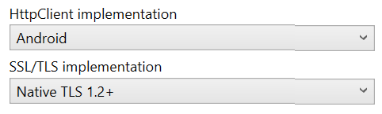
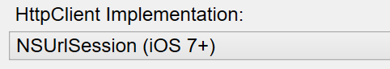

# Transport Layer Security (TLS) 1.2

Using the latest version of [_Transport Layer Security_ (TLS)](https://en.wikipedia.org/wiki/Transport_Layer_Security)
is important to ensure application network communications are secure.

> [!WARNING]
> **April, 2018** – Due to increased security requirements, including PCI compliance, major cloud providers and web servers are expected to stop supporting TLS versions older than 1.2. Xamarin projects created in previous versions of Visual Studio default to use older versions of TLS.
>
> In order to ensure your apps continue to work with these servers and services, **you should update your Xamarin projects to use the settings below, then re-build and re-deploy your apps** to your users.

Projects must reference the **System.Net.Http** assembly and be configured as shown below.

## Update Xamarin.Android to TLS 1.2

Update the **HttpClient implementation** and **SSL/TLS implementation** options to enable TLS 1.2 security.

> [!NOTE]
> Requires Android 5.0 or newer.

# [Visual Studio](#tab/windows)

These settings can be found in **Project Properties > Android Options** and then clicking on the **Advanced** button:

# [Visual Studio for Mac](#tab/macos)

These settings can be found in **Project Options > Build > Android Build** tab:

-----

## Update Xamarin.iOS to TLS 1.2

Update the **HttpClient Implementation** option to enable TSL 1.2 security.

# [Visual Studio](#tab/windows)

This setting can be found in **Project Properties > iOS Build**:

# [Visual Studio for Mac](#tab/macos)

This setting can be found in **Project Options > Build > iOS Build** tab:

-----

## Update Xamarin.Mac to TLS 1.2

In Visual Studio for Mac, to enable TLS 1.2 in a Xamarin.Mac app, update the 
**HttpClient Implementation** option in **Project Options > Build > Mac Build**:

> [!WARNING]
> The upcoming Xamarin.Mac 4.8 release will only support macOS 10.9 or higher.
> Previous versions of Xamarin.Mac supported macOS 10.7 or higher, but
> these older macOS versions lack sufficient TLS infrastructure to support
> TLS 1.2. To target macOS 10.7 or macOS 10.8, use Xamarin.Mac 4.6 or
> earlier.

## Alternative configuration options

This section discusses alternatives to the TLS 1.2-supported configurations shown above.
Application developers should only consider these alternatives if they understand the risks
of using different levels of TLS support.

### HttpClient implementation

Xamarin developers have always been able to use the native networking classes
in their code, however there is also an option that determines which networking
stack is used by the `HttpClient` classes. This provides a familiar .NET API
that has the speed and security advantages of the native platform.

The options are:

- **Managed stack** – the Mono-provided network functionality, or
- **Native stack** – various networking APIs provided by the underlying
  platforms (Android, iOS, or macOS).

The managed stack provides the highest level of compatibility with existing
.NET code, however it can be slower and result in larger executable size.

The native options can be faster and have better security (including TLS 1.2),
but may not provide all the functionality and options of the `HttpClient` class.

### SSL/TLS implementation (Android)

Android project options also let you choose which SSL/TLS implementation to support:

- **Mono/Managed** – TLS 1.1 on Android
- **Native** – TLS 1.2 on Android.

New Xamarin projects default to the native implementation that
supports TLS 1.2 (which is recommended for all projects),
however you can switch back to the managed code if required for compatibility reasons.

> [!IMPORTANT]
> The **Mono/Managed** option has been [removed from iOS and Mac](https://github.com/xamarin/release-notes-archive/blob/master/release-notes/ios/xamarin.ios_10/xamarin.ios_10.8.md) project options.
>
> The Native option is always used on iOS and Mac platforms.

## Platform-specific details

The above summary explains the project-level settings for HttpClient
and SSL/TLS implementation in Xamarin Projects. The HttpClient implementation
can also be set dynamically in code. Refer to these platform-specific guides for more information:

- [**Android**](~/android/app-fundamentals/http-stack.md)
- [**iOS and Mac**](~/cross-platform/macios/http-stack.md)

## Summary

Applications should use Transport Layer Security (TLS) 1.2 wherever possible.
You should update the settings in existing applications according to the instructions
in this article, then re-build and re-deploy to your customers.

## Related links

- [App Transport Security](~/ios/app-fundamentals/ats.md)
- [Xamarin.Android Environment](~/android/deploy-test/environment.md)
- [Xamarin Cycle 9 (February 2017)](https://releases.xamarin.com/stable-release-cycle-9/)
- [TLS (Wikipedia)](https://en.wikipedia.org/wiki/Transport_Layer_Security)
- [Mono 4.8 Release Notes - TLS 1.2 Support](https://www.mono-project.com/docs/about-mono/releases/4.8.0/#tls-12-support)
- [BoringSSL](https://boringssl.googlesource.com/boringssl/)
- [HttpClient, HttpClientHandler, and WebRequestHandler Explained](/archive/blogs/henrikn/httpclient-httpclienthandler-and-webrequesthandler-explained)
- [System.Net.HttpClient](/previous-versions/visualstudio/hh193681(v=vs.118))
- [System.Net.HttpClientHandler](/previous-versions/visualstudio/hh138157(v=vs.118))
- [System.Net.HttpMessageHandler](/previous-versions/visualstudio/hh138091(v=vs.118))
- [System.Net.HttpWebRequest](/dotnet/api/system.net.httpwebrequest)
- [System.Net.WebClient](/dotnet/api/system.net.webclient)
- [System.Net.WebRequest](/dotnet/api/system.net.webrequest)
- [java.net.URLConnection](https://developer.android.com/reference/java/net/URLConnection.html)
- [Foundation.CFNetwork](xref:CoreFoundation.CFNetwork)
- [Foundation.NSUrlConnection](xref:Foundation.NSUrlConnection)
- [System.Net.WebRequest](/dotnet/api/system.net.webrequest)
- [HTTP Client (sample)](/samples/xamarin/ios-samples/httpclient/)