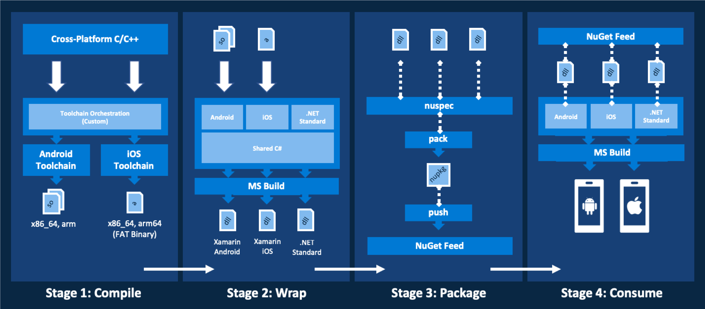

# Use C/C++ libraries with Xamarin

## Overview

Xamarin enables developers to create cross-platform native mobile apps with Visual Studio. Generally, C# bindings are used to expose existing platform components to developers. However, there are times when Xamarin apps need to work with existing codebases. Sometimes teams simply don't have the time, budget, or resources to port a large, well-tested, and highly optimized codebase to C#.

[Visual C++ for cross-platform mobile development](/visualstudio/cross-platform/visual-cpp-for-cross-platform-mobile-development) enables the C/C++ and C# code to be built as part of the same solution, offering many advantages including a unified debugging experience. Microsoft has used C/C++ and Xamarin in this way to deliver apps such as [Hyperlapse Mobile](https://www.microsoft.com/p/hyperlapse-mobile/9wzdncrd1prw) and [Pix Camera](https://www.microsoft.com/microsoftpix).

However, in some cases there is a desire (or requirement) to keep existing C/C++ tools and processes in place and to keep the library code decoupled from the application, treating the library as if it were similar to a third-party component. In these situations, the challenge is not only exposing the relevant members to C# but managing the library as a dependency. And, of course, automating as much of this process as possible.  

This post outlines a high-level approach for this scenario and walks through a simple example.

## Background

C/C++ is considered a cross-platform language, but great care must be taken to ensure that the source code is indeed cross-platform, using only C/C++ supported by all target compilers and containing little or no conditionally-included platform or compiler-specific code.

Ultimately the code must compile and run successfully on all target platforms therefore this boils down to the commonality across the platforms (and compilers) being targeted. Issues may still arise from minor differences between compilers and so thorough testing (preferably automated) on each target platform becomes increasingly important.  

## High-level approach

The illustration below represents the four-stage approach used to transform C/C++ source code into a cross-platform Xamarin library that is shared via NuGet and then is consumed in a Xamarin.Forms app.



The 4 stages are:

1. Compiling the C/C++ source code into platform-specific native libraries.
2. Wrapping the native libraries with a Visual Studio solution.
3. Packing and pushing a NuGet package for the .NET wrapper.
4. Consuming the NuGet package from a Xamarin app.

### Stage 1: Compiling the C/C++ source code into platform-specific native libraries

The goal of this stage is to create native libraries that can be called by the C# wrapper. This may or may not be relevant depending on your situation. The many tools and processes that can be brought to bear in this common scenario are beyond the scope of this article. Key considerations are keeping the C/C++ codebase in sync with any native wrapper code, sufficient unit testing, and build automation.

The libraries in the walk-through were created using Visual Studio Code with an accompanying shell script. An extended version of this walk-through can be found in the [Mobile CAT GitHub repository](https://github.com/xamcat/mobcat-samples/tree/master/cpp_with_xamarin) that discusses this part of the sample in greater depth. The native libraries are being treated as a third-party dependency in this case however this stage is illustrated for context.

For simplicity, the walkthrough targets only a subset of architectures. For iOS, it uses the lipo utility to create a single fat binary from the individual architecture-specific binaries. Android will use dynamic binaries with a .so extension and iOS will use a static fat binary with a .a extension.

### Stage 2: Wrapping the native libraries with a Visual Studio solution

The next stage is to wrap the native libraries so that they are easily used from .NET. This is done with a Visual Studio solution with four projects. A shared project contains the common code. Projects targeting each of Xamarin.Android, Xamarin.iOS, and .NET Standard allow the library to be referenced in a platform-agnostic manner.

The wrapper uses '[the bait and switch trick](https://github.com/JFMG/Bait-and-Switch-PCL-example),'. This is not the only way, but it makes it easy to reference the library and it avoids the need to explicitly manage platform-specific implementations within the consuming application itself. The trick is essentially ensuring that the targets (.NET Standard, Android, iOS) share the same namespace, assembly name, and class structure. Since NuGet will always prefer a platform-specific library, the .NET Standard version is never used at runtime.

Most of the work in this step will focus on using P/Invoke to call the native library methods and managing the references to the underlying objects. The goal is to expose the library’s functionality to the consumer while abstracting out any complexity. The Xamarin.Forms developers do not need to have working knowledge on the inner workings of the unmanaged library. It should feel like they are using any other managed C# library.

Ultimately, the output of this stage is a set of .NET libraries, one per target, along with a nuspec document that contains the information required in order to build the package in the next step.

**Stage 3: Packing and pushing a NuGet package for the .NET wrapper**

The third stage is creating a NuGet package using the build artifacts from the previous step. The outcome from this step is a NuGet package that can be consumed from a Xamarin app. The walkthrough uses a local directory to serve as the NuGet feed. In production, this step should publish a package to a public or private NuGet feed and should be fully automated.

**Stage 4: Consuming the NuGet package from a Xamarin.Forms app**

The final step is to reference and use the NuGet package from a Xamarin.Forms app. This requires configuring the NuGet feed in Visual Studio to use the feed defined in the previous step.

Once the feed is configured, the package needs to be referenced from each project in the cross-platform Xamarin.Forms app. ‘The bait-and-switch trick’ provides identical interfaces, so the native library functionality can be called using code defined in a single location.

The source code repository contains a [list of further reading](https://github.com/xamcat/mobcat-samples/tree/master/cpp_with_xamarin#wrapping-up) that includes articles on how to set up a private NuGet feed on Azure DevOps and how to push the package to that feed. While requiring a little more setup time than a local directory, this type of feed is better in a team development environment.

## Walk-through

The steps provided are specific to **Visual Studio for Mac**, but the structure works in **Visual Studio 2017** as well.

### Prerequisites

In order to follow along, the developer will need:

- [NuGet Command Line (CLI)](/nuget/tools/nuget-exe-cli-reference#macoslinux)

- [*Visual Studio* *for Mac*](https://visualstudio.microsoft.com/downloads)

> [!NOTE]
> An active [**Apple Developer Account**](https://developer.apple.com/) is required in order to deploy apps to an iPhone.

## Creating the native libraries (Stage 1)

The native library functionality is based on the example from [Walkthrough: Creating and Using a Static Library (C++)](/cpp/windows/walkthrough-creating-and-using-a-static-library-cpp?view=vs-2017&preserve-view=true).

This walkthrough skips the first stage, building the native libraries, since the library is provided as a third-party dependency in this scenario. The precompiled native libraries are included alongside the [sample code](https://github.com/xamcat/mobcat-samples/tree/master/cpp_with_xamarin) or can be [downloaded](https://github.com/xamcat/mobcat-samples/tree/master/cpp_with_xamarin/Sample/Artefacts) directly.

### Working with the native library

The original *MathFuncsLib* example includes a single class called `MyMathFuncs` with the following definition:

```cpp
namespace MathFuncs
{
    class MyMathFuncs
    {
    public:
        double Add(double a, double b);
        double Subtract(double a, double b);
        double Multiply(double a, double b);
        double Divide(double a, double b);
    };
}
```

An additional class defines wrapper functions that allow a .NET consumer to create, dispose, and interact with the underlying native `MyMathFuncs` class.

```cpp
#include "MyMathFuncs.h"
using namespace MathFuncs;

extern "C" {
    MyMathFuncs* CreateMyMathFuncsClass();
    void DisposeMyMathFuncsClass(MyMathFuncs* ptr);
    double MyMathFuncsAdd(MyMathFuncs *ptr, double a, double b);
    double MyMathFuncsSubtract(MyMathFuncs *ptr, double a, double b);
    double MyMathFuncsMultiply(MyMathFuncs *ptr, double a, double b);
    double MyMathFuncsDivide(MyMathFuncs *ptr, double a, double b);
}
```

It will be these wrapper functions that are used on the [Xamarin](https://visualstudio.microsoft.com/xamarin/) side.

## Wrapping the native library (Stage 2)

This stage requires the [precompiled libraries](https://github.com/xamcat/mobcat-samples/tree/master/cpp_with_xamarin/Sample/Artefacts) described in the [previous section](#creating-the-native-libraries-stage-1).

### Creating the Visual Studio solution

1. In **Visual Studio for Mac**, click **New Project** (from the *Welcome Page*) or **New Solution** (from the *File* menu).
2. From the **New Project** window, choose **Shared Project** (from within *Multiplatform > Library*) and then click **Next**.
3. Update the following fields then click **Create**:

    - **Project Name:** MathFuncs.Shared  
    - **Solution Name:** MathFuncs  
    - **Location:** Use the default save location (or pick an alternative)   
    - **Create a project within the solution directory:** Set this to checked
4. From **Solution Explorer**, double-click on the **MathFuncs.Shared** project and navigate to **Main Settings**.
5. Remove **.Shared** from the **Default Namespace** so it is set to **MathFuncs** only, then click **OK**.
6. Open **MyClass.cs** (created by the template), then rename both the class and the filename to **MyMathFuncsWrapper** and change the namespace to **MathFuncs**.
7. **CONTROL + CLICK** on the solution **MathFuncs**, then choose **Add New Project...** from the **Add** menu.
8. From the **New Project** window, choose **.NET Standard Library** (from within *Multiplatform > Library*) and then click **Next**.
9. Choose **.NET Standard 2.0** and then click **Next**.
10. Update the following fields then click **Create**:

    - **Project Name:** MathFuncs.Standard  
    - **Location:** Use the same save location as the shared project   

11. From **Solution Explorer**, double-click on the **MathFuncs.Standard** project.
12. Navigate to **Main Settings**, then update **Default Namespace** to **MathFuncs**.
13. Navigate to the **Output** settings, then update **Assembly name** to **MathFuncs**.
14. Navigate to the **Compiler** settings, change the **Configuration** to **Release**, setting **Debug information** to **Symbols Only** then click **OK**.
15. Delete **Class1.cs/Getting Started** from the project (if one of these has been included as part of the template).
16. **CONTROL + CLICK** on the project **Dependencies/References** folder, then choose **Edit References**.
17. Select **MathFuncs.Shared** from the **Projects** tab, then click **OK**.
18. Repeat steps 7-17 (ignoring step 9) using the following configurations:

    | **PROJECT NAME**  | **TEMPLATE NAME**   | **NEW PROJECT MENU**   |
    |-------------------| --------------------| -----------------------|
    | MathFuncs.Android | Class Library       | Android > Library      |
    | MathFuncs.iOS     | Binding Library     | iOS > Library          |

19. From **Solution Explorer**, double-click on the **MathFuncs.Android** project, then navigate to the **Compiler** settings.

20. With the **Configuration** set to **Debug**, edit **Define Symbols** to include **Android;**.

21. Change the **Configuration** to **Release**, then edit **Define Symbols** to also include **Android;**.

22. Repeat steps 19-20 for **MathFuncs.iOS**, editing **Define Symbols** to include **iOS;** instead of **Android;** in both cases.

23. Build the solution in **Release** configuration (**CONTROL + COMMAND + B**) and validate that all three output assemblies (Android, iOS, .NET Standard) (in the respective project bin folders) share the same name **MathFuncs.dll**.

At this stage, the solution should have three targets, one apiece for Android, iOS and .NET Standard, and a shared project that is referenced by each of the three targets. These should be configured to use the same default namespace and output assemblies with the same name. This is necessary for the 'bait and switch' approach mentioned previously.

### Adding the native libraries

The process of adding the native libraries to the wrapper solution varies slightly between Android and iOS.

#### Native references for MathFuncs.Android

1. **CONTROL + CLICK** on the **MathFuncs.Android** project, then choose **New Folder** from the **Add** menu naming it **lib**.

2. For each **ABI** (Application Binary Interface), **CONTROL + CLICK** on the **lib** folder, then choose **New Folder** from the **Add** menu, naming it after that respective **ABI**. In this case:

    - arm64-v8a
    - armeabi-v7a
    - x86
    - x86_64  

    > [!NOTE]
    > For a more detailed overview, see the [Architectures and CPUs](https://developer.android.com/ndk/guides/arch) topic from the [NDK developer guide](https://developer.android.com/ndk/guides/), specifically the section on addressing [native code in app packages](https://developer.android.com/ndk/guides/abis#native-code-in-app-packages).

3. Verify the folder structure:  

    ```folders
    - lib
        - arm64-v8a
        - armeabi-v7a
        - x86
        - x86_64
    ```

4. Add the corresponding **.so** libraries to each of the **ABI** folders based on the following mapping:

    **arm64-v8a:**
    lib/Android/arm64

    **armeabi-v7a:**
    lib/Android/arm  

    **x86:**
    lib/Android/x86

    **x86_64:**
    lib/Android/x86_64

    > [!NOTE]
    > To add files, **CONTROL + CLICK** on the folder representing the respective **ABI**, then choose **Add Files...** from the **Add** menu. Choose the appropriate library (from the **PrecompiledLibs** directory) then click **Open** and then click **OK** leaving the default option to *Copy the file to the directory*.

5. For each of the **.so** files, **CONTROL + CLICK** then choose the **EmbeddedNativeLibrary** option from the **Build Action** menu.

Now the **lib** folder should appear as follows:

```folders
- lib
    - arm64-v8a
        - libMathFuncs.so
    - armeabi-v7a
        - libMathFuncs.so
    - x86
        - libMathFuncs.so
    - x86_64
        - libMathFuncs.so
```

#### Native references for MathFuncs.iOS

1. **CONTROL + CLICK** on the **MathFuncs.iOS** project, then choose **Add Native Reference** from the **Add** menu.
2. Choose the **libMathFuncs.a** library (from libs/ios under the **PrecompiledLibs** directory) then click **Open**
3. **CONTROL + CLICK** on the **libMathFuncs** file (within the **Native References** folder, then choose the **Properties** option from the menu  
4. Configure the **Native Reference** properties so they are checked (showing a tick icon) in the **Properties** Pad:

    - Force Load
    - Is C++
    - Smart Link

    > [!NOTE]
    > Using a binding library project type along with a [native reference](../macios/native-references.md) embeds the static library and enables it to be automatically linked with the Xamarin.iOS app that references it (even when it is included via a NuGet package).

5. Open **ApiDefinition.cs**, deleting the templated commented code (leaving only the `MathFuncs` namespace), then perform the same step for **Structs.cs**

    > [!NOTE]
    > A Binding library project requires these files (with the *ObjCBindingApiDefinition* and *ObjCBindingCoreSource* build actions) in order to build. However, we will write the code, to call our native library, outside of these files in a way that can be shared between both Android and iOS library targets using standard P/Invoke.

### Writing the managed library code

Now, write the C# code to call the native library. The goal is to hide any underlying complexity. The consumer should not need any working knowledge of the native library internals or of P/Invoke concepts.  

#### Creating a SafeHandle

1. **CONTROL + CLICK** on the **MathFuncs.Shared** project, then choose **Add File...** from the **Add** menu.
2. Choose **Empty Class** from the **New File** window, name it **MyMathFuncsSafeHandle** and then click **New**
3. Implement the **MyMathFuncsSafeHandle** class:

    ```csharp
    using System;
    using Microsoft.Win32.SafeHandles;

    namespace MathFuncs
    {
        internal class MyMathFuncsSafeHandle : SafeHandleZeroOrMinusOneIsInvalid
        {
            public MyMathFuncsSafeHandle() : base(true) { }

            public IntPtr Ptr => handle;

            protected override bool ReleaseHandle()
            {
                // TODO: Release the handle here
                return true;
            }
        }
    }
    ```

    > [!NOTE]
    > A [SafeHandle](/dotnet/api/system.runtime.interopservices.safehandle?view=netframework-4.7.2&preserve-view=true) is the preferred way to work with unmanaged resources in managed code. This abstracts away a lot of boilerplate code related to critical finalization and object lifecycle. The owner of this handle can subsequently treat it like any other managed resource and will not have to implement the full [Disposable pattern](/dotnet/standard/garbage-collection/implementing-dispose).

#### Creating the internal wrapper class

1. Open **MyMathFuncsWrapper.cs**, changing it to an internal static class

    ```csharp
    namespace MathFuncs
    {
        internal static class MyMathFuncsWrapper
        {
        }
    }
    ```

2. In the same file, add the following conditional statement to the class:

    ```csharp
    #if Android
        const string DllName = "libMathFuncs.so";
    #else
        const string DllName = "__Internal";
    #endif
    ```

    > [!NOTE]
    > This sets the **DllName** constant value based on whether the library is being built for **Android** or **iOS**. This is to address the different naming conventions used by each respective platform but also the type of library being used in this case. Android is using a dynamic library and so expects a filename including extension. For iOS, '*__Internal*' is required since we are using a static library.

3. Add a reference to **System.Runtime.InteropServices** at the top of the **MyMathFuncsWrapper.cs** file

    ```csharp
    using System.Runtime.InteropServices;
    ```

4. Add the wrapper methods to handle the creation and disposal of the **MyMathFuncs** class:

    ```csharp
    [DllImport(DllName, EntryPoint = "CreateMyMathFuncsClass")]
    internal static extern MyMathFuncsSafeHandle CreateMyMathFuncs();

    [DllImport(DllName, EntryPoint = "DisposeMyMathFuncsClass")]
    internal static extern void DisposeMyMathFuncs(MyMathFuncsSafeHandle ptr);
    ```

    > [!NOTE]
    > We are passing in our constant **DllName** to the **DllImport** attribute along with the **EntryPoint** which explicitly tells the .NET runtime the name of the function to call within that library. Technically, we do not need to provide the **EntryPoint** value if our managed method names were identical to the unmanaged one. If one is not provided, the managed method name would be used as the **EntryPoint** instead. However, it is better to be explicit.  

5. Add the wrapper methods to enable us to work with the **MyMathFuncs** class using the following code:

    ```csharp
    [DllImport(DllName, EntryPoint = "MyMathFuncsAdd")]
    internal static extern double Add(MyMathFuncsSafeHandle ptr, double a, double b);

    [DllImport(DllName, EntryPoint = "MyMathFuncsSubtract")]
    internal static extern double Subtract(MyMathFuncsSafeHandle ptr, double a, double b);

    [DllImport(DllName, EntryPoint = "MyMathFuncsMultiply")]
    internal static extern double Multiply(MyMathFuncsSafeHandle ptr, double a, double b);

    [DllImport(DllName, EntryPoint = "MyMathFuncsDivide")]
    internal static extern double Divide(MyMathFuncsSafeHandle ptr, double a, double b);
    ```

    > [!NOTE]
    > We're using simple types for the parameters in this example. Since marshalling is a bitwise-copy in this case it requires no additional work on our part. Also notice the use of the **MyMathFuncsSafeHandle** class instead of the standard **IntPtr**. The **IntPtr** is automatically mapped to the **SafeHandle** as part of the marshalling process.

6. Verify that the finished **MyMathFuncsWrapper** class appears as below:

    ```csharp
    using System.Runtime.InteropServices;

    namespace MathFuncs
    {
        internal static class MyMathFuncsWrapper
        {
            #if Android
                const string DllName = "libMathFuncs.so";
            #else
                const string DllName = "__Internal";
            #endif

            [DllImport(DllName, EntryPoint = "CreateMyMathFuncsClass")]
            internal static extern MyMathFuncsSafeHandle CreateMyMathFuncs();

            [DllImport(DllName, EntryPoint = "DisposeMyMathFuncsClass")]
            internal static extern void DisposeMyMathFuncs(MyMathFuncsSafeHandle ptr);

            [DllImport(DllName, EntryPoint = "MyMathFuncsAdd")]
            internal static extern double Add(MyMathFuncsSafeHandle ptr, double a, double b);

            [DllImport(DllName, EntryPoint = "MyMathFuncsSubtract")]
            internal static extern double Subtract(MyMathFuncsSafeHandle ptr, double a, double b);

            [DllImport(DllName, EntryPoint = "MyMathFuncsMultiply")]
            internal static extern double Multiply(MyMathFuncsSafeHandle ptr, double a, double b);

            [DllImport(DllName, EntryPoint = "MyMathFuncsDivide")]
            internal static extern double Divide(MyMathFuncsSafeHandle ptr, double a, double b);
        }
    }
    ```

#### Completing the MyMathFuncsSafeHandle class

1. Open the **MyMathFuncsSafeHandle** class, navigate to the placeholder **TODO** comment within the **ReleaseHandle** method:

    ```csharp
    // TODO: Release the handle here
    ```

1. Replace the **TODO** line:

    ```csharp
    MyMathFuncsWrapper.DisposeMyMathFuncs(this);
    ```

#### Writing the MyMathFuncs class

Now that the wrapper is complete, create a MyMathFuncs class that will manage the reference to the unmanaged C++ MyMathFuncs object.  

1. **CONTROL + CLICK** on the **MathFuncs.Shared** project, then choose **Add File...** from the **Add** menu.
2. Choose **Empty Class** from the **New File** window, name it **MyMathFuncs** and then click **New**
3. Add the following members to the **MyMathFuncs** class:

    ```csharp
    readonly MyMathFuncsSafeHandle handle;
    ```

4. Implement the constructor for the class so it creates and stores a handle to the native **MyMathFuncs** object when the class is instantiated:

    ```csharp
    public MyMathFuncs()
    {
        handle = MyMathFuncsWrapper.CreateMyMathFuncs();
    }
    ```

5. Implement the **IDisposable** interface using the following code:

    ```csharp
    public class MyMathFuncs : IDisposable
    {
        ...

        protected virtual void Dispose(bool disposing)
        {
            if (handle != null && !handle.IsInvalid)
                handle.Dispose();
        }

        public void Dispose()
        {
            Dispose(true);
            GC.SuppressFinalize(this);
        }

        // ...
    }
    ```

6. Implement the **MyMathFuncs** methods using the **MyMathFuncsWrapper** class to perform the real work under the hood by passing in the pointer we have stored to the underlying unmanaged object. The code should be as follows:

    ```csharp
    public double Add(double a, double b)
    {
        return MyMathFuncsWrapper.Add(handle, a, b);
    }

    public double Subtract(double a, double b)
    {
        return MyMathFuncsWrapper.Subtract(handle, a, b);
    }

    public double Multiply(double a, double b)
    {
        return MyMathFuncsWrapper.Multiply(handle, a, b);
    }

    public double Divide(double a, double b)
    {
        return MyMathFuncsWrapper.Divide(handle, a, b);
    }
    ```

#### Creating the nuspec

In order to have the library packaged and distributed via NuGet, the solution needs a **nuspec** file. This will identify which of the resulting assemblies will be included for each supported platform.

1. **CONTROL + CLICK** on the solution **MathFuncs**, then choose **Add Solution Folder** from the **Add** menu naming it **SolutionItems**.
2. **CONTROL + CLICK** on the **SolutionItems** folder, then choose **New File...** from the **Add** menu.
3. Choose **Empty XML File** from the **New File** window, name it **MathFuncs.nuspec** and then click **New**.
4. Update **MathFuncs.nuspec** with the basic package metadata to be displayed to the **NuGet** consumer. For example:

    ```xml
    <?xml version="1.0"?>
    <package>
        <metadata>
            <id>MathFuncs</id>
            <version>$version$</version>
            <authors>Microsoft Mobile Customer Advisory Team</authors>
            <description>Sample C++ Wrapper Library</description>
            <requireLicenseAcceptance>false</requireLicenseAcceptance>
            <copyright>Copyright 2018</copyright>
        </metadata>
    </package>
    ```

    > [!NOTE]
    > See the [nuspec reference](/nuget/reference/nuspec) document for further detail on the schema used for this manifest.

5. Add a `<files>` element as a child of the `<package>` element (just below `<metadata>`), identifying each file with a separate `<file>` element:

    ```xml
    <files>

        <!-- Android -->

        <!-- iOS -->

        <!-- netstandard2.0 -->

    </files>
    ```

    > [!NOTE]
    > When a package is installed into a project, and where there are multiple assemblies specified by the same name, NuGet will effectively choose the assembly that is most specific to the given platform.

6. Add the `<file>` elements for the **Android** assemblies:

    ```xml
    <file src="MathFuncs.Android/bin/Release/MathFuncs.dll" target="lib/MonoAndroid81/MathFuncs.dll" />
    <file src="MathFuncs.Android/bin/Release/MathFuncs.pdb" target="lib/MonoAndroid81/MathFuncs.pdb" />
    ```

7. Add the `<file>` elements for the **iOS** assemblies:

    ```xml
    <file src="MathFuncs.iOS/bin/Release/MathFuncs.dll" target="lib/Xamarin.iOS10/MathFuncs.dll" />
    <file src="MathFuncs.iOS/bin/Release/MathFuncs.pdb" target="lib/Xamarin.iOS10/MathFuncs.pdb" />
    ```

8. Add the `<file>` elements for the **netstandard2.0** assemblies:

    ```xml
    <file src="MathFuncs.Standard/bin/Release/netstandard2.0/MathFuncs.dll" target="lib/netstandard2.0/MathFuncs.dll" />
    <file src="MathFuncs.Standard/bin/Release/netstandard2.0/MathFuncs.pdb" target="lib/netstandard2.0/MathFuncs.pdb" />
    ```

9. Verify the **nuspec** manifest:

    ```xml
    <?xml version="1.0"?>
    <package>
    <metadata>
        <id>MathFuncs</id>
        <version>$version$</version>
        <authors>Microsoft Mobile Customer Advisory Team</authors>
        <description>Sample C++ Wrapper Library</description>
        <requireLicenseAcceptance>false</requireLicenseAcceptance>
        <copyright>Copyright 2018</copyright>
    </metadata>
    <files>

        <!-- Android -->
        <file src="MathFuncs.Android/bin/Release/MathFuncs.dll" target="lib/MonoAndroid81/MathFuncs.dll" />
        <file src="MathFuncs.Android/bin/Release/MathFuncs.pdb" target="lib/MonoAndroid81/MathFuncs.pdb" />

        <!-- iOS -->
        <file src="MathFuncs.iOS/bin/Release/MathFuncs.dll" target="lib/Xamarin.iOS10/MathFuncs.dll" />
        <file src="MathFuncs.iOS/bin/Release/MathFuncs.pdb" target="lib/Xamarin.iOS10/MathFuncs.pdb" />

        <!-- netstandard2.0 -->
        <file src="MathFuncs.Standard/bin/Release/netstandard2.0/MathFuncs.dll" target="lib/netstandard2.0/MathFuncs.dll" />
        <file src="MathFuncs.Standard/bin/Release/netstandard2.0/MathFuncs.pdb" target="lib/netstandard2.0/MathFuncs.pdb" />

    </files>
    </package>
    ```

    > [!NOTE]
    > This file specifies the assembly output paths from a **Release** build, so be sure to build the solution using that configuration.

At this point, the solution contains 3 .NET assemblies and a supporting **nuspec** manifest.

## Distributing the .NET wrapper with NuGet

The next step is to package and distribute the NuGet package so it may be easily consumed by the app and managed as a dependency. The wrapping and consumption could all be done within a single solution, but distributing the library via NuGet aids in decoupling and enables us to manage these codebases independently.

### Preparing a local packages directory

The simplest form of NuGet feed is a local directory:

1. In **Finder**, navigate to a convenient directory. For example, **/Users**.
2. Choose **New Folder** from the **File** menu, providing a meaningful name such as **local-nuget-feed**.

### Creating the package

1. Set the **Build Configuration** to **Release**, and execute a build using **COMMAND + B**.
2. Open **Terminal** and change directory to the folder containing the **nuspec** file.
3. In **Terminal**, execute the **nuget pack** command specifying the **nuspec** file, the **Version** (for example, 1.0.0), and the **OutputDirectory** using the folder created in the [previous step](#preparing-a-local-packages-directory), that is, **local-nuget-feed**. For example:

    ```bash
    nuget pack MathFuncs.nuspec -Version 1.0.0 -OutputDirectory ~/local-nuget-feed
    ```

4. **Confirm** that **MathFuncs.1.0.0.nupkg** has been created in the **local-nuget-feed** directory.

### [OPTIONAL] Using a private NuGet feed with Azure DevOps

A more robust technique is described in [Get started with NuGet packages in Azure DevOps](/azure/devops/artifacts/get-started-nuget?tabs=new-nav&view=vsts#publish-a-package&preserve-view=true), which shows how to create a private feed and push the package (generated in the previous step) to that feed.

It is ideal to have this workflow fully automated, for example using [Azure Pipelines](/azure/devops/pipelines/index?view=vsts&preserve-view=true). For more information, see [Get started with Azure Pipelines](/azure/devops/pipelines/get-started/index?view=vsts&preserve-view=true).

## Consuming the .NET wrapper from a Xamarin.Forms app

To complete the walkthrough, create a **Xamarin.Forms** app to consume the package just published to the local **NuGet** feed.

### Creating the **Xamarin.Forms** project

1. Open a new instance of **Visual Studio for Mac**. This can be done from **Terminal**:

    ```bash
    open -n -a "Visual Studio"
    ```

2. In **Visual Studio for Mac**, click **New Project** (from the *Welcome Page*) or **New Solution** (from the *File* menu).
3. From the **New Project** window, choose **Blank Forms App** (from within *Multiplatform > App*) and then click **Next**.
4. Update the following fields then click **Next**:

    - **App Name:** MathFuncsApp.
    - **Organization Identifier:** Use a reverse namespace, for example, _com.{your_org}_.
    - **Target Platforms:** Use the default (both Android and iOS targets).
    - **Shared Code:** Set this to .NET Standard (a “Shared Library” solution is possible, but beyond the scope of this walkthrough).

5. Update the following fields then click **Create**:

    - **Project Name:** MathFuncsApp.
    - **Solution Name:** MathFuncsApp.  
    - **Location:** Use the default save location (or pick an alternative).

6. In **Solution Explorer**, **CONTROL + CLICK** on the target (**MathFuncsApp.Android** or **MathFuncs.iOS**) for initial testing, then choose **Set As Startup Project**.
7. Choose the preferred **device** or **Simulator**/**Emulator**.
8. Run the solution (**COMMAND + RETURN**) to validate that the templated **Xamarin.Forms** project builds and runs okay.

    > [!NOTE]
    > **iOS** (specifically the simulator) tends to have the fastest build/deploy time.

### Adding the local NuGet feed to the NuGet configuration

1. In **Visual Studio**, choose **Preferences** (from the **Visual Studio** menu).
2. Choose **Sources** from under the **NuGet** section, then click **Add**.
3. Update the following fields then click **Add Source**:

    - **Name:** Provide a meaningful name, for example, Local-Packages.  
    - **Location:** Specify the **local-nuget-feed** folder created in the [previous step](#preparing-a-local-packages-directory).

    > [!NOTE]
    > In this case there is no need to specify a **Username** and **Password**.

4. Click **OK**.

### Referencing the package

Repeat the following steps for each project (**MathFuncsApp**, **MathFuncsApp.Android**, and **MathFuncsApp.iOS**).

1. **CONTROL + CLICK** on the project, then choose **Add NuGet Packages...** from the **Add** menu.
2. Search for **MathFuncs**.
3. Verify the **Version** of the package is **1.0.0** and the other details appear as expected such as the **Title** and **Description**, that is, *MathFuncs* and *Sample C++ Wrapper Library*.
4. Select the **MathFuncs** package, then click **Add Package**.

### Using the library functions

Now, with a reference to the **MathFuncs** package in each of the projects, the functions are available to the C# code.

1. Open **MainPage.xaml.cs** from within the **MathFuncsApp** common **Xamarin.Forms**project (referenced by both **MathFuncsApp.Android** and **MathFuncsApp.iOS**).
2. Add **using** statements for **System.Diagnostics** and **MathFuncs** at the top of the file:

    ```csharp
    using System.Diagnostics;
    using MathFuncs;
    ```

3. Declare an instance of the `MyMathFuncs` class at the top of the `MainPage` class:

    ```csharp
    MyMathFuncs myMathFuncs;
    ```

4. Override the `OnAppearing` and `OnDisappearing` methods from the `ContentPage` base class:

    ```csharp
    protected override void OnAppearing()
    {
        base.OnAppearing();
    }

    protected override void OnDisappearing()
    {
        base.OnDisappearing();
    }
    ```

5. Update the `OnAppearing` method to initialize the `myMathFuncs` variable declared previously:

    ```csharp
    protected override void OnAppearing()
    {
        base.OnAppearing();
        myMathFuncs = new MyMathFuncs();
    }
    ```

6. Update the `OnDisappearing` method to call the `Dispose` method on `myMathFuncs`:

    ```csharp
    protected override void OnDisappearing()
    {
        base.OnAppearing();
        myMathFuncs.Dispose();
    }
    ```

7. Implement a private method called **TestMathFuncs** as follows:

    ```csharp
    private void TestMathFuncs()
    {
        var numberA = 1;
        var numberB = 2;

        // Test Add function
        var addResult = myMathFuncs.Add(numberA, numberB);

        // Test Subtract function
        var subtractResult = myMathFuncs.Subtract(numberA, numberB);

        // Test Multiply function
        var multiplyResult = myMathFuncs.Multiply(numberA, numberB);

        // Test Divide function
        var divideResult = myMathFuncs.Divide(numberA, numberB);

        // Output results
        Debug.WriteLine($"{numberA} + {numberB} = {addResult}");
        Debug.WriteLine($"{numberA} - {numberB} = {subtractResult}");
        Debug.WriteLine($"{numberA} * {numberB} = {multiplyResult}");
        Debug.WriteLine($"{numberA} / {numberB} = {divideResult}");
    }
    ```

8. Finally, call `TestMathFuncs` at the end of the `OnAppearing` method:

    ```csharp
    TestMathFuncs();
    ```

9. Run the app on each target platform and validate the output in the **Application Output** Pad appears as follows:

    ```csharp
    1 + 2 = 3
    1 - 2 = -1
    1 * 2 = 2
    1 / 2 = 0.5
    ```

    > [!NOTE]
    > If you encounter a '*DLLNotFoundException*' when testing on Android, or a build error on iOS, be sure to check that the CPU architecture of the device/emulator/simulator you are using is compatible with the subset that we chose to support.

## Summary

This article explained how to create a Xamarin.Forms app that uses native libraries through a common .NET wrapper distributed via a NuGet package. The example provided in this walkthrough is intentionally very simplistic to more easily demonstrate the approach. A real application will have to deal with complexities such as exception handling, callbacks, the marshalling of more complex types, and linking with other dependency libraries. A key consideration is the process by which the evolution of the C++ code is coordinated and synced with the wrapper and client applications. This process may vary depending on whether one or both of those concerns are the responsibility of a single team. Either way, automation is a real benefit. Below are some resources providing further reading around some of the key concepts along with the relevant downloads.

### Downloads

- [NuGet Command Line (CLI) tools](/nuget/tools/nuget-exe-cli-reference#macoslinux)
- [Visual Studio](https://visualstudio.microsoft.com/vs)

### Examples

- [Hyperlapse cross-platform mobile development with C++](https://blogs.msdn.microsoft.com/vcblog/2015/06/26/hyperlapse-cross-platform-mobile-development-with-visual-c-and-xamarin/)
- [Microsoft Pix (C++ and Xamarin)](https://devblogs.microsoft.com/xamarin/microsoft-research-ships-intelligent-apps-with-the-power-of-c-and-ai/)
- [Mono San Angeles Sample Port](/samples/xamarin/monodroid-samples/sanangeles-ndk/)

### Further Reading

[Articles relating to the content of this post](https://github.com/xamcat/mobcat-samples/tree/master/cpp_with_xamarin#wrapping-up)
