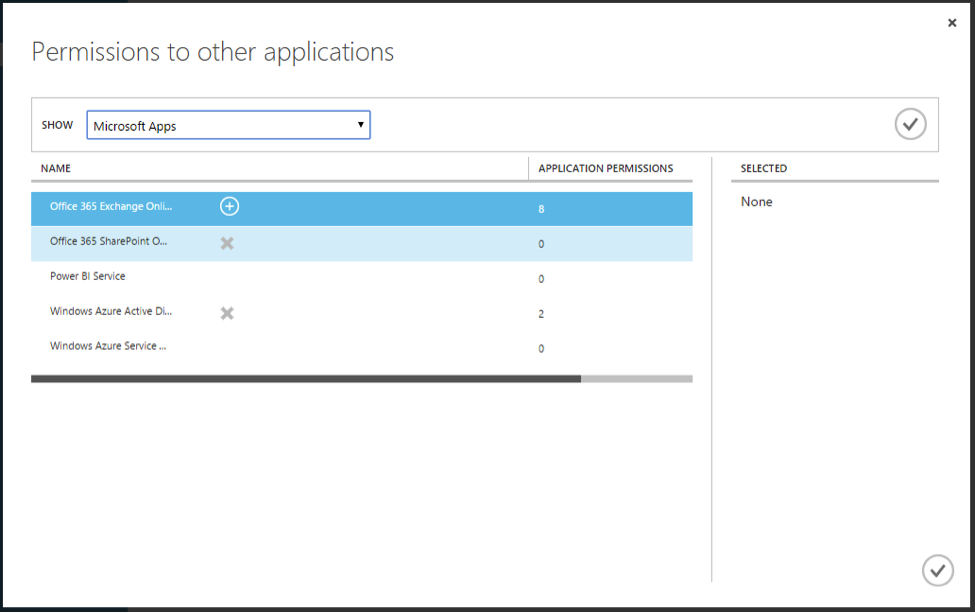

# Step 2. Configure Service Access for Mobile Application

Whenever any resource e.g. web application, web service,
  etc. needs to be secured by Azure Active Directory,
  it needs to be registered. All the secure applications
  or services can be seen under **Applications** tab.
  Here you can select the application which needs to be
  accessed from mobile application and give access to it.

1. On the **Configure** tab, locate **permissions to
   other applications** section:

   

2. Click on **Add application** button. On the next
   screen pop-up you should see list of all the applications
   which are secured by Azure Active Directory. Select the
   applications that needs to be accessed from the mobile application.

   

3. After selecting the application, once again select the
   newly-added application in **permissions to other
   applications** section and give appropriate rights.

   

4. Finally, **Save** the configuration. These services should
   now be available in mobile applications!

## Related Links

- [Microsoft NativeClient sample](https://github.com/AzureADSamples/NativeClient-MultiTarget-DotNet)
