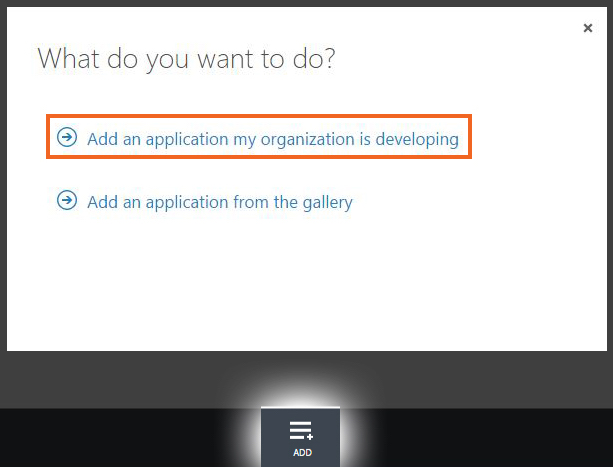
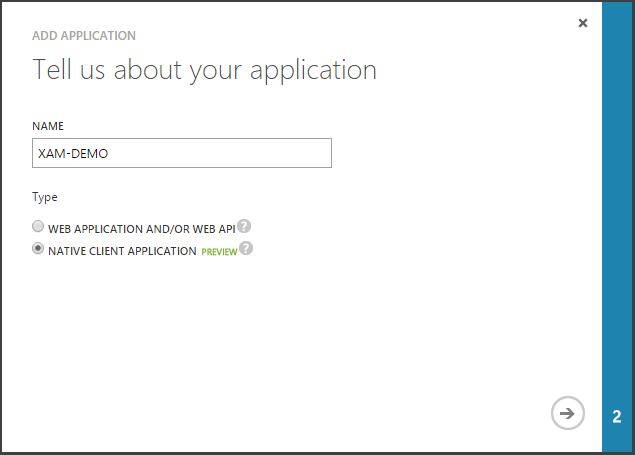

# Step 1. Register an app to use Azure Active Directory

1. Navigate to [windowsazure.com](https://manage.windowsazure.com)
   and log in with your Microsoft Account or Organization Account
   in the Azure Portal. If you don’t have an Azure
   subscription, you can get a trial from
   [azure.com](https://www.azure.com)

2. After signing in, go to the **Active Directory** (1)
   section and choose the directory where you want
   to register the application (2)

   

3. Click **Add** to create new application, then
   select **Add an application my organization is developing**

   

4. On the next screen, give your app a name (eg. XAM-DEMO).
   Make sure you select **Native Client Application** as the type of application.

   

5. On the final screen, provide a **Redirect URI* that is unique
   to your application as it will return to this URI when
   authentication is complete.

   

6. Once the app is created, navigate to the **Configure** tab.
   Write down the **Client ID** which we’ll use in our application
   later. Also, on this screen you can give your mobile application
   access to Active Directory or add another application like
   Web API or Office365, which can be used by mobile application once
   authentication is complete.

   

## Related Links

- [Microsoft NativeClient sample](https://github.com/AzureADSamples/NativeClient-MultiTarget-DotNet)
