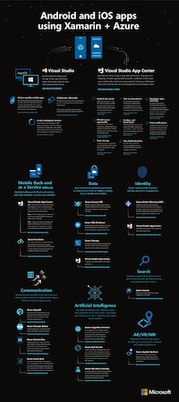

# Xamarin mobile apps with Azure and App Center

Xamarin developers can take advantage of a wide variety of cloud services, from continuous integration build with App Center to machine learning with Azure. [Download this poster](/xamarin/guides/cross-platform/azure/Resources/poster.pdf) or follow the links below to learn more.

## App Center

Visual Studio App Center supports end to end and integrated services central to mobile app development. Developers can use **Build**, **Test** and **Distribute** services to set up a Continuous Integration and Delivery pipeline. Once the app is deployed, developers can monitor the status and usage of their app using the **Analytics** and **Diagnostics** services, and engage with users using the **Push** service. Developers can also leverage **Auth** to authenticate their users and the **Data** service to persist and sync app data in the cloud.

If you are looking to integrate cloud services in your Xamarin apps, [visit the docs](/appcenter) and sign up with [App Center](https://appcenter.ms/signup?utm_source=XamarinDocs&utm_medium=Azure&utm_campaign=docs) today.

## Azure

Learn about [mobile app development with cloud services](/azure/mobile-apps/), including SignalR, cognitive services, machine learning, spatial anchors, search, and more.

## Download the poster

Download this [PDF (180kb)](/xamarin/guides/cross-platform/azure/Resources/poster.pdf) reference of the most popular Azure and App Center services available for mobile app development with Xamarin:

<!--
NOTE TO AUTHORS: this page is referenced from
https://azure.microsoft.com/develop/mobile/xamarin/
as https://developer xamarin com/guides/cross-platform/data-cloud/mobile-services/
A redirect has been put in place to /mobile-apps/ HOWEVER the /Resources/ .ZIP files are still located in /mobile-services/ so that the following permalinks don't break

The ZIPs in /Resources/ are also referenced by inbound links
Getting Started https://go.microsoft.com/fwlink/p/?LinkId=331359
Get started with data https://go.microsoft.com/fwlink/p/?LinkId=331302
Get started with push https://go.microsoft.com/fwlink/p/?LinkId=331303
Get started with authentication https://go.microsoft.com/fwlink/p/?LinkId=331328
Get started with Notification Hubs https://go.microsoft.com/fwlink/p/?LinkId=331329
Validate and modify data  https://go.microsoft.com/fwlink/p/?LinkId=331330

These links are for the Xamarin documentation available on the [Azure Mobile Apps](/azure/app-service-mobile/) website.
Adding Azure functionality to a Xamarin app by downloading the [Azure Mobile Client](https://www.nuget.org/packages/Microsoft.Azure.Mobile.Client/).

[Working with the Xamarin Client Library (Component)](/azure/app-service-mobile/app-service-mobile-dotnet-how-to-use-client-library) 

- [iOS](/azure/app-service-mobile/app-service-mobile-xamarin-ios-get-started/)
- [Android](/azure/app-service-mobile/app-service-mobile-xamarin-android-get-started/)
- [Xamarin.Forms](/azure/app-service-mobile/app-service-mobile-xamarin-forms-get-started)

- [GettingStarted (sample)](https://github.com/xamarin/mobile-samples/tree/master/Azure/GettingStarted)
- [GetStartedWithData (sample)](https://github.com/xamarin/mobile-samples/tree/master/Azure/GetStartedWithData)
- [GetStartedWithUsers (sample)](https://github.com/xamarin/mobile-samples/tree/master/Azure/GetStartedWithUsers)
- [GetStartedWithPush (sample)](https://github.com/xamarin/mobile-samples/tree/master/Azure/GetStartedWithPush)
- [NotificationHubs (sample)](https://github.com/xamarin/mobile-samples/tree/master/Azure/NotificationHubs)
- [Azure Mobile Client](https://www.nuget.org/packages/Microsoft.Azure.Mobile.Client/)
- [Azure Mobile Apps learning path](https://azure.microsoft.com/documentation/learning-paths/appservice-mobileapps/)
-->