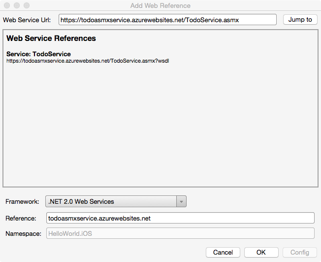

# Introduction to Web Services

_This guide demonstrates how to consume different web service technologies. Topics covered include communicating with REST services, SOAP services, and Windows Communication Foundation services._

To function correctly, many mobile applications are dependent on the cloud, and so integrating web services into mobile applications is a common scenario. The Xamarin platform supports consuming different web service technologies, and includes in-built and third-party support for consuming RESTful, ASMX, and Windows Communication Foundation (WCF) services.

For customers using Xamarin.Forms, there are complete examples using each of these technologies in the [Xamarin.Forms Web Services](~/xamarin-forms/data-cloud/index.yml)
documentation.

> [!IMPORTANT]
> In iOS 9, App Transport Security (ATS) enforces secure connections
> between internet resources (such as the app's back-end server) and the
> app, thereby preventing accidental disclosure of sensitive information.
> Since ATS is enabled by default in apps built for iOS 9, all connections
> will be subject to ATS security requirements. If connections do not meet
> these requirements, they will fail with an exception.

You can opt-out of ATS if it is not possible to use the `HTTPS` protocol and secure communication for internet resources. This can be achieved by updating the app's **Info.plist** file. For more information see [App Transport Security](~/ios/app-fundamentals/ats.md).

## REST

Representational State Transfer (REST) is an architectural style for building web services. REST requests are made over HTTP using the same HTTP verbs that web browsers use to retrieve web pages and to send data to servers. The verbs are:

- **GET** – this operation is used to retrieve data from the web service.
- **POST** – this operation is used to create a new item of data on the web service.
- **PUT** – this operation is used to update an item of data on the web service.
- **PATCH** – this operation is used to update an item of data on the web service by describing a set of instructions about how the item should be modified. This verb is not used in the sample application.
- **DELETE** – this operation is used to delete an item of data on the web service.

Web service APIs that adhere to REST are called RESTful APIs, and are defined using:

- A base URI.
- HTTP methods, such as GET, POST, PUT, PATCH, or DELETE.
- A media type for the data, such as JavaScript Object Notation (JSON).

The simplicity of REST has helped make it the primary method for accessing web services in mobile applications.

## Consuming REST Services

There are a number of libraries and classes that can be used to consume REST services, and the following subsections discuss them. For more information about consuming a REST service, see [Consume a RESTful Web Service](~/xamarin-forms/data-cloud/web-services/rest.md).

### HttpClient

The [Microsoft HTTP Client Libraries](https://www.nuget.org/packages/Microsoft.Net.Http) provides the `HttpClient` class, which is used to send and receive requests over HTTP. It provides functionality for sending HTTP requests and receiving HTTP responses from a URI-identified resource. Each request is sent as an asynchronous operation. For more information about asynchronous operations, see [Async Support Overview](~/cross-platform/platform/async.md).

The `HttpResponseMessage` class represents an HTTP response message received from the web service after an HTTP request has been made. It contains information about the response, including the status code, headers, and body. The `HttpContent` class represents the HTTP body and content headers, such as `Content-Type` and `Content-Encoding`. The content can be read using any of the `ReadAs` methods, such as `ReadAsStringAsync` and `ReadAsByteArrayAsync`, depending upon the format of the data.

For more information about the `HttpClient` class, see [Creating the HTTPClient Object](~/xamarin-forms/data-cloud/web-services/rest.md).

<a name="Using_HTTPWebRequest"></a>

### HTTPWebRequest

Calling web services with `HTTPWebRequest` involves:

- Creating the request instance for a particular URI.
- Setting various HTTP properties on the request instance.
- Retrieving an  `HttpWebResponse` from the request.
- Reading data out of the response.

For example, the following code retrieves data from the U.S. National Library of Medicine web service:

```csharp
var rxcui = "198440";
var request = HttpWebRequest.Create(string.Format(@"https://rxnav.nlm.nih.gov/REST/RxTerms/rxcui/{0}/allinfo", rxcui));
request.ContentType = "application/json";
request.Method = "GET";

using (HttpWebResponse response = request.GetResponse() as HttpWebResponse)
{
  if (response.StatusCode != HttpStatusCode.OK)
     Console.Out.WriteLine("Error fetching data. Server returned status code: {0}", response.StatusCode);
  using (StreamReader reader = new StreamReader(response.GetResponseStream()))
  {
               var content = reader.ReadToEnd();
               if(string.IsNullOrWhiteSpace(content)) {
                       Console.Out.WriteLine("Response contained empty body...");
               }
               else {
                       Console.Out.WriteLine("Response Body: \r\n {0}", content);
               }

               Assert.NotNull(content);
  }
}
```

The above example creates an `HttpWebRequest` that will return data formatted as JSON. The data is returned in an `HttpWebResponse`, from which a `StreamReader` can be obtained to read the data.

<a name="Using_RESTSHARP"></a>

### RestSharp

Another approach to consuming REST services is using the [RestSharp](http://restsharp.org/) library. RestSharp encapsulates HTTP requests, including support for retrieving results either as raw string content or as a deserialized C# object. For example, the following code makes a request to the U.S. National Library of Medicine web service, and retrieves the results as a JSON formatted string:

```csharp
var request = new RestRequest(string.Format("{0}/allinfo", rxcui));
request.RequestFormat = DataFormat.Json;
var response = Client.Execute(request);
if(string.IsNullOrWhiteSpace(response.Content) || response.StatusCode != System.Net.HttpStatusCode.OK) {
       return null;
}
rxTerm = DeserializeRxTerm(response.Content);
```

`DeserializeRxTerm` is a method that will take the raw JSON string from the `RestSharp.RestResponse.Content` property and convert it into a C# object. Deserializing data returned from web services is discussed later in this article.

<a name="Using_NSUrlconnection"></a>

### NSUrlConnection

In addition to classes available in the Mono base class library (BCL), such as `HttpWebRequest`, and third party C# libraries, such as RestSharp, platform-specific classes are also available for consuming web services. For example, in iOS, the `NSUrlConnection` and `NSMutableUrlRequest` classes can be used.

The following code example shows how to call the U.S. National Library of Medicine web service using iOS classes:

```csharp
var rxcui = "198440";
var request = new NSMutableUrlRequest(new NSUrl(string.Format("https://rxnav.nlm.nih.gov/REST/RxTerms/rxcui/{0}/allinfo", rxcui)),
       NSUrlRequestCachePolicy.ReloadRevalidatingCacheData, 20);
request["Accept"] = "application/json";

var connectionDelegate = new RxTermNSURLConnectionDelegate();
var connection = new NSUrlConnection(request, connectionDelegate);
connection.Start();

public class RxTermNSURLConnectionDelegate : NSUrlConnectionDelegate
{
       StringBuilder _ResponseBuilder;
       public bool IsFinishedLoading { get; set; }
       public string ResponseContent { get; set; }

       public RxTermNSURLConnectionDelegate()
               : base()
       {
               _ResponseBuilder = new StringBuilder();
       }

       public override void ReceivedData(NSUrlConnection connection, NSData data)
       {
               if(data != null) {
                       _ResponseBuilder.Append(data.ToString());
               }
       }
       public override void FinishedLoading(NSUrlConnection connection)
       {
               IsFinishedLoading = true;
               ResponseContent = _ResponseBuilder.ToString();
       }
}
```

Generally, platform-specific classes for consuming web services should be limited to scenarios where native code is being ported to C#. Where possible, web service access code should be portable so that it can be shared cross-platform.

<a name="Using_ServiceStack_Client"></a>

### ServiceStack

Another option for calling web services is the [Service Stack](https://servicestack.net) library. For example, the following code shows how to use Service Stack’s `IServiceClient.GetAsync` method to issue a service request:

```csharp
client.GetAsync<CustomersResponse>("",
          (response) => {
               foreach(var c in response.Customers) {
                       Console.WriteLine(c.CompanyName);
               }
       },
       (response, ex) => {
               Console.WriteLine(ex.Message);
       });
```

> [!IMPORTANT]
> While tools like ServiceStack and RestSharp make it easy to call and consume REST services, it is sometimes non-trivial to consume XML or JSON that does not conform to the standard _DataContract_ serialization conventions. If necessary, invoke the request and handle the appropriate serialization explicitly using the ServiceStack.Text library discussed below.

<a name="Options_for_consuming_RESTful_data"></a>

## Consuming RESTful Data

RESTful web services typically use JSON messages to return data to the client. JSON is a text-based, data-interchange format that produces compact payloads, which results in reduced bandwidth requirements when sending data. In this section, mechanisms for consuming RESTful responses in JSON and Plain-Old-XML (POX) will be examined.

<a name="Using_System.JSON"></a>

### System.JSON

The Xamarin platform ships with support for JSON out of the box. By using a `JsonObject`, results can be retrieved as shown in the following code example:

```csharp
var obj = JsonObject.Parse(json);
var properties = obj["rxtermsProperties"];
term.BrandName = properties["brandName"];
term.DisplayName = properties["displayName"];
term.Synonym = properties["synonym"];
term.FullName = properties["fullName"];
term.FullGenericName = properties["fullGenericName"];
term.Strength = properties["strength"];
```

However, it’s important to be aware that the `System.Json` tools load the entirety of the data into memory.

<a name="Using_JSON.NET"></a>

### JSON.NET

The [NewtonSoft JSON.NET library](https://www.newtonsoft.com/json) is a widely used library for serializing and deserializing JSON messages. The following
code example shows how to use JSON.NET to deserialize a JSON message into a C# object:

```csharp
var term = new RxTerm();
var properties = JObject.Parse(json)["rxtermsProperties"];
term.BrandName = properties["brandName"].Value<string>();
term.DisplayName = properties["displayName"].Value<string>();
term.Synonym = properties["synonym"].Value<string>();;
term.FullName = properties["fullName"].Value<string>();;
term.FullGenericName = properties["fullGenericName"].Value<string>();;
term.Strength = properties["strength"].Value<string>();
term.RxCUI = properties["rxcui"].Value<string>();
```

<a name="Using_ServiceStack.Text"></a>

### ServiceStack.Text

ServiceStack.Text is a JSON serialization library designed to work with the ServiceStack library. The following code example shows how to parse JSON using a `ServiceStack.Text.JsonObject`:

```csharp
var result = JsonObject.Parse(json).Object("rxtermsProperties")
       .ConvertTo(x => new RxTerm {
               BrandName = x.Get("brandName"),
               DisplayName = x.Get("displayName"),
               Synonym = x.Get("synonym"),
               FullName = x.Get("fullName"),
               FullGenericName = x.Get("fullGenericName"),
               Strength = x.Get("strength"),
               RxTermDoseForm = x.Get("rxtermsDoseForm"),
               Route = x.Get("route"),
               RxCUI = x.Get("rxcui"),
               RxNormDoseForm = x.Get("rxnormDoseForm"),
       });
```

<a name="Using_System.Xml.Linq"></a>

### System.Xml.Linq

In the event of consuming an XML-based REST web service, LINQ to XML can be used to parse the XML and populate a C# object inline, as demonstrated in the following code example:

```csharp
var doc = XDocument.Parse(xml);
var result = doc.Root.Descendants("rxtermsProperties")
.Select(x=> new RxTerm()
       {
               BrandName = x.Element("brandName").Value,
               DisplayName = x.Element("displayName").Value,
               Synonym = x.Element("synonym").Value,
               FullName = x.Element("fullName").Value,
               FullGenericName = x.Element("fullGenericName").Value,
               //bind more here...
               RxCUI = x.Element("rxcui").Value,
       });
```

<a name="asmx"></a>

## ASP.NET Web Service (ASMX)

ASMX provides the ability to build web services that send messages using the Simple Object Access Protocol (SOAP). SOAP is a platform-independent and language-independent protocol for building and accessing web services. Consumers of an ASMX service do not need to know anything about the platform, object model, or programming language used to implement the service. They only need to understand how to send and receive SOAP messages.

A SOAP message is an XML document containing the following elements:

- A root element named *Envelope* that identifies the XML document as a SOAP message.
- An optional *Header* element that contains application-specific information such as authentication data. If the *Header* element is present it must be the first child element of the *Envelope* element.
- A required *Body* element that contains the SOAP message intended for the recipient.
- An optional *Fault* element that's used to indicate error messages. If the *Fault* element is present, it must be a child element of the *Body* element.

SOAP can operate over many transport protocols, including HTTP, SMTP, TCP, and UDP. However, an ASMX service can only operate over HTTP. The Xamarin platform supports standard SOAP 1.1 implementations over HTTP, and this includes support for many of the standard ASMX service configurations.

### Generating a Proxy

A *proxy* must be generated to consume an ASMX service, which allows the application to connect to the service. The proxy is constructed by consuming service metadata that defines the methods and associated service configuration. This metadata is exposed as a Web Services Description Language (WSDL) document that is generated by the web service. The proxy is built by using Visual Studio for Mac or Visual Studio to add a web reference for the web service to the platform-specific projects.

The web service URL can either be a hosted remote source or local file system resource accessible via the `file:///` path prefix, for example:

```csharp
file:///Users/myUserName/projects/MyProjectName/service.wsdl
```

[](images/add-webreference-dialog.png#lightbox)

This generates the proxy in the Web or Service References folder of the project. Since a proxy is generated code, it should not be modified.

<a name="Manually_adding_a_proxy_to_a_project"></a>

#### Manually Adding a Proxy to a Project

If you have an existing proxy that has been generated using compatible tools, this output can be consumed when included as part of your project. In Visual Studio for Mac, use the **Add files…** menu option to add the proxy. In addition, this requires *System.Web.Services.dll* to be referenced explicitly using the **Add References…** dialog.

### Consuming the Proxy

The generated proxy classes provide methods for consuming the web service that use the Asynchronous Programming Model (APM) design pattern. In this pattern an asynchronous operation is implemented as two methods named *BeginOperationName* and *EndOperationName*, which begin and end the asynchronous operation.

The *BeginOperationName* method begins the asynchronous operation and returns an object that implements the `IAsyncResult` interface. After calling *BeginOperationName*, an application can continue executing instructions on the calling thread, while the asynchronous operation takes place on a thread pool thread.

For each call to *BeginOperationName*, the application should also call *EndOperationName* to get the results of the operation. The return value of *EndOperationName* is the same type returned by the synchronous web service method. The following code example shows an example of this:

```csharp
public async Task<List<TodoItem>> RefreshDataAsync ()
{
  ...
  var todoItems = await Task.Factory.FromAsync<ASMXService.TodoItem[]> (
    todoService.BeginGetTodoItems,
    todoService.EndGetTodoItems,
    null,
    TaskCreationOptions.None);
  ...
}
```

The Task Parallel Library (TPL) can simplify the process of consuming an APM begin/end method pair by encapsulating the asynchronous operations in the same `Task` object. This encapsulation is provided by multiple overloads of the `Task.Factory.FromAsync` method. This method creates a `Task` that executes the `TodoService.EndGetTodoItems` method once the `TodoService.BeginGetTodoItems` method completes, with the `null` parameter indicating that no data is being passed into the `BeginGetTodoItems` delegate. Finally, the value of the `TaskCreationOptions` enumeration specifies that the default behavior for the creation and execution of tasks should be used.

For more information about APM, see [Asynchronous Programming Model](/dotnet/standard/asynchronous-programming-patterns/asynchronous-programming-model-apm) and [TPL and Traditional .NET Framework Asynchronous Programming](/dotnet/standard/parallel-programming/tpl-and-traditional-async-programming) on MSDN.

For more information about consuming an ASMX service, see [Consume an ASP.NET Web Service (ASMX)](~/xamarin-forms/data-cloud/web-services/asmx.md).

<a name="wcf"></a>

## Windows Communication Foundation (WCF)

WCF is Microsoft's unified framework for building service-oriented applications. It enables developers to build secure, reliable, transacted, and interoperable distributed applications.

WCF describes a service with a variety of different contracts which include the following:

- **Data contracts** – define the data structures that form the basis for the content within a message.
- **Message contracts** – compose messages from existing data contracts.
- **Fault contracts** – allow custom SOAP faults to be specified.
- **Service contracts** – specify the operations that services support and the messages required for interacting with each operation. They also specify any custom fault behavior that can be associated with operations on each service.

There are differences between ASP.NET Web Services (ASMX) and WCF, but it is important to understand that WCF supports the same capabilities that ASMX provides – SOAP messages over HTTP.

> [!IMPORTANT]
> The Xamarin platform support for WCF is limited to text-encoded SOAP messages over HTTP/HTTPS using the `BasicHttpBinding` class. In addition, WCF support requires the use of tools only available in a Windows environment to generate the proxy.

### Generating a Proxy

A *proxy* must be generated to consume a WCF service, which allows the application to connect to the service. The proxy is constructed by consuming service metadata that define the methods and associated service configuration. This metadata is exposed in the form of a Web Services Description Language (WSDL) document that is generated by the web service. The proxy can be built by using the Microsoft WCF Web Service Reference Provider in Visual Studio 2017 to add a service reference for the web service to a .NET Standard Library.

An alternative to creating the proxy using the Microsoft WCF Web Service Reference Provider in Visual Studio 2017 is to use the ServiceModel Metadata Utility Tool (svcutil.exe). For more information, see [ServiceModel Metadata Utility Tool (Svcutil.exe)](/dotnet/framework/wcf/servicemodel-metadata-utility-tool-svcutil-exe).

<a name="Calling_a_WCF_Service_with_Client_Credential_Security"></a>

### Configuring the Proxy

Configuring the generated proxy will generally take two configuration arguments (depending on SOAP 1.1/ASMX or WCF) during initialization: the `EndpointAddress` and/or the associated binding information, as shown in the example below:

```csharp
var binding = new BasicHttpBinding () {
       Name= "basicHttpBinding",
       MaxReceivedMessageSize = 67108864,
};

binding.ReaderQuotas = new System.Xml.XmlDictionaryReaderQuotas() {
       MaxArrayLength = 2147483646,
       MaxStringContentLength = 5242880,
};

var timeout = new TimeSpan(0,1,0);
binding.SendTimeout= timeout;
binding.OpenTimeout = timeout;
binding.ReceiveTimeout = timeout;

client = new Service1Client (binding, new EndpointAddress ("http://192.168.1.100/Service1.svc"));
```

A binding is used to specify the transport, encoding, and protocol details required for applications and services to communicate with each other. The `BasicHttpBinding` specifies that text-encoded SOAP messages will be sent over the HTTP transport protocol. Specifying an endpoint address enables the application to connect to different instances of the WCF service, provided that there are multiple published instances.

### Consuming the Proxy

The generated proxy classes provide methods for consuming the web services that use the Asynchronous Programming Model (APM) design pattern. In this pattern, an asynchronous operation is implemented as two methods named *BeginOperationName* and *EndOperationName*, which begin and end the asynchronous operation.

The *BeginOperationName* method begins the asynchronous operation and returns an object that implements the `IAsyncResult` interface. After calling *BeginOperationName*, an application can continue executing instructions on the calling thread, while the asynchronous operation takes place on a thread pool thread.

For each call to *BeginOperationName*, the application should also call *EndOperationName* to get the results of the operation. The return value of *EndOperationName* is the same type returned by the synchronous web service method. The following code example shows an example of this:

```csharp
public async Task<List<TodoItem>> RefreshDataAsync ()
{
  ...
  var todoItems = await Task.Factory.FromAsync <ObservableCollection<TodoWCFService.TodoItem>> (
    todoService.BeginGetTodoItems,
    todoService.EndGetTodoItems,
    null,
    TaskCreationOptions.None);
  ...
}
```

The Task Parallel Library (TPL) can simplify the process of consuming an APM begin/end method pair by encapsulating the asynchronous operations in the same `Task` object. This encapsulation is provided by multiple overloads of the `Task.Factory.FromAsync` method. This method creates a `Task` that executes the `TodoServiceClient.EndGetTodoItems` method once the `TodoServiceClient.BeginGetTodoItems` method completes, with the `null` parameter indicating that no data is being passed into the `BeginGetTodoItems` delegate. Finally, the value of the `TaskCreationOptions` enumeration specifies that the default behavior for the creation and execution of tasks should be used.

For more information about APM, see [Asynchronous Programming Model](/dotnet/standard/asynchronous-programming-patterns/asynchronous-programming-model-apm) and [TPL and Traditional .NET Framework Asynchronous Programming](/dotnet/standard/parallel-programming/tpl-and-traditional-async-programming) on MSDN.

For more information about consuming a WCF service, see [Consume a Windows Communication Foundation (WCF) Web Service](~/xamarin-forms/data-cloud/web-services/wcf.md).

<a name="Calling_a_WCF_Service_with_Transport_Security"></a>

#### Using Transport Security

WCF Services may employ transport level security to protect against interception of messages. The Xamarin platform supports bindings that employ transport level
security using SSL. However, there may be cases in which the stack may need to validate the certificate, which results in unanticipated behavior. The validation can be overridden by registering a `ServerCertificateValidationCallback` delegate before invoking the service, as demonstrated in the following code example:

```csharp
System.Net.ServicePointManager.ServerCertificateValidationCallback +=
(se, cert, chain, sslerror) => { return true; };
```

This maintains transport encryption while ignoring the server-side certificate validation. However, this approach effectively disregards the trust concerns associated with the certificate and may not be appropriate. For more information, see [Using Trusted Roots Respectfully](https://www.mono-project.com/UsingTrustedRootsRespectfully) on [mono-project.com](https://www.mono-project.com).

<a name="Calling_a_WCF_Service_with_Client_Credential_Security"></a>

#### Using Client Credential Security

WCF services may also require the service clients to authenticate using credentials. The Xamarin platform does not support the WS-Security Protocol, which allows clients to send credentials inside the SOAP message envelope. However, the Xamarin platform does support the ability to send HTTP Basic Authentication credentials to the server by specifying the appropriate `ClientCredentialType`:

```csharp
basicHttpBinding.Security.Transport.ClientCredentialType = HttpClientCredentialType.Basic;
```

Then, basic authentication credentials can be specified:

```csharp
client.ClientCredentials.UserName.UserName = @"foo";
client.ClientCredentials.UserName.Password = @"mrsnuggles";
```

For more information about HTTP basic authentication, although in the context of a REST web service, see [Authenticating a RESTful Web Service](~/xamarin-forms/data-cloud/authentication/rest.md).

## Related Links

- [Web Services in Xamarin.Forms](~/xamarin-forms/data-cloud/index.yml)
- [ServiceModel Metadata Utility Tool (svcutil.exe)](/dotnet/framework/wcf/servicemodel-metadata-utility-tool-svcutil-exe)
- [BasicHttpBinding](/dotnet/api/system.servicemodel.basichttpbinding)