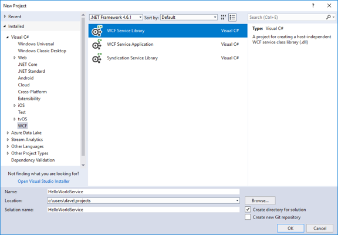
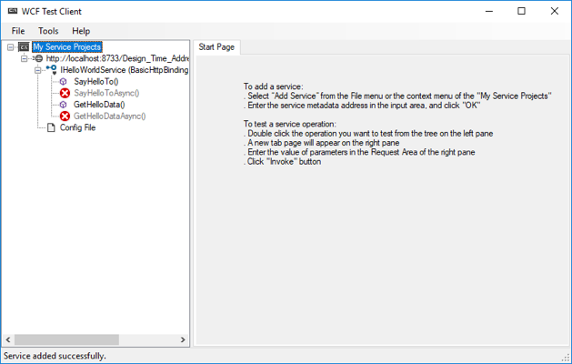
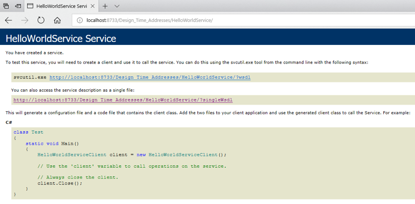
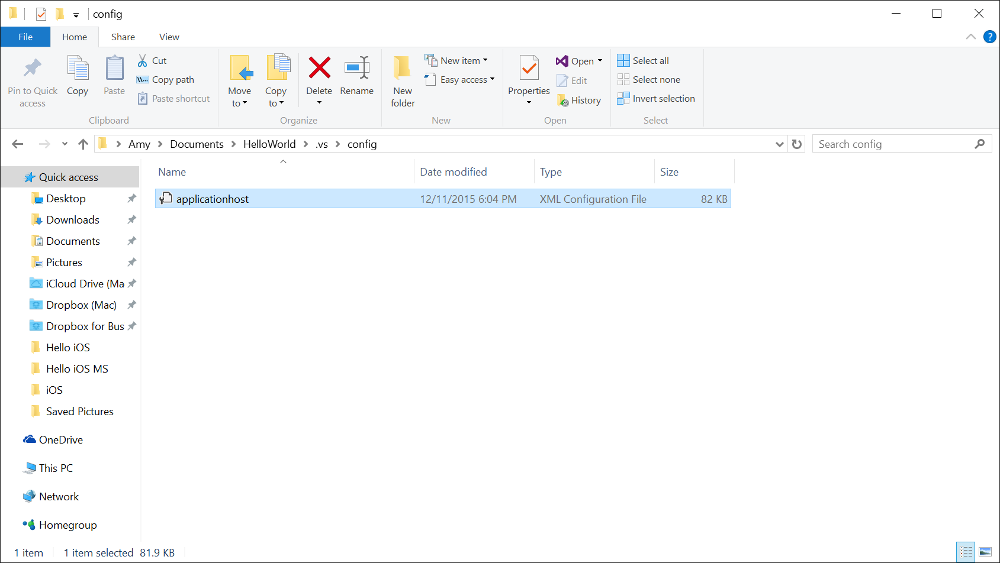
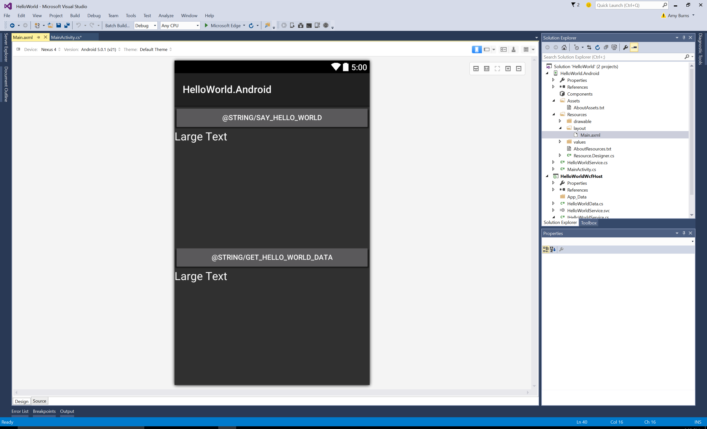
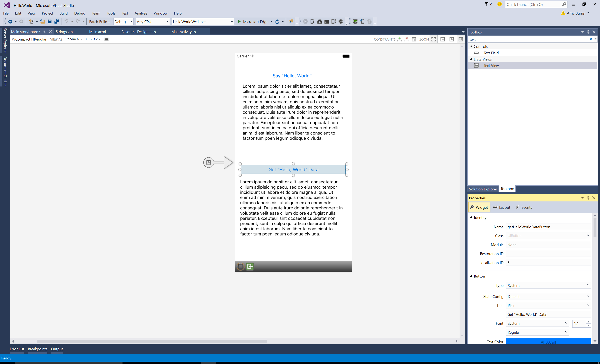

# Walkthrough - Working with WCF

_This walkthrough covers how a mobile application built with Xamarin can consume a WCF web service using the BasicHttpBinding class._

<a name="Overview" />

# Overview

It is a common requirement for mobile applications to be able to communicate with backend systems. There are many choices and options for backend frameworks, one of which is [Windows Communication Foundation](http://msdn.microsoft.com/en-us/library/ms731082.aspx) (WCF). This walkthrough will provide an example of how a Xamarin mobile application can consume a WCF service using the `BasicHttpBinding` class. The walkthrough includes the following topics:

1.  **Create a WCF Service** - In this section we will create a very basic WCF service having two methods. The first method will take a string parameter, while the other method will take a C# object. This section will also discuss how to configure a developer's workstation to allow remote access to the WCF service.
1.  **Create a Xamarin.Android Application** - Once the WCF service has been created, we will create a simple Xamarin.Android application that will use the WCF service. This section will cover how to create a WCF service proxy class to facilitate communication with the WCF service.
1.  **Create a Xamarin.iOS Application** - The final part of this tutorial involves creating a simple Xamarin.iOS application that will use the WCF service.

<a name="Requirements" />

# Requirements

This walkthrough assumes that you have some familiarity with creating and using WCF services.

<a name="Creating_a_WCF_Service" />

# Creating a WCF Service

The first task before us is to create a WCF service for a mobile applications to communicate with.

1. Launch Visual Studio 2017, and create a new project.
1. In the **New Project** dialog, select the **WCF > WCF Service Library** template, and name the solution `HelloWorldService`:

  

1. In **Solution Explorer**, add a new class named `HelloWorldData` to the project:

        using System.Runtime.Serialization;

        namespace HelloWorldService
        {
            [DataContract]
            public class HelloWorldData
            {
                [DataMember]
                public bool SayHello { get; set; }

                [DataMember]
                public string Name { get; set; }

                public HelloWorldData()
                {
                    Name = "Hello ";
                    SayHello = false;
                }
            }
        }

1. In **Solution Explorer**, rename `IService1.cs` to `IHelloWorldService.cs`, and rename `Service1.cs` to `HelloWorldService.cs`.
1. In **Solution Explorer**, open `IHelloWorldService.cs` and replace the code with the following code:

        using System.ServiceModel;

        namespace HelloWorldService
        {
            [ServiceContract]
            public interface IHelloWorldService
            {
                [OperationContract]
                string SayHelloTo(string name);

                [OperationContract]
                HelloWorldData GetHelloData(HelloWorldData helloWorldData);
            }
        }

    This service provides two methods – one that takes a string for a parameter and another that takes a .NET object.

1. In **Solution Explorer**, open `HelloWorldService.cs` and replace the code with the following code:

        using System;

        namespace HelloWorldService
        {
            public class HelloWorldService : IHelloWorldService
            {
                public HelloWorldData GetHelloData(HelloWorldData helloWorldData)
                {
                    if (helloWorldData == null)
                        throw new ArgumentException("helloWorldData");

                    if (helloWorldData.SayHello)
                        helloWorldData.Name = "Hello World to {helloWorldData.Name}";

                    return helloWorldData;
                }

                public string SayHelloTo(string name)
                {
                    return "Hello World to you, {name}";
                }
            }
        }

1. In **Solution Explorer**, open `App.config`, update the `name` attribute of the `<service>` node, the `contract` attribute of the `<endpoint>` node, and the `baseAddress` attribute of the `<add>` node:

        <?xml version="1.0" encoding="utf-8"?>
        <configuration>
            ...
            <services>
              <service name="HelloWorldService.HelloWorldService">
                <endpoint address="" binding="basicHttpBinding" contract="HelloWorldService.IHelloWorldService">
                  <identity>
                    <dns value="localhost" />
                  </identity>
                </endpoint>
                <endpoint address="mex" binding="mexHttpBinding" contract="IMetadataExchange" />
                <host>
                  <baseAddresses>
                    <add baseAddress="http://localhost:8733/Design_Time_Addresses/HelloWorldService/" />
                  </baseAddresses>
                </host>
              </service>
            </services>
            ...
        </configuration>

1. Build and run the WCF service. The service will be hosted by the WCF test client:

  

1. With the WCF test client running, launch a browser and navigate to the endpoint for the WCF service:

  

> [!IMPORTANT]
> **Note:** The following section is only necessary if you need to accept remote connections on a Windows 10 workstation. The section can be ignored if you have an alternate platform on which to deploy the WCF service.

<a name="Allow_Remote_Access_to_IIS_Express" />

## Configuring Remote Access to IIS Express

Hosting a WCF locally is adequate when connections only come from the local machine. However, remote devices (such as an Android device or an iPhone) will not have any access to a local WCF service. Therefore, this section explains how to configure Windows 10 and IIS Express to accept remote connections:

1.  **Configure IIS Express to Accept Remote connections** - This step involves editing the config file for IIS Express to accept remote connections on a specific port and then setting up a rule for IIS Express to accept the incoming traffic.
1.  **Add an Exception to Windows Firewall** - You must open up a port through Windows Firewall that remote applications can use to communicate with the WCF service.

You will need to know the IP address of your workstation. For the purposes of this example we'll assume that our workstation has the IP address 192.168.1.143.

1. Let's begin by configuring IIS Express to listen for external requests. We can do this by editing the configuration file for IIS Express at `[solutiondirectory]\.vs\config\applicationhost.config`, as shown in the following screenshot:

	

	Locate the `site` element with the name `HelloWorldWcfHost`. It should look something like the following XML snippet:

        <site name="HelloWorldWcfHost" id="2">
        	<application path="/" applicationPool="Clr4IntegratedAppPool">
        	    <virtualDirectory path="/" physicalPath="\\vmware-host\Shared Folders\tom\work\xamarin\code\private-samples\webservices\HelloWorld\HelloWorldWcfHost" />
        	</application>
        	<bindings>
        	    <binding protocol="http" bindingInformation="*:8733:localhost" />
        	</bindings>
        </site>

	We will need to add another `binding` to open up port 8734 to outside traffic. Add the following XML to the `bindings` element, replacing the IP address with your own IP address:

        <binding protocol="http" bindingInformation="*:8734:192.168.1.143" />

	This will configure IIS Express to accept HTTP traffic from any remote IP address on port 8734 on the external IP address of the computer. This above snippet assumes the IP address of the computer running IIS Express is 192.168.1.143. After the changes, the `bindings` element should look like the following:

        <site name="HelloWorldWcfHost" id="2">
        	<application path="/" applicationPool="Clr4IntegratedAppPool">
        	    <virtualDirectory path="/" physicalPath="\\vmware-host\Shared Folders\tom\work\xamarin\code\private-samples\webservices\HelloWorld\HelloWorldWcfHost" />
        	</application>
        	<bindings>
        	    <binding protocol="http" bindingInformation="*:8733:localhost" />
        	    <binding protocol="http" bindingInformation="*:8734:192.168.1.143" />
        	</bindings>
        </site>

1. Next, we need to configure IIS Express accept incoming connections on port 8734. Startup up an administrative command prompt, and run this command:

	`> netsh http add urlacl url=http://192.168.1.143:9608/ user=everyone`

1. The final step is to configure Windows Firewall to permit external traffic on port 8734. From an administrative command prompt, run the following command:

	`> netsh advfirewall firewall add rule name="IISExpressXamarin" dir=in protocol=tcp localport=8734 profile=private remoteip=localsubnet action=allow`

	This command will allow incoming traffic on port 8734 from all devices on the same subnet as the Windows 10 workstation.

You have created a very basic WCF service hosted in IIS Express that will accept incoming connections from other devices or computers on our subnet. You can test this out by running your application and visiting `http://localhost:8733/Design_Time_Addresses/HelloWorldService/` on your workstation and `http://192.168.1.143:8734/Design_Time_Addresses/HelloWorldService/` from another computer on your subnet.

To allow IIS Express to keep running and serving the service, turn off the **Edit and Continue** option in *Project Properties > Web >Debuggers*.

# Creating a Proxy for the Web Service

A web service proxy must be created for the WCF service, before an application can consume the service. This can be accomplished as follows:

1. Add a .NET Standard Class Library named `HelloWorldServiceProxy`, and delete any classes in the project.
1. Run the `HelloWorldService` project.
1. With the `HelloWorldService` project running, add a new **Connected Service** to the project, using the **Microsoft WCF Web Service Reference Provider**.
1. In the **Service Endpoint** tab of the **Configure WCF Web Service Reference** dialog, click the **Discover** button, delete `mex` from the end of the detected endpoint in the **URI** drop-down, enter `HelloWorldServiceProxy` as the **Namespace**, and click the **Next** button.
1. In the **Data Type Options** tab of the **Configure WCF Web Service Reference** dialog, accept the defaults by clicking the **Next** button.
1. In the **Client Options** tab of the **Configure WCF Web Service Reference** dialog, ensure that the **Public** checkbox is selected, and click the **Finish** button.
1. Build the `HelloWorldServiceProxy` project.

> [!NOTE]
> **Note**: An alternative to creating the proxy using the Microsoft WCF Web Service Reference Provider in Visual Studio 2017 is to use the ServiceModel Metadata Utility Tool (svcutil.exe). For more information, see [ServiceModel Metadata Utility Tool (Svcutil.exe)](https://docs.microsoft.com/en-us/dotnet/framework/wcf/servicemodel-metadata-utility-tool-svcutil-exe).

<a name="Creating_a_Xamarin_Android_Application" />

# Creating a Xamarin.Android Application

The WCF service proxy can be consumed by a Xamarin.Android application, as follows:

1. In Visual Studio, add a new blank Android project to the solution and name it `HelloWorld.Android`.
1. In the `HelloWorld.Android` project, add a reference to the `HelloWorldServiceProxy` project, and a reference to the `System.ServiceModel` namespace.
1. In **Solution Explorer**, open `Resources/layout/main.axml` and replace the existing XML with the following XML:

        <?xml version="1.0" encoding="utf-8"?>
        <LinearLayout xmlns:android="http://schemas.android.com/apk/res/android"
                  android:orientation="vertical"
                  android:layout_width="fill_parent"
                  android:layout_height="fill_parent">
        	<LinearLayout
        	        android:orientation="vertical"
        	        android:layout_width="fill_parent"
        	        android:layout_height="0px"
        	        android:layout_weight="1">
        	    <Button
        	            android:id="@+id/sayHelloWorldButton"
        	            android:layout_width="fill_parent"
        	            android:layout_height="wrap_content"
        	            android:text="@string/say_hello_world" />
        	    <TextView
        	            android:text="Large Text"
        	            android:textAppearance="?android:attr/textAppearanceLarge"
        	            android:layout_width="fill_parent"
        	            android:layout_height="wrap_content"
        	            android:id="@+id/sayHelloWorldTextView" />
        	</LinearLayout>
        	<LinearLayout
        	        android:orientation="vertical"
        	        android:layout_width="fill_parent"
        	        android:layout_height="0px"
        	        android:layout_weight="1">
        	    <Button
        	            android:id="@+id/getHelloWorldDataButton"
        	            android:layout_width="fill_parent"
        	            android:layout_height="wrap_content"
        	            android:text="@string/get_hello_world_data" />
        	    <TextView
        	            android:text="Large Text"
        	            android:textAppearance="?android:attr/textAppearanceLarge"
        	            android:layout_width="fill_parent"
        	            android:layout_height="wrap_content"
        	            android:id="@+id/getHelloWorldDataTextView" />
        	</LinearLayout>
        </LinearLayout>

	The following screenshots shows the UI in the designer:

	

1. In **Solution Explorer**, open `Resources/values/Strings.xml` and add the following XML:

        <string name="say_hello_world">Say Hello World</string>
        <string name="get_hello_world_data">Get Hello World data</string>

1. In **Solution Explorer**, open `MainActivity.cs` and replace existing code with the following code:

        [Activity(Label = "HelloWorld.Android", MainLauncher = true)]
        public class MainActivity : Activity
        {
            static readonly EndpointAddress Endpoint = new EndpointAddress("<insert_WCF_service_endpoint_here>");

            HelloWorldServiceClient _client;
            Button _getHelloWorldDataButton;
            TextView _getHelloWorldDataTextView;
            Button _sayHelloWorldButton;
            TextView _sayHelloWorldTextView;
            ...
        }

    Replace `<insert_WCF_service_endpoint_here>` with the address of your WCF endpoint.

1. In `MainActivity.cs`, modify the `OnCreate` method so that it contains the following code:

        protected override void OnCreate(Bundle savedInstanceState)
        {
        	base.OnCreate(bundle);

        	SetContentView(Resource.Layout.Main);

        	InitializeHelloWorldServiceClient();

        	// This button will invoke the GetHelloWorldData - the method that takes a C# object as a parameter.
        	_getHelloWorldDataButton = FindViewById<Button>(Resource.Id.getHelloWorldDataButton);
        	_getHelloWorldDataButton.Click += GetHelloWorldDataButtonOnClick;
        	_getHelloWorldDataTextView = FindViewById<TextView>(Resource.Id.getHelloWorldDataTextView);

        	// This button will invoke SayHelloWorld - this method takes a simple string as a parameter.
        	_sayHelloWorldButton = FindViewById<Button>(Resource.Id.sayHelloWorldButton);
        	_sayHelloWorldButton.Click += SayHelloWorldButtonOnClick;
        	_sayHelloWorldTextView = FindViewById<TextView>(Resource.Id.sayHelloWorldTextView);
        }

	The code above initializes the instance variables for the class and wires up some event handlers.

1. In `MainActivity.cs`, instantiate the client proxy class by adding the following two methods:

        void InitializeHelloWorldServiceClient()
        {
            BasicHttpBinding binding = CreateBasicHttpBinding();
            _client = new HelloWorldServiceClient(binding, Endpoint);
        }

        static BasicHttpBinding CreateBasicHttpBinding()
        {
            BasicHttpBinding binding = new BasicHttpBinding
            {
                Name = "basicHttpBinding",
                MaxBufferSize = 2147483647,
                MaxReceivedMessageSize = 2147483647
            };

            TimeSpan timeout = new TimeSpan(0, 0, 30);
            binding.SendTimeout = timeout;
            binding.OpenTimeout = timeout;
            binding.ReceiveTimeout = timeout;
            return binding;
        }

	The code above instantiates and initializes a `HelloWorldServiceClient` object.

1. In `MainActivity.cs`, add even handlers for the two buttons in the `Activity`:

        async void GetHelloWorldDataButtonOnClick(object sender, EventArgs e)
        {
            var data = new HelloWorldData
            {
                Name = "Mr. Chad",
                SayHello = true
            };

            _getHelloWorldDataTextView.Text = "Waiting for WCF...";
            HelloWorldData result;
            try
            {
                result = await _client.GetHelloDataAsync(data);
                _getHelloWorldDataTextView.Text = result.Name;
            }
            catch (Exception ex)
            {
                Console.WriteLine(ex.Message);
            }
        }

        async void SayHelloWorldButtonOnClick(object sender, EventArgs e)
        {
            _sayHelloWorldTextView.Text = "Waiting for WCF...";
            try
            {
                var result = await _client.SayHelloToAsync("Kilroy");
                _sayHelloWorldTextView.Text = result;
            }
            catch (Exception ex)
            {
                Console.WriteLine(ex.Message);
            }
        }

1. Run the application, ensure that the WCF service is running, and click on the two buttons. The application will call the WCF asynchronously, provided that the `Endpoint` field is correctly set:

  

<a name="Creating_a_Xamarin_iOS_Application" />

# Creating a Xamarin.iOS Application

The WCF service proxy can be consumed by a Xamarin.iOS application, as follows:

1. In Visual Studio, add a new iPhone **Single View Application** project to the solution and name it `HelloWorld.iOS`.
1. In the `HelloWorld.iOS` project, add a reference to the `HelloWorldServiceProxy` project, and a reference to the `System.ServiceModel` namespace.
1. In **Solution Explorer**, double-click on `Main.storyboard` to open the file in the iOS designer. Then, add the following `UIButton` and `UITextView` controls:

	<table>
	    <thead>
	        <tr>
	            <td></td>
	            <td>Name</td>
	            <td>Title</td>
	        </tr>
	    </thead>
	    <tbody>
	        <tr>
	            <td><code>UIButton</code></td>
	            <td><code>sayHelloWorldButton</code></td>
	            <td>Say "Hello, World"</td>
	        </tr>
	        <tr>
	            <td><code>UITextView</code></td>
	            <td><code>sayHelloWorldText</code></td>
	            <td></td>
	        </tr>
	        <tr>
	            <td><code>UIButton</code></td>
	            <td><code>getHelloWorldDataButton</code></td>
	            <td>Get "Hello, World" Data</td>
	        </tr>
	        <tr>
	            <td><code>UITextView</code></td>
	            <td><code>getHelloWorldDataText</code></td>
	            <td></td>
	        </tr>
	    </tbody>
	</table>

	After adding the controls, the UI should resemble the following screenshot:

	

1. In **Solution Explorer**, open `ViewController.cs` and add the following code:

        public partial class ViewController : UIViewController
        {
            static readonly EndpointAddress Endpoint = new EndpointAddress("<insert_WCF_service_endpoint_here>");
            HelloWorldServiceClient _client;
            ...
        }

    Replace `<insert_WCF_service_endpoint_here>` with the address of your WCF endpoint.

1. In `ViewController.cs`, update the `ViewDidLoad` method so that it resembles the following:

        public override void ViewDidLoad()
        {
            base.ViewDidLoad();
            InitializeHelloWorldServiceClient();

            getHelloWorldDataButton.TouchUpInside += GetHelloWorldDataButton_TouchUpInside;
            sayHelloWorldButton.TouchUpInside += SayHelloWorldButton_TouchUpInside;
        }

1. In `ViewController.cs`, add the `InitializeHelloWorldServiceClient` and `CreateBasicHttpBinding` methods:

        void InitializeHelloWorldServiceClient()
        {
            BasicHttpBinding binding = CreateBasicHttpBinding();
            _client = new HelloWorldServiceClient(binding, Endpoint);
        }

        static BasicHttpBinding CreateBasicHttpBinding()
        {
            BasicHttpBinding binding = new BasicHttpBinding
            {
                Name = "basicHttpBinding",
                MaxBufferSize = 2147483647,
                MaxReceivedMessageSize = 2147483647
            };

            TimeSpan timeout = new TimeSpan(0, 0, 30);
            binding.SendTimeout = timeout;
            binding.OpenTimeout = timeout;
            binding.ReceiveTimeout = timeout;
            return binding;
        }

1. In `ViewController.cs`, add event handlers for the `TouchUpInside` events on the two `UIButton` instances:

        async void GetHelloWorldDataButton_TouchUpInside(object sender, EventArgs e)
        {
            getHelloWorldDataText.Text = "Waiting for WCF...";
            var data = new HelloWorldData
            {
                Name = "Mr. Chad",
                SayHello = true
            };

            HelloWorldData result;
            try
            {
                result = await _client.GetHelloDataAsync(data);
                getHelloWorldDataText.Text = result.Name;
            }
            catch (Exception ex)
            {
                Console.WriteLine(ex.Message);
            }
        }

        async void SayHelloWorldButton_TouchUpInside(object sender, EventArgs e)
        {
            sayHelloWorldText.Text = "Waiting for WCF...";
            try
            {
                var result = await _client.SayHelloToAsync("Kilroy");
                sayHelloWorldText.Text = result;
            }
            catch (Exception ex)
            {
                Console.WriteLine(ex.Message);
            }
        }

1. Run the application, ensure that the WCF service is running, and click on the two buttons. The application will call the WCF asynchronously, provided that the `Endpoint` field is correctly set:

	

<a name="Summary" />

# Summary

This tutorial covered how to work with a WCF service in a mobile application using Xamarin.Android and Xamarin.iOS. It showed how to create a WCF service and explained how to configure Windows 10 and IIS Express to accept connections from remote devices. It then explained how to generate a WCF proxy client and demonstrated how to use the proxy client in both Xamarin.Android and Xamarin.iOS applications.

## Related Links

- [HelloWorld (sample)](https://developer.xamarin.com/samples/mobile/WCF-Walkthrough/)
- [Developing Service-Oriented Applications with WCF](https://docs.microsoft.com/en-us/dotnet/framework/wcf/index)
- [How to: Create a Windows Communication Foundation Client](https://docs.microsoft.com/en-us/dotnet/framework/wcf/how-to-create-a-wcf-client)
- [ServiceModel Metadata Utility Tool (svcutil.exe)](https://docs.microsoft.com/en-us/dotnet/framework/wcf/servicemodel-metadata-utility-tool-svcutil-exe)
