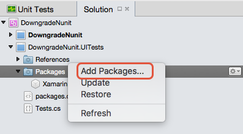
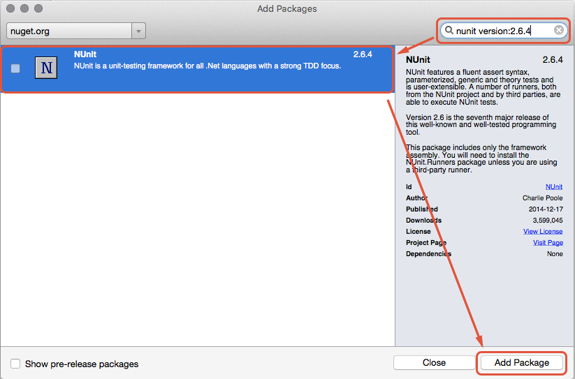
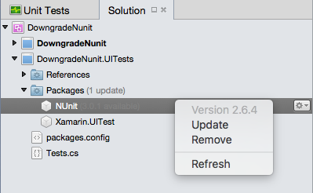
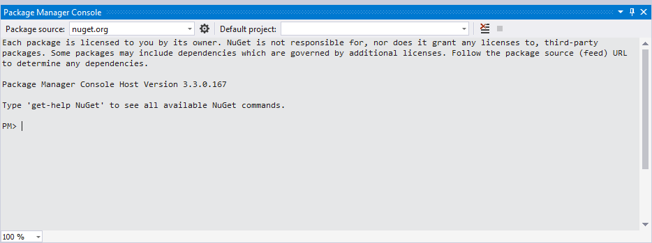

# Installing NUnit 2.6.4 using NuGet

_This guide covers how to downgrade NUnit 3.0 to NUnit 2.6.4 using NuGet._

Developers that are writing tests in Visual Studio for Mac or using Xamarin.UITest should be using [NUnit 2.6.4](http://nunit.org/index.php?p=docHome&r=2.6.4) as NUnit 3.0 or higher is not compatible with Visual Studio for Mac or Xamarin.UITest. Attempting to run unit tests in Visual Studio for Mac or Xamarin.UITests with NUnit 3.0 will fail.

# [Visual Studio for Mac](#tab/macos)

This guide will discuss how to install NUnit 2.6.4 using NuGet for Visual Studio for Mac. These steps will also uninstall NUnit 3.0 if necessary.

# [Visual Studio](#tab/windows)

This guide will discuss how to downgrade NUnit 3.0 to NUnit 2.6.4 using NuGet in Visual Studio 2015.

-----

## Requirements

This guide assumes that there is an existing solution with a mobile app project and a test project.

# [Visual Studio for Mac](#tab/macos)

## Installing NUnit 2.6.4 in Visual Studio for Mac

The following steps describe how to install NUnit 2.6.4.


1. **Open the Package Manager** - Right click on **Packages** and select **Add Packages** from the popup menu:

	[](installing-nunit-using-nuget-images/add-packages-xs.png#lightbox)
	
1. **Search for `NUnit version:2.6.4`** - Visual Studio for Mac will uninstall NUnit 3.0 (if necessary) and then download and install NUnit 2.6.4. In **Add Packages** dialog, enter the text `nunit version:2.6.4` in the **Search** field located in the upper right hand corner. Select **NUnit** from the search results and click the **Add Package** button:

	[](installing-nunit-using-nuget-images/nunit-search-xs.png#lightbox)


It is possible to confirm that NUnit 2.6.4 has been installed by inspecting the version number of the NUnit package in the Solution Pad:

[](installing-nunit-using-nuget-images/nunit-2-6-4-installed.png#lightbox)

## Summary

This guide discussed how to downgrade NUnit 3.0 to NUnit 2.6.4 in Visual Studio for Mac using the Package Manager Console.


# [Visual Studio](#tab/windows)

## Installing NUnit 2.6.4 in Visual Studio

This section will focus on using the _NuGet Package Manager Console_ in Visual Studio 2015 to uninstall NUnit 3.0 and install NUnit 2.6.4.


1. **Start the NuGet Package Manager Console** - Select **Tools > NuGet Package Manager > Package Manager Console**:

	[](installing-nunit-using-nuget-images/package-manager-console.png#lightbox)
	
1. **Verify The Version of NUnit** - you may optionally verify the version of NUnit that is installed by running the command `Get-Package -Project <UITEST PROJECT>`:

	```bash
	[PM] Get-Package -Project [TEST PROJECT NAME]
	
		Id                                  Versions                                 ProjectName
		--                                  --------                                 -----------
	NUnit                               {3.0.1}                                  [TEST PROJECT NAME]
	Xamarin.UITest                      {1.2.0}                                  [TEST PROJECT NAME]
	```

If you see NUnit 3.0 or higher, then you must downgrade to NUnit 2.6.4.

1. **Uninstall NUnit 3.0** - Use the `Uninstall-Package` commandlet to uninstall NUnit 3.0:

		<PM> Uninstall-Package NUnit -Project <TEST PROJECT NAME>
		Attempting to gather dependencies information for package 'NUnit.3.0.1' with respect to project '<TEST PROJECT NAME>', targeting '.NETFramework,Version=v4.5'
		Resolving actions to uninstall package 'NUnit.3.0.1'
		Resolved actions to uninstall package 'NUnit.3.0.1'
		Removed package 'NUnit.3.0.1' from 'packages.config'
		Successfully uninstalled 'NUnit.3.0.1' from <TEST PROJECT NAME>

1. **Install NUnit 2.6.4** - Install Nunit 2.6.4 with the `Install-Package` commandlet as demonstrated in the following snippet:

		<PM> Install-Package NUnit -Version 2.6.4 -Project <TEST PROJECT NAME>
		Attempting to gather dependencies information for package 'NUnit.2.6.4' with respect to project '<TEST PROJECT NAME>', targeting '.NETFramework,Version=v4.5'
		Attempting to resolve dependencies for package 'NUnit.2.6.4' with DependencyBehavior 'Lowest'
		Resolving actions to install package 'NUnit.2.6.4'
		Resolved actions to install package 'NUnit.2.6.4'
		Adding package 'NUnit.2.6.4' to folder 'Z:\Desktop\DowngradeNunit\packages'
		Added package 'NUnit.2.6.4' to folder 'Z:\Desktop\DowngradeNunit\packages'
		Added package 'NUnit.2.6.4' to 'packages.config'
		Successfully installed 'NUnit 2.6.4' to <TEST PROJECT NAME>
	
## Summary

This guide discussed how to downgrade NUnit 3.0 to NUnit 2.6.4 in Visual Studio 2015 using the Package Manager Console.

-----

## Related Links

- [NUnit 2.6.4](http://nunit.org/index.php?p=docHome&r=2.6.4)
- [NUnit 2.6.4 NuGet Package](https://www.nuget.org/packages/NUnit/2.6.4)
