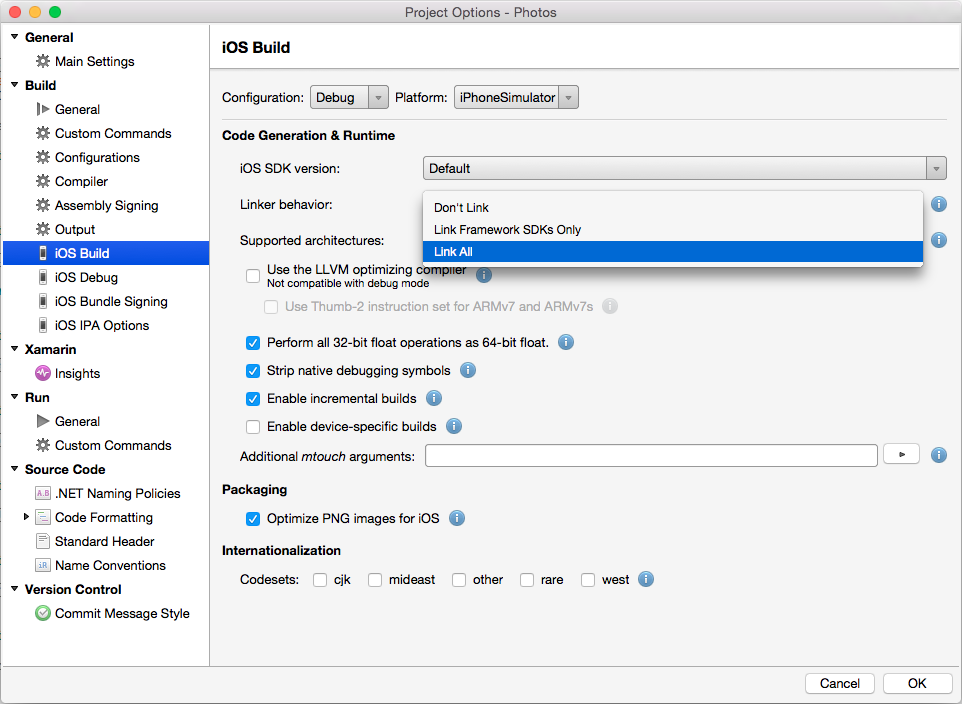
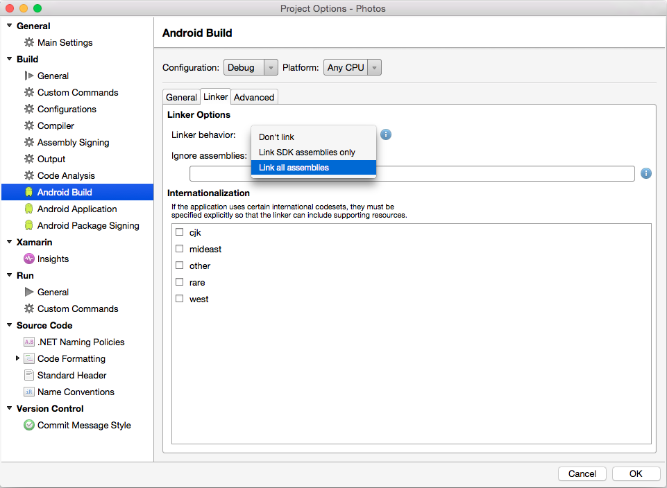

# Cross-Platform Performance

Poor application performance presents itself in many ways. It can make an application seem unresponsive, can cause slow scrolling, and can reduce battery life. However, optimizing performance involves more than just implementing efficient code. The user's experience of application performance must also be considered. For example, ensuring that operations execute without blocking the user from performing other activities can help to improve the user's experience.

<a name="profiler"></a>

## Use the Profiler

When developing an application, it's important to only attempt to optimize code once it has been profiled. Profiling is a technique for determining where code optimizations will have the greatest effect in reducing performance problems. The profiler tracks the application's memory usage, and records the running time of methods in the application. This data helps to navigate through the execution paths of the application, and the execution cost of the code, so that the best opportunities for optimization can be discovered.

The Xamarin Profiler will measure, evaluate, and help find performance-related issues in an application. It can be used to profile Xamarin.iOS and Xamarin.Android applications from inside Visual Studio for Mac or Visual Studio. For more information about the Xamarin Profiler, see [Introduction to the Xamarin Profiler](~/tools/profiler/index.md).

The following best practices are recommended when profiling an app:

- Avoid profiling an application in a simulator, as the simulator may distort the application performance.
- Ideally, profiling should be performed on a variety of devices, as taking performance measurements on one device won't always show the performance characteristics of other devices. However, at a minimum, profiling should be performed on a device that has the lowest anticipated specification.
- Close all other applications to ensure that the full impact of the application being profiled is being measured, rather than the other applications.

<a name="idisposable"></a>

## Release IDisposable Resources

The `IDisposable` interface provides a mechanism for releasing resources. It provides a `Dispose` method that should be implemented to explicitly release resources. `IDisposable` is not a destructor, and should only be implemented in the following circumstances:

- When the class owns unmanaged resources. Typical unmanaged resources that require releasing include files, streams, and network connections.
- When the class owns managed `IDisposable` resources.

Type consumers can then call the `IDisposable.Dispose` implementation to free resources when the instance is no longer required. There are two approaches for achieving this:

- By wrapping the `IDisposable` object in a `using` statement.
- By wrapping the call to `IDisposable.Dispose` in a `try`/`finally` block.

### Wrapping the IDisposable Object in a using Statement

The following code example shows how to wrap an `IDisposable` object in a `using` statement:

```csharp
public void ReadText (string filename)
{
  ...
  string text;
  using (StreamReader reader = new StreamReader (filename)) {
    text = reader.ReadToEnd ();
  }
  ...
}
```

The `StreamReader` class implements `IDisposable`, and the `using` statement provides a convenient syntax that calls the `StreamReader.Dispose` method on the `StreamReader` object prior to it going out of scope. Within the `using` block, the `StreamReader` object is read-only and cannot be reassigned. The `using` statement also ensures that the `Dispose` method is called even if an exception occurs, as the compiler implements the intermediate language (IL) for a `try`/`finally` block.

### Wrapping the Call to IDisposable.Dispose in a Try/Finally Block

The following code example shows how to wrap the call to `IDisposable.Dispose` in a `try`/`finally` block:

```csharp
public void ReadText (string filename)
{
  ...
  string text;
  StreamReader reader = null;
  try {
    reader = new StreamReader (filename);
    text = reader.ReadToEnd ();
  } finally {
    if (reader != null) {
      reader.Dispose ();
    }
  }
  ...
}
```

The `StreamReader` class implements `IDisposable`, and the `finally` block calls the `StreamReader.Dispose` method to release the resource.

For more information, see [IDisposable Interface](xref:System.IDisposable).

<a name="events"></a>

## Unsubscribe from Events

To prevent memory leaks, events should be unsubscribed from before the subscriber object is disposed of. Until the event is unsubscribed from, the delegate for the event in the publishing object has a reference to the delegate that encapsulates the subscriber's event handler. As long as the publishing object holds this reference, garbage collection will not reclaim the subscriber object memory.

The following code example shows how to unsubscribe from an event:

```csharp
public class Publisher
{
  public event EventHandler MyEvent;

  public void OnMyEventFires ()
  {
    if (MyEvent != null) {
      MyEvent (this, EventArgs.Empty);
    }
  }
}

public class Subscriber : IDisposable
{
  readonly Publisher publisher;

  public Subscriber (Publisher publish)
  {
    publisher = publish;
    publisher.MyEvent += OnMyEventFires;
  }

  void OnMyEventFires (object sender, EventArgs e)
  {
    Debug.WriteLine ("The publisher notified the subscriber of an event");
  }

  public void Dispose ()
  {
    publisher.MyEvent -= OnMyEventFires;
  }
}
```

The `Subscriber` class unsubscribes from the event in its `Dispose` method.

Reference cycles can also occur when using event handlers and lambda syntax, as lambda expressions can reference and keep objects alive. Therefore, a reference to the anonymous method can be stored in a field and used to unsubscribe from the event, as shown in the following code example:

```csharp
public class Subscriber : IDisposable
{
  readonly Publisher publisher;
  EventHandler handler;

  public Subscriber (Publisher publish)
  {
    publisher = publish;
    handler = (sender, e) => {
      Debug.WriteLine ("The publisher notified the subscriber of an event");
    };
    publisher.MyEvent += handler;
  }

  public void Dispose ()
  {
    publisher.MyEvent -= handler;
  }
}
```

The `handler` field maintains the reference to the anonymous method, and is used for event subscription and unsubscribe.

<a name="weakreferences"></a>

## Use Weak References to Prevent Immortal Objects

> [!NOTE]
> iOS developers should review the documentation on
> [avoiding circular references in iOS](~/ios/deploy-test/performance.md#avoid-strong-circular-references)
> to ensure their apps use memory efficiently.

<a name="lazy"></a>

## Delay the Cost of Creating Objects

Lazy initialization can be used to defer the creation of an object until it's first used. This technique is primarily used to improve performance, avoid computation, and reduce memory requirements.

Consider using lazy initialization for objects that are expensive to create in this two scenarios:

- The application might not use the object.
- Other expensive operations must complete before the object is created.

The `Lazy<T>` class is used to define a lazy-initialized type, as demonstrated in the following code example:

```csharp
void ProcessData(bool dataRequired = false)
{
  Lazy<double> data = new Lazy<double>(() =>
  {
    return ParallelEnumerable.Range(0, 1000)
                 .Select(d => Compute(d))
                 .Aggregate((x, y) => x + y);
  });

  if (dataRequired)
  {
    if (data.Value > 90)
    {
      ...
    }
  }
}

double Compute(double x)
{
  ...
}
```

Lazy initialization occurs the first time the `Lazy<T>.Value` property is accessed. The wrapped type is created and returned on first access, and stored for any future access.

For more information about lazy initialization, see [Lazy Initialization](/dotnet/framework/performance/lazy-initialization).

<a name="async"></a>

## Implement Asynchronous Operations

.NET provides asynchronous versions of many of its APIs. Unlike synchronous APIs, the asynchronous APIs ensure that the active execution thread never blocks the calling thread for a significant amount of time. Therefore, when calling an API from the UI thread, use the asynchronous API if it's available. This will keep the UI thread unblocked, which will help to improve the user's experience with the application.

In addition, long running operations should be executed on a background thread, to avoid blocking the UI thread. .NET provides the `async` and `await` keywords that enable the writing of asynchronous code that executes long running operations on a background thread, and accesses the results on completion. However, while long running operations can be executed asynchronously with the `await` keyword, this does not guarantee that the operation will run on a background thread. Instead, this can be accomplished by passing the long running operation to `Task.Run`, as shown in the following code example:

```csharp
public class FaceDetection
{
  ...
  async void RecognizeFaceButtonClick(object sender, EventArgs e)
  {
    await Task.Run(() => RecognizeFace ());
    ...
  }

  async Task RecognizeFace()
  {
    ...
  }
}
```

The `RecognizeFace` method executes on a background thread, with the `RecognizeFaceButtonClick` method waiting until the `RecognizeFace` method completes before continuing.

Long running operations should also support cancellation. For example, continuing a long running operation may become unnecessary if the user navigates within the application. The pattern for implementing cancellation is as follows:

- Create a `CancellationTokenSource` instance. This instance will manage and send cancellation notifications.
- Pass the `CancellationTokenSource.Token` property value to each task that should be cancelable.
- Provide a mechanism for each task to respond to cancellation.
- Call the `CancellationTokenSource.Cancel` method to provide cancellation notification.

> [!IMPORTANT]
> The `CancellationTokenSource` class implements the `IDisposable` interface, and so the `CancellationTokenSource.Dispose` method should be invoked once the `CancellationTokenSource` instance is finished with.

For more information, see [Async Support Overview](~/cross-platform/platform/async.md).

<a name="sgen"></a>

## Use the SGen Garbage Collector

Managed languages such as C# use garbage collection to reclaim memory that is allocated to objects that are no longer in use. The two garbage collectors used by the Xamarin platform are:

- [**SGen**](https://www.mono-project.com/docs/advanced/garbage-collector/sgen/) – This is a generational garbage collector and is the default garbage collector on the Xamarin platform.
- [**Boehm**](http://www.hboehm.info/gc/) – This is a conservative, non-generational garbage collector. It is the default garbage collector used for Xamarin.iOS applications that use the Classic API.

SGen utilizes one of three heaps to allocate space for objects:

- **The Nursery** – This is where new small objects are allocated. When the nursery runs out of space, a minor garbage collection will occur. Any live objects will be moved to the major heap.
- **Major Heap** – This is where long running objects are kept. If there is not enough memory in the major heap, then a major garbage collection will occur. If a major garbage collection fails to free up enough memory then SGen will ask the system for more memory.
- **Large Object Space** – This is where objects that require more than 8000 bytes are kept. Large objects will not start out in the nursery, but instead will be allocated in this heap.

One of the advantages of SGen is that the time it takes to perform a minor garbage collection is proportional to the number of new live objects that were created since the last minor garbage collection. This will reduce the impact of garbage collection on the performance of an application, as these minor garbage collections will take less time than a major garbage collection. Major garbage collections will still occur, but less frequently.

The SGen garbage collector is the default in Xamarin.iOS 9.2.1 and greater, and therefore it will be used automatically. Please note that the ability to change garbage collector has been removed from newer versions of Visual Studio. For more information, see [New Reference Counting System](~/ios/internals/newrefcount.md).

### Reducing Pressure on the Garbage Collector

When SGen starts a garbage collection, it will stop the application’s threads while it reclaims memory. While memory is being reclaimed, the application may experience a brief pause or stutter in the UI. How perceptible this pause is depends on two factors:

1. **Frequency** – How often garbage collection occurs. The frequency of garbage collections will increase as more memory is allocated between collections.
1. **Duration** – How long each individual garbage collection will take. This is roughly proportional to the number of live objects that are being collected.

Collectively this means that if many objects are allocated but do not stay alive, there will be many short garbage collections. Conversely, if new objects are allocated slowly and the objects stay alive, there will be fewer but longer garbage collections.

To reduce pressure on the garbage collector, follow these guidelines:

- Avoid garbage collection in tight loops by using object pools. This is particularly relevant for games, which need to create the majority of their objects in advance.
- Explicitly release resources such as streams, network connections, large blocks of memory, and files once they are no longer required. For more information, see [Release IDisposable Resources](#idisposable).
- De-register event handlers once they are no longer required, to make objects collectable. For more information, see [Unsubscribe from Events](#events).

<a name="linker"></a>

## Reduce the Size of the Application

It's important to understand the compilation process on each platform, to understand where an application's executable size comes from:

- iOS applications are ahead-of-time (AOT) compiled to ARM assembly language. The .NET framework is included, with unused classes being stripped out only if the appropriate linker option is enabled.
- Android applications are compiled to intermediate language (IL) and packaged with MonoVM and just-in-time (JIT) compilation. Unused framework classes are stripped out only if the appropriate linker option is enabled.
- Windows Phone applications are compiled to IL and executed by the built-in runtime.

In addition, if an application makes extensive use of generics then the final executable size will further increase since it will contain natively compiled versions of the generic possibilities.

To help reduce the size of applications, the Xamarin platform includes a linker as part of the build tools. By default the linker is disabled, and must be enabled in the project options for the application. At build time, it will perform static analysis of the application to determine which types, and members, are actually used by the application. It will then remove any unused types and methods from the application.

The following screenshot shows the linker options in Visual Studio for Mac for a Xamarin.iOS project:



The following screenshot shows the linker options in Visual Studio for Mac for a Xamarin.Android project:



The linker provides three different settings to control its behavior:

- **Don’t Link** – No unused types and methods will be removed by the linker. For performance reasons, this is the default setting for debug builds.
- **Link Framework SDKs/SDK Assemblies Only** – This setting will only reduce the size of those assemblies that are shipped by Xamarin. User code will be unaffected.
- **Link All Assemblies** – This is a more aggressive optimization that will target the SDK assemblies and user code. For bindings this will remove unused backing fields and make each instance (or bound objects) lighter, consuming less memory.

The *Link All Assemblies* should be used with caution as it may break the application in unexpected ways. The static analysis that is performed by the linker may not correctly identify all of the code that is required, resulting in too much code being removed from the compiled application. This situation will manifest itself only at runtime when the application crashes. Because of this it is important to thoroughly test an application after changing the linker behavior.

If testing does reveal that the linker has incorrectly removed a class or method it is possible to mark types or methods that are not statically referenced but are required by the application by using one of the following attributes:

- `Xamarin.iOS.Foundation.PreserveAttribute` – This attribute is for Xamarin.iOS projects.
- `Android.Runtime.PreserveAttribute` – This attribute is for Xamarin.Android projects.

For instance, it may be necessary to preserve the default constructors of types that are dynamically instantiated. Also, the use of XML serialization may require that the properties of types are preserved.

For more information, see [Linker for iOS](~/ios/deploy-test/linker.md) and [Linker for Android](~/android/deploy-test/linker.md).

### Additional Size Reduction Techniques

There are a wide variety of CPU architectures that power mobile devices. Therefore, Xamarin.iOS and Xamarin.Android produce *fat binaries* that contain a compiled version of the application for each CPU architecture. This ensures that a mobile application can run on a device regardless of the CPU architecture.

The following steps can be used to further reduce the application executable size:

- Ensure that a Release build is produced.
- Reduce the number of architectures that the application is built for, to avoid a FAT binary being produced.
- Ensure that the LLVM compiler is being used, to generate a more optimized executable.
- Reduce the application's managed code size. This can be accomplished by enabling the linker on every assembly (*Link All* for iOS projects, and *Link all assemblies* for Android projects).

Android apps can also be split into a separate APK for each ABI ("architecture").
Learn more in this blog post:
[How To Keep Your Android App Size Down](https://montemagno.com/how-to-keep-your-android-app-size-down/).

<a name="optimizeimages"></a>

## Optimize Image Resources

Images are some of the most expensive resources that applications use, and are often captured at high resolutions. While this creates vibrant images full of detail, applications that display such images typically require more CPU usage to decode the image and more memory to store the decoded image. It is wasteful to decode a high resolution image in memory when it will be scaled down to a smaller size for display. Instead, reduce the CPU usage and memory footprint by creating multiple resolution versions of stored images that are close to the predicted display sizes. For example, an image displayed in a list view should most likely be a lower resolution than an image displayed at full-screen. In addition, scaled down versions of high resolution images can be loaded to efficiently display them with minimal memory impact. For more information, see [Load Large Bitmaps Efficiently](https://github.com/xamarin/recipes/tree/master/Recipes/android/resources/general/load_large_bitmaps_efficiently).

Regardless of the image resolution, displaying image resources can greatly increase the app's memory footprint. Therefore, they should only be created when required and should be released as soon as the application no longer requires them.

<a name="activationperiod"></a>

## Reduce the Application Activation Period

All applications have an *activation period*, which is the time between when the application is started and when the application is ready to use. This activation period provides users with their first impression of the application, and so it's important to reduce the activation period and the user's perception of it, in order for them to gain a favorable first impression of the application.

Before an application displays its initial UI, it should provide a splash screen to indicate to the user that the application is starting. If the application can't quickly display its initial UI, the splash screen should be used to inform the user of progress through the activation period, to offer reassurance that the application hasn't hung. This reassurance could be a progress bar, or similar control.

During the activation period, applications execute activation logic, which often includes the loading and processing of resources. The activation period can be reduced by ensuring that required resources are packaged within the app, instead of being retrieved remotely. For example, in some circumstances it may be appropriate during the activation period to load locally stored placeholder data. Then, once the initial UI is displayed, and the user is able to interact with the app, the placeholder data can be progressively replaced from a remote source. In addition, the app's activation logic should only perform work that's required to let the user start using the application. This can help if it delays loading additional assemblies, as assemblies are loaded the first time they are used.

<a name="webservicecommunication"></a>

## Reduce Web Service Communication

Connecting to a web service from an application can have an impact on application performance. For example, an increased use of network bandwidth will result in an increased usage of the device's battery. In addition, users may be using the application in a bandwidth limited environment. Therefore, it's sensible to limit the bandwidth utilization between an application and a web service.

One approach to reducing an application's bandwidth utilization is to compress data before transferring it over a network. However, the additional CPU usage from the compression process can also result in an increased battery usage. Therefore, this tradeoff should be carefully evaluated before deciding whether to move compressed data over a network.

Another issue to consider is the format of the data that moves between an application and a web service. The two primary formats are Extensible Markup Language (XML) and JavaScript Object Notation (JSON). XML is a text-based data-interchange format that produces relatively large data payloads, because it contains a large number of formatting characters. JSON is a text-based data-interchange format that produces compact data payloads, which results in reduced bandwidth requirements when sending data and receiving data. Therefore, JSON is often the preferred format for mobile applications.

It's recommended to use data transfer objects (DTOs) when transferring data between an application and a web service. A DTO contains a set of data for transferring across the network. By utilizing DTOs, more data can be transmitted in a single remote call, which can help to reduce the number of remote calls made by the application. Generally, a remote call carrying a larger data payload takes a similar amount of time as a call that only carries a small data payload.

Data retrieved from the web service should be cached locally, with the cached data being utilized rather than repeatedly retrieved from the web service. However, when adopting this approach a suitable caching strategy should also be implemented to update data in the local cache if it changes in the web service.

## Summary

This article described and discussed techniques for increasing the performance of applications built using the Xamarin platform. Collectively these techniques can greatly reduce the amount of work being performed by a CPU, and the amount of memory consumed by an application.

## Related Links

- [Xamarin.iOS Performance](~/ios/deploy-test/performance.md)
- [Xamarin.Android Performance](~/android/deploy-test/performance.md)
- [Introduction to the Xamarin Profiler](~/tools/profiler/index.md)
- [Xamarin.Forms Performance](~/xamarin-forms/deploy-test/performance.md)
- [Async Support Overview](~/cross-platform/platform/async.md)
- [IDisposable](xref:System.IDisposable)