# Multi-Process Debugging

It is very common for modern solutions developed in Visual Studio for Mac to have multiple projects that target different platforms. For example, a solution might have a mobile application project that relies on the data provided by a web service project. While developing this solution, a developer might need to have both projects running concurrently to troubleshoot errors. Beginning in the [Cycle 9 release of Xamarin](https://releases.xamarin.com/stable-release-cycle-9/), it is now possible for Visual Studio for Mac to debug multiple processes that are running at the same time. This makes it possible to set breakpoints, to inspect variables, and to view threads in more than one running project. This is known as _multiple process debugging_.

This guide will discuss some of the changes made to Visual Studio for Mac to support debugging multiple processes, how to configure solutions to debug multiple processes, and how to attach to existing processes with Visual Studio for Mac.

## Requirements

Debugging multiple processes requires Visual Studio for Mac.

## IDE Changes

To help developers with multi-process debugging, Visual Studio for Mac has undergone some changes to its user interface. Visual Studio for Mac has an updated **Debug toolbar**, and  a new **Solutions Configuration** section in the **Solution Options** folder. In addition, the **Threads Pad** will now display running processes and the threads for each process. Visual Studio for Mac will also display multiple debug pads, one for each process, for certain things like **Application Output**.

### Solution Configurations

By default, Visual Studio for Mac will display an individual project in the **Solution Configuration** area of the debug toolbar. When a debugging session is initiated, this is the project that Visual Studio for Mac will start and attach the debugger to.

To start and debug multiple processes in Visual Studio for Mac, it is necessary to create a _solution configuration_. A solution configuration describes what projects in a solution should be included when a debugging session is initiated with a click of the **Start** button or when &#8984;&#8617; (**Cmd-Enter**) is pressed. The following screenshot is an example of a solution in Visual Studio for Mac that has multiple solution configurations:

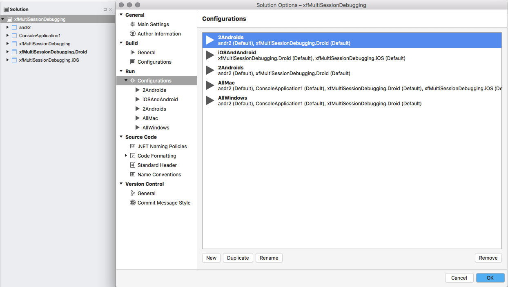

### Parts of the Debug Toolbar

The debug toolbar has changed to allow a solution configuration to be selected via a popup menu. This screenshot shows the parts of the Debug toolbar:

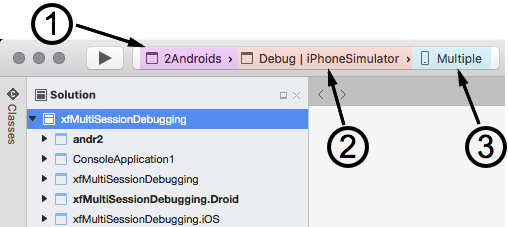

1. **Solution Configuration** - It is possible to set the solution configuration by clicking on the Solution configuration in the debug toolbar and selecting the configuration from the popup menu:

    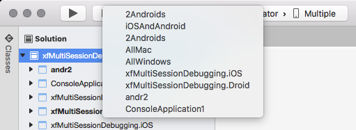

2. **Build Target** - This identifies the build target for the projects. This is unchanged from previous versions of Visual Studio for Mac.
3. **Device Targets** - This selects the devices that the solution will be run on. It is possible to identify a separate device or emulator for each project.:

    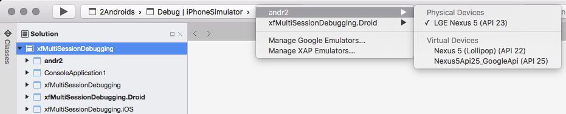

### Multiple Debug Pads

When the multi-solution configuration is started, some of the Visual Studio for Mac pads will appear multiple times, one for each process. For example, the following screenshot shows two **Application Output** pads for a solution that is running two projects:

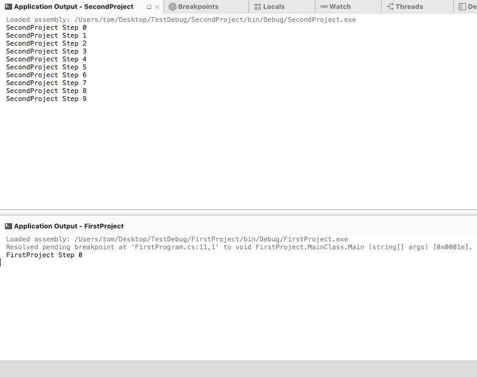

### Multiple Processes and the _Active Thread_

When a breakpoint is encountered in one process, that process will pause execution, while the other processes continue running. In a single process scenario, Visual Studio for Mac can easily display information such as threads, local variables, application output in a single set of pads. However, when there are multiple processes with multiple breakpoints, and potentially multiple threads, it can prove overwhelming to the developer to cope with the information from a debugging session that is trying to display all information from all threads (and processes) at once.

To address this problem, Visual Studio for Mac will only display the information from one thread at a time, this is known as the _active thread_. The first thread that pauses at a breakpoint is considered the _active thread_. The active thread is the thread that is the focus of the developer's attention. Debug commands, such as **Step Over** &#8679;&#8984;O (Shift-Cmd-O), will be issued to the active thread.

The **Thread Pad** will display information for all the processes and threads that are under inspection in the solution configuration and provide visual cues as to what the active thread is:

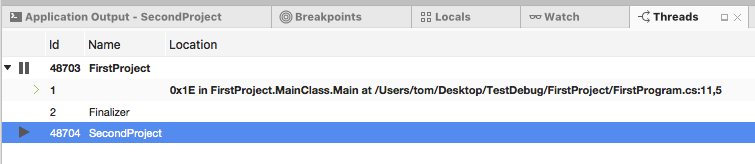

The threads are grouped by the process that is hosting them. The project name and ID of the active thread will be displayed in bold text, and an arrow pointing to the right will appear in the gutter next to the active thread. In the previous screenshot, **thread #1** in **process Id 48703** (**FirstProject**) is the active thread.

When debugging multiple processes, it is possible to switch the active thread to see debug information for that process (or thread) by using the **Thread Pad**. To switch the active thread, select the desired thread in the **Thread Pad** and then double click on it.

#### Stepping through Code When Multiple Projects Are Stopped

When two (or more) projects have break points, Visual Studio for Mac will pause both processes. It is only possible to **Step Over** code in the active thread. The other process will be paused until a scope change makes it possible for the debugger to switch focus from the active thread. For example, consider the following screenshot of Visual Studio for Mac debugging two projects:

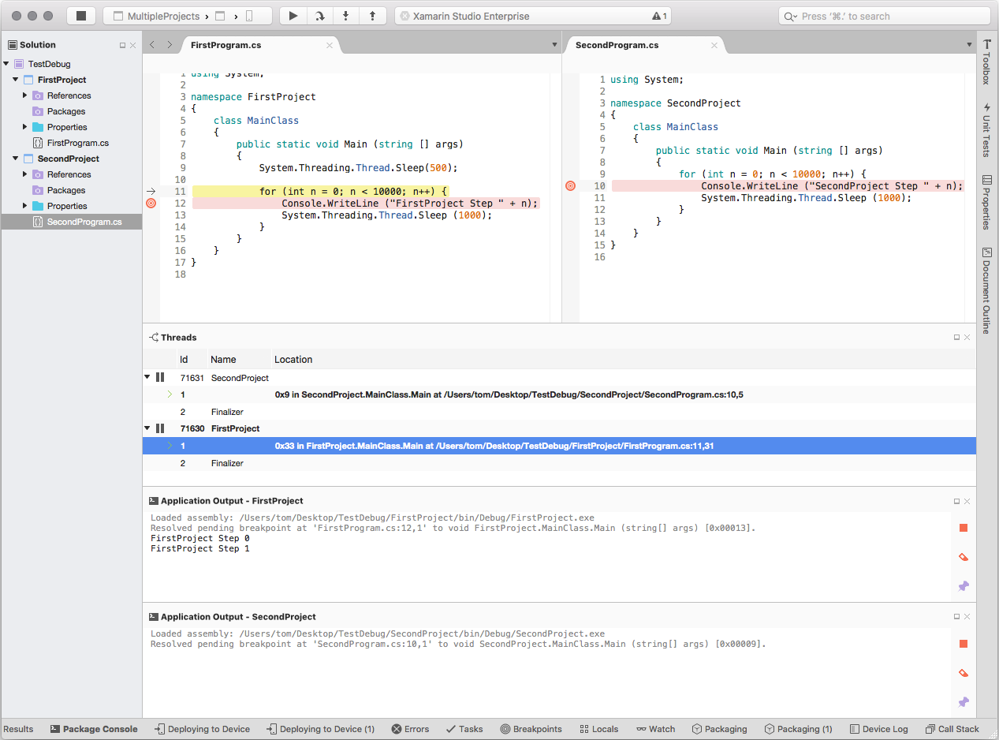

In this screenshot, each solution has its own breakpoint. When debugging starts, the first breakpoint to be encountered is on **line 10** of `MainClass` in **SecondProject**. Because both projects have breakpoints, each process is halted. Once the breakpoint is encountered, each invocation of the **Step Over** will cause Visual Studio for Mac to step over code in the active thread.

Stepping through the code is limited to the active thread, so Visual Studio for Mac will step through, code line at a time, while the other process is still paused.

Using the previous screenshot as an example, when the `for` loop finished, Visual Studio for Mac would allow **FirstProject** to run until the breakpoint at **line 11** in `MainClass` was encountered. For each **Step Over** command, the debugger would advance line by line in **FirstProject**, until the internal heuristic algorithms of Visual Studio for Mac switch the active thread back to **SecondProject**.

If only one of the projects had a break point set, then only that process would be paused. The other project would continue to run until paused by the developer or a breakpoint was added.

### Pausing and Resuming a Processes

It is possible to pause or resume a process by right-clicking on the process and selecting **Pause** or **Resume** from the context menu:

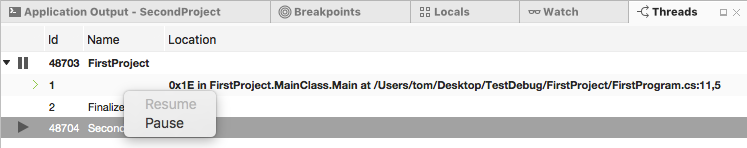

The appearance of the debug toolbar will change depending on the state of the projects that are being debugged. When multiple projects are running, the debug toolbar will display both the **Pause** and **Resume** button where there is at least one project running and one project paused:

Clicking the **Pause** button in the **Debug toolbar** will pause all processes that are being debugged, while clicking the **Resume** buttons will resume all paused processes.

### Debugging a Second Project

It is also possible to debug a second project once the first project is started by Visual Studio for Mac. Once the first project is started, **Right Click* on the project in the **Solution Pad** and select **Start Debugging Item**:

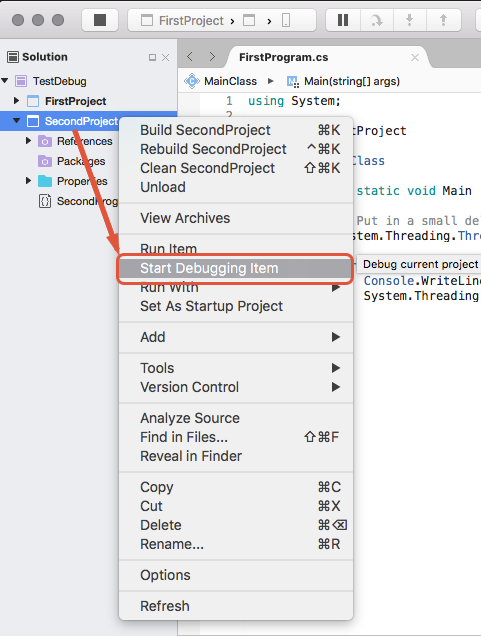

## Creating a Solution Configuration

A _solution configuration_ tells Visual Studio for Mac what project to run when a debugging session is initiated with the **Start** button. There can be more than one solution configuration per solution. This makes it possible to specify what projects are run when debugging the project.

To create a new solution configuration in Xamaring Studio:

1. Open the **Solution Options** dialog in Visual Studio for Mac, and select **Run > Configurations**:

    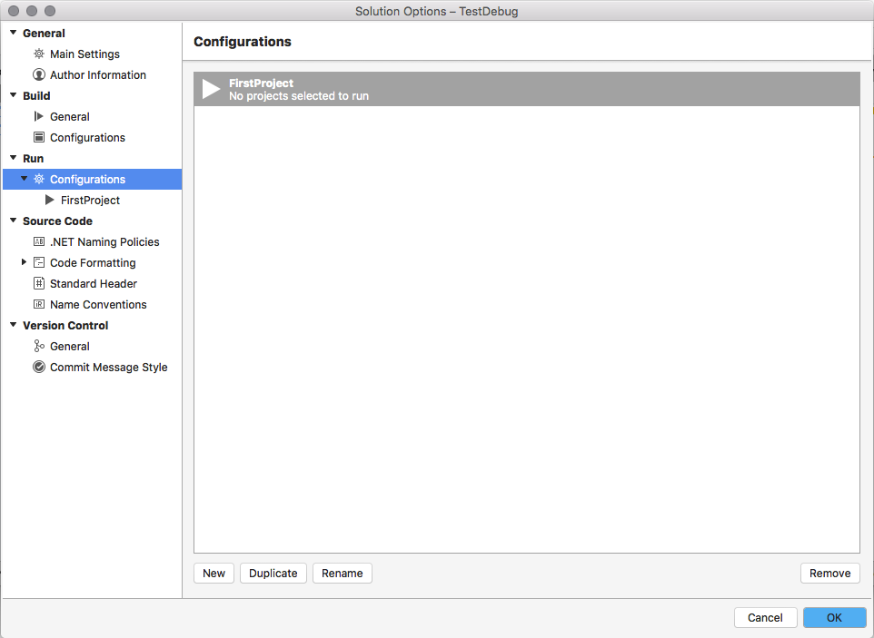

2. Click on the **New** button, and enter the name of the new solution configuration, and click **Create**. The new solution configuration will appear in the **Configurations** window:

    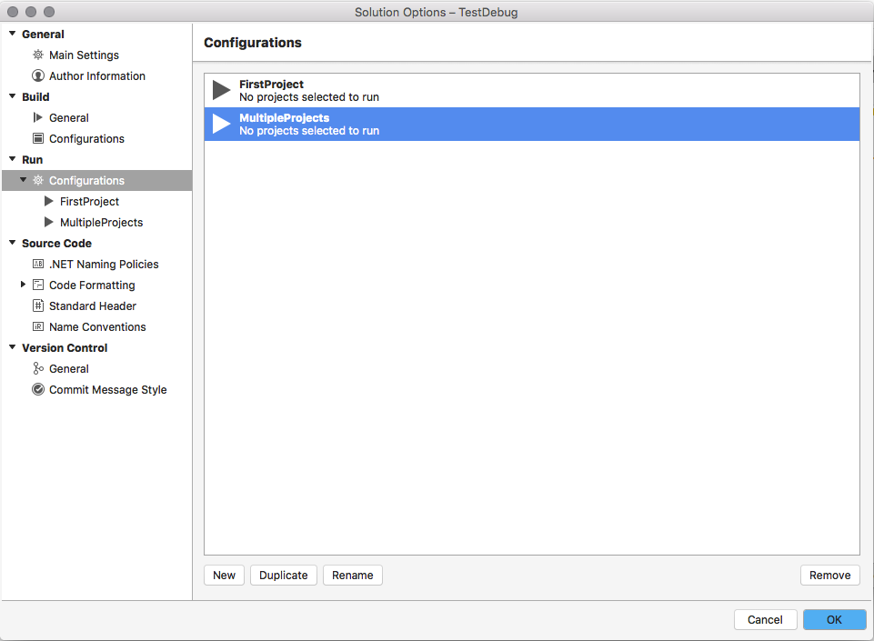

3. Select the new run configuration in the configurations list. The **Solution Options** dialog will display each project in the solution. Check off each project that should be started when a debugging session is initiated:

    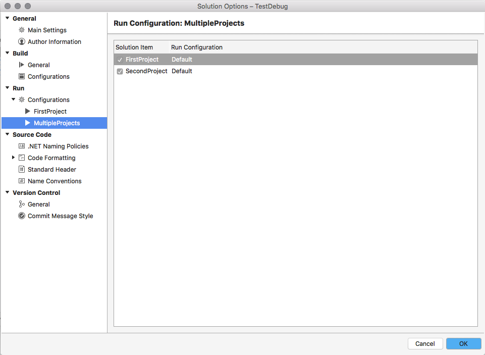

The **MultipleProjects** solution configuration will now appear in the **Debug toolbar**, making it possible for a developer to simultaneously debug the two projects.

## Summary

This guide discussed debugging multiple process in Visual Studio for Mac. It covered some of the changes to the IDE to support multi-process debugging and described some of the associated  behaviour.

## Related Links

- [Xamarin Cycle 9 Release Notes](https://releases.xamarin.com/stable-release-cycle-9/)
