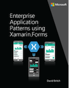

# Cross-Platform for Desktop Developers

This section contains information to help WPF and Windows Forms developers
to learn mobile app development with Xamarin, by cross-referencing their existing
knowledge and experience to mobile idioms, and providing examples of porting
desktop apps to mobile.

## [App Lifecycle Comparison](lifecycle.md)

Understanding the differences between WPF and Xamarin.Forms app startup and background states.

## [UI Controls Comparison](controls/index.md)

Quick reference to find equivalent controls in Windows Forms, WPF, and Xamarin.Forms, including additional guidance on the differences between WPF and Xamarin.Forms.

## [Porting Guidance](porting.md)

Using the Portability Analyzer to help migrate desktop application code (excluding the user interface) to Xamarin.Forms.

## [Samples](samples.md)

Reference samples demonstrating enterprise application architecture and
porting code from WPF to Xamarin.Forms.

## Learn More

 
