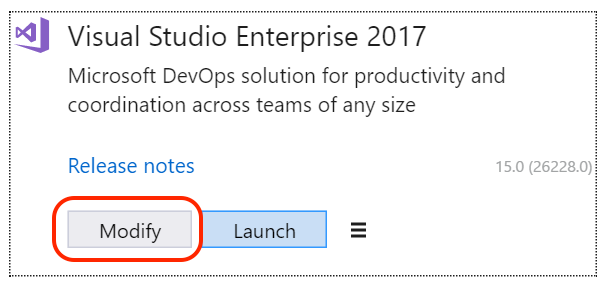
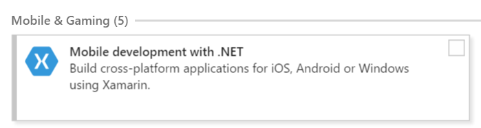
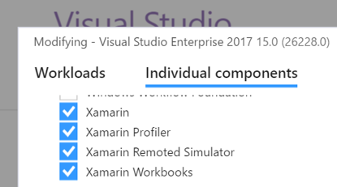
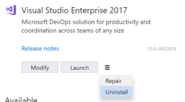
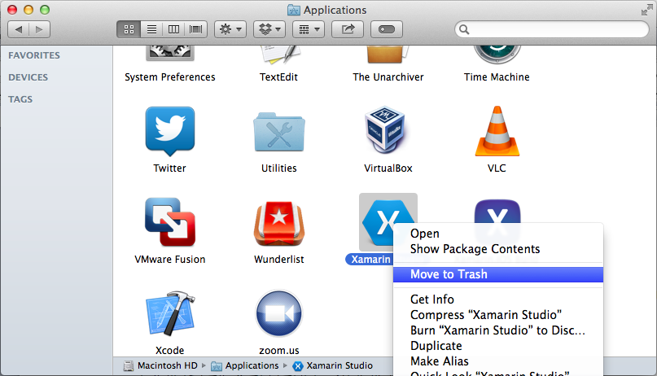

# Uninstalling Xamarin

This guide explains how to remove Xamarin from macOS or from Visual Studio on Windows.

If it is necessary to reinstall Xamarin using the Universal Installer, it is always recommended that the computer is rebooted first.

## Uninstalling Xamarin on macOS

This guide can be used to uninstall each product individually by navigating to the relevant section. The entire Xamarin toolset, which includes the listed products, can be uninstalled by following this guide the whole way through:

- [Mono](#uninstallmono)
- [Xamarin.Android](#uninstallandroid)
- [Xamarin.iOS](#uninstallios)
- [Xamarin.Mac](#uninstallmac)
- [Inspector and Workbooks](#uninstallworkbooks)
- [Xamarin Profiler](#uninstallprofiler)
- [Installer](#uninstallinstaller)

> [!TIP]
> We have provided an [uninstall script](https://raw.githubusercontent.com/MicrosoftDocs/visualstudio-docs/master/mac/resources/uninstall-vsmac.sh) for you to use when removing Xamarin from your macOS machine. For more information on using the script, see the [Using the Uninstall Script](#uninstallscript) section in this guide.

### Uninstalling Visual Studio for Mac

The first step in uninstalling Xamarin from a Mac is to locate **Visual Studio.app** in the **/Applications** directory and drag it to the **Trash Can**. Alternatively, right-click and select **Move to Trash** as illustrated in the following image:


Deleting this app bundle removes Visual Studio for Mac, although there may be other files relating to Xamarin still on a file system.

To remove all traces of Visual Studio for Mac, run the following commands in Terminal:

```bash
sudo rm -rf "/Applications/Visual Studio.app"
rm -rf ~/Library/Caches/VisualStudio
rm -rf ~/Library/Preferences/VisualStudio
rm -rf ~/Library/Preferences/Visual\ Studio
rm -rf ~/Library/Logs/VisualStudio
rm -rf ~/Library/VisualStudio
rm -rf ~/Library/Preferences/Xamarin/
rm -rf ~/Library/Developer/Xamarin
rm -rf ~/Library/Application\ Support/VisualStudio
rm -rf ~/Library/Application\ Support/VisualStudio/7.0/LocalInstall/Addins/
```

> [!NOTE]
> For information on uninstalling Visual Studio for Mac, refer to the [Uninstall](https://docs.microsoft.com/visualstudio/mac/uninstall) guide on docs.microsoft.com

<a name="uninstallmono" />

### Uninstall Mono SDK (MDK)

Mono is an open-source implementation of the .NET Framework and is used by all Xamarin Products—Xamarin.iOS, Xamarin.Android, and Xamarin.Mac to allow development of these platforms in C#.

> [!WARNING]
> There are other applications outside of Xamarin
> which also use Mono, such as Unity. Be sure that there are no other dependencies
> on Mono before uninstalling it.

To remove the Mono Framework, run the following commands in Terminal:

```bash
sudo rm -rf /Library/Frameworks/Mono.framework
sudo pkgutil --forget com.xamarin.mono-MDK.pkg
sudo rm /etc/paths.d/mono-commands
```

<a name="uninstallandroid" />

### Uninstall Xamarin.Android

There are a number of items that are required when using Xamarin.Android,
such as the Android SDK and Java SDK, which need to be removed when uninstalling Xamarin.Android. This section will guide you through uninstalling all the necessary parts.

To remove Xamarin.Android, run the following commands in Terminal:

```bash
sudo rm -rf /Developer/MonoDroid
rm -rf ~/Library/MonoAndroid
sudo pkgutil --forget com.xamarin.android.pkg
sudo rm -rf /Library/Frameworks/Xamarin.Android.framework
```

#### Uninstall Android SDK and Java SDK

The Android SDK is required for development of Android applications. To completely remove all parts of the Android SDK, locate the file at **~/Library/Developer/Xamarin/** and move it to **Trash**.

The Java SDK (JDK) does not need to be uninstalled, as it is already pre packaged as part of Mac OS X.

#### Uninstall Android AVD

> [!WARNING]
> There are other applications outside of Visual Studio for Mac that also use Android AVD and these additional android components, such as Android Studio.
> Removing this directory may cause projects to break in Android Studio. 

To remove any Android AVDs and additional Android components, use the following command:

```bash
rm -rf ~/.android
```

To remove only the Android AVDs, use the following command:

```bash
rm -rf ~/.android/avd
```

<a name="uninstallios" />

### Uninstall Xamarin.iOS

Xamarin.iOS allows iOS application development using C# or F#. To uninstall Xamarin.iOS from a machine, follow the steps below:

To remove all Xamarin.iOS files, use the following commands in Terminal :

```bash
rm -rf ~/Library/MonoTouch
sudo rm -rf /Library/Frameworks/Xamarin.iOS.framework
sudo rm -rf /Developer/MonoTouch
sudo pkgutil --forget com.xamarin.monotouch.pkg
sudo pkgutil --forget com.xamarin.xamarin-ios-build-host.pkg
sudo pkgutil --forget com.xamarin.xamarin.ios.pkg
```

<a name="uninstallmac" />

### Uninstall Xamarin.Mac

Xamarin.Mac can be removed from your machine by using the following two commands to eradicate the product and license from your Mac respectively:

```bash
sudo rm -rf /Library/Frameworks/Xamarin.Mac.framework
rm -rf ~/Library/Xamarin.Mac
```

<a name="uninstallworkbooks" />

### Uninstall Workbooks and Inspector

To remove Xamarin Inspector and Workbooks version 1.2.2 and above, use the following commands in Terminal:

```bash
sudo /Library/Frameworks/Xamarin.Interactive.framework/Versions/Current/uninstall
```

For earlier versions, see the [Workbooks](~/tools/workbooks/install.md#uninstall-macos) uninstall guide.

<a name="uninstallprofiler" />

### Uninstall the Xamarin Profiler

To remove the Xamarin Profiler, use the following commands in Terminal:

```bash
sudo rm -rf "/Applications/Xamarin Profiler.app"
```

<a name="uninstallinstaller" />

### Uninstall the Xamarin Installer

To remove all traces of the Xamarin Universal Installer, use the following commands:

```bash
rm -rf ~/Library/Caches/XamarinInstaller/
rm -rf ~/Library/Caches/VisualStudioInstaller/
rm -rf ~/Library/Logs/XamarinInstaller/
rm -rf ~/Library/Logs/VisualStudioInstaller/
rm -rf ~/Library/Preferences/Xamarin/
rm -rf "~/Library/Preferences/Visual Studio/"
```

<a name="uninstallscript" />

### Using the Uninstall Script

This uninstall script allows you to uninstall Visual Studio for Mac and its associated Xamarin components in one go.

The script contains most of the commands that are found in the article. There are two main omissions from the script and are not included due to possible external dependencies:

- Uninstalling Mono
- Uninstalling Android AVD

To run the script, do the following steps:

1. Right-click on the script and select Save As… to save the file on your Mac.

2.  Open **Terminal** and change the working directory to where the script was downloaded:

        $ cd /location/of/file

3. Make the script executable and the run it with **sudo**:

        $ chmod +x ./xamarin_uninstall.sh
        $ sudo ./xamarin_uninstall.sh

4. Finally, delete the uninstall script.

At this point, Xamarin should be uninstalled from your computer.

<a name="uninstallwindows" />

## Uninstalling Xamarin on Windows

Xamarin has been supported on the following:

- [Visual Studio 2017](#uninstallvs2017)
- [Visual Studio 2015](#uninstallvs2015)
- [Visual Studio 2013](#uninstallvs2015) [**Unsupported**]
- [Xamarin Studio](#uninstallxamarinstudio) [**Unsupported**]

<a name="uninstallvs2017" />

### Visual Studio 2017

Xamarin is uninstalled from Visual Studio 2017 using the installer app:

1. Use the **Start menu** to open the **Visual Studio Installer**.

2. Press the **Modify** button for the instance you wish to change.

    [](uninstalling-xamarin-images/vs2017-02.png#lightbox)

3. In the **Workloads** tab, de-select the **Mobile Development with .NET** option
  (in the **Mobile & Gaming** section).

    [](uninstalling-xamarin-images/vs2017-03.png#lightbox)

4. Click the **Modify** button in the bottom right of the window.

5. The installer will remove the de-selected components
  (Visual Studio 2017 must be closed before the installer can make any changes).

    [](uninstalling-xamarin-images/vs2017-04.png#lightbox)

Individual Xamarin components (such as the Profiler or Workbooks) can be uninstalled
by switching to the **Individual Components** tab in step 3, and unchecking
specific components:

[](uninstalling-xamarin-images/vs2017-components.png#lightbox)

To uninstall Visual Studio 2017 completely, choose **Uninstall** from the
three-bar menu next to the **Launch** button.

[](uninstalling-xamarin-images/vs2017-uninstall.png#lightbox)

> [!IMPORTANT]
> If you have two (or more) instances of Visual Studio installed side-by-side (SxS) – such as a Release and a Preview version – uninstalling
> one instance might remove some Xamarin functionality from the other Visual Studio instance(s), including:
>
> - Xamarin Profiler
> - Xamarin Workbooks/Inspector
> - Xamarin Remote iOS Simulator
> - Apple Bonjour SDK
>
> Under certain conditions, uninstalling one of the SxS instances can result in the incorrect removal of these features. This may degrade the performance of the Xamarin Platform on the Visual Studio instance(s) that remain on the system after the uninstallation of the SxS instance.
>
>This isresolved by running the **Repair** option in the Visual Studio installer, which will re-install the missing components.


## Uninstalling older and unsupported products

<a name="uninstallvs2015"></a>

### Visual Studio 2015 and earlier

To uninstall Visual Studio 2015 completely, use [the support answer on visualstudio.com](https://www.visualstudio.com/vs/support/vs2015/uninstall-visual-studio-2015/).

Xamarin can be uninstalled from a Windows machine through **Control Panel**. Navigate to **Programs and Features** or **Programs > Uninstall a Program** as illustrated below:

 [](uninstalling-xamarin-images/image3.png#lightbox) 

From the Control Panel, uninstall any of the following that are present:

- Xamarin
- Xamarin for Windows
- Xamarin.Android
- Xamarin.iOS
- Xamarin for Visual Studio

In Explorer, delete any remaining files from the Xamarin Visual Studio extension folders (all versions, including both Program Files and Program Files (x86)):

``` 
C:\Program Files*\Microsoft Visual Studio 1*.0\Common7\IDE\Extensions\Xamarin
```

Delete Visual Studio's MEF component cache directory, which should be located in the following location:

``` 
%LOCALAPPDATA%\Microsoft\VisualStudio\1*.0\ComponentModelCache
```

Check in the **VirtualStore** directory to see if Windows might have stored any overlay files for the **Extensions\Xamarin** or **ComponentModelCache** directories there:

``` 
%LOCALAPPDATA%\VirtualStore
```

Open the registry editor (regedit) and look for the following key:

``` 
HKEY_LOCAL_MACHINE\SOFTWARE\Wow6432Node\Microsoft\Windows\CurrentVersion\SharedDlls
```

Find and delete any entries that match this pattern:

``` 
C:\Program Files*\Microsoft Visual Studio 1*.0\Common7\IDE\Extensions\Xamarin
```

Look for this key:

``` 
HKEY_CURRENT_USER\Software\Microsoft\VisualStudio\1*.0\ExtensionManager\PendingDeletions
```

Delete any entries that look like they might be related to Xamarin. For example, anything containing the terms `mono` or `xamarin`.

Open an administrator cmd.exe command prompt, and then run the `devenv /setup` and `devenv /updateconfiguration` commands for each installed version of Visual Studio. For example, for Visual Studio 2015:

```cmd
"%ProgramFiles(x86)%\Microsoft Visual Studio 14.0\Common7\IDE\devenv.exe" /setup
"%ProgramFiles(x86)%\Microsoft Visual Studio 14.0\Common7\IDE\devenv.exe" /updateconfiguration
```

<a name="uninstallxamarinstudio"></a>

### Uninstall Xamarin Studio on Windows

Xamarin Studio is uninstalled from a Windows machine through **Control Panel**. Navigate to **Programs and Features** or **Programs > Uninstall a Program** 

To uninstall Xamarin Studio, find **Xamarin Studio 5.x.x** in the list of programs and click the **Uninstall** button. 

### Uninstall Xamarin Studio on Mac

The first step in uninstalling Xamarin Studio from a Mac is to locate **Xamarin Studio.app** in the **/Applications** directory and drag it to the **Trash Can**. Alternatively, right-click and select **Move to Trash** as illustrated below:

 [](uninstalling-xamarin-images/image1.png#lightbox)

Deleting this app bundle will remove Xamarin Studio, however, there are other files relating to Xamarin still on a file system.

To remove all traces of Xamarin Studio, the following commands should be run in Terminal:

```bash
sudo rm -rf "/Applications/Xamarin Studio.app"
rm -rf ~/Library/Caches/XamarinStudio-*
rm -rf ~/Library/Preferences/XamarinStudio-*
rm -rf ~/Library/Logs/XamarinStudio-*
rm -rf ~/Library/XamarinStudio-*
```

## Summary

This article provided instruction on uninstalling Xamarin completely from a Mac
through the use of Terminal commands. It also provided instruction on uninstalling Xamarin from
a Windows machine through the **Programs and Features** option (for Visual Studio 2015
and earlier), and using the **Visual Studio Installer** for Visual Studio 2017.


## Related Links

- [Uninstall Script (sample)](https://raw.githubusercontent.com/MicrosoftDocs/visualstudio-docs/master/mac/resources/uninstall-vsmac.sh)
