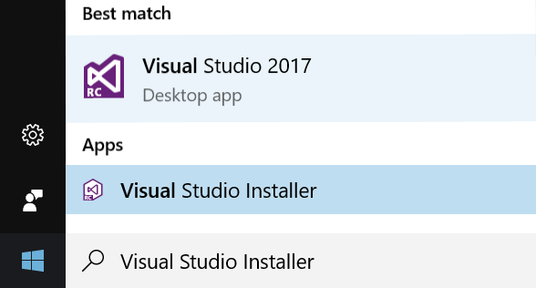
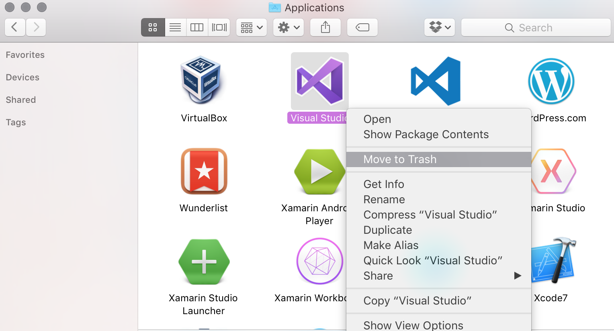

# Uninstalling Xamarin

> [!IMPORTANT]
> This article explains how to uninstall Xamarin Studio or other Xamarin products from a Mac or Windows computer. For information on uninstalling Visual Studio for Mac, refer to the [Uninstall](https://docs.microsoft.com/visualstudio/mac/uninstall) guide on docs.microsoft.com

There are a number of Xamarin products that enable cross-platform application development,
including stand-alone apps like Xamarin Studio, and extensions to other apps like
the Xamarin support in Visual Studio.

This guide will explain how to remove the Xamarin functionality on macOS,
or from Visual Studio on Windows:

1.  [Uninstalling Xamarin Studio](#uninstallxamarinstudio)
  1.  [Uninstalling Mono](#uninstallmono)
  1.  [Uninstalling Xamarin.Android](#uninstallandroid)
  1.  [Uninstalling Xamarin.iOS](#uninstallios)
  1.  [Uninstalling Xamarin.Mac](#uninstallmac)
  2.  [Uninstalling Inspector and Workbooks](#uninstallworkbooks)
1.  [Uninstalling Xamarin from Windows](#uninstallwindows)
  1.  [Uninstalling Xamarin from Visual Studio 2015 and earlier](#uninstallvs2015)
  1.  [Uninstalling Xamarin from Visual Studio 2017](#uninstallvs2017)
1.  [Uninstalling Visual Studio for Mac](#uninstallvsmac)

If it is necessary to re-install Xamarin using the Universal Installer, it is always recommended that the computer is rebooted first.

## Uninstalling Xamarin on Mac

This guide can be used to uninstall each product individually by navigating to the relevant section. The entire Xamarin toolset can be uninstalled by following this guide the whole way through.

For help with using the [Uninstall script](http://download.xamarin.com/developer/cross-platform/xamarin_uninstall.sh), jump to the [Using the Uninstall Script](#uninstallscript) at the bottom of this guide.

<a name="uninstallxamarinstudio" />

### Uninstall Xamarin Studio

The first step in uninstalling Xamarin Studio from a Mac is to locate **Xamarin Studio.app** in the **/Applications** directory and drag it to the **Trash Can**. Alternatively, right-click and select **Move to Trash** as illustrated below:

 [](uninstalling-xamarin-images/image1.png#lightbox)

Deleting this app bundle will remove Xamarin Studio, however, there are other files relating to Xamarin still on a file system.

To remove all traces of Xamarin Studio, the following commands should be run in Terminal:

```bash
sudo rm -rf "/Applications/Xamarin Studio.app"
rm -rf ~/Library/Caches/XamarinStudio-*
rm -rf ~/Library/Preferences/XamarinStudio-*
rm -rf ~/Library/Logs/XamarinStudio-*
rm -rf ~/Library/XamarinStudio-*
```

<a name="uninstallmono" />

### Uninstall Mono SDK (MDK)

Mono is an open source implementation of Microsoft’s .NET Framework and is used by all Xamarin Products—Xamarin.iOS, Xamarin.Android and Xamarin.Mac to allow development of these platforms in C#.

> [!IMPORTANT]
> Note: There are other applications outside of Xamarin
> which also use Mono, such as Unity. Be sure that there are no other dependencies
> on Mono before uninstalling it.

To remove the Mono Framework from a machine, run the following commands in Terminal:

```bash
sudo rm -rf /Library/Frameworks/Mono.framework
sudo pkgutil --forget com.xamarin.mono-MDK.pkg
sudo rm /etc/paths.d/mono-commands
```

<a name="uninstallandroid" />

### Uninstall Xamarin.Android

There are a number of items required for the installation and use of Xamarin.Android,
such as the Android SDK and Java SDK. More information about these
required components is available in the [Manual Installation](https://docs.microsoft.com/visualstudio/mac/installation/) guide.

Use the following commands to remove Xamarin.Android:

```bash
sudo rm -rf /Developer/MonoDroid
rm -rf ~/Library/MonoAndroid
sudo pkgutil --forget com.xamarin.android.pkg
sudo rm -rf /Library/Frameworks/Xamarin.Android.framework
```

#### Uninstall Android SDK and Java SDK

The Android SDK is required for development of Android applications. To completely remove all parts of the Android SDK, locate the file at **~/Library/Developer/Xamarin/** and move it to **Trash**, as illustrated below:

 [](uninstalling-xamarin-images/image2.png#lightbox)

The Java SDK (JDK) does not need to be uninstalled, as it is already pre packaged as part of Mac OS X.

<a name="uninstallios" />

### Uninstall Xamarin.iOS

Xamarin.iOS allows iOS application development using C# or F# with Xamarin Studio on a Mac.
The Xamarin Build Host was also installed automatically with earlier versions of Xamarin.iOS to allow for
iOS development in Visual Studio. To uninstall both from a machine, follow the steps below:

Use the following commands in Terminal to remove all Xamarin.iOS files from a file system:

```bash
rm -rf ~/Library/MonoTouch
sudo rm -rf /Library/Frameworks/Xamarin.iOS.framework
sudo rm -rf /Developer/MonoTouch
sudo pkgutil --forget com.xamarin.monotouch.pkg
sudo pkgutil --forget com.xamarin.xamarin-ios-build-host.pkg
```

#### Uninstall the Mac Build Host

Note: This may already have been removed if you have already updated to Xamarin 4
Run the following command in Terminal to remove the Build Host application:

```bash
sudo rm -rf "/Applications/Xamarin.iOS Build Host.app"
```

The Build Host process or `launchd` job may still be running or listening on certain ports.
You can check its status by running `launchctl list | grep com.xamarin.mtvs.buildserver` in Terminal.

```bash
sudo launchctl unload /Library/LaunchAgents/com.xamarin.mtvs.buildserver.plist
sudo rm -f /Library/LaunchAgents/com.xamarin.mtvs.buildserver.plist
```

<a name="uninstallmac" />

### Uninstall Xamarin.Mac

Once Xamarin Studio has been successfully uninstalled, Xamarin.Mac can be removed from your machine using the following two commands to eradicate the product and license from your Mac respectively:

```bash
sudo rm -rf /Library/Frameworks/Xamarin.Mac.framework
rm -rf ~/Library/Xamarin.Mac
```

<a name="uninstallworkbooks" />

### Uninstall Workbooks and Inspector

The following Bash command will remove the Xamarin Inspector and Workbooks version 1.2.2 and above:

```bash
sudo /Library/Frameworks/Xamarin.Interactive.framework/Versions/Current/uninstall
```

For earlier versions, see the [Workbooks](~/tools/workbooks/install.md#uninstall-macos) uninstall guide.

### Uninstall the Xamarin Installer

Use the following commands to remove all traces of the Xamarin Universal Installer:

```bash
rm -rf ~/Library/Caches/XamarinInstaller/
rm -rf ~/Library/Logs/XamarinInstaller/
rm -rf ~/Library/Preferences/Xamarin/
```

<a name="uninstallscript" />

### Using the Uninstall Script

The [uninstall script](http://download.xamarin.com/developer/cross-platform/xamarin_uninstall.sh) will remove Xamarin from a computer. To use the uninstall script:

1.  Download the uninstall script and make a note of the download location. By default this is the **/Downloads** directory.
1.  Open **Terminal** and change the working directory to where the script was downloaded:

        $ cd /location/of/file

1. Make the script executable and the run it with **sudo**:

        $ chmod +x ./xamarin_uninstall.sh
        $ sudo ./xamarin_uninstall.sh

1. Finally, delete the uninstall script.

At this point, Xamarin should be uninstalled from your computer.

<a name="uninstallwindows" />

## Uninstalling Xamarin on Windows

<a name="uninstallvs2015" />

### Visual Studio 2015 and earlier

Xamarin can be uninstalled from a Windows machine through **Control Panel**. Navigate to **Programs and Features** or **Programs > Uninstall a Program** as illustrated below:

 [](uninstalling-xamarin-images/image3.png#lightbox) [](uninstalling-xamarin-images/image3.png#lightbox)

To uninstall Xamarin Studio, find **Xamarin Studio 5.x.x** in the list of programs and click the **Uninstall** button. To remove the Xamarin extension for Visual Studio, and the SDKs, find **Xamarin** in the list of Programs and click **Uninstall**. These are illustrated in the screenshot below:

 [](uninstalling-xamarin-images/image4a.png#lightbox)

These programs may also be removed to completely all Xamarin components:

-  Android SDK


  [](uninstalling-xamarin-images/image5.png#lightbox)
-  GTK#


  [](uninstalling-xamarin-images/image6.png#lightbox)
-  Xamarin Universal Installer


 [](uninstalling-xamarin-images/image7.png#lightbox)
-  Java SDK (Be careful when removing this, as there may be other dependencies on it)


 [](uninstalling-xamarin-images/image8.png#lightbox)

To uninstall Visual Studio completely, follow [Microsoft's instructions](https://msdn.microsoft.com/library/mt720585.aspx).


<a name="uninstallvs2017" />

## Visual Studio 2017

Xamarin can be uninstalled from Visual Studio 2017 using the installer app:

1. Use the **Start menu** to open the **Visual Studio Installer**.

  [](uninstalling-xamarin-images/vs2017-01.png#lightbox)

1. Press the **Modify** button for the instance you wish to change.

  [](uninstalling-xamarin-images/vs2017-02.png#lightbox)

1. In the **Workloads** tab, de-select the **Mobile Development with .NET** option
  (in the **Mobile & Gaming** section).

  [](uninstalling-xamarin-images/vs2017-03.png#lightbox)

1. Click the **Modify** button in the bottom right of the window.
1. The installer will remove the de-selected components
  (Visual Studio 2017 must be closed before the installer can make any changes).

  [](uninstalling-xamarin-images/vs2017-04.png#lightbox)

Individual Xamarin components (such as the Profiler or Workbooks) can be uninstalled
by switching to the **Individual Components** tab in step 3, and un-checking
specific components:

[](uninstalling-xamarin-images/vs2017-components.png#lightbox)

To uninstall Visual Studio 2017 completely, choose **Uninstall** from the
three-bar menu next to the **Launch** button.

[](uninstalling-xamarin-images/vs2017-uninstall.png#lightbox)

> [!IMPORTANT]
> **WARNING:** If you have two (or more) instances of Visual Studio installed side-by-side (SxS) – such as a Release and a Preview version – uninstalling
> one instance might remove some Xamarin functionality from the other Visual Studio instance(s), including:
>
> - Xamarin Profiler
> - Xamarin Workbooks/Inspector
> - Xamarin Remote iOS Simulator
> - Apple Bonjour SDK
>
> Under certain conditions, uninstalling one of the SxS instances can result in the incorrect removal of these features. This may degrade the performance of the Xamarin Platform on the Visual Studio instance(s) that remain on the system after the uninstallation of the SxS instance.
>
>This can be resolved by running the **Repair** option in the Visual Studio installer, which will re-install the missing components.

<a name="uninstallvsmac" />

## Uninstalling Visual Studio for Mac

To uninstall Visual Studio for Mac but to keep using Xamarin Studio, locate **Visual Studio.app** in the **/Applications** directory and drag it to the Trash Can. Alternatively, right-click and select **Move to Trash** as illustrated below:

 [](uninstalling-xamarin-images/image9.png#lightbox)

To uninstall Xamarin completely from your machine, first delete Visual Studio for Mac, and then follow the steps listed in the [Uninstall Xamarin Studio](#uninstallxamarinstudio) section.

## Summary

In this article we looked at uninstalling Xamarin completely from a Mac
through the use of Terminal commands, as well as uninstalling Xamarin from
a Windows machine through the **Programs and Features** option (for Visual Studio 2015
and earlier), and using the **Visual Studio Installer** for Visual Studio 2017.


## Related Links

- [Uninstall Script (sample)](http://download.xamarin.com/developer/cross-platform/xamarin_uninstall.sh)
