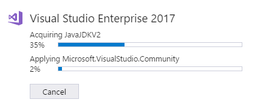
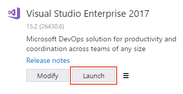
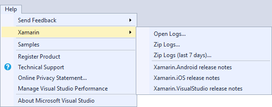
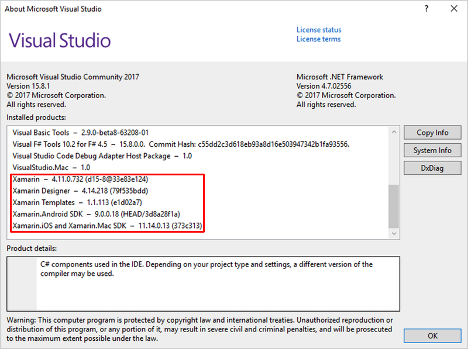

# Installing Xamarin in Visual Studio 2017

## Requirements

The following are required for installing Xamarin in Visual Studio 2017:

1. Windows 7 or higher.

2. Visual Studio 2017 (Community, Professional, or Enterprise).

3. Xamarin for Visual Studio.

For more information about the prerequisites for installing
and using Xamarin, see
[System Requirements](~/cross-platform/get-started/requirements.md).

## Installation

Xamarin can be installed as part of a new Visual Studio 2017 installation.
To achieve this, use the following steps:

1. Download Visual Studio 2017 Community, Visual Studio Professional, or
   Visual Studio Enterprise from the
   [Visual Studio](https://visualstudio.microsoft.com/vs/) page (download
   links are provided at the bottom).

2. Double-click the downloaded package to start installation.

3. Select the **Mobile development with .NET** workload from the
   installation screen:

    

4. While **Mobile development with .NET** is selected, have a look at
   the **Installation details** panel on the right. Here, you can deselect
   mobile development options that you do not want to install.

    

5. When you are ready to begin Visual Studio 2017 installation, click the
   **Install** button in the lower right-hand corner:

    

   Depending on which edition of Visual Studio 2017 you are installing, the
   installation process can take a long time to complete. Use the
   progress bars to monitor the installation:

    

6. When Visual Studio 2017 installation has completed, click the **Launch**
   button to start Visual Studio:

    

### Adding Xamarin to Visual Studio 2017

If Visual Studio 2017 is already installed, add Xamarin by
re-rerunning the Visual Studio 2017 installer to modify workloads (see
[Modify Visual Studio](https://docs.microsoft.com/visualstudio/install/modify-visual-studio)
for details). Next, follow the steps listed above to install Xamarin.

For more information about downloading and installing Visual Studio
2017, see [Install Visual Studio 2017](https://docs.microsoft.com/visualstudio/install/install-visual-studio).

### Verifying installation

In Visual Studio 2017, verify that Xamarin is installed by
clicking the **Help** menu. If Xamarin is installed, you should
see a **Xamarin** menu item as shown in this screenshot:

You can also click **Help > About Microsoft Visual Studio** and scroll
through the list of installed products to see if Xamarin is installed:

For more information about locating version information, see
[Where can I find my version information and logs?](~/cross-platform/troubleshooting/questions/version-logs.md)

## Next steps

Installing Xamarin in Visual Studio 2017 allows you to start writing code
for your apps, but does require additional setup for building and
deploying your apps to simulator, emulator, and device. Visit the
following guides to complete your installation and start building cross
platform apps.

### iOS

For more detailed information, see the [Installing Xamarin.iOS on Windows](~/ios/get-started/installation/windows/index.md) guide. 

1. [Install Visual Studio for Mac](https://docs.microsoft.com/visualstudio/mac/installation)
2. [Connect Visual Studio to your Mac build host](~/ios/get-started/installation/windows/connecting-to-mac/index.md)
3. [iOS Developer Setup](~/ios/get-started/installation/device-provisioning/index.md) - Required to run your application on device
5. [Remoted iOS Simulator](~/tools/ios-simulator.md)
6. [Introduction to Xamarin.iOS for Visual Studio](~/ios/get-started/installation/windows/introduction-to-xamarin-ios-for-visual-studio.md)

### Android

For more detailed information, see the [Installing Xamarin.Android on Windows](~/android/get-started/installation/windows.md) guide.

1. [Xamarin.Android Configuration](~/android/get-started/installation/windows.md#configuration)
2. [Using the Xamarin Android SDK Manager](~/android/get-started/installation/android-sdk.md?ide=vs)
3. [Android SDK Emulator](~/android/get-started/installation/android-emulator/index.md)
4. [Set Up Device for Development](~/android/get-started/installation/set-up-device-for-development.md)
