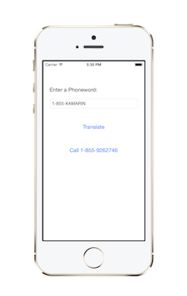

# Introduction to Mobile Development

Building mobile applications can be as easy as opening up the IDE, throwing
something together, doing a quick bit of testing, and submitting to an App Store
– all done in an afternoon. Or it can be an extremely involved process that
involves rigorous up-front design, usability testing, QA testing on thousands of
devices, a full beta lifecycle, and then deployment a number of different
ways.

This document is intended to introduce the Xamarin platform. To learn more about the *process* of building mobile applications from design through to testing, refer to the [Introduction to the Mobile Software Development Lifecycle](~/cross-platform/get-started/introduction-to-mobile-sdlc.md) document.

Please refer to our [system requirements](~/cross-platform/get-started/requirements.md#macos-requirements)
to confirm you are able to install Xamarin.

## Introduction to Xamarin

When considering how to build iOS and Android applications, many people think
that the native languages, Objective-C, Swift, and Java, are the only
choice. However, over the past few years, an entire new ecosystem of platforms
for building mobile applications has emerged.

Xamarin is unique in this space by offering a single language – C#, class
library, and runtime that works across all three mobile platforms of iOS,
Android, and Windows Phone (Windows Phone’s native language is already
C#), while still compiling native (non-interpreted) applications that are
performant enough even for demanding games.

Each of these platforms has a different feature set and each varies in its
ability to write native applications – that is, applications that compile down
to native code and that interop fluently with the underlying Java subsystem. For
example, some platforms only allow apps to be built in HTML and JavaScript, whereas some are very low-level and only allow C/C++ code. Some platforms don’t even utilize the native
control toolkit.

Xamarin is unique in that it combines all of the power of the native
platforms and adds a number of powerful features of its own, including:

1.   **Complete Binding for the underlying SDKs** – Xamarin contains bindings for nearly the entire underlying platform SDKs in both iOS and Android. Additionally, these bindings are strongly-typed, which means that they’re easy to navigate and use, and provide robust compile-time type checking and during development. This leads to fewer runtime errors and higher quality applications.
1.   **Objective-C, Java, C, and C++ Interop** – Xamarin provides facilities for directly invoking Objective-C, Java, C, and C++ libraries, giving you the power to use a wide array of 3rd party code that has already been created. This lets you take advantage of existing iOS and Android libraries written in Objective-C, Java or C/C++. Additionally, Xamarin offers binding projects that allow you to easily bind native Objective-C and Java libraries using a declarative syntax.
1.   **Modern Language Constructs** – Xamarin applications are written in C#, a modern language that includes significant improvements over Objective-C and Java such as  *Dynamic Language Features* ,  *Functional Constructs* such as  *Lambdas* ,  *LINQ* ,  *Parallel Programming* features, sophisticated  *Generics* , and more.
1.   **Amazing Base Class Library (BCL)** – Xamarin applications use the .NET BCL, a massive collection of classes that have comprehensive and streamlined features such as powerful XML, Database, Serialization, IO, String, and Networking support, just to name a few. Additionally, existing C# code can be compiled for use in an applications, which provides access to thousands upon thousands of libraries that will let you do things that aren’t already covered in the BCL.
1.   **Modern Integrated Development Environment (IDE)** – Xamarin uses Visual Studio for Mac on Mac OS X and Visual Studio on Windows. These are both modern IDEs that include features such as code auto completion, a sophisticated Project and Solution management system, a comprehensive project template library, integrated source control, and many others.
1.   **Mobile Cross Platform Support** – Xamarin offers sophisticated cross-platform support for the three major mobile platforms of iOS, Android, and Windows Phone. Applications can be written to share up to 90% of their code, and our Xamarin.Mobile library offers a unified API to access common resources across all three platforms. This can significantly reduce both development costs and time to market for mobile developers that target the three most popular mobile platforms.

Because of Xamarin’s powerful and comprehensive feature set, it fills a
void for application developers that want to use a modern language and platform
to develop cross-platform mobile applications.

> [!NOTE]
> This Getting Started series focuses on getting started building iOS and Android applications. Microsoft offers information about [Universal Windows Platform (UWP) development](https://docs.microsoft.com/windows/uwp/develop/) for tablets and desktops. To learn more about cross-platform development with Xamarin (including UWP apps for Windows), read the [Building Cross-Platform Applications guide](~/cross-platform/app-fundamentals/building-cross-platform-applications/index.md).

## How Does Xamarin Work?

Xamarin offers two commercial products: Xamarin.iOS and Xamarin.Android. They’re both built on
top of *Mono*, an open-source version of the .NET Framework based on the
published .NET ECMA standards. Mono has been around almost as long as the .NET
framework itself, and runs on nearly every imaginable platform including Linux,
Unix, FreeBSD, and Mac OS X.

On iOS, Xamarin’s *Ahead-of-Time* ( *AOT*) Compiler compiles
Xamarin.iOS applications directly to native ARM assembly code. On Android,
Xamarin’s compiler compiles down to *Intermediate Language*
( *IL*), which is then *Just-in-Time* ( *JIT*) compiled to
native assembly when the application launches.

In both cases, Xamarin applications utilize a runtime that automatically
handles things such as memory allocation, garbage collection, underlying
platform interop, etc.

### Xamarin.iOS.dll and Mono.Android.dll

Xamarin applications are built against a subset of the .NET BCL known as the
Xamarin Mobile Profile. This profile has been created specifically for mobile
applications and packaged in the MonoTouch.dll and Mono.Android.dll (for iOS and
Android respectively). This is much like the way Silverlight (and Moonlight)
applications are built against the Silverlight/Moonlight .NET Profile. In fact,
the Xamarin Mobile profile is equivalent to the Silverlight 4.0 profile with a
bunch of BCL classes added back in.

For a full list of available assemblies and classes, see the [Xamarin.iOS Assembly List](~/cross-platform/internals/available-assemblies.md?context=xamarin/ios) and the [Xamarin.Android Assembly List](~/cross-platform/internals/available-assemblies.md?context=xamarin/android)

In addition to the BCL, these .dlls include wrappers for nearly the entire
iOS SDK and Android SDK that allows the underlying SDK APIs to be invoked
directly from C#.

### Application Output

When Xamarin applications are compiled, the result is an Application Package,
either an .app file in iOS, or .apk file in Android. These files are
indistinguishable from application packages built with the platform's default
IDEs and are deployable in the exact same way.

## Getting Started

Now you've learned a little about how Xamarin works, it's time to dive in!

The next step is to start building the app using one of these guides:

* [**Hello, iOS**](~/ios/get-started/hello-ios/index.md)

* [**Hello, Android**](~/android/get-started/hello-android/index.md)

* [**Get Started with Xamarin.Forms**](~/get-started/index.md)

## Summary

This document has merely introduced the Xamarin platform. The real fun starts when you get your first app up-and-running. Check out the [Hello, iOS](~/ios/get-started/hello-ios/index.md), [Hello, Android](~/android/get-started/hello-android/index.md), and [Get Started with Xamarin.Forms](~/get-started/index.md) guides to begin.

## Related Links

- [Hello, iOS](~/ios/get-started/hello-ios/index.md)
- [Hello, Android](~/android/get-started/hello-android/index.md)
