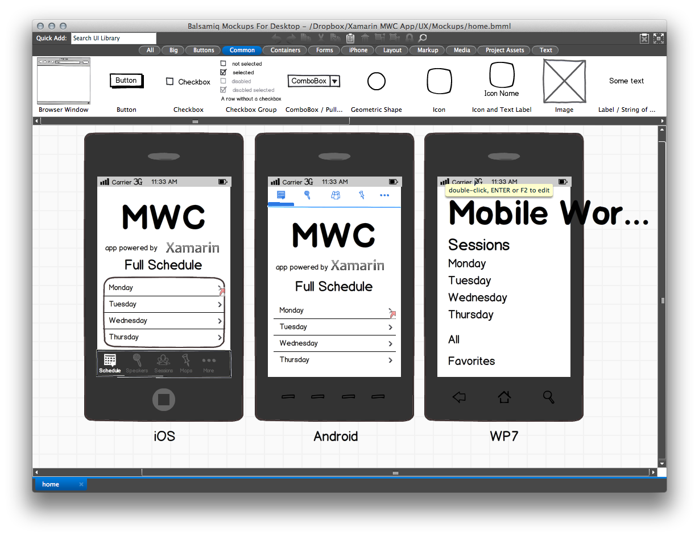
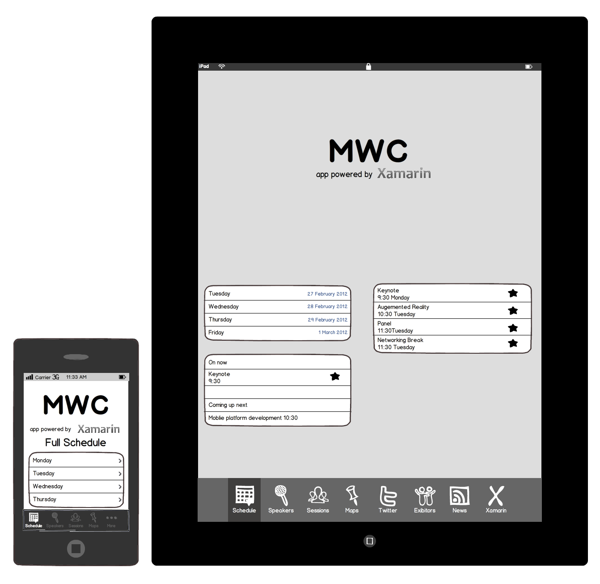
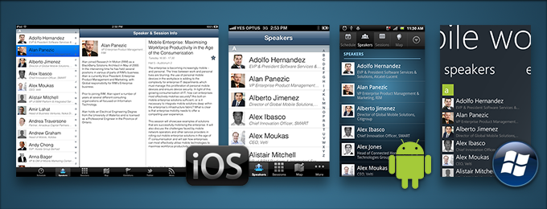

# Mobile software development lifecycle

Building mobile applications can be as easy as opening up Visual Studio, throwing
something together, doing a quick bit of testing, and submitting to an App Store
– all done in an afternoon. Or it can be an extremely involved process that
involves rigorous up-front design, usability testing, QA testing on thousands of
devices, a full beta lifecycle, and then deployment a number of different
ways.

In this document, we’re going to take a thorough introductory examination
of building mobile applications, including:

1. **Process** – The process of software development is called the Software Development Lifecycle (SDLC). We’ll examine all phases of the SDLC with respect to mobile application development, including: Inception, Design, Development, Stabilization, Deployment, and Maintenance.
1. **Considerations** – There are a number of considerations when building mobile applications, especially in contrast to traditional web or desktop applications. We’ll examine these considerations and how they affect mobile development.

This document is intended to answer fundamental questions about mobile app
development, for new and experienced application developers alike. It takes a
fairly comprehensive approach to introducing most of the concepts you’ll run
into during the entire Software Development Lifecycle (SDLC). However, this
document may not be for everyone, if you’re itching to just start building
applications, we recommend jumping ahead to the [Introduction to Mobile Development](~/cross-platform/get-started/introduction-to-mobile-development.md) guide and then coming back to this document later.

## Mobile development software lifecycle

The lifecycle of mobile development is largely no different than the SDLC for
web or desktop applications. As with those, there are usually 5 major portions
of the process:

1. **Inception** – All apps start with an idea. That idea is usually refined into a solid basis for an application.
1. **Design** – The design phase consists of defining the app’s User Experience (UX) such as what the general layout is, how it works, etc., as well as turning that UX into a proper User Interface (UI) design, usually with the help of a graphic designer.
1. **Development** – Usually the most resource intensive phase, this is the actual building of the application.
1. **Stabilization** – When development is far enough along, QA usually begins to test the application and bugs are fixed. Often times an application will go into a limited beta phase in which a wider user audience is given a chance to use it and provide feedback and inform changes.
1. **Deployment**

Often many of these pieces are overlapped, for example, it’s common for
development to be going on while the UI is being finalized, and it may even
inform the UI design. Additionally, an application may be going into a
stabilization phase at the same that new features are being added to a new
version.

Furthermore, these phases can be used in any number of SDLC methodologies
such as Agile, Spiral, Waterfall, etc.

Each of the these phases will be explained in more detail by the following sections.

### Inception

The ubiquity and level of interaction people have with mobile devices means
that nearly everyone has an idea for a mobile app. Mobile devices open up a
whole new way to interact with computing, the web, and even corporate
infrastructure.

The inception stage is all about defining and refining the idea for an app.
To create a successful app, it’s important to ask some fundamental
questions. Here are some things to consider before publishing an app in one of the public App Stores:

- **Competitive Advantage** – Are there similar apps out there already? If so, how does this application differentiate from others?

For apps that will be distributed in an Enterprise:

- **Infrastructure Integration** – What existing infrastructure will it integrate with or extend?

Additionally, apps should be evaluated in the context of the mobile form factor:

- **Value** – What value does this app bring users? How will they use it?
- **Form/Mobility** – How will this app work in a mobile form factor? How can I add value using mobile technologies such as location awareness, the camera, etc.?

To help with designing the functionality of an app, it can be useful to
define Actors and [Use Cases](https://en.wikipedia.org/wiki/Use_case). Actors are roles within
an application and are often users. Use cases are typically actions or
intents.

For instance, a task tracking application might have two Actors: *User* and *Friend*. A User might *Create a Task*, and *Share a Task* with a Friend. In this case, creating a
task and sharing a task are two distinct use cases that, in tandem with the
Actors, will inform what screens you’ll need to build, as well as what
business entities and logic will need to be developed.

Once an appropriate number of use cases and actors has been captured, it’s much easier
to begin designing an application. Development can then focus on how to create the app, rather than what the app is or should do.

### Designing mobile applications

Once the features and functionality of the app have been determined, the next step is
start trying to solve the User Experience or UX.

#### UX design

UX is usually done via wireframes or mockups using one of the many [design toolkits](/windows/uwp/design/downloads/). UX mockups allow the UX to be designed without having to worry
about the actual UI design:

 

When creating UX mockups, it’s important to consider the interface
guidelines for the various platforms that the app will target. The app should "feel at home" on each platform. The official design guidelines for each platform are:

1. **Apple** -  [Human Interface Guidelines](https://developer.apple.com/ios/human-interface-guidelines/overview/themes/)
1. **Android** –  [Design Guidelines](https://developer.android.com/design/index.html)
1. **UWP** –  [UWP Design basics](/windows/uwp/design/basics/)

For example, each app has a metaphor for switching between sections in an
application. iOS uses a tab bar at the bottom of the screen, Android uses a tab bar at the top of the screen, and UWP uses the [Pivot or tab](/windows/uwp/design/controls-and-patterns/pivot) view.

Additionally, the hardware itself also dictates UX decisions. For example,
iOS devices have no physical *back* button, and therefore introduce the
Navigation Controller metaphor:

 

Furthermore, form factor also influences UX decisions. A tablet has far more
real estate, and so can display more information. Often what needs multiple screens on a phone is compressed into one for a tablet:

 

And due to the myriad of form factors out there, there are often mid-size
form factors (somewhere between a phone and a tablet) that you may also want to
target.

#### User interface (UI) design

Once the UX is determined, the next step is to
create the UI design. While UX is typically just black and white mockups, the UI
Design phase is where colors, graphics, etc., are introduced and finalized. Spending time
on good UI design is important and generally, the most popular apps have a
professional design.

As with UX, it’s important to understand that each platform has it’s own
design language, so a well-designed application may still look different on each platform:

 

### Development

The development phase usually starts very early. In fact, once an idea has
some maturation in the conceptual/inspiration phase, often a working prototype
is developed that validates functionality, assumptions, and helps to give an
understanding of the scope of the work.

In the rest of the tutorials, we’ll focus largely on the development
phase.

### Stabilization

Stabilization is the process of working out the bugs in your app. Not just
from a functional standpoint, e.g.: “It crashes when I click this button,”
but also Usability and Performance. It’s best to start stabilization very
early within the development process so that course corrections can occur before
they become costly. Typically, applications go into *Prototype*, *Alpha*, *Beta*, and *Release Candidate* stages. Different
people define these differently, but they generally follow the following
pattern:

1. **Prototype** – The app is still in proof-of-concept phase and only core functionality, or specific parts of the application are working. Major bugs are present.
1. **Alpha** – Core functionality is generally code-complete (built, but not fully tested). Major bugs are still present, outlying functionality may still not be present.
1. **Beta** – Most functionality is now complete and has had at least light testing and bug fixing. Major known issues may still be present.
1. **Release Candidate** – All functionality is complete and tested. Barring new bugs, the app is a candidate for release to the wild.

It’s never too early to begin testing an application. For example, if a
major issue is found in the prototype stage, the UX of the app can still be
modified to accommodate it. If a performance issue is found in the alpha stage,
it’s early enough to modify the architecture before a lot of code has been
built on top of false assumptions.

Typically, as an application moves further along in the lifecycle, it’s
opened to more people to try it out, test it, provide feedback, etc. For
instance, prototype applications may only be shown or made available to key
stakeholders, whereas release candidate applications may be distributed to
customers that sign up for early access.

For early testing and deployment to relatively few devices, usually deploying
straight from a development machine is sufficient. However, as the audience
widens, this can quickly become cumbersome. As such, there are a number of test
deployment options out there that make this process much easier by allowing you
to invite people to a testing pool, release builds over the web, and provide
tools that allow for user feedback.

For testing and deployment, you can use [App Center](https://appcenter.ms/) to continuously build, test, release, and monitor apps.

### Distribution

Once the application has been stabilized, it’s time to get it out into the
wild. There are a number of different distribution options, depending on the
platform.

#### iOS

Xamarin.iOS and Objective-C apps are distributed in exactly the same way:

1. **Apple App Store** – Apple’s App Store is a globally available online application repository that is built into Mac OS X via iTunes. It’s by far the most popular distribution method for applications and it allows developers to market and distribute their apps online with very little effort.
1. **In-House Deployment** – In-House deployment is meant for internal distribution of corporate applications that aren’t available publicly via the App Store.
1. **Ad-Hoc Deployment** – Ad-hoc deployment is intended primarily for development and testing and allows you to deploy to a limited number of properly provisioned devices. When you deploy to a device via Xcode or Visual Studio for Mac, it is known as ad-hoc deployment.

#### Android

All Android applications must be signed before being distributed. Developers
sign their applications by using their own certificate protected by a private
key. This certificate can provide a chain of authenticity that ties an
application developer to the applications that developer has built and released.
It must be noted that while a development certificate for Android can be signed
by a recognized certificate authority, most developers do not opt to utilize
these services, and self-sign their certificates. The main purpose for
certificates is to differentiate between different developers and applications.
Android uses this information to assist with enforcement of delegation of
permissions between applications and components running within the Android
OS.

Unlike other popular mobile platforms, Android takes a very open approach to
app distribution. Devices are not locked to a single, approved app store.
Instead, anyone is free to create an app store, and most Android phones allow
apps to be installed from these third party stores.

This allows developers a potentially larger yet more complex distribution
channel for their applications. [Google Play](https://play.google.com/store?hl=en) is Google’s official app store, but there are
many others. A few popular ones are:

1. [AppBrain](https://www.appbrain.com/)
1. [Amazon App Store for Android](https://www.amazon.com/mobile-apps/b?ie=UTF8&amp;node=2350149011)
1. [Handango](https://www.handango.com/)
1. [GetJar](https://www.getjar.com/)

#### UWP

UWP applications are distributed to users via the Microsoft Store. Developers submit their apps for approval, after which they appear in the Store. For more information on publishing Windows apps, see UWP's [Publish](/windows/uwp/publish/) documentation.

## Mobile development considerations

While developing mobile applications isn’t fundamentally different that
traditional web/desktop development in terms of process or architecture, there
are some considerations to be aware of.

### Common considerations

#### Multitasking

There are two significant challenges to multitasking (having multiple
applications running at once) on a mobile device. First, given the limited
screen real estate, it is difficult to display multiple applications
simultaneously. Therefore, on mobile devices only one app can be in the
foreground at one time. Second, having multiple applications open and performing
tasks can quickly use up battery power.

Each platform handles multitasking differently, which we’ll explore in a
bit.

#### Form factor

Mobile devices generally fall into two categories, phones and tablets, with a
few crossover devices in between. Developing for these form factors is generally
very similar, however, designing applications for them can be very different.
Phones have very limited screen space, and tablets, while bigger, are still
mobile devices with less screen space than even most laptops. Because of this,
mobile platform UI controls have been designed specifically to be effective on
smaller form factors.

#### Device and operating system fragmentation

It’s important to take into account different devices throughout the entire
software development lifecycle:

1. **Conceptualization and Planning** – Keep in mind that hardware and features will vary from device to device, an application that relies on certain features may not work properly on certain devices. For example, not all devices have cameras, so if you’re building a video messaging application, some devices may be able to play videos, but not take them.
1. **Design** – When designing an application’s User Experience (UX), pay attention to the different screen ratios and sizes across devices. Additionally, when designing an application’s User Interface (UI), different screen resolutions should be considered.
1. **Development** – When using a feature from code, the presence of that feature should always be tested first. For example, before using a device feature, such as a camera, always query the OS for the presence of that feature first. Then, when initializing the feature/device, make sure to request currently supported from the OS about that device and then use those configuration settings.
1. **Testing** – It’s incredibly important to test the application early and often on actual devices. Even devices with the same hardware specs can vary widely in their behavior.

#### Limited resources

Mobile devices get more and more powerful all the time, but they are still
mobile devices that have limited capabilities in comparison to desktop or
notebook computers. For instance, desktop developers generally don’t worry
about memory capacities; they’re used to having both physical and virtual
memory in copious quantities, whereas on mobile devices you can quickly consume
all available memory just by loading a handful of high-quality pictures.

Additionally, processor-intensive applications such as games or text
recognition can really tax the mobile CPU and adversely affect device
performance.

Because of considerations like these, it’s important to code smartly and to
deploy early and often to actual devices to validate
responsiveness.

### iOS considerations

#### Multitasking

Multitasking is very tightly controlled in iOS, and there are a number of
rules and behaviors that your application must conform to when another
application comes to the foreground, otherwise your application will be
terminated by iOS.

#### Device-specific resources

Within a particular form factor, hardware can vary greatly between different
models. For instance, some devices have a rear-facing camera, some also have a
front-facing camera, and some have none.

Some older devices (iPhone 3G and older) don’t even allow multitasking.

Because of these differences between device models, it’s important to check
for the presence of a feature before attempting to use it.

#### OS specific constraints

To make sure that applications are responsive and secure, iOS
enforces a number of rules that applications must abide by. In addition to the
rules regarding multitasking, there are a number of event methods out of which
your app must return in a certain amount of time, otherwise it will get
terminated by iOS.

Also worth noting, apps run in what’s known as a Sandbox, an environment
that enforces security constraints that restrict what your app can access. For
instance, an app can read from and write to its own directory, but if it
attempts to write to another app directory, it will be terminated.

### Android considerations

#### Multitasking

Multitasking in Android has two components; the first is the activity
lifecycle. Each screen in an Android application is represented by an Activity,
and there is a specific set of events that occur when an application is placed
in the background or comes to the foreground. Applications must adhere to this
lifecycle to create responsive, well-behaved applications. For more
information, see the [Activity Lifecycle](~/android/app-fundamentals/activity-lifecycle/index.md) guide.

The second component to multitasking in Android is the use of Services.
Services are long-running processes that exist independent of an application and
are used to execute processes while the application is in the background. For
more information see the [Creating Services](~/android/app-fundamentals/services/index.md)
guide.

#### Many devices and many form factors

Google doesn’t impose any limits on which devices can run the Android OS. This
open paradigm results in a product environment populated by a myriad of
different devices with very different hardware, screen resolutions and ratios,
device features, and capabilities.

Because of the extreme fragmentation of Android devices, most people choose
the most popular 5 or 6 devices to design and test for, and prioritize
those.

#### Security considerations

Applications in the Android OS all run under a distinct, isolated identity
with limited permissions. By default, applications can do very little. For
example, without special permissions, an application cannot send a text message,
determine the phone state, or even access the Internet! To access these
features, applications must specify in their application manifest file which
permissions they would like, and when they’re being installed; the OS reads
those permissions, notifies the user that the application is requesting those
permissions, and then allows the user to continue or cancel the installation.
This is an essential step in the Android distribution model, because of the open
application store model, since applications are not curated the way they are for
iOS, for instance. For a list of application permissions, see the [Manifest Permissions](https://developer.android.com/reference/android/Manifest.permission.html) reference article in the Android Documentation.

### Windows considerations

#### Multitasking

Multitasking in UWP has two parts: the lifecycle for pages and
applications, and background processes. Each screen in an application is an
instance of a Page class, which has events associated with being made active or
inactive (with special rules for handling the inactive state, or being
“tombstoned”).

The second part is providing background agents for processing tasks even when
the application is not running in the foreground.

#### Device capabilities

Although UWP hardware is fairly homogeneous, there are still components that are optional
and therefore require special considering while coding. Optional hardware
capabilities include the camera, compass, and gyroscope. There is also a special
class of low-memory (256MB) that requires special consideration, or developers
can opt-out of low-memory support.

#### Security considerations

For information on important security considerations in UWP, refer to the [Security](/windows/uwp/security/) documentation.

## Summary

This guide gave an introduction to the SDLC as it relates to mobile
development. It introduced general considerations for building mobile
applications and examined a number of platform-specific considerations including
design, testing, and deployment.

## Next steps

- [What is Xamarin?](~/cross-platform/get-started/introduction-to-mobile-development.md)
- [Get started with Xamarin](~/get-started/index.yml)
- [Sharing code across platforms](~/cross-platform/app-fundamentals/index.md)