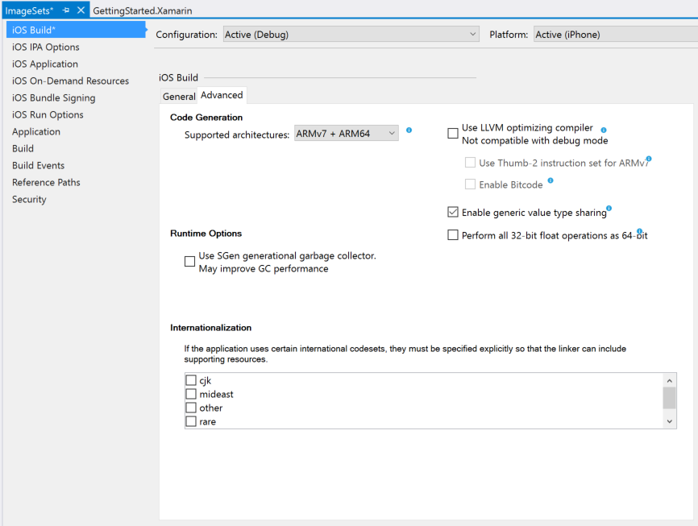
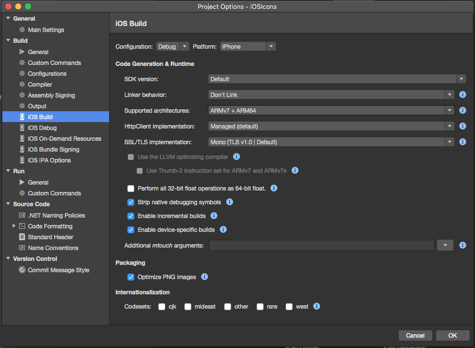
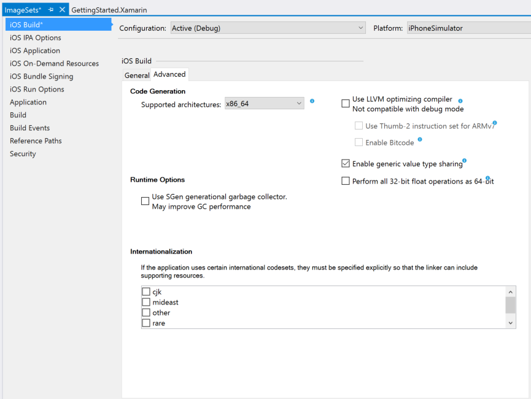
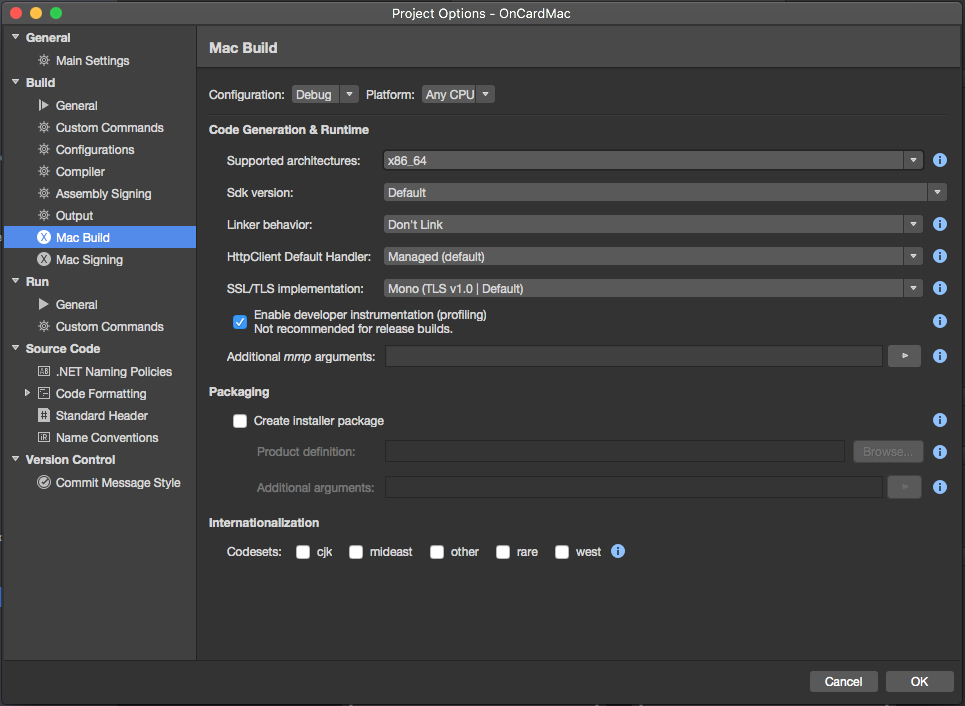

# 32/64 bit Platform Considerations

_Considerations in choosing 32-bit and 64-bit modes for your application_

Apple operating systems support running code on 32 and 64
	bit modes depending on the host hardware.   There are some
	differences that developers need to be aware of when choosing
	these platforms.

The frameworks `XamMac.dll` on Mac
	and `monotouch.dll` on iOS only run on 32-bit modes
	regardless of the host processor.

The new `Xamarin.iOS`
	and `Xamarin.Mac` frameworks can build software for
	32-bits, 32-bit and 64-bits or 64-bit modes.

<a name="ios" />

# iOS

Traditionally, iOS was primarily a 32 bit platform, however, all modern iOS devices support 64 bit instructions and address spaces.   The 64 bit support for iOS not only brings a larger address space, but also performance improvements based on a newly designed instruction set as well as a cleaner and modern ABI.

The new libraries allow developers to choose what kind of applications they want to produce. 
All iOS frameworks pre iOS 11 were available on both 32-bit and 64-bit modes. However, with the introduction of iOS 11, Apple no longer support 32-bit apps and they will fail to launch on that operating system.

<a name="enable-64" />

## Enabling 64-Bit Builds of Xamarin.iOS Apps

For a Xamarin.iOS mobile application that has been converted to the Unified API, the developer still needs to enable the building of the application for 64 bit machines from the app's Options. 

> [!WARNING]
> **NOTE:** This section is included for historic reasons only and to help move older Xamarin.iOS projects to the modern APIs and 64 bits. All new Xamarin.iOS projects will use the Unified APIs and 64 bits by default.

Do the following:

1. In the **Solution Explorer** double-click the App's **Project File** to display it's **Options**.
2. Select **iOS Build** > **Advanced Tab**.
3. In the **Supported architectures** dropdown select either **x86\_64** or **i386 + x86\_64** for the iOS Simulator: 

	[[ide name="xs"]]
	
	

	[[/ide]]

	[[ide name="vs"]]

	

	[[/ide]]

4. For real iOS hardware, select one of the available **ARM64** combinations to support 64 bits: 

	[[ide name="xs"]]
	
	
	
	[[/ide]]

	[[ide name="vs"]]
	
	
	
	[[/ide]]
	
5. Click the **OK** button to save your changes and close the Options dialog box.
6. Do a clean build of the application.

ARMv7s is the latest architecture supported only by the A6 processor included in the iPhone 5 (or greater). ARMv7 code is faster and smaller than the ARMv6 but only works with the iPhone 3GS and later, but is _required_ by Apple when targeting the iPad or a minimum iOS version of 5.0. ARMv6 works on all devices but is no longer supported by the compiler shipped with Xcode 4.5 and later. 
ARM64 is required to support iOS 8 on iPhone 6 or other 64 bit devices and will be _required_ by Apple when submitting new or updating exiting applications in the iTunes App Store.

### 64 Bit and Binary Size Increases

One of the primary benefits of the Unified API is its compatibility with both 32-bit AND 64-bit systems. During Apple's transition period between the two systems, it is important for apps to be able to run on an iPhone 5 and an iPhone 6, so the apps that are bundled with the Unified API contain both a 32-bit version and a 64-bit version.

Because your application's distributable now includes both a 32 bit and a 64 bit version of your executable, a signification size increase is to be expected. Including multiple architectures doubles the size of the executable, but allows for newer devices to use better optimized code while still supporting older devices.

> [!IMPORTANT]
> **NOTE:** If you receive the following message when submitting an iOS application to the iTunes App Store, _"WARNING ITMS-9000: Missing 64-bit support. Starting February 1, 2015, new iOS apps uploaded to the App Store must include 64-bit support and be built with the iOS 8 SDK, included in Xcode 6 or later. To enable 64-bit in your project, we recommend using the default Xcode build setting of “Standard architectures” to build a single binary with both 32-bit and 64-bit code."_ You need to switch the supported architectures to one of the available **ARM64** combination (as shown above), recompile and resubmit.

# Mac

Most modern Mac computers support both 32 bit and 64 bit
	applications.   MacOS 10.6 (Snow Leopard) was the last
	operating system to run on 32-bit systems.   Most Macs
	released since 2010 support both systems.

Unlike iOS, many of the new frameworks introduced in recent
	versions of MacOS are only supported in 64 bit mode (CloudKit,
	EventKit, GameController, LocalAuthentication, MediaLibrary,
	MultipeerConnectivity, NotificationCenter, GLKit, SpriteKit,
	Social, MapKit among others).

The Unified API allow developers to choose what kind of
	applications they want to produce.   32-bit only, 32 and
	64-bit and 64-bit only.

 **32-bit only applications** will run on both 32 bit and
	64 bit Mac computers, have an address space limited to 32
	bits, and requires that all libraries are 32 bits.

You will typically use this mode if you have 32-bit
	dependencies that do not run on 64-bit mode, if you want to
	have a smaller download, or if there are no performance
	benefits in moving to 64 bits.

This mode is limiting as you wont be able to use many
	frameworks available in MacOS Mavericks and MacOS Yosemite.

 **32 and 64 bit applications** will bundle builds done with 32
	bit code and 64 bit code.   Then the operating system will
	choose which code to execute depending on the device it is
	running on.

You would use this mode if all your code is 32 and 64 bit
	ready and you want to take advantage of either the larger
	address space in 64-bit platforms or want to benefit from the
	added performance that the ARM 64 ABI and instruction set
	bring.

While your code will compile and run, you wont be able to
	take advantage of any of the 64-bit only frameworks.

 **64-bit only applications** will only run on 64-bit iOS
	devices.

For Mac, this is the preferred mode of operation as most
	Macs in use today support 64 bit mode and you have access to
	the complete set of frameworks provided by Apple.
	
## Enabling 64 Bit Builds of Xamarin.Mac Apps

For a Xamarin.Mac application that has been converted to the Unified API, the developer still needs to enable the building of the application for 64 bit machines from the app's Options. 

Do the following:

1. In the **Solution Explorer** double-click the App's **Project File** to display it's **Options**.
2. Select **Mac Build**.
3. In the **Supported architectures** dropdown select **x86\_64**: 

	
4. Click the **OK** button to save your changes and close the Options dialog box.
5. Do a clean build of the application.

**x86\_64** is recommended and works on all versions of Mac OS X that Xamarin.Mac supports (10.6 and newer). Choose this architecture unless there is an explicit reason to choose otherwise (such as supporting 32 bit machines or libraries). **i386** will run the application in 32 bit mode and should only be used if the application requires 32 bit support (such as linking against or calling a 32 bit only library).

## Select the Correct Target Framework

There are two supported Target Framework types that can be selected when using the Unified API in a Xamarin.Mac application:

- **Xamarin.Mac Mobile Framework** - This is the same tuned .NET framework used by Xamarin.iOS and Xamarin.Android supporting a subset of the full **Desktop** framework. This is the recommended framework because it provides smaller average binaries due to superior linking behavior.
- **Xamarin.Mac .NET 4.5 Framework** - This framework is again, a subset of the **Desktop** framework. However, it trims off far less of the full **Desktop** framework than the **Mobile** framework and should _"just work"_ with most NuGet Packages or 3rd party libraries. This allows the developer to consume standard **Desktop** assemblies while still using a supported framework, but this option produces larger application bundles. This is the recommended framework where 3rd party .NET assemblies are being used that are not compatible with the **Xamarin.Mac Mobile Framework**. For a list of supported assemblies, please see our [Assemblies](~/cross-platform/internals/available-assemblies.md) documentation.

For detailed information on Target Frameworks and the implications of selecting a specific target for your Xamarin.Mac application, please see our [Target Frameworks](~/mac/platform/target-framework.md) documentation.

## Related Links

- [Classic vs Unified API differences](https://developer.xamarin.com/releases/ios/api_changes/classic-vs-unified-8.6.0/)
