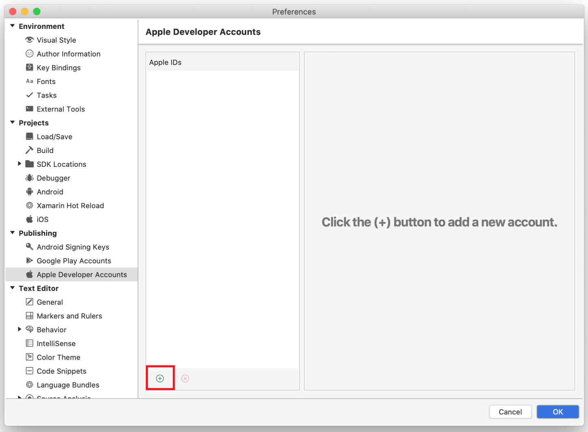
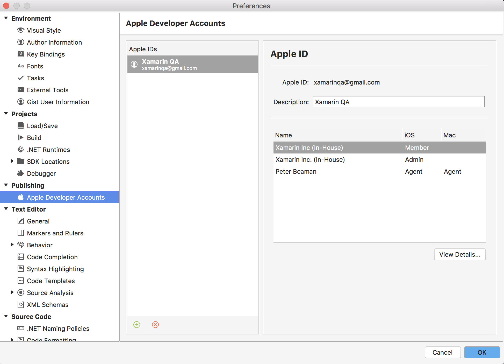
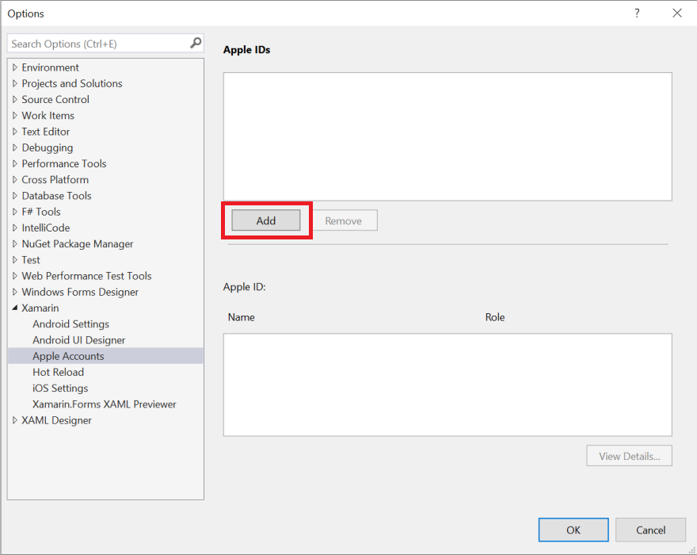
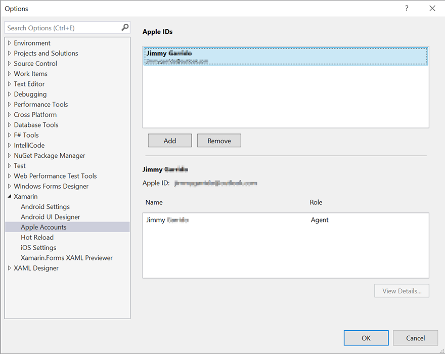

# Apple Account Management

The Apple account management interface in Visual Studio provides a way to view information for development teams associated with an Apple ID. It allows you to do the following:

- **Add Apple developer accounts**
- **View signing certificates and provisioning profiles**
- **Create new signing certificates**
- **Download existing provisioning profiles**

> [!IMPORTANT]
> Xamarin's tools for Apple account management only display information
> about paid Apple developer accounts. To learn how to test an app on a
> device without a paid Apple developer account, please see the
> [Free provisioning for Xamarin.iOS apps](~/ios/get-started/installation/device-provisioning/free-provisioning.md) guide.

## Requirements

Apple account management is available on Visual Studio for Mac, Visual Studio 2019, and Visual Studio 2017 (Version 15.7 and higher). You must also have a paid Apple Developer account to use this feature. More information on Apple developer accounts is available in the [Device Provisioning](~/ios/get-started/installation/device-provisioning/index.md) guide.

> [!NOTE]
> Before you begin, be sure to first accept any user license agreements in the [Apple Developer portal](https://developer.apple.com/account/).

## Add an Apple developer account

# [Visual Studio for Mac](#tab/macos)

1. Go to **Visual Studio > Preferences > Apple Developer Account** and click the **+** button to open the sign in dialog:

    

2. Enter your Apple ID and password then click **Sign In**. This will save your credentials in the secure Keychain on this machine.

3. Select **Always Allow** on the alert dialog to allow Visual Studio to use your credentials:

    

4. Once your account has been added successfully, you will see your Apple ID and any teams that your Apple ID is part of:

    

# [Visual Studio](#tab/windows)

> [!NOTE]
> If you are using Visual Studio 2017 or Visual Studio 2019 (version 16.4 and older), you will need to be [Paired to a Mac build host](~/ios/get-started/installation/windows/connecting-to-mac/index.md) before proceeding.

1. Go to **Tools > Options > Xamarin > Apple Accounts** and click on **Add**:

    

2. Enter your Apple ID and password then click **Login**.

3. Once your account has been added successfully, you'll see your Apple ID and any teams that your Apple ID is part of:

    

-----

## View signing certificates and provisioning profiles

Select a team and click on **View Details…** to open a dialog that displays a list of signing identities and provisioning profiles that are installed on your machine.

The team details dialog displays a list of Signing Identities, organized by type. The **Status** column advises you if the certificate is:

- **Valid** – The signing identity (both the certificate and the private key) is installed on your machine and it has not expired.

- **Not in Keychain** – There is a valid signing identity on Apple's server. To install this on your machine, it must be exported from another machine. You cannot download the signing identity from the Apple Developer Portal as it will not contain the private key.

- **Private key is missing** – A Certificate with no private key is installed in the keychain.

- **Expired** – The Certificate is expired. You should remove this from your keychain.

  

## Create a signing certificate

To create a new signing identity, click **Create Certificate** to open the drop-down menu and select the [certificate type](https://help.apple.com/xcode/mac/current/#/dev80c6204ec) that you want to create. If you have the correct permissions a new signing identity will appear after a few seconds.

If an option in the drop-down is greyed out and unselected, it means that you do not have the correct team permissions to create this type of certificate.

## Download provisioning profiles

The team details dialog also displays a list of all provisioning profiles connected to your developer account. You can download all provisioning profiles to your local machine by clicking **Download all Profiles**.

## Troubleshoot

- It may take several hours for a new Apple developer account to be approved. You will not be able to enable automatic provisioning until the account has been approved.

- If adding an Apple developer accounts fails with the message `Authentication Error: Xcode 7.3 or later is required to continue developing with your Apple ID.`, make sure that the Apple ID you are using has an active paid membership to the Apple Developer Program. To use a paid Apple developer account, please see the [Free provisioning for Xamarin.iOS apps](~/ios/get-started/installation/device-provisioning/free-provisioning.md) guide.

- If attempting to create a new signing certificate fails with the error `You have reached the limit for certificates of this type`, then the maximum number of certificates allowed have been generated. To fix this, browse to the [Apple Developer Center](https://developer.apple.com/account/ios/certificate/distribution) and revoke one of the Production Certificates.

- If you are experiencing issues logging in your account on Visual Studio for Mac, a possible fix is to open the Keychain application and under **Category** select **Passwords**. Search for `deliver.` and delete all entries that are found.

- If your signing certificate is revoked, it can be removed from the following path on Windows: `C:\Users\<user>\AppData\Local\Xamarin\iOS\Provisioning\Certificates`.

## Known Issues

- Distribution provisioning profiles by default will target App Store. In House or Ad Hoc profiles should be created manually.
