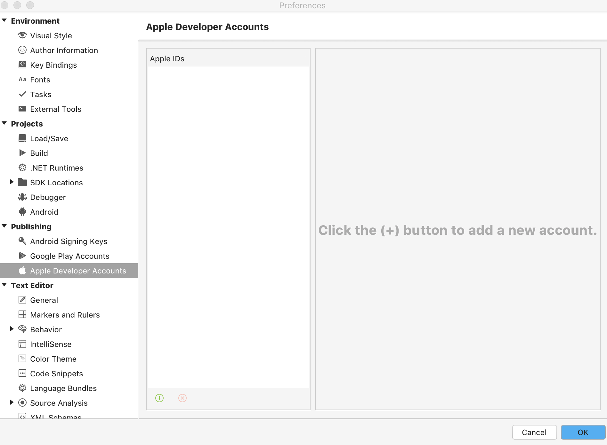
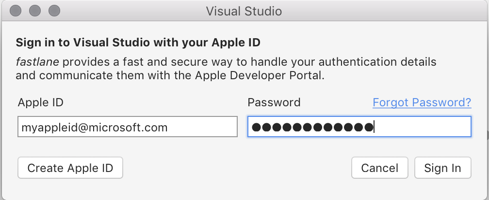
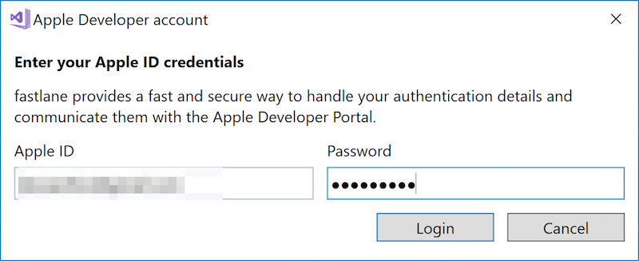
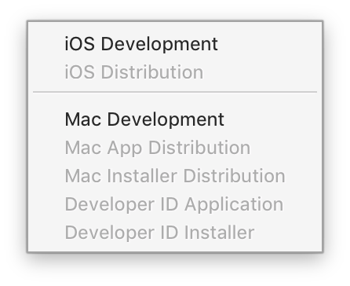
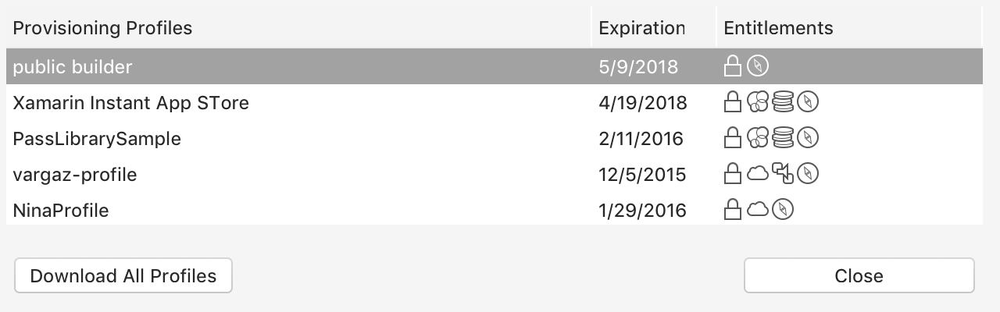
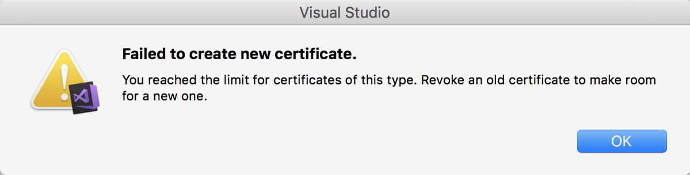

# Apple Account Management

The Apple account management interface provides a way to view all development teams associated with an Apple ID. It also allows you to view more details about each team by displaying a list of _Signing Identities_ and _Provisioning Profiles_ that are installed on your machine.

Authentication of your Apple ID is performed on the command line with [fastlane](https://fastlane.tools/). fastlane must be installed on your machine for you to be successfully authenticated. More information on fastlane and how to install it is detailed in the [fastlane](~/ios/deploy-test/provisioning/fastlane/index.md) guides.

The Apple Account dialog allows you to do the following:

* **Create and Manage Certificates**
* **Create and Manage Provisioning Profiles**

Information on how to do this is described in this guide.

> [!NOTE]
> Xamarin's tools for Apple account management only display information
> about paid Apple developer accounts. To learn how to test an app on a
> device without a paid Apple developer account, please see the
> [Free provisioning for Xamarin.iOS apps](~/ios/get-started/installation/device-provisioning/free-provisioning.md) guide.

You can also use the iOS Automatic Provisioning tools to automatically create and manage your Signing Identities, App IDs, and Provisioning Profiles. For more information on using these features, refer to the [Device Provisioning](~/ios/get-started/installation/device-provisioning/index.md) guide.

## Requirements

Apple account management is available on Visual Studio for Mac and Visual Studio 2017 (Version 15.7 and higher)

You must have an Apple Developer account to use this feature. More information on Apple developer accounts is available in the [Device Provisioning](~/ios/get-started/installation/device-provisioning/index.md) guide.

- Ensure you are connected to the internet. This is because fastlane communicates directly with the Apple Developer portal.
- Ensure you have [fastlane tools installed](~/ios/deploy-test/provisioning/fastlane/index.md#Installation).
- Ensure you have the latest fastlane tools from [https://download.fastlane.tools](https://download.fastlane.tools).
- Before you begin, make sure to accept any user license agreements in the [developer portal](https://developer.apple.com/account/).

## Adding an Apple developer account

# [Visual Studio for Mac](#tab/macos)

1. To open the account management dialog go to **Visual Studio > Preferences > Apple Developer Account**:

    

2. Press the **+** button to display the sign in dialog, as depicted below: 

    

4. Enter your Apple ID and Password and click the **Sign In** button. This will save your credentials in the secure Keychain on this machine. [fastlane](~/ios/deploy-test/provisioning/fastlane/index.md) is used to handle your credentials securely and pass them to Apple's developer portal.
 
5. Select **Always Allow** on the alert dialog to allow Visual Studio to use your credentials :

    

6. Once your account has been added successfully, you'll see your Apple ID and any teams that your Apple ID is part of.

    

7. Select any team and press the **View Details…** button. This will display a list of all Signing Identities and Provisioning Profiles that are installed on your machine:

    

# [Visual Studio](#tab/windows)

1. Before you begin adding your Apple ID to Visual Studio 2017, make sure that your development environment is [Paired to a Mac build host](~/ios/get-started/installation/windows/connecting-to-mac/index.md).

1. To open the account management window, go to **Tools > Options > Xamarin > Apple Accounts**:

    

1. Select the **Add** button and enter your Apple ID and password:

    

1. Once your account has been added successfully, you'll see your Apple ID and any teams that your Apple ID is part of.
 
1. Select any team and press the **View Details…** button. This will display a list of all Signing Identities and Provisioning Profiles that are installed on your machine:

    

-----

## Managing Signing Identities and Provisioning Profiles

The team details dialog displays a list of Signing Identities, organized by type. The **Status** column advises you if the certificate is: 

* **Valid** – The signing identity (both the certificate and the private key) is installed on your machine and it has not expired.

* **Not in Keychain** – There is a valid signing identity on Apple's server. To install this on your machine, it must be exported from another machine. You cannot download the signing identity from the Apple Developer Portal as it will not contain the private key.

* **Private key is missing** – A Certificate with no private key is installed in the keychain.

* **Expired** – The Certificate is expired. You should remove this from your keychain.

  

## Create a Signing Identities

To create a new signing identity, select the **Create  Certificate** drop-down button and select the type that you require. If you have the correct permissions a new signing identity will appear after a few seconds.

If an option in the drop-down is greyed out and unselected, it means that you do not have the correct team permissions to create this type of certificate.

# [Visual Studio for Mac](#tab/macos)

# [Visual Studio](#tab/windows)

-----

## Download Provisioning Profiles

The team details dialog also displays a list of all provisioning profiles connected to your developer account. You can download all provisioning profiles to your local machine by pressing the **Download all Profiles** button

# [Visual Studio for Mac](#tab/macos)

# [Visual Studio](#tab/windows)

-----

## iOS Bundle Signing

For information on deploying your app to a device, refer to the [device provisioning](~/ios/get-started/installation/device-provisioning/index.md) guide.

## Troubleshooting

### View Details dialog is empty

This is currently a known issue, relating to bug [#53906](https://bugzilla.xamarin.com/show_bug.cgi?id=53906). Make sure that you are using the latest stable version of Visual Studio for Mac

### If you are experiencing issues logging in your account, please try the following:

* Open the keychain application and under Category select *Passwords*. Search for `deliver.`, and delete all entries.

### "Error Adding Account. Please Sign in with an app-specific password"

This is because 2 factor authentication is enabled on your account. Make sure that you are using the latest stable version of Visual Studio for Mac

### Failed to create new certificate
"You have reached the limit for certificates of this type"

The maximum number of certificates allowed have been generated. To fix this, browse to the [Apple Developer Center](https://developer.apple.com/account/ios/certificate/distribution) and revoke one of the Production Certificates.

## Known Issues

* Distribution provisioning profiles by default will target App Store. In House or Ad Hoc profiles should be created manually.
