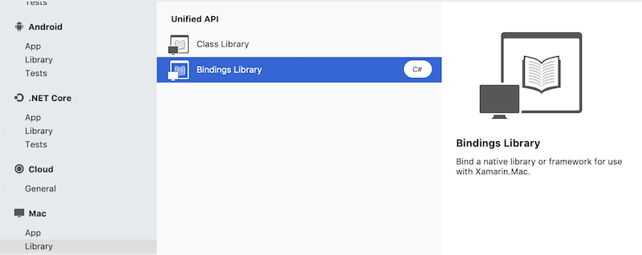

# Binding Objective-C

This section includes a variety of documents that cover
    creating bindings to Objective-C libraries, so they can be
    called from C# applications created with Xamarin.iOS or Xamarin.Mac.

## [Overview](~/cross-platform/macios/binding/overview.md)

This document contains some of the internals of how a
    binding takes place. It is an advanced document with some
    technical information.

## [Binding Objective-C Libraries](~/cross-platform/macios/binding/objective-c-libraries.md)

This document describes the process used to create C#
    bindings of Objective-C APIs and how the idioms in Objective-C
    are mapped to the idioms used in .NET.
    If you are binding just C APIs, you should use the standard
    .NET mechanism for this, the P/Invoke framework.

## [Binding Definition Reference Guide](~/cross-platform/macios/binding/binding-types-reference.md)

This is the reference guide that describes all of the
    attributes available to binding authors to drive the binding
    generation process.

## [Objective Sharpie](~/cross-platform/macios/binding/objective-sharpie/index.md)

Objective Sharpie is a command line tool to help bootstrap the first pass of a
binding. It works by parsing the header files of a native library to map the
public API into the [binding definition](~/cross-platform/macios/binding/objective-c-libraries.md)
(a process that can also be done manually).

## iOS

The [iOS binding page](~/ios/platform/binding-objective-c/index.md) links
back to these common binding resources, in addition to the examples below.

### [Walkthrough: Binding an Objective-C Library](~/ios/platform/binding-objective-c/walkthrough.md)

This article provides a step-by-step walkthrough of creating a binding project using the open source [InfColorPicker](https://github.com/InfinitApps/InfColorPicker) Objective-C project as an example. The InfColorPicker library provides a reusable view controller that allow the user to select a color based on its HSB representation, making color selection more user-friendly. Objective Sharpie will be used to assist in the binding process.

### [Binding Samples](https://github.com/mono/monotouch-bindings)

A collection of third-party bindings that can be used as reference when creating new Binding Projects.

## Mac

Follow the [Mac binding](~/mac/platform/binding.md) instructions to bind macOS libraries. You can create a new **Mac Bindings Library** from the **New Project** window:

## Related Links

- [iOS Binding](~/ios/platform/binding-objective-c/index.md)
- [Mac Binding](~/mac/platform/binding.md)
