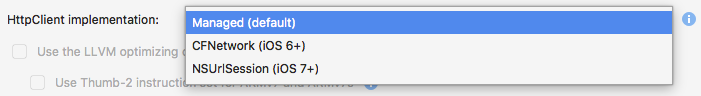
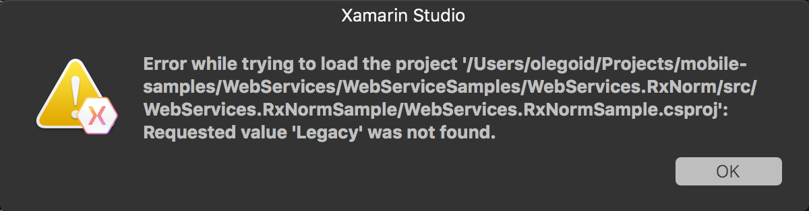

# HttpClient Stack Selector

Available for Xamarin.iOS, Xamarin.tvOS, and Xamarin.Mac: this controls which `HttpClient` implementation to use. The default continues to be an HttpClient that is powered by `HttpWebRequest`, while you can now optionally switch to an implementation that uses iOS, tvOS, or macOS native transports (`NSUrlSession` or `CFNetwork` depending on the OS). The upside is smaller binaries, and faster downloads, the downside is that it requires the event loop to be running for async operations to be executed.

Projects must reference the **System.Net.Http** assembly.

<a name="Selecting-a-HttpClient-Stack" />

## Selecting a HttpClient Stack

To adjust the HttpClient being used by your app:

1. Double-click the **Project Name** in the **Solution Explorer** to open the Project Options.
2. Switch to the **Build** settings for your project (for example, **iOS Build** for a Xamarin.iOS app).
3. From the **HttpClient Implementation** dropdown, select the HttpClient type as one of the following: **Managed**, **CFNetwork** or **NSUrlSession**.

[](http-stack-images/http-xs.png#lightbox)

<a name="Managed" />

## Managed (Default)

The Managed handler is the fully managed HttpClient handler that has been shipped with previous version of Xamarin.

### Pros:

 - It has the most compatible feature set with Microsoft .NET and older Xamarin versions.

### Cons:

 - It is not fully integrated with the Apple OSes and is limited to TLS 1.0.
 - It typically much slower at things like encryption than the native APIs.
 - It requires more managed code, thus creating a larger app distributable.

<a name="CFNetwork" />

## CFNetwork

The CFNetwork-based handler is based on the native `CFNetwork` framework available in iOS 6 and newer.

### Pros:

 - It uses native APIs for better performance and smaller executable size.
 - Supports for newer standards such as TLS 1.2.

### Cons:

 - Requires iOS 6 or later.
 - Not available on watchOS.
 - Some HttpClient features/options are not available.

<a name="NSUrlSession" />

## NSUrlSession

The NSURLSession-based handler is based on the native `NSURLSession` framework available in iOS 7 and newer.

### Pros:

 - It uses native APIs for better performance and smaller executable size.
 - Supports for the latest standards such as TLS 1.2.

### Cons:

 - Requires iOS 7 or later.
 - Some HttpClient features/options are not available.


## Programmatically Setting the HttpMessageHandler

In addition to the project-wide configuration shown above, you can also instantiate an `HttpClient` and inject the desired `HttpMessageHandler` through the constructor, as demonstrated in these code snippets:

```csharp
// This will use the default message handler for the application; as
// set in the Project Options for the project.
HttpClient client = new HttpClient();

// This will create an HttpClient that explicitly uses the CFNetworkHandler
HttpClient client = new HttpClient(new CFNetworkHandler());

// This will create an HttpClient that explicitly uses NSUrlSessionHandler
HttpClient client = new HttpClient(new NSUrlSessionHandler());
```

This makes it possible to use a different `HttpMessageHandler` from what is declared in the **Project Options** dialog.

<a name="New-SSL-TLS-implementation-build-option" />
<a name="Selecting-a-SSL-TLS-implementation" />
<a name="Apple-TLS" />

# SSL/TLS implementation build

SSL (Secure Socket Layer) and its successor, TLS (Transport Layer Security), provide support for HTTP and other network connections via `System.Net.Security.SslStream`. Xamarin.iOS, Xamarin.tvOS or Xamarin.Mac's `System.Net.Security.SslStream` implementation will call Apple's native SSL/TLS implementation instead of using the managed implementation provided by Mono. Apple's native implementation supports TLS 1.2.

<a name="Mono" />
> [!WARNING]
> The **Mono/Managed** TLS provider is limited to SSL v3 and TLS v1. This TLS provider has been deprecated and is no longer available for Xamarin.iOS applications. 

<a name="App-Transport-Security" />

# App Transport Security

Apple's _App Transport Security_ (ATS) enforces secure connections between internet resources (such as the app's back-end server) and your app. ATS ensures that all internet communications conform to secure connection best practices, thereby preventing accidental disclosure of sensitive information either directly through your app or a library that it is consuming.

Since ATS is enabled by default in apps built for iOS 9, tvOS 9 and OS X 10.11 (El Capitan) and newer, all connections using `NSUrlConnection`, `CFUrl` or `NSUrlSession` will be subject to ATS security requirements. If your connections do not meet these requirements, they will fail with an exception.

Based on your HttpClient Stack and SSL/TLS Implementation selections, you may need to make modifications to your app to work correctly with ATS.

To find out more about ATS, please see our [App Transport Security guide](~/ios/app-fundamentals/ats.md).

## Known Issues

This section will cover known issues with TLS support in Xamarin.iOS.

### Project failed to load with error "Requested value AppleTLS wasn't found"

Xamarin.iOS 9.8 introduced some new settings contained the **.csproj** file for a Xamarin.iOS application. These changes  may cause problems when the project is opened with older versions of Xamarin.iOS. The following screenshot is a example of the error message that may be displayed in this scenario:



This error is caused by the introduction of the `MtouchTlsProvider` setting to the project file in Xamarin.iOS 9.8. If it is not possible to update to Xamarin.iOS 9.8 (or higher), the work around is to manually edit the **.csproj** file  application, remove the `MtouchTlsprovider` element, and then save the  changed project file.

The following snippet is an example of what the `MtouchTlsProvider` setting may look like inside a **.csproj** file:

```xml
<MtouchTlsProvider>Default</MtouchTlsProvider>
```
s


## Related Links

- [Transport Layer Security (TLS)](~/cross-platform/app-fundamentals/transport-layer-security.md)
- [App Transport Security](~/ios/app-fundamentals/ats.md)
