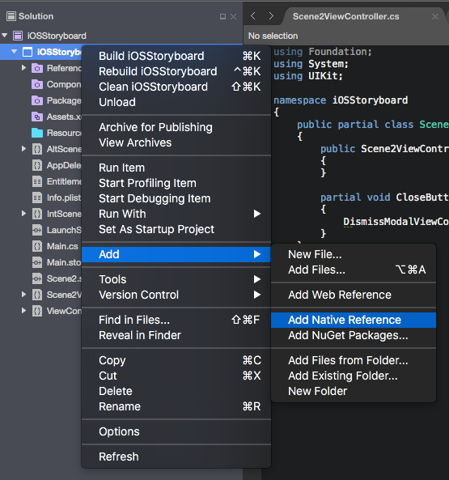
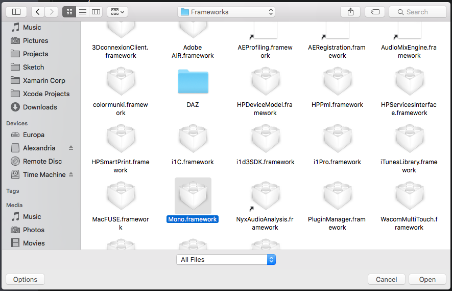
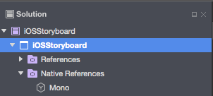

# Native References in iOS, Mac, and Bindings Projects

_Native references gives you the ability to embed a native framework into a Xamarin.iOS or Xamarin.Mac project or binding project._

Since iOS 8.0 it’s been possible to create an embedded framework to share code between app extensions and the main app in Xcode. Using the Native Reference feature it will be possible to consume these embedded frameworks (created with Xcode) in Xamarin.iOS.

> [!IMPORTANT]
> It will not be possible to create embedded frameworks from any type of Xamarin.iOS or Xamarin.Mac projects, Native References only allow for the consumption of existing native (Objective-C) frameworks.

## Terminology

In iOS 8 (and later), **Embedded Frameworks** can be both embedded statically linked and dynamically linked Frameworks. To properly distribute them, you must make them into "fat" Frameworks that included all of their _Slices_ for each device architecture that you want to support with your app.

### Static vs. Dynamic Frameworks

**Static Frameworks** are linked at compile time where **Dynamic Frameworks** are linked at runtime and therefor can be modified without re-linking. If you have used any 3rd-party Framework prior to iOS 8, you were using a **Static Framework** that was compiled into your app. See Apple's [Dynamic Library Programming](https://developer.apple.com/library/mac/documentation/DeveloperTools/Conceptual/DynamicLibraries/100-Articles/OverviewOfDynamicLibraries.html#//apple_ref/doc/uid/TP40001873-SW1) documentation for more details.

### Embedded vs. System Frameworks

**Embedded Frameworks** are included in your apps bundle and are only accessible to your specific app via its sandbox. **System Frameworks** are stored at the Operating System Level and are available to all apps on the device. Currently, only Apple has the ability to create Operating System Level Frameworks.

### Thin vs. Fat Frameworks

**Thin Frameworks** contain only the compiled code for a specific system architecture where **Fat Frameworks** contain code for multiple architectures. Each architecture-specific codebase compiled into a Framework is referred to as a _Slice_. So, for example, if we had a Framework that was compiled for the two iOS Simulator architectures (i386 and X86_64), it would contain two Slices.

If you tried to distribute this sample Framework with your app, it would run correctly on the Simulator, but fail on the device since the Framework does not contain any code-specific Slices for an iOS device. To ensure that a Framework will work in all instances, it would also need to include device-specific Slices such as arm64, armv7 and armv7s.

## Working with Embedded Frameworks

There are two steps that must be completed to work with Embedded Frameworks in a Xamarin.iOS or Xamarin.Mac app: Creating a Fat Framework and Embedding the Framework.

### Creating a Fat Framework

As stated above, to be able to consume an Embedded Framework in your app, it must be a Fat Framework that includes all of the system architectures Slices for the devices that your app will run on.

When the Framework and the consuming app are in the same Xcode project, this is not a problem as Xcode will build both the Framework and the App using the same build settings. Since Xamarin apps cannot create Embedded Frameworks, this technique cannot be used.

To solve this issue, the `lipo` command line tool can be used to merge two or more Frameworks into one Fat Framework containing all of the necessary Slices. For more information on working with the `lipo` command, please see our [Linking Native Libraries](~/ios/platform/native-interop.md) documentation.

### Embedding a Framework

The follow step are required to embed a framework in a Xamarin.iOS or Xamarin.Mac project using Native References:

1. Create a new or open an existing Xamarin.iOS, Xamarin.Mac or Binding project.
2. In the **Solution Explorer**, right-click on the project name and select **Add** > **Add Native Reference**: 

    
3. From the **Open** dialog box, select the name of the Native Framework that you want to embed and click the **Open** button: 

    
4. The framework will be added to the project's tree: 

    

When the project is compiled, the Native Framework will be embedded in the App's bundle.

## App Extensions and Embedded Frameworks

Internally Xamarin.iOS may take advantage of this feature to link with the Mono runtime as a framework (when the deployment target is >= iOS 8.0), thus reducing app size significantly for apps with extensions (since the Mono runtime will be included only once for the entire app bundle, instead of once for the container app and once for each extension).

Extensions will link with the Mono runtime as a framework, because all extensions require iOS 8.0.

Apps that don’t have extensions and apps that target iOS 

## Summary

This article has taken a detailed look at embedding a native Framework into a Xamarin.iOS or Xamarin.Mac application.
