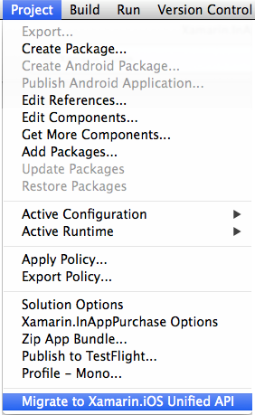
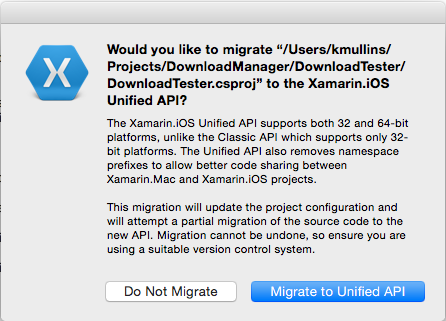
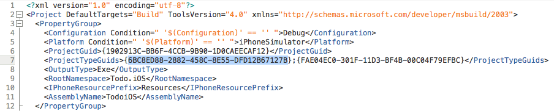
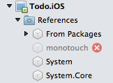

# Updating Existing iOS Apps

_Follow these steps to update an existing Xamarin.iOS app to use the Unified API._

Updating an existing app to use the Unified API requires changes to the project file itself as well as to the namespaces and APIs used in the application code.

## The Road to 64 Bits

The new Unified APIs are required to support 64 bit device architectures from a Xamarin.iOS mobile application. As of February 1st, 2015 Apple requires that all new app submissions to the iTunes App Store support 64 bit architectures.

Xamarin provides tooling for both Visual Studio for Mac and Visual Studio to automate the migration process from the Classic API to the Unified API or you can convert the project files manually. While the using the automatic tooling is highly suggested, this article will cover both methods.

### Before You Start...

Before you update your existing code to the Unified API, it is highly recommended that you eliminate all *compilation warnings*. Many *warnings* in the Classic API will become errors once you migrate to Unified. Fixing them before you start is easier because the compiler messages from the Classic API often provide hints on what to update.

## Automated Updating

Once the warnings have been fixed, select an existing iOS project in Visual Studio for Mac or Visual Studio and choose **Migrate to Xamarin.iOS Unified API** from the **Project** menu. For example:

You'll need to agree to this warning before the automated migration will run (obviously you should ensure you have backups/source control before embarking on this adventure):

The tool basically automates all the steps outlined in the **Update Manually** section presented below and is the suggested method of converting an existing Xamarin.iOS project to the Unified API.

## Steps to Update Manually

Again, once the warnings have been fixed, follow these steps to manually update Xamarin.iOS apps to use the new Unified API:

### 1. Update Project Type & Build Target

Change the project flavor in your **csproj** files from `6BC8ED88-2882-458C-8E55-DFD12B67127B` to `FEACFBD2-3405-455C-9665-78FE426C6842`. Edit the **csproj** file in a text editor, replacing the first item in the `<ProjectTypeGuids>` element as shown:

Change the **Import** element that contains `Xamarin.MonoTouch.CSharp.targets` to `Xamarin.iOS.CSharp.targets` as shown:

### 2. Update Project References

Expand the iOS application project's **References** node. It will initially show a *broken- **monotouch** reference similar to this screenshot (because we just changed the project type):

Right-click on the iOS application project to **Edit References**, then click on the **monotouch** reference and delete it using the red "X" button.

Now scroll to the end of the references list and tick the **Xamarin.iOS** assembly.

Press **OK** to save the project references changes.

### 3. Remove MonoTouch from Namespaces

Remove the **MonoTouch** prefix from namespaces in `using` statements or wherever a classname has been fully qualified (eg. `MonoTouch.UIKit` becomes just `UIKit`).

### 4. Remap Types

[Native types](~/cross-platform/macios/nativetypes.md) have been introduced which replace some Types that were previously used, such as instances of `System.Drawing.RectangleF` with `CoreGraphics.CGRect` (for example). The full list of types can be found on the [native types](~/cross-platform/macios/nativetypes.md) page.

### 5. Fix Method Overrides

Some `UIKit` methods have had their signature changed to use the new [native types](~/cross-platform/macios/nativetypes.md) (such as `nint`). If custom subclasses override these methods the signatures will no longer match and will result in errors. Fix these method overrides by changing the subclass to match the new signature using native types.

Examples include changing `public override int NumberOfSections (UITableView tableView)` to return `nint` and changing both return type and parameter types in `public override int RowsInSection (UITableView tableView, int section)` to `nint`.

## Considerations

The following considerations should be taken into account when converting an existing Xamarin.iOS project from the Classic API to the new Unified API if that app relies on one or more Component or NuGet Package.

### Components

Any component that you have included in your application will also need to be updated to the Unified API or you will get a conflict when you try to compile. For any included component, replace the current version with a new version from the Xamarin Component Store that supports the Unified API and do a clean build. Any component that has not yet been converted by the author, will display a 32 bit only warning in the component store.

### NuGet Support

While we contributed changes to NuGet to work with the Unified API support, there has not been a new release of NuGet, so we are evaluating how to get NuGet to recognize the new APIs.

Until that time, just like the components, you'll need to switch any NuGet Package you have included in your project to a version that supports the Unified APIs and do a clean build afterwards.

> [!IMPORTANT]
> If you have an error in the form _"Error 3 Cannot include both 'monotouch.dll' and 'Xamarin.iOS.dll' in the same Xamarin.iOS project - 'Xamarin.iOS.dll' is referenced explicitly, while 'monotouch.dll' is referenced by 'xxx, Version=0.0.000, Culture=neutral, PublicKeyToken=null'"_ after converting your application to the Unified APIs, it is typically due to having either a component or NuGet Package in the project that has not been updated to the Unified API. You'll need to remove the existing component/NuGet, update to a version that supports the Unified APIs and do a clean build.

## Enabling 64 Bit Builds of Xamarin.iOS Apps

For a Xamarin.iOS mobile application that has been converted to the Unified API, the developer still needs to enable the building of the application for 64 bit machines from the app's Options. Please see the **Enabling 64 Bit Builds of Xamarin.iOS Apps** of the [32/64 bit Platform Considerations](~/cross-platform/macios/32-and-64/index.md#enable-64) document for detailed instructions on enabling 64 bit builds.

## Finishing Up

Whether or not you choose to use the automatic or manual method to convert your Xamarin.iOS application from the Classic to the Unified APIs, there are several instances that will require further, manual intervention. Please see our [Tips for Updating Code to the Unified API](~/cross-platform/macios/unified/updating-tips.md) document for known issues and work arounds.

## Related Links

- [Tips for Updating Code to the Unified API](~/cross-platform/macios/unified/updating-tips.md)
- [Working with Native Types in Cross-Platform Apps](~/cross-platform/macios/native-types-cross-platform.md)
- [Classic vs Unified API differences](https://github.com/xamarin/release-notes-archive/blob/master/release-notes/ios/api_changes/classic-vs-unified-8.6.0/index.md)
