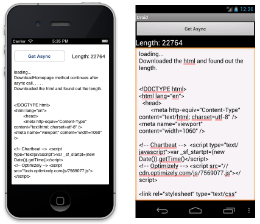

# Async Support Overview

_C# 5 introduced two keywords to simplify asynchronous programing: async and await. These keywords let you write simple code that utilizes the Task Parallel Library to execute long running operations (such as network access) in another thread and easily access the results on completion. The latest versions of Xamarin.iOS and Xamarin.Android support async and await - this document provides explanations and an example of using the new syntax with Xamarin._

Xamarin's Async support is built on the Mono 3.0 foundation and upgrades the API profile from the being a Mobile-friendly version of Silverlight to be a mobile-friendly version of .NET 4.5.

## Overview

This document introduces the new async and await keywords then walks through some simple examples implementing asynchronous methods in Xamarin.iOS and Xamarin.Android.

For a more complete discussion of the new asynchronous features of C# 5 (including lots of samples and different usage scenarios) refer to the article [Asynchronous programming](/dotnet/csharp/async).

The sample application makes a simple asynchronous web request (without blocking the main thread) then updates the UI with the downloaded html and character count.

 [](async-images/AsyncAwait.png#lightbox)

Xamarin's async support is built on the Mono 3.0 foundation and upgrades the API profile from the being a mobile-friendly version of Silverlight to be a mobile-friendly version of .NET 4.5.

## Requirements

C# 5 features require Mono 3.0 that is included in Xamarin.iOS 6.4 and Xamarin.Android 4.8. You will be prompted to upgrade your Mono, Xamarin.iOS, Xamarin.Android and Xamarin.Mac to take advantage of it.

## Using async &amp; await

 `async` and `await` are new C# language features that work in conjunction with the Task Parallel Library to make it easy to write threaded code to perform long-running tasks without blocking the main thread of your application.

## async

### Declaration

The `async` keyword is placed in a method declaration (or on a lambda or anonymous method) to indicate that it contains code that can run asynchronously, ie. not block the caller’s thread.

A method marked with `async` should contain at least one await expression or statement. If no `await` statements are present in the method then it will run synchronously (the same as if there were no `async` modifier). This will also result in a compiler warning (but not an error).

### Return Types

An async method should return a `Task`, `Task<TResult>` or `void`.

Specify the `Task` return type if the method does not return any other value.

Specify `Task<TResult>` if the method needs to return a value, where `TResult` is the type being returned (such as an `int`, for example).

The `void` return type is used mainly for event handlers which require it. Code that calls void-returning asynchronous methods can’t `await` on the result.

### Parameters

Asynchronous methods cannot declare `ref` or `out` parameters.

## await

The await operator can be applied to a Task inside a method marked as async. It causes the method to stop execution at that point and wait until the task completes.

Using await does not block the caller’s thread – rather control is returned to the caller. This means that the calling thread is not blocked, so for example the user interface thread would not be blocked when awaiting a task.

When the task completes, the method resumes executing at the same point in the code. This includes returning to the try scope of a try-catch-finally block (if one is present). await cannot be used in a catch or finally block.

Read more about [await](/dotnet/csharp/language-reference/keywords/await).

## Exception Handling

Exceptions that occur inside an async method are stored in the task and thrown when the task is `await`ed. These exceptions can be caught and handled inside a try-catch block.

## Cancellation

Asynchronous methods that take a long time to complete should support cancellation. Typically, cancellation is invoked as follows:

- A `CancellationTokenSource` object is created.
- The `CancellationTokenSource.Token` instance is passed to a cancellable asynchronous method.
- Cancellation is requested by calling the `CancellationTokenSource.Cancel` method.

The task then cancels itself and acknowledges the cancellation.

For more information about cancellation, see [Fine-Tuning Your Async Application (C#)](/dotnet/csharp/programming-guide/concepts/async/fine-tuning-your-async-application).

## Example

Download the [example Xamarin solution](/samples/xamarin/mobile-samples/asyncawait/) (for both iOS and Android) to see a working example of `async` and `await` in mobile apps. The example code is discussed in more detail in this section.

### Writing an async method

The following method demonstrates how to code an `async` method with an `await`ed task:

```csharp
public async Task<int> DownloadHomepage()
{
    var httpClient = new HttpClient(); // Xamarin supports HttpClient!

    Task<string> contentsTask = httpClient.GetStringAsync("https://visualstudio.microsoft.com/xamarin"); // async method!

    // await! control returns to the caller and the task continues to run on another thread
    string contents = await contentsTask;

    ResultEditText.Text += "DownloadHomepage method continues after async call. . . . .\n";

    // After contentTask completes, you can calculate the length of the string.
    int exampleInt = contents.Length;

    ResultEditText.Text += "Downloaded the html and found out the length.\n\n\n";

    ResultEditText.Text += contents; // just dump the entire HTML

    return exampleInt; // Task<TResult> returns an object of type TResult, in this case int
}
```

Note these points:

- The method declaration includes the  `async` keyword.
- The return type is  `Task<int>` so calling code can access the  `int` value that is calculated in this method.
- The return statement is  `return exampleInt;` which is an integer object – the fact that the method returns  `Task<int>` is part of the language improvements.

### Calling an async method 1

This button click event handler can be found in the Android sample application to call the method discussed above:

```csharp
GetButton.Click += async (sender, e) => {

    Task<int> sizeTask = DownloadHomepage();

    ResultTextView.Text = "loading...";
    ResultEditText.Text = "loading...\n";

    // await! control returns to the caller
    var intResult = await sizeTask;

    // when the Task<int> returns, the value is available and we can display on the UI
    ResultTextView.Text = "Length: " + intResult ;
    // "returns" void, since it's an event handler
};
```

Notes:

- The anonymous delegate has the async keyword prefix.
- The asynchronous method DownloadHomepage returns a Task\<int> that is stored in the sizeTask variable.
- The code awaits on the sizeTask variable.  *This* is the location that the method is suspended and control is returned to the calling code until the asynchronous task finishes on its own thread.
- Execution does  *not* pause when the task is created on the first line of the method, despite the task being created there. The await keyword signifies the location where execution is paused.
- When the asynchronous task finishes, intResult is set and execution continues on the original thread, from the await line.

### Calling an async method 2

In the iOS sample application the example is written slightly differently to demonstrate an alternative approach. Rather than use an anonymous delegate this example declares an `async` event handler that is assigned like a regular event handler:

```csharp
GetButton.TouchUpInside += HandleTouchUpInside;
```

The event handler method is then defined as shown here:

```csharp
async void HandleTouchUpInside (object sender, EventArgs e)
{
    ResultLabel.Text = "loading...";
    ResultTextView.Text = "loading...\n";

    // await! control returns to the caller
    var intResult = await DownloadHomepage();

    // when the Task<int> returns, the value is available and we can display on the UI
    ResultLabel.Text = "Length: " + intResult ;
}
```

Some important points:

- The method is marked as  `async` but returns  `void` . This is typically only done for event handlers (otherwise you’d return a  `Task` or  `Task<TResult>` ).
- The `await` keyword on the  `DownloadHomepage` method directly assigns to a variable (`intResult`) unlike the previous example where we used an intermediate  `Task<int>` variable to reference the task.  *This* is the location where control is returned to the caller until the asynchronous method has completed on another thread.
- When the asynchronous method completes and returns, execution resumes at the  `await` which means the integer result is returned and then rendered in a UI widget.

## Summary

Using async and await greatly simplifies the code required to spawn long-running operations on background threads without blocking the main thread. They also make it easy to access the results when the task has completed.

This document has given an overview of the new language keywords and examples for both Xamarin.iOS and Xamarin.Android.

## Related Links

- [AsyncAwait (sample)](/samples/xamarin/mobile-samples/asyncawait/)
- [Callbacks as our Generations' Go To Statement](https://tirania.org/blog/archive/2013/Aug-15.html)
- [Data (iOS) (sample)](/samples/xamarin/ios-samples/data/)
- [HttpClient (iOS) (sample)](/samples/xamarin/ios-samples/httpclient/)
- [MapKitSearch (iOS) (sample)](https://github.com/xamarin/monotouch-samples/tree/master/MapKitSearch)
- [Asynchronous programming](/dotnet/csharp/async)
- [Fine-Tuning Your Async Application (C#)](/dotnet/csharp/programming-guide/concepts/async/fine-tuning-your-async-application)
- [Await, and UI, and deadlocks! Oh my!](https://devblogs.microsoft.com/pfxteam/await-and-ui-and-deadlocks-oh-my/)
- [Processing tasks as they complete)](https://devblogs.microsoft.com/pfxteam/processing-tasks-as-they-complete/)
- [Task-based Asynchronous Pattern (TAP)](/dotnet/standard/asynchronous-programming-patterns/task-based-asynchronous-pattern-tap)
- [Asynchrony in C# 5 (Eric Lippert's blog) – about the introduction of the keywords](/archive/blogs/ericlippert/asynchrony-in-c-5-part-six-whither-async)
