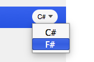
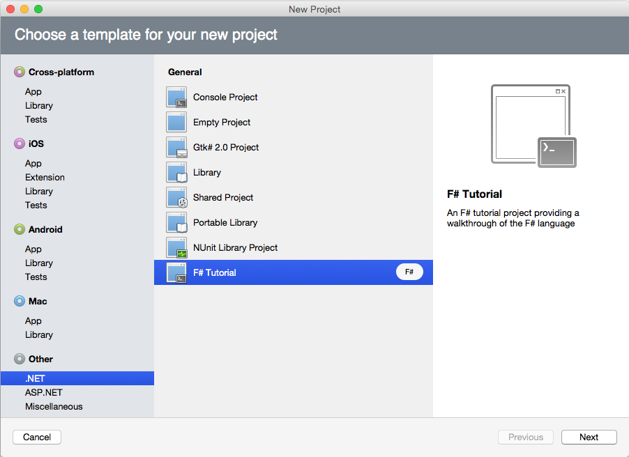
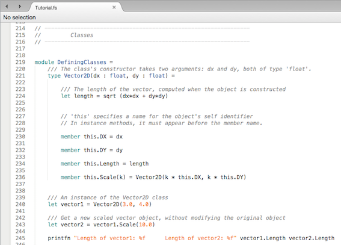

# Getting Started with F&#35;

## Requirements

F# is included by default in Visual Studio for Mac.

On Windows, you must install standalone F# compiler tools, per the instructions on [the FSharp.org site](https://fsharp.org/use/windows/).

## Creating an F&#35; Project

Creating a new F# application is done in the same **New Project** window
used for C#.

In Visual Studio for Mac choose **File > New Solution**. In the **New Project** dialog, select a project template. Use the drop-down to the right of the template to choose the language you wish to use:

 

Select your project type and click **Next** to name and create it.

You are now ready to start creating some great F# applications!

## Learning to use F&#35;

An F# tutorial can also be created from within the **New Solution** dialog in Visual Studio for Mac. Navigate to **Other > .NET > F# Tutorial**, as detailed in the image below:

 

This opens a new interactive solution. Exploring this is a great way to get to grips with the basics of the language.

 

Check out the [list of samples](~/cross-platform/platform/fsharp/samples.md) to see F# in action.

## References

There is a plethora of information online for getting up to speed with the F#
language, covering all proficiencies. Listed below are a few of our recommendations:

- [F# Software Foundation](https://fsharp.org)
- [Visual F# Development Portal](https://go.microsoft.com/fwlink/?LinkID=234174)
- [Visual F# Code Gallery](/samples/browse/)
- [Visual F# Math/Stats Programming](/previous-versions/visualstudio/visual-studio-2010/hh273075(v=vs.100))
- [Visual F# Charting](/previous-versions/visualstudio/visual-studio-2010/hh273079(v=vs.100))