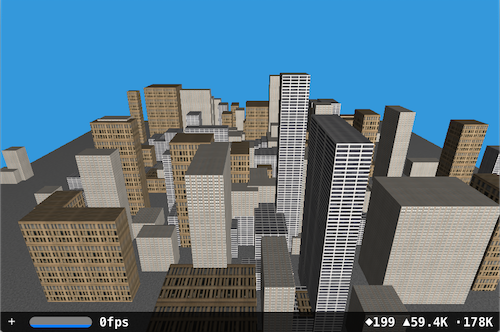

# F# Samples for Xamarin

This page links to some F# samples using Xamarin.

## iOS

The [FSSceneKit City](/samples/xamarin/ios-samples/ios8-fsscenekit/) sample shows how to
create a randomly generated city using [SceneKit](xref:SceneKit)
and F#. There's also an ["Oculus Thrift" (Google Cardboard) Edition](/samples/xamarin/ios-samples/ios8-scenekitfsharp/).

[Shallow](https://github.com/dvdsgl/shallow) demonstrates a fun
swipe-user-interface built with F# for iOS.

## Xamarin.Forms

A number of samples for the [Xamarin.Forms book](~/xamarin-forms/creating-mobile-apps-xamarin-forms/index.md)
have been ported to F#. These links take you to the github location for each chapter:

- [Chapter 2. Anatomy of an app](https://github.com/xamarin/xamarin-forms-book-samples/tree/master/Chapter02/FS)
- [Chapter 3. Deeper into text](https://github.com/xamarin/xamarin-forms-book-samples/tree/master/Chapter03/FS)
- [Chapter 4. Scrolling the stack](https://github.com/xamarin/xamarin-forms-book-samples/tree/master/Chapter04/FS)
- [Chapter 5. Dealing with sizes](https://github.com/xamarin/xamarin-forms-book-samples/tree/master/Chapter05/FS)
- [Chapter 6. Button clicks](https://github.com/xamarin/xamarin-forms-book-samples/tree/master/Chapter06/FS)
- [Chapter 7. XAML vs. code](https://github.com/xamarin/xamarin-forms-book-samples/tree/master/Chapter07/FS/CodePlusXaml)
- [Chapter 8. Code and XAML in harmony](https://github.com/xamarin/xamarin-forms-book-samples/tree/master/Chapter08/FS/XamlKeypad)