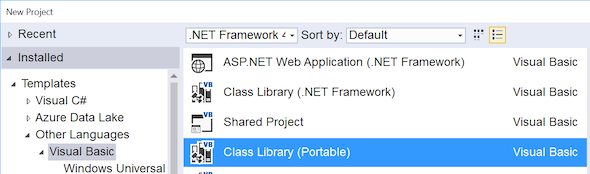
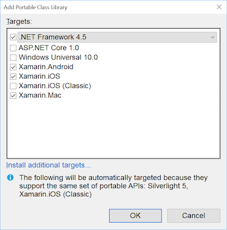
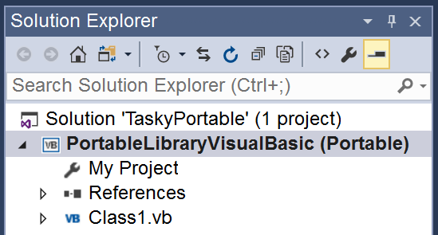
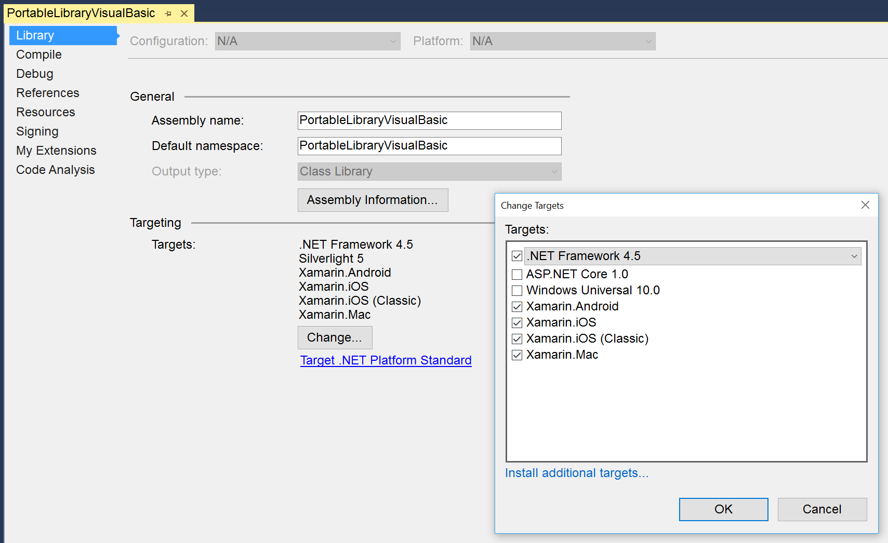

# Portable Visual Basic.NET

Xamarin iOS and Android projects do not natively support Visual Basic; however developers can use Portable Class Libraries to migrate existing Visual Basic code to iOS and Android, or to write significant portion of their application logic in Visual Basic. Xamarin.Forms applications can be created entirely in Visual Basic (excluding custom renderers, dependency services, and XAML codebehind).

## Requirements

Portable Class Library Support was added in Xamarin.Android 4.10.1, Xamarin.iOS 7.0.4 and Xamarin Studio 4.2, meaning any Xamarin projects created with those tools can incorporate Visual Basic PCL assemblies.

To create and compile Visual Basic Portable Class Libraries you must use Visual Studio on Windows (Visual Studio 2012 or newer).

> ℹ️ **NOTE:** Visual Basic libraries can only be created and compiled using Visual Studio. Xamarin.iOS and Xamarin.Android do not support the Visual Basic language.
>
> If you work solely in Visual Studio you can reference the Visual Basic project from Xamarin.iOS and Xamarin.Android projects.
>
> If your iOS and Android projects must also be loaded in Visual Studio for Mac you should reference the output assembly from the Visual Basic PCL.

## Creating a Visual Basic.NET PCL

This section walks through how to create a Visual Basic Portable Class Library using Visual Studio.
The library can then be referenced in other projects, including Xamarin.iOS, Xamarin.Android, and Xamarin.Forms apps.

### Creating a PCL

When adding a Visual Basic PCL in Visual Studio you must choose a Profile that describes what platforms your library should be compatible with. Profiles are explained in the Introduction to PCL document.

The steps to create a PCL and choose its Profile are:

1.  In the  **New Project** screen, select the  **Visual Basic > Class Library (Portable)** option:

  

1.  Visual Studio will immediately prompt with the following  **Add Portable Class Library** dialog so that the Profile can be configured. Tick the platforms you need to support and press **OK**.

  

1.  The Visual Basic PCL project will appear as shown in the  **Solution Explorer** like this:

  

The PCL is now ready for Visual Basic code to be added. PCL projects can be referenced by other projects (Application projects, Library projects and even other PCL projects).

### Editing the PCL Profile

The PCL Profile (that controls which platforms the PCL is compatible with) can be viewed and changed by right-clicking on the project and choosing **Properties > Library > Change...**. The resulting dialog is shown in this screenshot:

 

If the profile is changed after code has already been added to the PCL, it’s possible that the library will no longer compile if the code references features that are not part of the newly selected profile.

## Summary

This article has demonstrated how consume Visual Basic code in Xamarin applications using Visual Studio and Portable Class Libraries. Even though Xamarin does not support Visual Basic directly, compiling Visual Basic into a PCL allows code written with Visual Basic to be included in iOS and Android apps.

The following pages describe how to use Visual Basic.NET PCLs in native or Xamarin.Forms apps:

- [Building native Xamarin.iOS and Xamarin.Android apps that use VB](native-apps.md)
- [Building Xamarin.Forms apps with VB](xamarin-forms.md)

## Related Links

- [TaskyPortableVB (sample)](https://github.com/xamarin/mobile-samples/tree/master/VisualBasic/TaskyPortableVB)
- [XamarinFormsVB (sample)](https://github.com/xamarin/mobile-samples/tree/master/VisualBasic/XamarinFormsVB)
- [Cross-Platform Development with the .NET Framework (Microsoft)](http://msdn.microsoft.com/en-us/library/gg597391(v=vs.110).aspx)