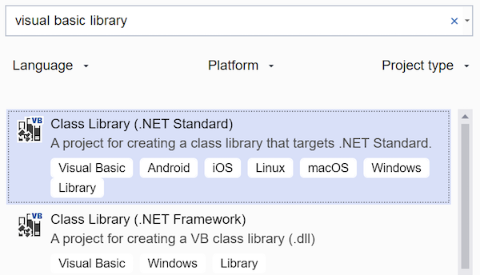
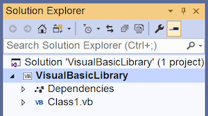

# Visual Basic and .NET Standard

Xamarin Android and iOS projects do not natively support Visual Basic; however developers can use [.NET Standard](~/cross-platform/app-fundamentals/net-standard.md) libraries to migrate existing Visual Basic code to Android and iOS, or to write significant portion of their application logic in Visual Basic. Xamarin.Forms applications can be created entirely in Visual Basic (excluding custom renderers, dependency services, and XAML code-behind).

## Requirements

To create and compile Visual Basic .NET Standard libraries you must use Visual Studio on Windows (Visual Studio 2017 or newer).

> [!NOTE]
> Visual Basic libraries can only be created and compiled using Visual Studio. Xamarin.Android and Xamarin.iOS do not support the Visual Basic language.
>
> If you work solely in Visual Studio you can reference the Visual Basic project from Xamarin.Android and Xamarin.iOS projects.
>
> If your Android and iOS projects must also be loaded in Visual Studio for Mac you should reference the output assembly from the Visual Basic assembly.

## Creating a Visual Basic.NET .NET Standard library

This section walks through how to create a Visual Basic .NET Standard library using Visual Studio 2019.
The library can then be referenced in other projects, including Xamarin.Android, Xamarin.iOS, and Xamarin.Forms apps.

When adding a Visual Basic .NET Standard library in Visual Studio you must be careful to choose the correct project type:

1. From Visual Studio 2019 choose **Create a new project**.

2. Type **Visual Basic library** to filter the project options and choose the **Class Library (.NET Standard)** option with the Visual Basic icon:

    

3. On the next screen, type a name for the project and press **Create**.

4. The Visual Basic project will appear as shown in the  **Solution Explorer** like this:

    

The project is now ready for Visual Basic code to be added. .NET Standard projects can be referenced by other projects (application projects or library projects).

## Summary

This article has demonstrated how consume Visual Basic code in Xamarin applications using Visual Studio. Even though Xamarin does not support Visual Basic directly, compiling Visual Basic into a .NET Standard library allows code written with Visual Basic to be included in Android and iOS apps.

The following pages describe how to use Visual Basic.NET .NET Standard libraries in native or Xamarin.Forms apps:

- [Building native Xamarin.iOS and Xamarin.Android apps that use VB](native-apps.md)
- [Building Xamarin.Forms apps with VB](xamarin-forms.md)

## Related Links

- [TaskyVB (sample)](/samples/xamarin/mobile-samples/visualbasic-taskyvb/)
- [XamarinFormsVB (sample)](/samples/xamarin/mobile-samples/visualbasic-xamarinformsvb/)
- [.NET Standard and Xamarin](~/cross-platform/app-fundamentals/net-standard.md)
- [.NET Standard](/dotnet/standard/net-standard/)