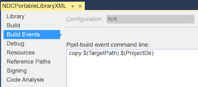
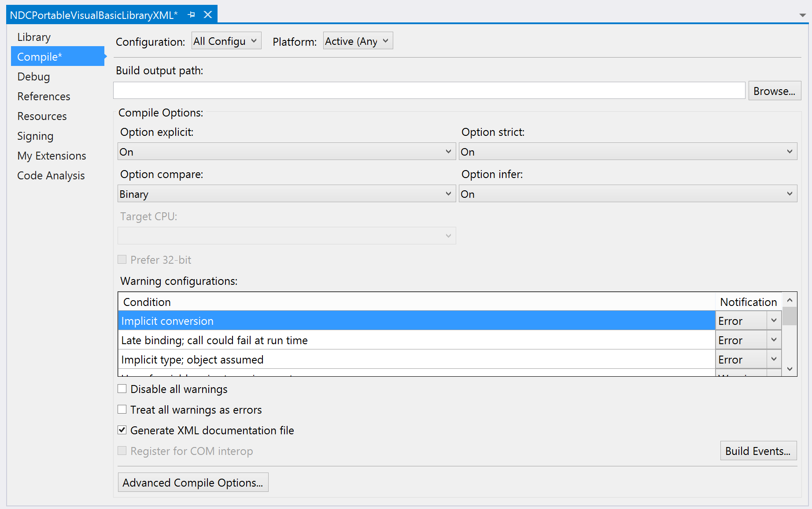
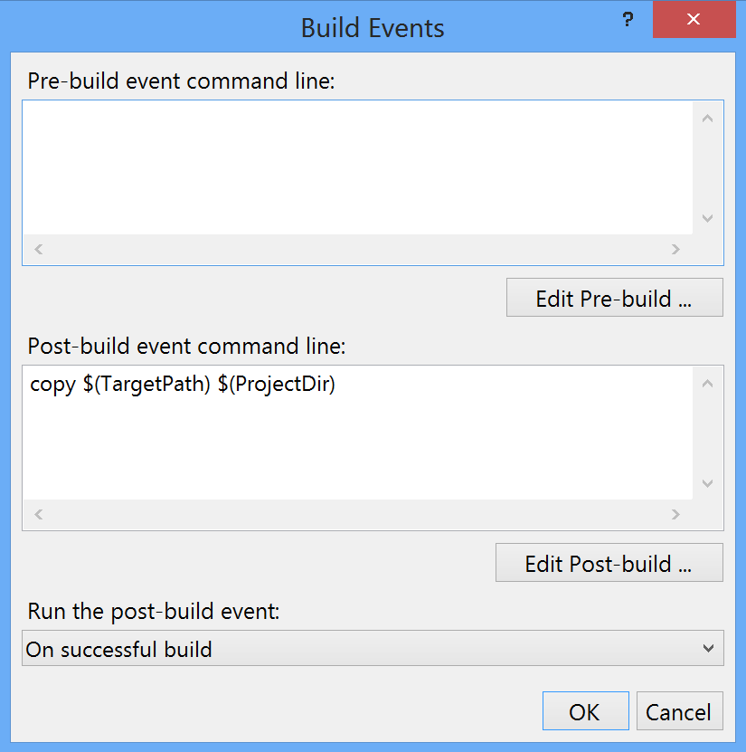
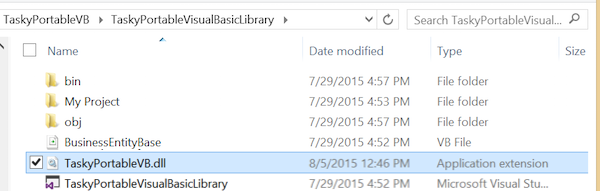
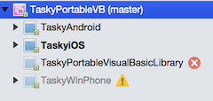
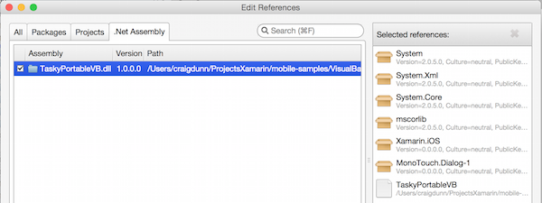

# Visual Basic.NET in Xamarin iOS and Android

The [TaskyPortable](/samples/mobile/VisualBasic/TaskyPortableVB/) sample application demonstrates how Visual Basic code compiled into a Portable Class Library can be used with Xamarin. Here are some screenshots of the resulting apps running on iOS, Android and Windows Phone:

 [](native-apps-images/image5.png#lightbox)

The iOS, Android and Windows Phone projects in the example are all written in C#. The user interface for each application is built with native technologies (Storyboards, Xml and Xaml respectively), while the `TodoItem` management is provided by the Visual Basic Portable Class Library using an `IXmlStorage` implementation provided by the native project.

## Sample Walkthrough

This guide discusses how Visual Basic has been implemented in the
[TaskyPortableVB](https://github.com/xamarin/mobile-samples/tree/master/VisualBasic/TaskyPortableVB)
Xamarin sample for iOS and Android.

> [!NOTE]
> Review the instructions on [Visual Basic.NET PCLs](/guides/cross-platform/application_fundamentals/pcl/portable_visual_basic_net/) before continuing with this guide.

## VisualBasicPortableLibrary

Visual Basic Portable Class Libraries can only be created in Visual Studio.
The example library contains the basics of our application in four Visual Basic files:

-  IXmlStorage.vb
-  TodoItem.vb
-  TodoItemManager.vb
-  TodoItemRepositoryXML.vb


### IXmlStorage.vb

Because file access behaviors vary so greatly between platforms, Portable Class Libraries do not provide `System.IO` file storage APIs in any profile. This means that if we want to interact directly with the filesystem in our portable code, we need to call back to our native projects on each platform.  By writing our Visual Basic code against a simple interface that can be implemented in C# on each platform, we can have shareable Visual Basic code that still has access to the file system.

The sample code uses this very simple interface that contains just two methods: to read and write a serialized Xml file.

```vb
Public Interface IXmlStorage
    Function ReadXml(filename As String) As List(Of TodoItem)
    Sub WriteXml(tasks As List(Of TodoItem), filename As String)
End Interface
```

iOS, Android and Windows Phone implementations for this interface will be shown later in the guide.

### TodoItem.vb

This class contains the business object to be used throughout the application. It will be defined in Visual Basic and shared with the iOS, Android and Windows Phone projects that are written in C#.

The class definition is shown here:

```vb
Public Class TodoItem
    Property ID() As Integer
    Property Name() As String
    Property Notes() As String
    Property Done() As Boolean
End Class
```

The sample uses XML serialization and de-serialization to load and save the TodoItem objects.

### TodoItemManager.vb

The Manager class presents the ‘API’ for the portable code. It provides basic CRUD operations for the `TodoItem` class, but no implementation of those operations.

```vb
Public Class TodoItemManager
    Private _repository As TodoItemRepositoryXML
    Public Sub New(filename As String, storage As IXmlStorage)
        _repository = New TodoItemRepositoryXML(filename, storage)
    End Sub
    Public Function GetTask(id As Integer) As TodoItem
        Return _repository.GetTask(id)
    End Function
    Public Function GetTasks() As List(Of TodoItem)
        Return New List(Of TodoItem)(_repository.GetTasks())
    End Function
    Public Function SaveTask(item As TodoItem) As Integer
        Return _repository.SaveTask(item)
    End Function
    Public Function DeleteTask(item As TodoItem) As Integer
        Return _repository.DeleteTask(item.ID)
    End Function
End Class
```

The constructor takes an instance of IXmlStorage as a parameter. This allows each platform to provide its own working implementation while still letting the portable code describe other functionality that can be shared.

### TodoItemRepository.vb

The repository class contains the logic for managing the list of TodoItem objects. The complete code is shown below – the logic exists mainly to manage a unique ID value across the TodoItems as they are added and removed from the collection.

```vb
Public Class TodoItemRepositoryXML
    Private _filename As String
    Private _storage As IXmlStorage
    Private _tasks As List(Of TodoItem)

    ''' <summary>Constructor</summary>
    Public Sub New(filename As String, storage As IXmlStorage)
        _filename = filename
        _storage = storage
        _tasks = _storage.ReadXml(filename)
    End Sub
    ''' <summary>Inefficient search for a Task by ID</summary>
    Public Function GetTask(id As Integer) As TodoItem
        For t As Integer = 0 To _tasks.Count - 1
            If _tasks(t).ID = id Then
                Return _tasks(t)
            End If
        Next
        Return New TodoItem() With {.ID = id}
    End Function
    ''' <summary>List all the Tasks</summary>
    Public Function GetTasks() As IEnumerable(Of TodoItem)
        Return _tasks
    End Function
    ''' <summary>Save a Task to the Xml file
    ''' Calculates the ID as the max of existing IDs</summary>
    Public Function SaveTask(item As TodoItem) As Integer
        Dim max As Integer = 0
        If _tasks.Count > 0 Then
            max = _tasks.Max(Function(t As TodoItem) t.ID)
        End If
        If item.ID = 0 Then
            item.ID = ++max
            _tasks.Add(item)
        Else
            Dim j = _tasks.Where(Function(t) t.ID = item.ID).First()
            j = item
        End If
        _storage.WriteXml(_tasks, _filename)
        Return max
    End Function
    ''' <summary>Removes the task from the XMl file</summary>
    Public Function DeleteTask(id As Integer) As Integer
        For t As Integer = 0 To _tasks.Count - 1
            If _tasks(t).ID = id Then
                _tasks.RemoveAt(t)
                _storage.WriteXml(_tasks, _filename)
                Return 1
            End If
        Next
        Return -1
    End Function
End Class
```

> [!NOTE]
> This code is an example of a very basic data-storage mechanism.
> It is provided to demonstrate how a Portable Class Library can code 
> against an interface to access platform-specific functionality 
> (in this case, loading and saving an Xml file). It it not intended to be 
> a production-quality database alternative.

## iOS, Android and Windows Phone Application Projects

This section contains the platform-specific implementations for the IXmlStorage interface and shows how it is used in each application. The application projects are all written in C#.

### iOS and Android IXmlStorage

Xamarin.iOS and Xamarin.Android provide full `System.IO` functionality so you can easily load and save the Xml file using the following class:

```csharp
public class XmlStorageImplementation : IXmlStorage
{
    public XmlStorageImplementation(){}
    public List<TodoItem> ReadXml(string filename)
    {
        if (File.Exists(filename))
        {
            var serializer = new XmlSerializer(typeof(List<TodoItem>));
            using (var stream = new FileStream(filename, FileMode.Open))
            {
                return (List<TodoItem>)serializer.Deserialize(stream);
            }
        }
        return new List<TodoItem>();
    }
    public void WriteXml(List<TodoItem> tasks, string filename)
    {
        var serializer = new XmlSerializer(typeof(List<TodoItem>));
        using (var writer = new StreamWriter(filename))
        {
            serializer.Serialize(writer, tasks);
        }
    }
}
```

In the iOS application the `TodoItemManager` and the `XmlStorageImplementation` are created in the **AppDelegate.cs** file as shown in this code snippet. The first four lines are just building the path to the file where data will be stored; the final two lines show the two classes being instantiated.

```csharp
var xmlFilename = "TodoList.xml";
string documentsPath = Environment.GetFolderPath(Environment.SpecialFolder.Personal); // Documents folder
string libraryPath = Path.Combine(documentsPath, "..", "Library"); // Library folder
var path = Path.Combine(libraryPath, xmlFilename);
var xmlStorage = new XmlStorageImplementation();
TaskMgr = new TodoItemManager(path, xmlStorage);
```

In the Android application the `TodoItemManager` and the `XmlStorageImplementation` are created in the **Application.cs** file as shown in this code snippet. The first three lines are just building the path to the file where data will be stored; the final two lines show the two classes being instantiated.

```csharp
var xmlFilename = "TodoList.xml";
string libraryPath = Environment.GetFolderPath(Environment.SpecialFolder.Personal);
var path = Path.Combine(libraryPath, xmlFilename);
var xmlStorage = new AndroidTodo.XmlStorageImplementation();
TaskMgr = new TodoItemManager(path, xmlStorage);
```

The rest of the application code is primarily concerned with the user interface and using the `TaskMgr` class to load and save `TodoItem` classes.

### Windows Phone IXmlStorage

Windows Phone does not provide complete access to the device’s file system, instead exposing the IsolatedStorage API. The `IXmlStorage` implementation for Windows Phone looks like this:

```csharp
public class XmlStorageImplementation : IXmlStorage
{
    public XmlStorageImplementation(){}
    public List<TodoItem> ReadXml(string filename)
    {
        IsolatedStorageFile fileStorage = IsolatedStorageFile.GetUserStoreForApplication();
        if (fileStorage.FileExists(filename))
        {
            var serializer = new XmlSerializer(typeof(List<TodoItem>));
            using (var stream = new StreamReader(new IsolatedStorageFileStream(filename, FileMode.Open, fileStorage)))
            {
                return (List<TodoItem>)serializer.Deserialize(stream);
            }
        }
        return new List<TodoItem>();
    }
    public void WriteXml(List<TodoItem> tasks, string filename)
    {
        IsolatedStorageFile fileStorage = IsolatedStorageFile.GetUserStoreForApplication();
        var serializer = new XmlSerializer(typeof(List<TodoItem>));
        using (var writer = new StreamWriter(new IsolatedStorageFileStream(filename, FileMode.OpenOrCreate, fileStorage)))
        {
            serializer.Serialize(writer, tasks);
        }
    }
}
```

The `TodoItemManager` and the `XmlStorageImplementation` are created in the **App.xaml.cs** file as shown in this code snippet.

```csharp
var filename = "TodoList.xml";
var xmlStorage = new XmlStorageImplementation();
TodoMgr = new TodoItemManager(filename, xmlStorage);
```

The rest of the Windows Phone application consists of Xaml and C# to create the user interface and use the `TodoMgr` class to load and save `TodoItem` objects.

## Visual Basic PCL in Visual Studio for Mac

Visual Studio for Mac does NOT support the Visual Basic language – you cannot create or compile Visual Basic projects with Visual Studio for Mac.

Visual Studio for Mac’s support for Portable Class Libraries means that it can reference PCL assemblies that were built from Visual Basic.

This section explains how to compile a PCL assembly in Visual Studio and then ensure that it will be stored in a version control system and referenced by other projects.

### Keeping the PCL output from Visual Studio

By default most version control systems (including TFS and Git) will be configured to ignore the **/bin/** directory which means the compiled PCL assembly will not be stored. This means you would need to manually copy it to any computers running Visual Studio for Mac to add a reference to it.

To ensure your version control system can store the PCL assembly output, you can create a post-build script that copies it into the project root. This post-build step helps ensure the assembly can be easily added to source control and shared with other projects.

#### Visual Studio 2017

1. Right-click on the project and choose the **Properties > Build Events** section.

2. Add a _post-build_ script that copies the output DLL from this project into the project root directory (which is outside of  **/bin/**). Depending on your version control configuration, the DLL should now be able to be added to source control.

  [](native-apps-images/image6-vs.png#lightbox)

#### Visual Studio 2015

1.  Right-click on the project and choose  **Properties > Compile** , then ensure All Configurations is selected in the top-left comb-box. Click the  **Build Events...** button in the bottom right.

    [](native-apps-images/image6.png#lightbox)

1.  Add a post-build script that copies the output DLL from this project into the project root directory (which is outside of  **/bin/** ). Depending on your version control configuration, the DLL should now be able to be added to source control.

    [](native-apps-images/image7.png#lightbox)

#### All Versions

Next time you build the project, the Portable Class Library assembly will be copied to the project root, and when you check-in/commit/push your changes the DLL will be stored (so that it can be downloaded onto a Mac with Visual Studio for Mac).

  [](native-apps-images/image8.png#lightbox)


This assembly can then be added to Xamarin projects in Visual Studio for Mac, even though the Visual Basic language itself is not supported in Xamarin iOS or Android projects.

### Referencing the PCL in Visual Studio for Mac

Because Xamarin does not support Visual Basic it cannot load the PCL project (nor the Windows Phone app) as shown in this screenshot:

 [](native-apps-images/image9.png#lightbox)

We can still include the Visual Basic PCL assembly DLL in the Xamarin.iOS and Xamarin.Android projects:

1.  Right-click on the  **References** node and select  **Edit References...**

    [](native-apps-images/image10.png#lightbox)

1.  Select the  **.Net Assembly** tab and navigate to the output DLL in the Visual Basic project directory. Even though Visual Studio for Mac cannot open the project, all the files should be there from source control. Click  **Add** then  **OK** to add this assembly to the iOS and Android applications.

    [](native-apps-images/image11.png#lightbox)

1.  The iOS and Android applications can now include the application logic provided by the Visual Basic Portable Class Library. This screenshot shows an iOS application that references the Visual Basic PCL and has code that uses the functionality from that library.

    [](native-apps-images/image12.png#lightbox)


If changes are made to the Visual Basic project in Visual Studio remember to build the project, store the resulting assembly DLL in source control, and then pull that new DLL from source control onto your Mac so that Visual Studio for Mac builds contain the latest functionality.


## Summary

This article has demonstrated how consume Visual Basic code in Xamarin applications using Visual Studio and Portable Class Libraries. Even though Xamarin does not support Visual Basic directly, compiling Visual Basic into a PCL allows code written with Visual Basic to be included in iOS and Android apps.

## Related Links

- [TaskyPortableVB (sample)](https://github.com/xamarin/mobile-samples/tree/master/VisualBasic/TaskyPortableVB)
- [Cross-Platform Development with the .NET Framework (Microsoft)](http://msdn.microsoft.com/library/gg597391(v=vs.110).aspx)
