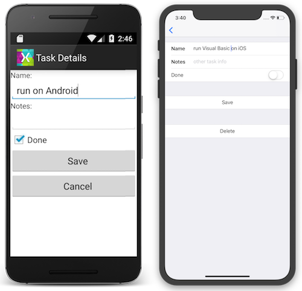

# Visual Basic in Xamarin Android and iOS

[ Download the sample](/samples/xamarin/mobile-samples/visualbasic-taskyvb/)

The [TaskyVB](/samples/xamarin/mobile-samples/visualbasic-taskyvb/) sample application demonstrates how Visual Basic code compiled into a .NET Standard library can be used with Xamarin. Here are some screenshots of the resulting apps running on Android and iOS:

 [](native-apps-images/simulators.png#lightbox)

The Android and iOS projects in the example are all written in C#. The user interface for each application is built with native technologies, while the `TodoItem` management is provided by the Visual Basic .NET Standard library using an XML file (for demonstration purposes, not a full database).

## Sample walkthrough

This guide discusses how Visual Basic has been implemented in the
[TaskyVB](https://github.com/xamarin/mobile-samples/tree/master/VisualBasic/TaskyVB)
Xamarin sample for iOS and Android.

> [!NOTE]
> Review the instructions on [Visual Basic and .NET Standard](index.md) before continuing with this guide.
>
> Refer to the [Xamarin.Forms using Visual Basic](xamarin-forms.md) instructions to see how to build an app with shared user-interface Visual Basic code.

## VisualBasicNetStandard

Visual Basic .NET Standard libraries can only be created in Visual Studio on Windows.
The example library contains the basics of our application in these Visual Basic files:

- TodoItem.vb
- TodoItemManager.vb
- TodoItemRepositoryXML.vb
- XmlStorage.vb

### TodoItem.vb

This class contains the business object to be used throughout the application. It will be defined in Visual Basic and shared with the Android and iOS projects that are written in C#.

The class definition is shown here:

```vb
Public Class TodoItem
    Property ID() As Integer
    Property Name() As String
    Property Notes() As String
    Property Done() As Boolean
End Class
```

The sample uses XML serialization and de-serialization to load and save the TodoItem objects.

### TodoItemManager.vb

The Manager class presents the ‘API’ for the portable code. It provides basic CRUD operations for the `TodoItem` class, but no implementation of those operations.

```vb
Public Class TodoItemManager
    Private _repository As TodoItemRepositoryXML
    Public Sub New(filename As String)
        _repository = New TodoItemRepositoryXML(filename, storage)
    End Sub
    Public Function GetTask(id As Integer) As TodoItem
        Return _repository.GetTask(id)
    End Function
    Public Function GetTasks() As List(Of TodoItem)
        Return New List(Of TodoItem)(_repository.GetTasks())
    End Function
    Public Function SaveTask(item As TodoItem) As Integer
        Return _repository.SaveTask(item)
    End Function
    Public Function DeleteTask(item As TodoItem) As Integer
        Return _repository.DeleteTask(item.ID)
    End Function
End Class
```

The constructor takes an instance of IXmlStorage as a parameter. This allows each platform to provide its own working implementation while still letting the portable code describe other functionality that can be shared.

### TodoItemRepository.vb

The repository class contains the logic for managing the list of TodoItem objects. The complete code is shown below – the logic exists mainly to manage a unique ID value across the TodoItems as they are added and removed from the collection.

```vb
Public Class TodoItemRepositoryXML
    Private _filename As String
    Private _storage As IXmlStorage
    Private _tasks As List(Of TodoItem)

    ''' <summary>Constructor</summary>
    Public Sub New(filename As String)
        _filename = filename
        _storage = New XmlStorage
        _tasks = _storage.ReadXml(filename)
    End Sub
    ''' <summary>Inefficient search for a Task by ID</summary>
    Public Function GetTask(id As Integer) As TodoItem
        For t As Integer = 0 To _tasks.Count - 1
            If _tasks(t).ID = id Then
                Return _tasks(t)
            End If
        Next
        Return New TodoItem() With {.ID = id}
    End Function
    ''' <summary>List all the Tasks</summary>
    Public Function GetTasks() As IEnumerable(Of TodoItem)
        Return _tasks
    End Function
    ''' <summary>Save a Task to the Xml file
    ''' Calculates the ID as the max of existing IDs</summary>
    Public Function SaveTask(item As TodoItem) As Integer
        Dim max As Integer = 0
        If _tasks.Count > 0 Then
            max = _tasks.Max(Function(t As TodoItem) t.ID)
        End If
        If item.ID = 0 Then
            item.ID = ++max
            _tasks.Add(item)
        Else
            Dim j = _tasks.Where(Function(t) t.ID = item.ID).First()
            j = item
        End If
        _storage.WriteXml(_tasks, _filename)
        Return max
    End Function
    ''' <summary>Removes the task from the XMl file</summary>
    Public Function DeleteTask(id As Integer) As Integer
        For t As Integer = 0 To _tasks.Count - 1
            If _tasks(t).ID = id Then
                _tasks.RemoveAt(t)
                _storage.WriteXml(_tasks, _filename)
                Return 1
            End If
        Next
        Return -1
    End Function
End Class
```

> [!NOTE]
> This code is an example of a very basic data-storage mechanism.
> It is provided to demonstrate how a .NET Standard library can code
> against an interface to access platform-specific functionality
> (in this case, loading and saving an XML file). It it not intended to be
> a production-quality database alternative.

## Android and iOS application projects

### iOS

In the iOS application the `TodoItemManager` and the `XmlStorageImplementation` are created in the **AppDelegate.cs** file as shown in this code snippet. The first four lines are just building the path to the file where data will be stored; the final two lines show the two classes being instantiated.

```csharp
var xmlFilename = "TodoList.xml";
string documentsPath = Environment.GetFolderPath(Environment.SpecialFolder.Personal); // Documents folder
string libraryPath = Path.Combine(documentsPath, "..", "Library"); // Library folder
var path = Path.Combine(libraryPath, xmlFilename);

TaskMgr = new TodoItemManager(path);
```

### Android

In the Android application the `TodoItemManager` and the `XmlStorageImplementation` are created in the **Application.cs** file as shown in this code snippet. The first three lines are just building the path to the file where data will be stored; the final two lines show the two classes being instantiated.

```csharp
var xmlFilename = "TodoList.xml";
string libraryPath = Environment.GetFolderPath(Environment.SpecialFolder.Personal);
var path = Path.Combine(libraryPath, xmlFilename);

TaskMgr = new TodoItemManager(path);
```

The rest of the application code is primarily concerned with the user interface and using the `TaskMgr` class to load and save `TodoItem` classes.

## Visual Studio 2019 for Mac

> [!WARNING]
> Visual Studio for Mac does NOT support editing the Visual Basic language – there are no menu items for creating Visual Basic projects or files. If you open a **.vb** there is no language syntax highlighting, autocomplete, or IntelliSense.

Visual Studio 2019 for Mac _can_ compile Visual Studio .NET Standard projects created on Windows, so iOS apps can reference those projects.

Visual Studio 2017 _cannot_ build Visual Basic projects at all.

## Summary

This article has demonstrated how to consume Visual Basic code in Xamarin applications using Visual Studio and .NET Standard libraries. Even though Xamarin does not support Visual Basic directly, compiling Visual Basic into a .NET Standard library allows code written with Visual Basic to be included in iOS and Android apps.

## Related Links

- [TaskyVB (.NET Standard sample)](https://github.com/xamarin/mobile-samples/tree/master/VisualBasic/TaskyVB)
- [What's new in .NET Standard](/dotnet/standard/whats-new/whats-new-in-dotnet-standard?tabs=csharp)