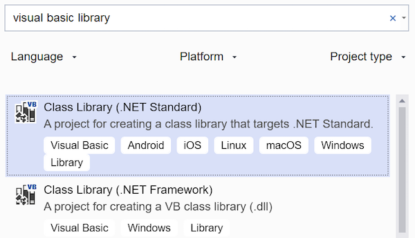
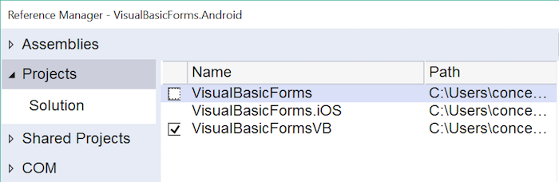

# Xamarin.Forms using Visual Basic.NET

Xamarin does not support Visual Basic directly - follow the instructions on
this page to create a C# Xamarin.Forms solution and then replace the
.NET Standard C# project with Visual Basic.

[ Download the sample](/samples/xamarin/mobile-samples/visualbasic-xamarinformsvb/)

[](xamarin-forms-images/hero.png#lightbox)

> [!NOTE]
> You must use Visual Studio on Windows to program with Visual Basic.

## Xamarin.Forms with Visual Basic walkthrough

Follow these steps to create a simple Xamarin.Forms project that uses Visual Basic:

1. From Visual Studio 2019 choose **Create a new project**.

2. In the **Create a new project** window, type **Xamarin.Forms** to filter the list and select **Mobile App (Xamarin.Forms)**, then press **Next**.

    [](xamarin-forms-images/02.png#lightbox)

3. On the next screen, type a name for the project and press **Create**.

4. Choose the **Blank** template and press **OK**:

    [](xamarin-forms-images/04.png#lightbox)

    This creates a Xamarin.Forms solution in Visual Studio, using C#. The next steps modify the solution to use Visual Basic.

5. Right-click on the solution and choose **Add > New Project...**

6. Type **Visual Basic library** to filter the project options and choose the **Class Library (.NET Standard)** option with the Visual Basic icon:

    [](xamarin-forms-images/06.png#lightbox)

7. On the next screen, type a name for the project and press **Create**.

8. Right-click on the Visual Basic project and choose **Properties**, then
  change the **Default namespace** to match the existing C# projects:

    [](xamarin-forms-images/07a.png#lightbox)

9. Right-click on the new Visual Basic project and choose **Manage NuGet Packages**,
then install **Xamarin.Forms** and close the package manager window.

    [](xamarin-forms-images/07b.png#lightbox)

10. Rename the default **Class1.vb** file to **App.vb**:

    [](xamarin-forms-images/08.png#lightbox)

11. Paste the following code into the **App.vb** file, which will become the starting
point of your Xamarin.Forms app:

    ```vb
    Imports Xamarin.Forms

    Public Class App
        Inherits Application

        Public Sub New()
            Dim label = New Label With {.HorizontalTextAlignment = TextAlignment.Center,
                                        .FontSize = Device.GetNamedSize(NamedSize.Medium, GetType(Label)),
                                        .Text = "Welcome to Xamarin.Forms with Visual Basic.NET"}

            Dim stack = New StackLayout With {
                .VerticalOptions = LayoutOptions.Center
            }
            stack.Children.Add(label)

            Dim page = New ContentPage
            page.Content = stack
            MainPage = page

        End Sub

    End Class
    ```

12. Update the Android and iOS projects so that they reference new Visual Basic project (and not the C# project created by the template).
Right-click on the **References** node in the Android and iOS projects to open the
**Reference Manager**. Un-tick the C# library and tick the Visual Basic library
(don't forget, do this for both the Android and iOS projects).

    [](xamarin-forms-images/10.png#lightbox)

13. Delete the C# project. Add new **.vb** files to build out your
Xamarin.Forms application. A template for new `ContentPage`s in Visual Basic
is shown below:

    ```vb
    Imports Xamarin.Forms

    Public Class Page2
    Inherits ContentPage

        Public Sub New()
            Dim label = New Label With {.HorizontalTextAlignment = TextAlignment.Center,
                                        .FontSize = Device.GetNamedSize(NamedSize.Medium, GetType(Label)),
                                        .Text = "Visual Basic ContentPage"}

            Dim stack = New StackLayout With {
                .VerticalOptions = LayoutOptions.Center
            }
            stack.Children.Add(label)

            Content = stack
        End Sub
    End Class
    ```

## Limitations of Visual Basic in Xamarin.Forms

As stated on the [Portable Visual Basic.NET page](~/cross-platform/platform/visual-basic/index.md),
Xamarin does not support the Visual Basic language. This means there are some limitations
on where you can use Visual Basic:

- XAML pages cannot be included in the Visual Basic project - the code-behind generator can only build C#. It is possible to include XAML in a separate, referenced, C# portable class library and use databinding to populate the XAML files via Visual Basic models (an example of this is included in the [sample](https://github.com/xamarin/mobile-samples/tree/master/VisualBasic/XamarinFormsVB)).

- Custom Renderers cannot be written in Visual Basic, they must be written in C# in the native platform projects.

- Dependency Service implementations cannot be written in Visual Basic, they must be written in C# in the native platform projects.

## Related Links

- [XamarinFormsVB (sample)](/samples/xamarin/mobile-samples/visualbasic-xamarinformsvb/)
- [Cross-Platform Development with the .NET Framework](/dotnet/standard/cross-platform/)