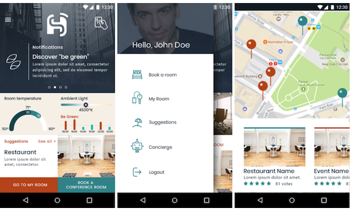
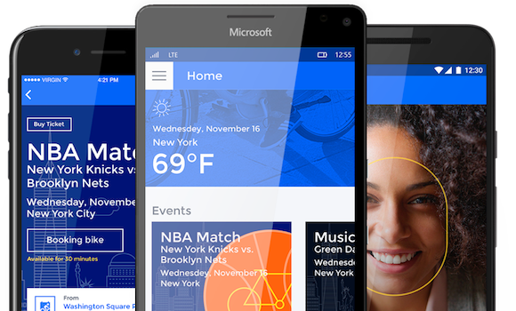
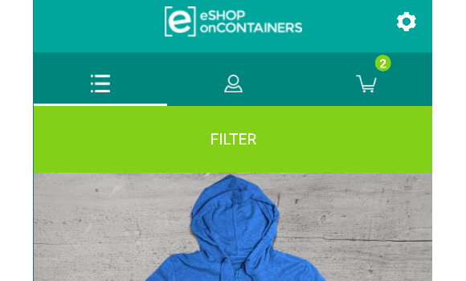

# Cross-platform samples

Xamarin cross-platform sample apps and code demos to help you get started building mobile apps with C# and Xamarin.

[All Xamarin samples](/samples/browse/?products=xamarin)

## Get started

:::row:::
    :::column:::

### [Todo](/samples/xamarin/xamarin-forms-samples/todo/)

This sample demonstrates a Todo list application where the data is stored and accessed in a local SQLite database, built with Xamarin.Forms.
    :::column-end:::
    :::column:::

### [My Shoppe](https://github.com/xamarinhq/app-myshoppe)

Demo app that empowers salespeople to track their sales performance, manage leads, view their contacts, manage orders, and browse the product catalog.
    :::column-end:::
    :::column:::

### [Xamarin CRM](https://github.com/xamarin/app-crm)

Demo app that empowers salespeople to track their sales performance, manage leads, view their contacts, manage orders, and browse the product catalog.
    :::column-end:::
:::row-end:::

## Azure & enterprise

Contact list app with a detail & edit screen. Source code is available in both Xamarin.Forms and Xamarin native implementations.
    :::column-end:::
    :::column:::

### [SmartHotel360](https://github.com/Microsoft/SmartHotel360-mobile-desktop-apps)

Connect 2017 demo building an app suite including Xamarin & Azure.
    :::column-end:::
    :::column:::

### [BikeSharing360](https://github.com/Microsoft/BikeSharing360_MobileApps)

Connect 2016 demo building an app suite including Xamarin & Azure.
    :::column-end:::
:::row-end:::
:::row:::
    :::column:::

### [eShop](https://github.com/dotnet-architecture/eShopOnContainers/tree/dev/src/Mobile)

Enterprise architecture guidance for building apps using containers on Azure.
    :::column-end:::
    :::column:::
    :::column-end:::
    :::column:::
    :::column-end:::
:::row-end:::

## All samples

For the complete set of Xamarin cross-platform sample apps and code demos, see [All Xamarin samples](/samples/browse/?products=xamarin).