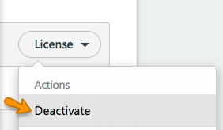

# How do I manually resynchronize Xamarin licenses?

> [!IMPORTANT]
> This guide does not apply to most MSDN users because they are not required to own or log into Xamarin accounts unless using the [Xamarin Components store](https://components.xamarin.com/) or [Visual Studio for Mac (Mac)](~/cross-platform/get-started/requirements.md).

## Overview

Usually your license information will be resynchronized with the Xamarin license server automatically when you start the IDE. For example, license upgrades, downgrades, and renewals will normally automatically appear after restarting the IDE. The license information shown in the IDE should match the information shown on your [account page](https://store.xamarin.com/account/my/subscription/computers). If the information is still mismatched, you can first double-check that your store account information looks correct, and then manually resynchronize the licenses by logging out, deleting the license files on disk, and then logging back in.

### Note for iOS developers on Windows

iOS developers on Windows may also need to perform these steps for Visual Studio for Mac; even if you don't directly develop on your paired Mac Build host.

## Quick manual refresh steps

This quick process skips the step of deleting the license files on disk which might be sufficient in some cases. 

1.  Log out of your Xamarin account via the IDE:
    -   Visual Studio for Mac
        -   Top right corner of the welcome screen
        -   **Visual Studio for Mac > Account** (Mac)
        -   **Tools > Account** (Windows)
    -   Visual Studio
        -   **Tools > Xamarin Account**
2.  Log back into your Xamarin account in the IDE.

## Extended manual license refresh steps

1.  Log out of your Xamarin account via the IDE. 
2.  Quit the IDE.
3.  Check that the store account information looks correct. In particular check for duplicate computer names on the [Computers page](https://store.xamarin.com/account/my/subscription/computers).

4.  If you see a pair of duplicate computer names, use the **Deactivate** drop-down menu item to remove _both_ members of the pair:
    
    

5.  Delete any remaining copies of the license files still present on disk.
    -   Windows

        Delete all of the following folders:
        -   `%PROGRAMDATA%\Mono for Android`
        -   `%PROGRAMDATA%\MonoTouch`
        -   `%LOCALAPPDATA%\VirtualStore\ProgramData\Mono for Android`
        -   `%LOCALAPPDATA%\VirtualStore\ProgramData\MonoTouch`

        In default installations of Windows:
        -   `%PROGRAMDATA%` will expand to `C:\ProgramData`
        -   `%LOCALAPPDATA%` will expand to `C:\Users\%USERNAME%\AppData\Local`

        The `VirtualStore` copies of the licenses are created automatically by Windows in certain scenarios. If the VirtualStore copies exist, they will be read _instead_ of the licenses in `%PROGRAMDATA%`.

    -   Mac

        Delete all of the following folders:

        -   `~/Library/MonoAndroid`
        -   `~/Library/MonoTouch`
        -   `~/Library/Xamarin.Mac`

        You can access these paths in **Finder** by selecting the **Go > Go to Folder** menu and pasting them into the dialog window. Finder automatically replaces the ~ tilde character with your user folder.

6.  Open Visual Studio for Mac or Visual Studio and log back into your Xamarin account.

## Supplementary information: individual license file locations

### Windows

On Windows the individual license files are stored in the following locations:

-   Xamarin.Android:  
     `%PROGRAMDATA%\Mono for Android\License\monoandroid.licx`
-   Xamarin.iOS:  
     `%PROGRAMDATA%\MonoTouch\License\monotouch.licx`

Licenses for *trial* subscriptions are named differently:

-   Xamarin.Android:  
     `%PROGRAMDATA%\Mono for Android\License\monoandroid.trial.licx`
-   Xamarin.iOS:  
     `%PROGRAMDATA%\MonoTouch\License\monotouch.trial.licx`

### Mac

On Mac the individual license files are stored in the following locations:

-   Xamarin.Android:  
     `~/Library/MonoAndroid/License`
-   Xamarin.iOS:  
     `~/Library/MonoTouch/License.v2`
-   Xamarin.Mac:  
     `~/Library/Xamarin.Mac/License`

Licenses for *trial* subscriptions are named differently:

-   Xamarin.Android:  
     `~/Library/MonoAndroid/License.trial`
-   Xamarin.iOS:  
     `~/Library/MonoTouch/License.trial`
-   Xamarin.Mac:  
     `~/Library/Xamarin.Mac/License.trial`

## Additional troubleshooting steps

-   Check if you have any non-ASCII characters in your user name, in your computer name, or in any of the fully expanded paths of the license files.

-   [Contact Xamarin Developer Support](http://xamarin.com/support)
