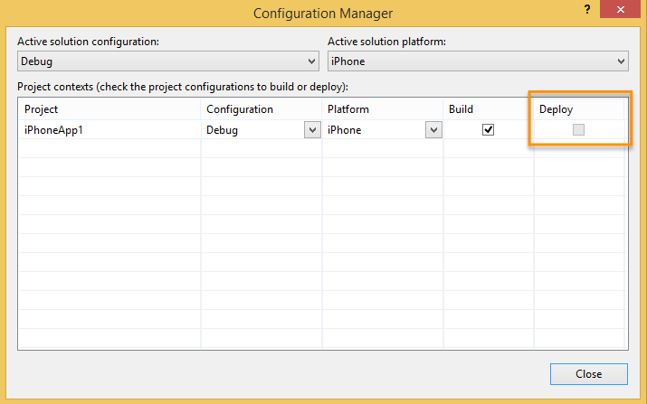
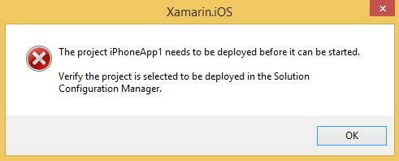

# Deploy checkboxes disabled in Configuration Manager

Since Xamarin 3.5, Xamarin.iOS projects deployed automatically whenever you press the **Start** toolbar button or pick the **Debug > Start Debugging** menu item. You will still need to set the desired Xamarin.iOS app project as the **StartUp Project** before running either of those commands.

Because of this, the **Deploy** checkboxes are intentionally disabled in the Visual Studio Configuration Manager for Xamarin.iOS projects:

This change eliminates an error that could appear in older versions of Xamarin (version 3.3 and earlier) when the Xamarin.iOS app project was not set to deploy:

