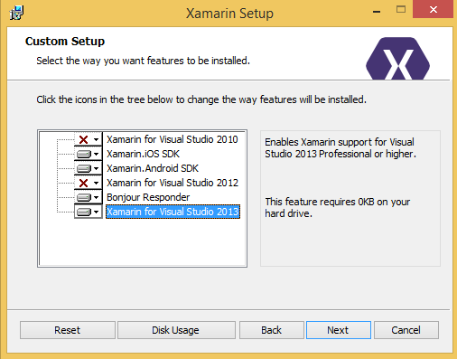
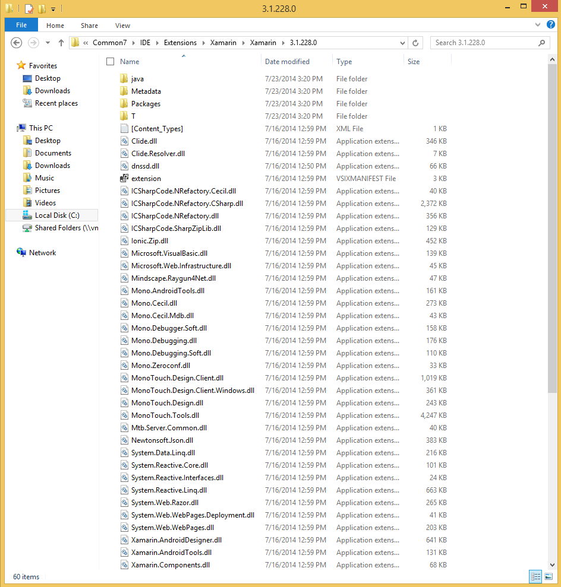

# Missing Visual Studio extensions after installation

## Error Message: This project is incompatible with the current edition of Visual Studio

Ensure Visual Studio 2017 (Community, Professional or Enterprise) or newer is installed.

See also the [Windows requirements](~/cross-platform/get-started/requirements.md#windows-requirements).

## Possible Fix 1: Change the installation to make sure the Visual Studio extensions are installed

In certain situations, the Xamarin installer might automatically un-check the install options for the Visual Studio extensions. If that's the cause of the problem, install the missing Visual Studio extensions using the installer's **Change** command. For example, to install the extensions for Visual Studio 2013:

1. Open the Windows **Programs and Features** Control Panel.

2. Right click the **Xamarin** entry, and select **Change**.

3. Click **Next**, then **Change**.

4. Make sure the **Xamarin for Visual Studio 2013** option is set to install:

    

5. Proceed through the rest of the installer wizard.

## Possible Fix 2: Ask Visual Studio to set up the extensions again

1. Check if the Xamarin extensions have been copied into the Visual Studio extensions folder:

    `C:\Program Files (x86)\Microsoft Visual Studio 12.0\Common7\IDE\Extensions\Xamarin\Xamarin\3.1.228.0`

    If the extensions are properly installed (for version 3.1.228), there will be 60 items in the folder:

    

2. After you have confirmed that this folder looks correct, tell Visual Studio to try setting up the extensions again:

    `"C:\Program Files (x86)\Microsoft Visual Studio 12.0\Common7\IDE\devenv.exe" /setup`

## Possible Fix 3: Try a fresh reinstall of Xamarin

1. From the Windows Control Panel, uninstall any of the following that are present:

    * Xamarin

    * Xamarin for Windows

    * Xamarin.Android

    * Xamarin.iOS

    * Xamarin for Visual Studio

2. In Explorer, delete any remaining files from the Xamarin Visual Studio extension folders (all versions, including both **Program Files** and **Program Files (x86)**):

    `C:\Program Files*\Microsoft Visual Studio 1*.0\Common7\IDE\Extensions\Xamarin`

3. Also check in the "VirtualStore" directory to see if there might be any "overlay" copies of any of the extension directories:

    `%LOCALAPPDATA%\VirtualStore`

4. Open the registry editor (regedit).

5. Look for this key:

    _HKEY\_LOCAL\_MACHINE\SOFTWARE\Wow6432Node\Microsoft\Windows\CurrentVersion\SharedDlls_

6. Find and delete any entries that match this pattern:

    _C:\Program Files\*\Microsoft Visual Studio 1\*.0\Common7\IDE\Extensions\Xamarin_

7. Look for this key:

    `HKEY\_CURRENT\_USER\Software\Microsoft\VisualStudio\1\*.0\ExtensionManager\PendingDeletions`

8. Delete any entries that look like they might be related to Xamarin. For example, here's one that used to cause trouble in older versions of Xamarin:

    _Mono.VisualStudio.Shell,1.0_

9. Reboot.

10. Reinstall the current stable version of Xamarin from [visualstudio.com](https://visualstudio.com/xamarin).

## Possible Fix 4: Repair Visual Studio installation

1. Open the Windows **Programs and Features** Control Panel.

2. Right click the relevant Microsoft Visual Studio entry, and select **Change**

3. Click the **Repair** button in the Visual Studio dialog that opens.
