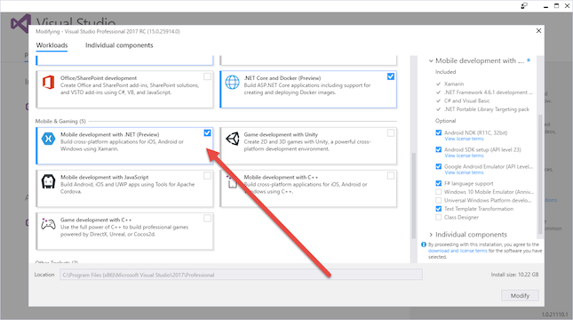
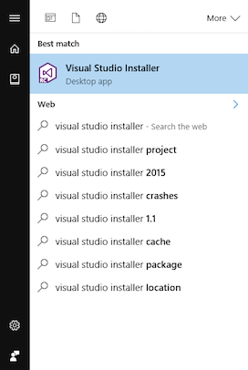
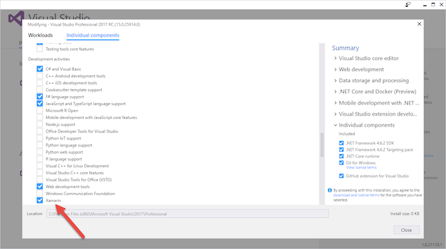
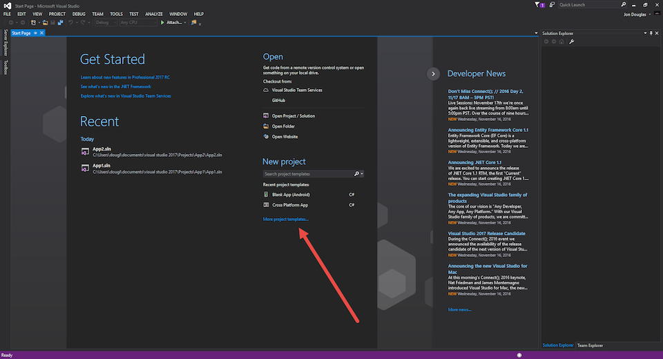
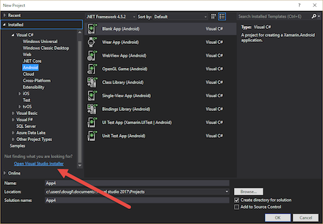

# Can I use Visual Studio 2017 Release Candidate with Xamarin?

## Can I use Visual Studio 2017 Release Candidate with Xamarin?

Yes. You are able to leverage Xamarin through Visual Studio 2017 Release Candidate. However, please note that currently, installing Xamarin to Visual Studio 2017 RC will uninstall any earlier versions of Xamarin installed into Visual Studio 2015/2013. Xamarin for Visual Studio 2017 can not be installed at the same time as Xamarin for Visual Studio 2015/2013 as a result of Visual Studio 2017 moving away from MSI packaging toward utilization of the Visual Studio Installer system.

While the team is currently looking into ways to bypass this expected behavior, we do advise users to choose their development environment based on their needs. 

> [!IMPORTANT]
> If you are building Xamarin.iOS projects, make sure Visual Studio for Mac on your paired Mac system is on the same version of Xamarin.iOS channel.

## How do I install Xamarin to Visual Studio 2017 Release Candidate?

### Installing during the Visual Studio 2017 RC Installer

* Select the **Xamarin** component as part of the new **Visual Studio Installer**

  

This will install the Visual Studio extension for Xamarin.iOS and Xamarin.Android development.

### Installing or Reinstalling Xamarin in an existing installation of Visual Studio 2017 RC

#### Using the Visual Studio Installer:

1. Search for the Visual Studio Installer application

  

2. Select:
  a. **Mobile development with .NET (Preview)** in the Workloads tab, or

  
  b. **Xamarin** in the **Individual components** tab

  

#### Using the Visual Studio Installer within Visual Studio:
1. Navigate to the Visual Studio 2017 Start Page
2. Click on **More project templates** under the **New Project** section

	
3. Click on `Open Visual Studio Installer` in the left pane

	
4. Select:
  	
  	a. **Mobile development with .NET (Preview)** in the Workloads tab, or

  	
  	b. **Xamarin** in the **Individual components** tab

  	
