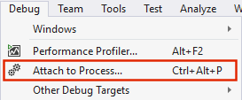
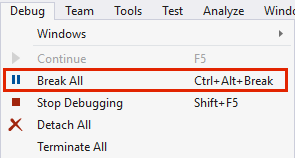
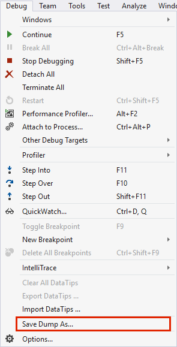
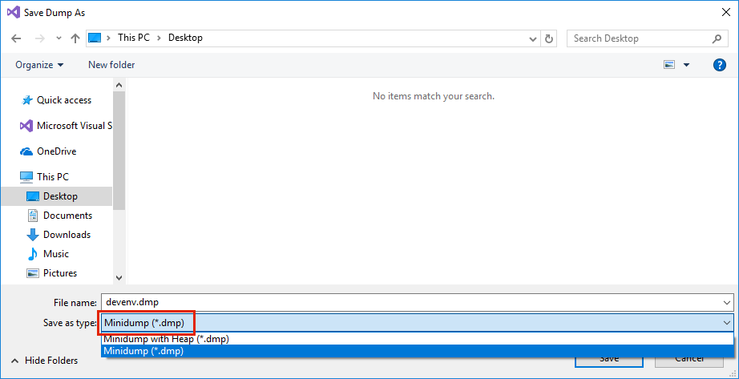

# How do I collect the current call stacks of the Visual Studio process?

When the GUI locks up (hangs, freezes) in Visual Studio, an important piece of diagnostic information to collect is the set of call stacks from all the threads of the Visual Studio process. To save this information for a hung instance of Visual Studio, you can use a second instance of Visual Studio:

1. Start a second instance (a new window) of Visual Studio.

2. Close any open solutions in the new instance of Visual Studio.

3. Select **Debug > Attach to Process**.

   

4. Select the original hung instance of `devenv.exe` from the list of **Available Processes**.

5. Select **Debug > Break All**.

   

6. Select **Debug > Save Dump As**.

   

7. Change **Save as type** to **Minidump (\*.dmp)**. This will produce a much smaller file than **Minidump with Heap**, and the heap is usually not relevant for diagnosing freezes.

   

8. Save the dump file. If submitting the file online, you can zip it to reduce the size.
