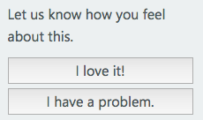

# What support options are available for Xamarin?

## Summary of Support Options

As shown on the [Xamarin Support page](https://www.xamarin.com/support), several options are available.  Here are some quick initial recommendations [inspired by Stack Overflow](http://stackoverflow.com/help/product-support) on how to pick the best option:

|   |   |
|---|---|
|"What does this error mean?" or "How do I ... ?"|[Stack Overflow](http://stackoverflow.com/questions/ask?tags=xamarin) under the *xamarin* tag|
|I believe this problem is caused by a defect in the Xamarin source code.|[Xamarin Bugzilla](https://bugzilla.xamarin.com/page.cgi?id=bug-writing.html)|
|I have an idea, feature request, or new documentation request.|[Xamarin UserVoice page](https://xamarin.uservoice.com)|
|What resources, frameworks, or tools do other users recommend for ... ? (and other open-ended discussions)|[Xamarin Forums](https://forums.xamarin.com)|
|I have a question about subscriptions, licensing, or pricing.|Email or call using the contact info on the [FAQ](https://www.xamarin.com/faq)|

The Xamarin support team helps monitor each of these options.  We encourage all users to contribute their thoughtful questions and reports to take advantage of and help grow the knowledgeable Xamarin developer community.  For suspected defects, be sure to submit bug reports when possible to ensure that the issues are tracked formally by the Xamarin engineering team.

<a name="Visual_Studio_email_support_incidents_for_Xamarin_topics"/>

### Visual Studio email support incidents for Xamarin topics

Xamarin SDK and IDE features are eligible for technical support incidents as part of [Visual Studio subscriber benefits](https://msdn.microsoft.com/subscriptions/bb266240) and [Microsoft Premier Support](https://www.microsoft.com/en-us/microsoftservices/support.aspx).  This matches up with the policies for other development platforms in Visual Studio like UWP and ASP.NET.  Xamarin incidents submitted this way will be assigned to the Xamarin support team.  See the [Microsoft Support FAQ](https://support.microsoft.com/gp/offerprophone) for more information on the policies for these incidents.

For Xamarin Test Cloud, support incidents can be submitted by navigating to the [Test Cloud login page](https://testcloud.xamarin.com/login) and opening the **Support** link.

### Information for users migrating from expired Xamarin subscriptions to Visual Studio subscriptions

Xamarin is [now an integrated part of Visual Studio subscriptions](https://blog.xamarin.com/xamarin-for-all/) and follows the standard Visual Studio subscriber benefits.  See the preceding section about [*Visual Studio support incidents*](#Visual_Studio_email_support_incidents_for_Xamarin_topics) for a few more details.

## Detailed Recommendations

### "What does this error mean?" or "How do I ... ?"

[Post a question on Stack Overflow](http://stackoverflow.com/questions/ask?tags=xamarin) to get help from the community on common errors or tricky implementation and API usage questions.  Be sure to include the _xamarin_ tag on the question.  See also: [How do I ask a good question?](http://stackoverflow.com/help/how-to-ask)

#### Additional resources

-   Check [Xamarin's Developer Center](/index.md) for documentation, guides, and samples.
-   Check [Stack Overflow Documentation](http://stackoverflow.com/documentation) for community-contributed sample code and explanations.
-   Consider [Xamarin's consulting partner](https://www.xamarin.com/consulting-partners) services for escalated assistance with feature implementation, bindings to third party Android, iOS, or Mac libraries, review of code for architecture advice, in-depth troubleshooting, memory/performance profiling, or optimization of existing code.

### What does this _installation_ error mean?

[Post a question on Stack Overflow](http://stackoverflow.com/questions/ask?tags=xamarin+installation) that includes both the _xamarin_ and _installation_ tags.  As usual, be sure to check briefly for any previous questions that might have solved the issue before.  See also: [How do I ask a good question?](http://stackoverflow.com/help/how-to-ask)

(Note: This recommendation is still evolving to ensure that new users have the best access to assistance for common pitfalls during initial setup.  Stay tuned for updates.)

#### Additional resources

-   Check the [installation guides](~/cross-platform/get-started/installation/index.md) and [system requirements](~/cross-platform/get-started/requirements.md) to make sure that all of the correct packages are installed and compatible.

### I believe this problem is caused by a defect in the Xamarin source code.

[File a bug on Xamarin's Bugzilla](https://bugzilla.xamarin.com/page.cgi?id=bug-writing.html) so the Xamarin engineering team can investigate.  See also: [When and how should I file a bug report?](~/cross-platform/troubleshooting/questions/howto-file-bug.md)

(*For issues after Stable updates*: Don't hesitate to file a quick bug report if you run into an error, installation failure, or other unexpected behavior after updating to a new Stable version.  Those reports are quite valuable.  Of course, do be sure to check the [release notes](https://developer.xamarin.com/releases/) briefly in case the issue you are seeing might be an intentional change or known issue.)

#### Additional resources

-   If you have solved an issue locally by creating a custom fix based on [Xamarin's open source development projects](http://open.xamarin.com/), please do consider submitting a pull request to get your changes incorporated into Xamarin!

### What does this error in a _preview product_ mean?

Please [file a bug on Xamarin's Bugzilla](https://bugzilla.xamarin.com/page.cgi?id=bug-writing.html) for any unexpected errors or behaviors you might find in a preview product.  Your valuable feedback will help the Xamarin engineers improve the future versions of the preview.

For community discussion about known issues and possible workarounds, you can post a question in the corresponding preview forum:

-   [Xamarin Live Player](https://forums.xamarin.com/categories/live-player)
-   For SDK bindings previews for new versions of Android, iOS, and macOS SDKs, find the corresponding preview release announcement in the [Xamarin.Android](http://forums.xamarin.com/categories/android), [Xamarin.iOS](http://forums.xamarin.com/categories/ios), or [Xamarin.Mac](http://forums.xamarin.com/categories/mac) forum.
-   For other preview features, browse for a corresponding release announcement in the [Prerelease & Betas](http://forums.xamarin.com/categories/xamarin-prerelease) forum.  Or if there is no matching announcement, feel free to raise your question in its own thread in that forum.

### I have an idea, feature request, or documentation request.

[Share your idea on Xamarin's UserVoice page](https://xamarin.uservoice.com) so the community can vote on it and the Xamarin team can work on adding it to the roadmap.

### I have a question about subscriptions, licensing, or pricing.

Check the [FAQ](https://www.xamarin.com/faq), and then use one of the contact options listed on that page for any follow-up questions.

### How do I get involved in Xamarin's open source development projects?

Go to [open.xamarin.com](http://open.xamarin.com/) to get started.

### I found a mistake or missing information in the Guides or Recipes on the [Xamarin Developer Center](/index.md).

Use the _I have a problem_ button to submit your feedback directly on the page where you noticed the issue.

### What resources, frameworks, or tools do other users recommend for ... ?

[Post a question on the forums](https://forums.xamarin.com/) to discuss these broader topics that can be [out-of-place on Stack Overflow](http://stackoverflow.com/help/dont-ask).

### Why do you ... ?

[Post a question on the forums](https://forums.xamarin.com/) to start a discussion with community members and the Xamarin team.

### When will you ... ?

-   Check the [Release Blog](http://releases.xamarin.com/) for timelines of the current active [Xamarin Platform](https://www.xamarin.com/platform) releases.
-   [Share your request on Xamarin's UserVoice page](https://xamarin.uservoice.com) so the community can vote on it and the Xamarin team can work on adding it to the roadmap.

